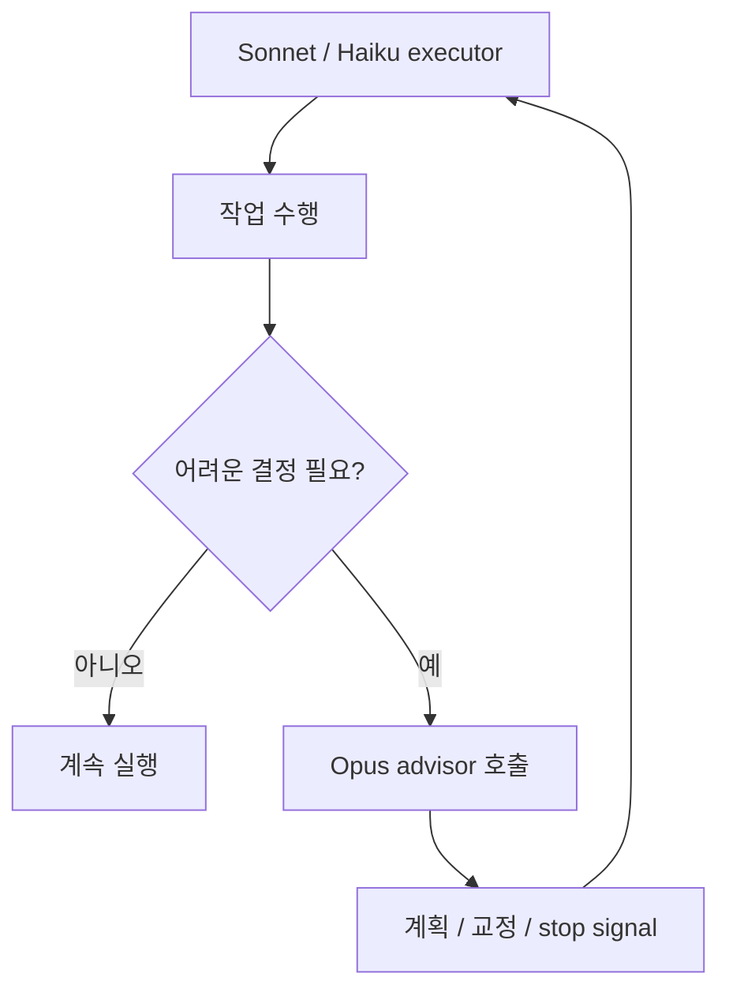
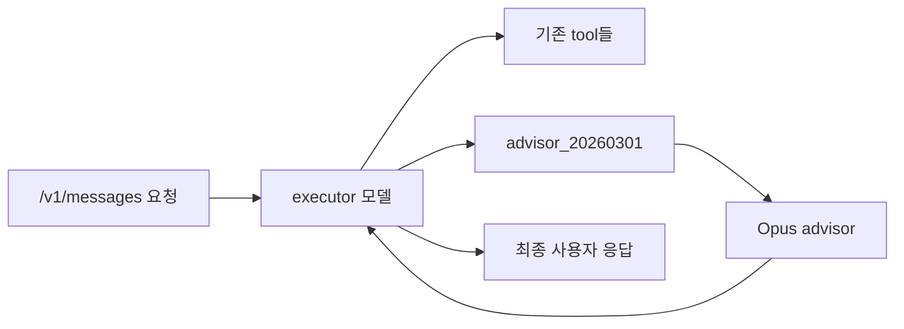

2026년 4월 9일 공개된 `Advisor Tool` 은 최근 Claude 플랫폼 업데이트 중에서도 꽤 방향성이 분명한 기능입니다. 핵심은 더 큰 모델을 항상 전면에 세우는 대신, **Sonnet이나 Haiku가 메인 실행을 맡고 정말 어려운 순간에만 Opus에게 자문을 구하게 한다** 는 점입니다. Claude 공식 블로그는 이를 `advisor strategy` 라고 부르며, “near Opus-level intelligence” 를 “a fraction of the cost” 로 가져오는 패턴이라고 설명합니다. [Claude 공식 블로그](https://claude.com/blog/the-advisor-strategy)
<!--more-->

영상도 이 점을 잘 짚습니다. 발표자는 이 기능이 “왜 이제 나왔을까 싶을 정도로 기발하다”고 말하면서, Sonnet을 executor로 두고 Opus를 advisor로 두는 구조가 사실상 우리가 수동으로 해 오던 “계획은 큰 모델, 실행은 싼 모델” 패턴을 API 레벨에서 한 툴로 묶어 준 것이라고 설명합니다. 즉 이것은 단순한 모델 추가가 아니라, **에이전트 설계 패턴 자체를 플랫폼 기능으로 승격한 것** 에 가깝습니다. [0:20](https://youtu.be/OvJp5Z3vCP8?t=20) [1:53](https://youtu.be/OvJp5Z3vCP8?t=113)

## Sources

- https://youtu.be/OvJp5Z3vCP8?si=I3AKCeMRE23AX0R8
- https://claude.com/blog/the-advisor-strategy

## 1. Advisor Tool의 핵심은 ‘큰 모델을 항상 쓰지 않는다’는 데 있다

공식 블로그에 따르면 advisor strategy는 Opus를 advisor, Sonnet 또는 Haiku를 executor로 짝지어 쓰는 방식입니다. executor는 실제 작업을 처음부터 끝까지 수행하며 도구를 호출하고 결과를 읽고 반복합니다. 반면 advisor는 필요할 때만 호출되어 계획, 수정 방향, 중단 신호 같은 짧은 가이드를 돌려줍니다. advisor는 직접 툴을 호출하지도 않고, 사용자에게 바로 출력하지도 않습니다. [Claude 공식 블로그](https://claude.com/blog/the-advisor-strategy)

이 구조가 중요한 이유는 기존의 “큰 모델이 전체를 오케스트레이션하고 작은 모델이 하위 작업을 처리한다”는 전형적인 서브에이전트 패턴을 뒤집기 때문입니다. 여기서는 비용 효율적인 모델이 계속 앞에서 일하고, frontier-level reasoning은 정말 필요할 때만 잠깐 개입합니다. 발표자가 “우리가 원래 계획은 Opus로 하고 실행은 Sonnet이나 Haiku로 하던 것을 하나로 묶었다”고 표현한 것도 정확히 이 의미입니다. [1:53](https://youtu.be/OvJp5Z3vCP8?t=113) [Claude 공식 블로그](https://claude.com/blog/the-advisor-strategy)

## 2. 공식 수치가 말하는 것은 ‘Opus 품질을 조금 빌려오기’다

공식 블로그는 Sonnet 4.6 단독 대비 Sonnet 4.6 + Opus 4.6 advisor 조합이 SWE-bench Multilingual에서 2.7%p 향상되었고, agentic task 당 비용은 11.9% 줄었다고 설명합니다. 즉 advisor 전략의 목표는 Sonnet을 갑자기 Opus로 바꾸는 것이 아니라, **Sonnet이 어려운 순간에만 Opus의 판단을 빌려와 평균 품질을 끌어올리는 것** 입니다. [Claude 공식 블로그](https://claude.com/blog/the-advisor-strategy)

Haiku 쪽 수치도 방향이 분명합니다. 공식 블로그는 BrowseComp에서 Haiku + Opus advisor가 Haiku 단독보다 두 배 이상 높은 점수를 냈다고 설명하면서도, 여전히 Sonnet solo보다 점수는 낮지만 비용은 훨씬 싸다고 말합니다. 결국 advisor 전략은 최고 품질을 무조건 추구하기보다, **품질·비용 사이의 효율적인 타협점** 을 더 정교하게 만들려는 도구입니다. [Claude 공식 블로그](https://claude.com/blog/the-advisor-strategy)

영상도 같은 방향으로 해석합니다. 발표자는 SWE-bench 기준 Sonnet 단독 72.1%에서 Sonnet + Opus advisor 74.8%로 개선되고 비용은 오히려 줄었다는 점을 강조하며, 저렴한 모델일수록 advisor의 체감 효과가 더 크다고 설명합니다. [1:28](https://youtu.be/OvJp5Z3vCP8?t=88) [2:23](https://youtu.be/OvJp5Z3vCP8?t=143)

## 3. 구현은 surprisingly simple하다: 툴 하나 추가하면 된다

공식 블로그가 특히 강조하는 부분은 이 전략이 API에서 “one-line change” 에 가깝다는 점입니다. `tools` 배열에 `advisor_20260301` 을 추가하고, advisor 모델과 `max_uses` 를 지정하면 됩니다. 메인 요청은 여전히 하나의 `/v1/messages` 호출 안에서 돌아가고, executor가 필요할 때만 advisor를 부릅니다. 별도 round-trip 이나 외부 컨텍스트 관리가 필요 없다는 설명입니다. [Claude 공식 블로그](https://claude.com/blog/the-advisor-strategy)

이 설계는 실무에서 매우 중요합니다. 이전에는 비슷한 패턴을 구현하려면 애플리케이션 레벨에서 큰 모델 호출과 작은 모델 호출을 직접 조정해야 했습니다. 하지만 Advisor Tool이 들어오면, 모델 간 역할 분담이 플랫폼 내부로 흡수됩니다. 발표자가 “툴에다가 그냥 Opus를 집어넣는다”고 표현한 부분이 바로 이 지점입니다. [2:59](https://youtu.be/OvJp5Z3vCP8?t=179) [Claude 공식 블로그](https://claude.com/blog/the-advisor-strategy)

## 4. 비용이 낮아지는 이유는 advisor가 짧은 계획만 돌려주기 때문이다

공식 블로그는 pricing 구조를 꽤 명확하게 설명합니다. advisor 토큰은 advisor 모델 요율로, executor 토큰은 executor 모델 요율로 과금됩니다. 하지만 advisor는 보통 400~700토큰 정도의 짧은 계획만 생성하고, 실제 긴 출력과 전체 실행은 더 싼 executor가 처리하기 때문에 총 비용이 Opus end-to-end보다 훨씬 낮게 유지된다는 것입니다. [Claude 공식 블로그](https://claude.com/blog/the-advisor-strategy)

영상의 데모도 이 구조를 직관적으로 보여 줍니다. 발표자가 만든 여행 플래너 예시에서 Opus 단독은 가장 비쌌고, Sonnet + advisor 조합은 Sonnet solo보다 약간 더 비쌀 때도 있지만 Opus보다 훨씬 싸면서 결과는 거의 비슷하거나 더 좋은 경우가 나왔다고 설명합니다. 즉 advisor는 “작은 모델 위에 얇게 덧대는 비싼 판단층” 으로 이해하면 감이 쉽습니다. [5:13](https://youtu.be/OvJp5Z3vCP8?t=313) [6:10](https://youtu.be/OvJp5Z3vCP8?t=370)

## 5. 데모가 보여 주는 가장 큰 차이는 planning quality다

영상의 여행 플래닝 데모는 이 기능의 효용을 꽤 잘 보여 줍니다. Haiku 결과는 이동 경로가 비효율적으로 흔들리고, Sonnet은 그보다 나아지며, Sonnet + advisor는 Opus 결과와 매우 비슷한 품질을 보여 줍니다. 발표자는 이를 “Opus가 planning한 것을 Sonnet이 implement하는 구조” 로 해석합니다. [6:10](https://youtu.be/OvJp5Z3vCP8?t=370) [7:22](https://youtu.be/OvJp5Z3vCP8?t=442)

이 관찰은 의미가 큽니다. Advisor Tool이 잘 맞는 작업은 대개 “실행량”보다 “중간 의사결정의 질”이 중요한 작업입니다. 아키텍처 선택, 장거리 계획, 복잡한 툴 사용 순서, 시스템 프롬프트 초안 같은 영역에서는 짧은 고품질 자문만으로도 결과 전체가 개선될 수 있습니다. 공식 블로그가 “better architectural decisions on complex tasks” 같은 사용자 피드백을 실은 이유도 여기에 있습니다. [Claude 공식 블로그](https://claude.com/blog/the-advisor-strategy)

## 6. 실전에서는 `max_uses`, 스트리밍 제약, 벤치마크가 중요하다

영상 후반부와 공식 발표를 함께 보면 운영상 포인트도 분명합니다. 첫째, `max_uses` 로 advisor 호출 횟수를 제한할 수 있습니다. 발표자도 이 값으로 비용이 너무 커지지 않게 제어할 수 있다고 설명합니다. 둘째, 공식 블로그는 advisor 토큰이 usage 블록에서 별도로 보고된다고 적고 있어 비용 관측도 가능합니다. [Claude 공식 블로그](https://claude.com/blog/the-advisor-strategy) [8:08](https://youtu.be/OvJp5Z3vCP8?t=488)

셋째, 영상은 스트리밍 제약도 짚습니다. advisor가 응답하는 동안에는 토큰 스트리밍이 잠시 멈추고, advisor의 결과가 돌아온 뒤에야 executor 쪽 스트리밍이 다시 이어집니다. 즉 UX 상으로는 중간에 잠깐 멈춤이 생길 수 있습니다. 넷째, 공식 블로그가 권장하듯이 실제 도입 전에는 Sonnet solo, Sonnet + advisor, Opus solo를 같은 eval suite로 비교해 보는 편이 안전합니다. [4:45](https://youtu.be/OvJp5Z3vCP8?t=285) [10:21](https://youtu.be/OvJp5Z3vCP8?t=621) [Claude 공식 블로그](https://claude.com/blog/the-advisor-strategy)

## 실전 적용 포인트

첫째, Advisor Tool은 “항상 Opus를 더 싸게 쓴다”는 단순 절감 기능으로 보기보다, Sonnet/Haiku가 막히는 지점에서만 frontier reasoning을 호출하는 **동적 스케일링 장치** 로 보는 편이 정확합니다.

둘째, planning quality가 중요한 작업부터 붙이는 것이 좋습니다. 복잡한 툴 조합, 아키텍처 선택, 긴 플로우 설계, 시스템 프롬프트 초안 생성 같은 영역에서 효과가 더 잘 보일 가능성이 큽니다.

셋째, 도입 전에는 반드시 자체 벤치마크를 해 보는 것이 좋습니다. 공식 수치는 참고가 되지만, 실제 업무에서는 작업 종류와 도구 체인이 달라서 비용·품질 곡선이 다르게 나올 수 있습니다.

## 핵심 요약

- Advisor Tool은 Opus를 advisor, Sonnet/Haiku를 executor로 두는 공식 패턴이다.
- executor가 실제 작업을 수행하고, 어려운 순간에만 advisor를 호출한다.
- 공식 발표 기준 Sonnet + Opus advisor는 Sonnet solo보다 성능이 올라가면서도 비용이 줄어드는 사례를 보였다.
- 구현은 `tools` 에 `advisor_20260301` 를 추가하는 수준으로 단순하다.
- 운영에서는 `max_uses`, advisor 토큰 분리 집계, 스트리밍 일시 중단, 자체 벤치마크가 중요하다.

## 결론

Advisor Tool의 진짜 의미는 새 모델 하나가 추가됐다는 데 있지 않습니다. 더 중요한 것은 Anthropic이 “큰 모델은 항상 메인에 있어야 한다”는 가정을 버리고, **작은 모델이 일을 주도하고 큰 모델은 필요한 순간에만 개입하는 에이전트 패턴** 을 공식 기능으로 밀기 시작했다는 점입니다.

이 변화는 앞으로 에이전트 설계의 기준도 바꿀 가능성이 큽니다. 좋은 시스템은 가장 비싼 모델을 항상 켜 두는 시스템이 아니라, 어디서 고급 판단이 필요하고 어디서는 싼 실행이 충분한지를 정확히 구분하는 시스템이 될 수 있습니다. Advisor Tool은 그 전환을 가장 선명하게 보여 주는 사례 중 하나입니다.
