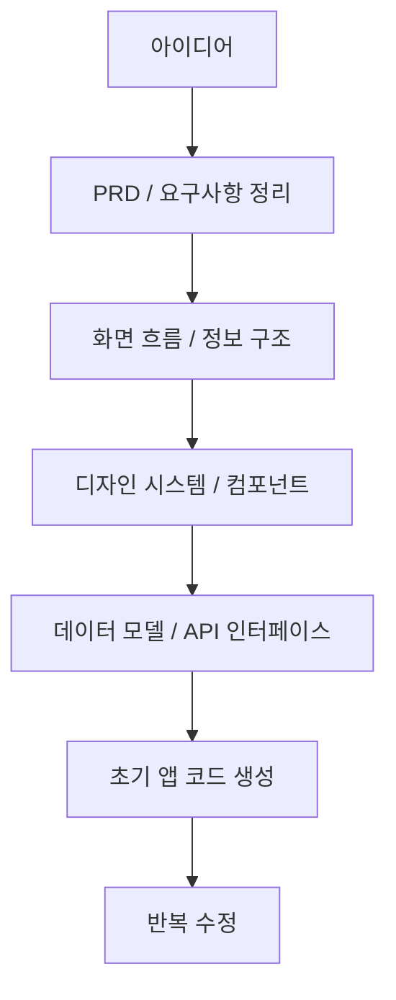

Threads에서 자주 보이는 AI 개발 도구 포스트 중에는 문장 하나만으로 사람을 멈추게 만드는 것들이 있습니다. 이번 글의 출발점도 그렇습니다. “Claude가 이제 여러분의 전체 모바일 앱을 구축할 수 있다. Apple 수준의 개발자처럼, 몇 분 만에, 무료로 가능하다”는 식의 짧고 강한 문장입니다. [Threads 원문](https://www.threads.com/@turtle_buff/post/DW5-Iw7D98s) [Jina Reader 추출](https://r.jina.ai/http://https://www.threads.com/@turtle_buff/post/DW5-Iw7D98s)
<!--more-->

다만 원문은 긴 설명이나 코드 저장소 링크가 붙은 형태가 아니라, 강한 주장과 이미지 카드 중심의 짧은 홍보형 포스트에 가깝습니다. 그래서 이 글은 그 주장을 사실로 단정하기보다, **이런 표현이 실제 개발 맥락에서 무엇을 뜻하는지** 를 해석하는 방식으로 정리합니다. 다시 말해 아래 내용 중 스레드가 직접 말하는 부분은 짧고, 나머지는 그 문장을 실전 워크플로 관점에서 풀어쓴 해석입니다. [Threads 원문](https://www.threads.com/@turtle_buff/post/DW5-Iw7D98s)

## Sources

- https://www.threads.com/@turtle_buff/post/DW5-Iw7D98s?xmt=AQF0l_ShpexQVUdfGSTZA13_d7-QmVVb8-hGkpY-0P7BI1W9bvpgLRe45pI2I9dC91qTL-g&slof=1
- https://r.jina.ai/http://https://www.threads.com/@turtle_buff/post/DW5-Iw7D98s

## 1. 원문이 실제로 말하는 것은 ‘앱 완성’보다 ‘앱 생성 속도의 압축’이다

원문은 아주 짧습니다. Claude가 “전체 모바일 앱”을 만들 수 있고, 예전에는 팀이 몇 주와 큰 비용을 들여 하던 일을 이제는 몇 가지 강력한 프롬프트로 할 수 있다는 주장입니다. 여기에 붙은 카드 이미지도 `Claude | iOS` 라는 조합으로, 메시지를 더 직설적으로 밀어 줍니다. [Threads 원문](https://www.threads.com/@turtle_buff/post/DW5-Iw7D98s) [Jina Reader 추출](https://r.jina.ai/http://https://www.threads.com/@turtle_buff/post/DW5-Iw7D98s)

여기서 중요한 것은 이 문장을 문자 그대로 “기획부터 출시까지 인간 없이 끝난다”로 읽기보다, **초기 앱 골격을 만드는 비용과 시간을 극단적으로 압축할 수 있다** 는 메시지로 읽는 편이 현실적이라는 점입니다. 원문에는 저장소, 데모, TestFlight 링크, 성능 검증 같은 근거가 붙어 있지 않기 때문입니다. 따라서 이 포스트의 직접 근거는 어디까지나 “Claude를 iOS 앱 생성에 연결하는 프롬프트 번들 혹은 워크플로가 있다”는 주장 수준입니다. [Threads 원문](https://www.threads.com/@turtle_buff/post/DW5-Iw7D98s)

## 2. 실전에서 ‘전체 모바일 앱 생성’은 보통 6단계 압축을 뜻한다

아래는 원문이 직접 설명한 내용이 아니라, 그 주장을 현실적인 개발 작업으로 풀어쓴 해석입니다. 오늘날 AI가 “앱을 만든다”고 할 때 실제로 압축되는 것은 대체로 여섯 단계입니다. 앱 아이디어를 PRD로 정리하고, 화면 목록과 사용자 흐름을 만들고, 디자인 시스템과 컴포넌트 규칙을 정하고, 데이터 모델과 API 인터페이스를 만들고, 첫 화면들을 코드로 뽑고, 마지막으로 수정 루프를 빠르게 돌리는 과정입니다.

즉 AI가 강한 것은 App Store 출시 자체보다도, **모호한 요구사항을 실행 가능한 앱 초안으로 빠르게 바꾸는 앞단** 입니다. 스레드의 “몇 주 걸리던 일이 몇 분으로 줄어든다”는 표현도 이 앞단 압축을 강조하는 쪽으로 읽는 것이 자연스럽습니다. 완전히 비어 있는 상태에서 첫 동작 버전까지 가는 거리가 엄청나게 줄어드는 것이지, 모든 운영·보안·성능·배포 이슈가 사라진다는 뜻은 아닙니다.

## 3. 프롬프트 몇 개가 강력해지는 이유는 프롬프트가 아니라 순서가 있기 때문이다

원문은 “몇 가지 강력한 프롬프트”를 강조하지만, 실제로 성과를 만드는 것은 프롬프트 문장 자체보다 **프롬프트가 호출하는 작업 순서** 입니다. 좋은 모바일 앱 생성 워크플로는 보통 한 번에 “앱 하나 만들어줘”라고 던지지 않습니다. 대신 앱 목적, 핵심 유저, 주요 화면, 상태 전이, 데이터 구조, 네이티브 기능 범위 같은 것을 순서대로 확정합니다.

결국 잘 되는 앱 생성은 마법의 문장 한 줄보다 작은 결정들을 누적하는 체계에 가깝습니다. 이 점에서 이런 류의 Threads 포스트를 볼 때 가장 주의할 부분도 보입니다. 겉으로는 프롬프트 몇 줄이 전부인 것처럼 보이지만, 실제로는 그 뒤에 **스펙 분해 → 코드 생성 → 에러 수정 → 디자인 정리 → 다시 생성** 의 반복 루프가 숨어 있는 경우가 많습니다.

## 4. 이 주장으로부터 실제로 배워야 할 것은 ‘모바일 앱을 글로 설계하는 능력’이다

이런 종류의 포스트가 던지는 진짜 신호는 “이제 코드를 몰라도 된다”가 아닙니다. 오히려 반대에 가깝습니다. 모바일 앱을 잘 만들려면 이제 코드만 잘 쓰는 것보다, **앱의 구조를 텍스트로 정확히 지시하는 능력** 이 훨씬 더 중요해집니다. 홈 화면에서 무엇이 보여야 하는지, 탭 구조는 어떤지, 상태는 어디에 저장하는지, 에러 시 UX는 어떻게 바뀌는지 같은 설명을 글로 잘 써야 모델 출력도 안정됩니다.

그래서 앞으로의 모바일 앱 생성은 “디자인 감각 + 제품 감각 + 구조적 서술 능력”의 결합으로 가는 흐름에 더 가깝습니다. Claude 같은 도구는 그 지시를 코드와 컴포넌트로 번역하는 속도를 올려 주지만, 무엇을 만들지와 어떤 기준으로 고칠지는 여전히 사람이 잡아야 합니다. 이 해석은 원문에 직접 적혀 있지는 않지만, “몇 개의 강력한 프롬프트”라는 표현이 실제로 작동하려면 반드시 필요한 전제입니다. [Threads 원문](https://www.threads.com/@turtle_buff/post/DW5-Iw7D98s)

## 5. ‘Apple 수준’이라는 표현은 품질 보증이 아니라 기대치 마케팅으로 보는 편이 안전하다

원문에는 “Apple 수준의 개발자처럼”이라는 강한 문구가 들어갑니다. 하지만 이 표현은 구체적 품질 기준이라기보다 기대를 끌어올리는 마케팅 수사로 해석하는 편이 안전합니다. 실제 앱 품질은 화면 일관성, 접근성, 성능, 상태 관리 안정성, 네이티브 동작 완성도, 배포 준비도 같은 요소로 갈리는데, 원문에는 그 검증 근거가 포함되어 있지 않습니다. [Threads 원문](https://www.threads.com/@turtle_buff/post/DW5-Iw7D98s)

따라서 이 포스트에서 현실적으로 건질 수 있는 메시지는 “Claude가 iOS 앱 프로토타입이나 1차 구현을 매우 빠르게 시작하게 해 줄 수 있다” 정도입니다. 그보다 더 강한 주장, 예를 들어 상용 출시 품질이 자동 보장된다는 식의 해석은 원문만으로는 뒷받침되지 않습니다.

## 실전 적용 포인트

첫째, 모바일 앱 생성에서 가장 먼저 자동화할 것은 코드가 아니라 요구사항 구조화입니다. AI에게 바로 코드부터 요청하기보다 앱 목적, 화면 목록, 핵심 동선, 상태 변화, 데이터 입출력을 먼저 명세하는 편이 결과가 훨씬 안정적입니다.

둘째, “전체 앱 생성” 요청은 한 번에 끝내지 말고 단계로 나눠야 합니다. 화면 구조를 먼저 만들고, 그다음 컴포넌트 규칙을 정하고, 이후 데이터 연결과 네이티브 기능을 붙이는 식으로 분리해야 Claude의 출력 품질이 올라갑니다.

셋째, 이런 홍보형 스레드는 도구의 가능성을 보는 용도로는 유용하지만, 그대로 믿고 개발 계획을 세우면 위험합니다. 저장소, 데모, 빌드 로그, 실제 코드 예시 같은 검증 가능한 산출물을 함께 확인하는 습관이 필요합니다.

## 핵심 요약

- 원문 스레드는 Claude가 전체 모바일 앱을 매우 빠르게 만들 수 있다는 강한 주장을 던진다.
- 하지만 직접 제공된 근거는 짧은 문장과 이미지 카드 수준이라, 상용 품질 보장으로 읽기에는 부족하다.
- 이 주장을 실전적으로 해석하면 “아이디어에서 실행 가능한 앱 초안까지 가는 앞단 비용이 크게 줄었다”는 의미에 가깝다.
- 진짜 중요한 것은 프롬프트 몇 줄보다도 스펙 분해와 생성 순서를 설계하는 능력이다.
- 앞으로 모바일 앱 생성에서는 코드 작성 능력만큼이나 앱 구조를 글로 정확히 설명하는 능력이 중요해진다.

## 결론

이 Threads 포스트는 정보량이 많지 않지만, 지금 AI 개발 도구 시장이 어디를 향하고 있는지는 꽤 선명하게 보여 줍니다. 사람들을 흥분시키는 포인트는 더 이상 “코드를 조금 도와준다”가 아니라, “앱 하나의 첫 버전을 거의 통째로 밀어붙인다”는 감각입니다.

다만 그 가능성을 실무에 연결하려면 과장된 문구를 그대로 믿기보다, 실제로 압축되는 단계가 무엇인지 분해해서 보는 습관이 필요합니다. Claude가 모바일 앱을 만든다는 말의 핵심은 만능 자동화가 아니라, **기획에서 앱 초안까지의 거리가 급격히 짧아졌다는 것** 입니다. 그리고 그 변화의 중심에는 프롬프트 문장보다, 생성 파이프라인을 설계하는 사람이 있습니다.
