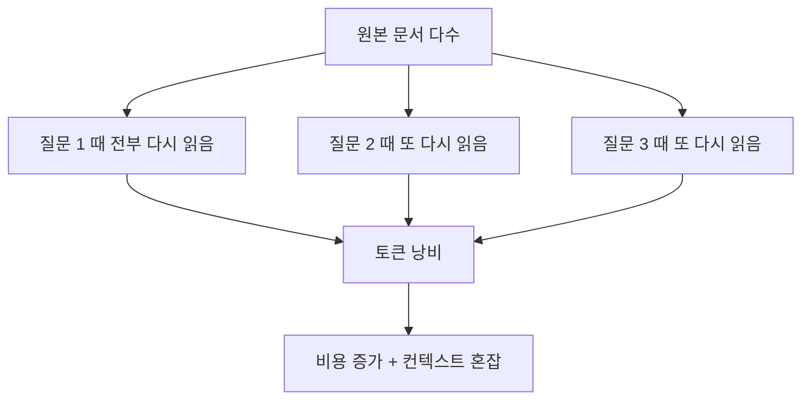
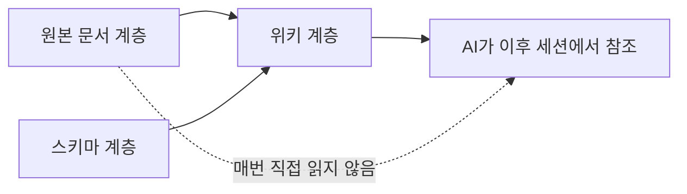
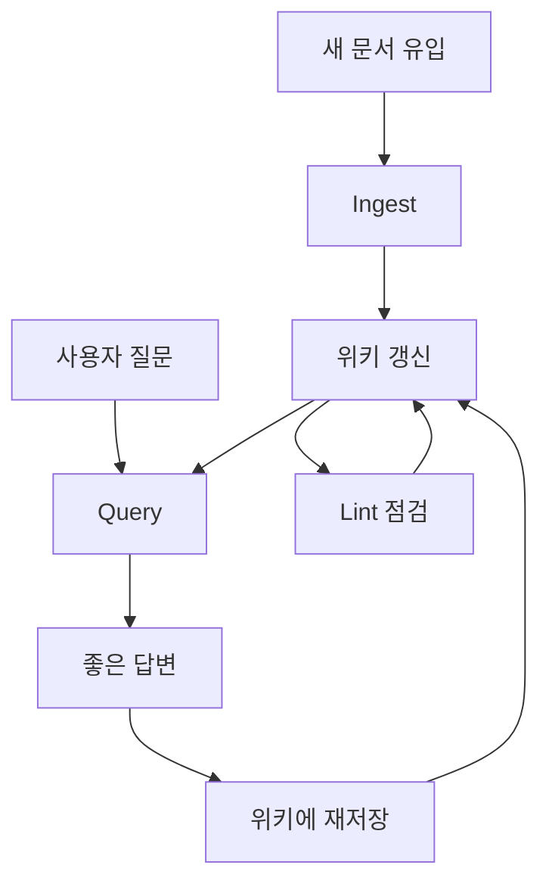

이 영상은 LLM Wiki 개념 자체를 처음 소개하는 데서 멈추지 않고, **왜 이 패턴이 실제 토큰 비용을 크게 줄이는지** 를 숫자와 운영 팁으로 설명합니다. 발표자는 문서 383개를 그대로 읽히면 세션 시작에 47,000토큰이 들었지만, 같은 자료를 LLM Wiki 방식으로 정리하니 7,700토큰으로 줄었고, 결과적으로 84% 절감이 가능했다고 말합니다. [0:00](https://youtu.be/5uTpUYw8Of4?t=0) [5:30](https://youtu.be/5uTpUYw8Of4?t=330)
<!--more-->

이미 Karpathy의 LLM Wiki 자체는 많이 알려졌지만, 이 영상이 흥미로운 이유는 그 개념을 Claude Code 사용자의 일상적인 문제와 바로 연결하기 때문입니다. AI가 같은 문서를 매번 다시 읽고, 앞 대화를 잊고, 토큰을 쓸데없이 태우는 상황을 어떻게 줄일지, 그리고 `/compact`, `/clear`, `CLAUDE.md`, 위키 컴파일러 플러그인을 어떻게 조합할지까지 실전적으로 이어 줍니다. [1:04](https://youtu.be/5uTpUYw8Of4?t=64) [8:02](https://youtu.be/5uTpUYw8Of4?t=482)

## Sources

- https://youtu.be/5uTpUYw8Of4?si=u_ePYW7GjfMhGmn6
- https://gist.github.com/karpathy/442a6bf555914893e9891c11519de94f
- https://github.com/ussumant/llm-wiki-compiler

## 1. 문제는 AI가 똑똑하지 않아서가 아니라 매번 다시 읽기 때문이다

영상의 첫 문제 제기는 단순합니다. AI는 앞에서 설명한 내용을 자꾸 잊고, 같은 프로젝트 문서를 매번 다시 훑습니다. 발표자는 이것을 컨텍스트 문제로 설명하며, 토큰을 AI의 단기 기억력 비용으로 비유합니다. 문서가 많아질수록 매 질문마다 다시 읽는 양이 커지고, 결국 비용과 응답 품질이 동시에 악화된다는 것입니다. [1:04](https://youtu.be/5uTpUYw8Of4?t=64) [2:04](https://youtu.be/5uTpUYw8Of4?t=124)

특히 영상은 이 현상을 “매일 출근할 때마다 기억이 초기화되는 신입사원” 비유로 풀어냅니다. 같은 100개 문서를 월요일, 화요일, 수요일마다 다시 읽어야 한다면 사람이 아무리 똑똑해도 비효율적일 수밖에 없습니다. 발표자의 핵심 메시지는 바로 이것입니다. 현재 많은 AI 도구의 병목은 모델 자체보다도, **이미 알고 있는 것을 매번 비싼 비용으로 다시 읽히는 운영 방식** 에 있습니다. [2:40](https://youtu.be/5uTpUYw8Of4?t=160) [3:09](https://youtu.be/5uTpUYw8Of4?t=189)

## 2. LLM Wiki 패턴은 원본 대신 ‘컴파일된 지식’을 보게 만든다

여기서 Karpathy의 LLM Wiki 패턴이 등장합니다. 발표자 설명에 따르면 아이디어는 단순합니다. 원본 문서를 질문 때마다 읽히지 말고, AI가 미리 핵심만 정리한 위키를 만든 뒤 이후에는 그 위키만 참조하게 하자는 것입니다. 영상은 이 구조를 3계층으로 설명합니다. 원본 소스 계층, 이를 정리한 위키 계층, 그리고 위키 구조와 형식을 정하는 스키마 계층입니다. [4:01](https://youtu.be/5uTpUYw8Of4?t=241) [4:29](https://youtu.be/5uTpUYw8Of4?t=269)

이 관점에서 중요한 것은 위키가 단순 요약본이 아니라는 점입니다. 발표자는 이를 “지식이 컴파일된 상태”라고 표현합니다. 즉 문서 더미를 그대로 매번 탐색하는 대신, 프로젝트 지식을 더 작은 구조적 산출물로 미리 변환해 두는 것입니다. 기존 RAG가 질의 시점의 검색에 더 가깝다면, LLM Wiki는 **사전 컴파일된 컨텍스트 운영** 에 더 가깝습니다. [5:00](https://youtu.be/5uTpUYw8Of4?t=300) [5:21](https://youtu.be/5uTpUYw8Of4?t=321)

## 3. 84% 절감 수치는 ‘문서를 덜 읽는다’는 말이 아니라 ‘읽는 단위를 바꾼다’는 뜻이다

영상은 이 패턴의 효과를 구체적인 숫자로 보여 줍니다. 383개의 마크다운 파일, 약 13.1MB 규모 문서를 위키로 컴파일했더니 13개 문서로 줄었고, 130개의 회의록 12만2,625줄은 244줄짜리 요약 파일로 압축됐다고 설명합니다. 발표자는 이를 각각 81배, 503배 압축으로 제시합니다. [5:30](https://youtu.be/5uTpUYw8Of4?t=330) [5:51](https://youtu.be/5uTpUYw8Of4?t=351)

토큰 수치도 분명합니다. 세션 시작 시 로딩되는 컨텍스트가 47,000토큰에서 7,700토큰으로 줄었고, 질문당 리서치 토큰은 약 8,000에서 600으로 감소했다고 말합니다. 중요한 것은 단순히 요약해서 짧아졌다는 사실보다, AI가 이후부터는 “원본 문서 더미”가 아니라 “프로젝트 지식의 구조화된 산출물”을 읽는다는 점입니다. 즉 절감은 압축 알고리즘의 마술이 아니라, **참조 대상 자체를 바꾸는 운영 전략** 에서 나옵니다. [6:08](https://youtu.be/5uTpUYw8Of4?t=368) [6:20](https://youtu.be/5uTpUYw8Of4?t=380)

## 4. 위키 운영은 ingest, query, lint의 순환 구조로 돌아간다

영상은 위키를 한 번 만들어 놓고 끝내는 정적 요약본으로 보지 않습니다. 발표자는 관리 과정을 세 가지로 설명합니다. 첫째는 ingest로, 새 문서가 들어오면 핵심을 추출해 관련 위키 페이지를 업데이트합니다. 둘째는 query로, 질문에 대한 좋은 답변이 나오면 그 답변 자체를 다시 위키에 저장해 지식을 풍부하게 만듭니다. 셋째는 lint로, 주기적으로 모순·낡은 정보·끊어진 연결을 점검합니다. [6:44](https://youtu.be/5uTpUYw8Of4?t=404) [7:41](https://youtu.be/5uTpUYw8Of4?t=461)

이 구조가 중요한 이유는 LLM Wiki를 단순 캐시가 아니라 살아 있는 지식 운영층으로 보기 때문입니다. 특히 질문과 답변을 다시 위키로 환류시키는 부분은, LLM Wiki가 정리본이면서 동시에 학습되는 운영 메모리라는 점을 보여 줍니다.

## 5. Claude Code에서는 `/compact`, `/clear`, `CLAUDE.md` 최적화가 기본기다

영상 후반부가 실용적인 이유는 거창한 위키 시스템이 없어도 지금 당장 적용할 수 있는 기본기를 짚어 주기 때문입니다. 발표자는 Claude Code 사용자라면 세 가지를 기억하라고 말합니다. 첫째 `/compact` 로 긴 대화를 압축하기, 둘째 주제가 바뀌면 `/clear` 로 새 세션 시작하기, 셋째 `CLAUDE.md` 를 너무 길게 두지 않고 중요한 규칙만 남기기입니다. [8:16](https://youtu.be/5uTpUYw8Of4?t=496)

특히 `CLAUDE.md` 를 200~500줄 사이로 유지하고 핵심 규칙만 남기라는 조언은, 앞서 말한 LLM Wiki 철학과 정확히 연결됩니다. 중요한 것은 더 많은 문맥을 무조건 넣는 것이 아니라, **지속적으로 다시 읽힐 문맥을 얼마나 압축된 형태로 유지하느냐** 입니다. 이 지점에서 `/compact` 와 `CLAUDE.md` 정리는 소형 LLM Wiki 운영이라고 봐도 무리가 없습니다. [8:52](https://youtu.be/5uTpUYw8Of4?t=532)

## 6. `llm-wiki-compiler` 플러그인은 이 개념을 실제 프로젝트 운영으로 바꾼다

영상은 마지막으로 `LLM Wiki Compiler` 플러그인을 소개합니다. 설명에 따르면 이 도구는 프로젝트 문서를 자동으로 분석해 위키로 컴파일하고, 이후에는 AI가 원본 문서 대신 이 컴파일된 위키를 참조하게 만듭니다. 즉 Karpathy의 개념을 Claude Code에서 바로 써 볼 수 있게 만든 구현체라는 의미입니다. [9:01](https://youtu.be/5uTpUYw8Of4?t=541)

비용 설명도 흥미롭습니다. 발표자는 초기 컴파일 비용이 대략 2.6달러에서 13달러, 이후 증분 업데이트 비용은 0.3달러에서 1.5달러 수준이라고 말합니다. 겉으로 보면 비싸 보일 수 있지만, 세션마다 47,000토큰을 태우는 대신 7,700토큰만 쓰게 된다면 첫 세션부터 본전을 뽑는 구조라고 주장합니다. [9:28](https://youtu.be/5uTpUYw8Of4?t=568) [9:50](https://youtu.be/5uTpUYw8Of4?t=590)

## 실전 적용 포인트

첫째, 위키 컴파일러를 당장 도입하지 않더라도 `/compact`, `/clear`, `CLAUDE.md` 다이어트만으로도 꽤 큰 개선을 체감할 수 있습니다. 특히 세션이 길어질수록 이 세 가지의 차이가 커집니다.

둘째, 문서가 많은 팀 프로젝트라면 원본 파일 전체를 매번 읽히는 구조부터 의심해야 합니다. 위키 컴파일, 인덱스 요약, 모듈별 핵심 문서 같은 중간 산출물이 없으면 AI는 항상 비싼 방식으로 기억을 복구합니다.

셋째, LLM Wiki는 단순 요약이 아니라 운영 체계입니다. ingest로 새 지식을 반영하고, query로 좋은 답변을 축적하고, lint로 모순을 정리하는 순환 구조를 만들어야 효과가 커집니다.

## 핵심 요약

- AI의 큰 비효율은 문서를 이해하지 못해서가 아니라, 같은 문서를 매번 다시 읽는 데서 나온다.
- Karpathy의 LLM Wiki 패턴은 원본 대신 컴파일된 위키를 참조하게 만들어 이 문제를 줄인다.
- 영상이 제시한 사례에서는 세션 시작 컨텍스트가 47,000토큰에서 7,700토큰으로 줄어 84% 절감 효과가 나타났다.
- Claude Code에서는 `/compact`, `/clear`, `CLAUDE.md` 최적화가 가장 먼저 적용할 기본기다.
- `llm-wiki-compiler` 같은 도구는 이 개념을 실제 프로젝트 운영 레이어로 옮기는 구현체다.

## 결론

이 영상의 진짜 메시지는 “토큰을 아껴라”가 아닙니다. 더 정확히는 **AI가 계속 다시 배우게 만들지 말라** 는 쪽에 가깝습니다. Karpathy의 LLM Wiki는 결국 지식을 원본 더미 상태로 두지 않고, 작업 가능한 형태로 컴파일해 두자는 제안입니다.

그래서 이 패턴의 가치는 비용 절감에만 있지 않습니다. 토큰이 줄어들면 비용도 줄지만, 그보다 더 중요한 것은 세션 품질과 일관성이 좋아진다는 점입니다. Claude Code를 오래 쓸수록 느끼는 답답함, 즉 앞 대화를 잊고 같은 문서를 또 읽는 문제를 줄이려면, 앞으로는 프롬프트보다도 **컴파일된 컨텍스트를 운영하는 방식** 이 더 중요해질 가능성이 큽니다.
