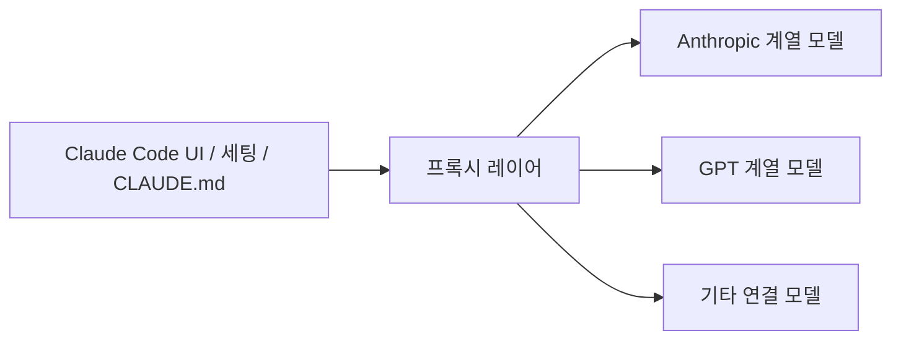
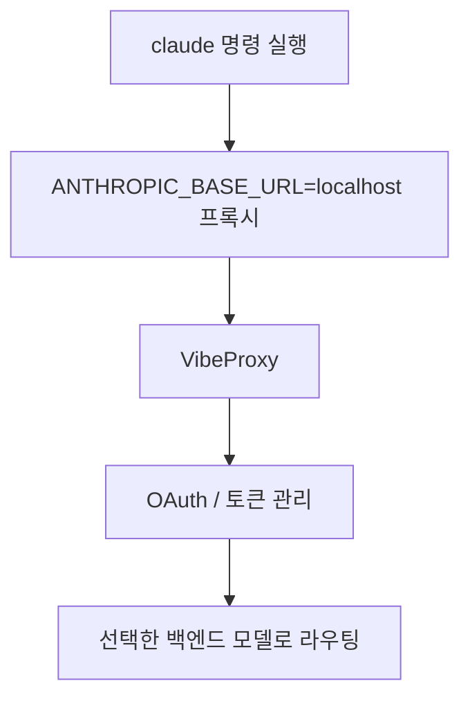

이 스레드가 흥미로운 이유는 “Claude Code 대신 GPT를 써라”가 아니라, **Claude Code의 작업 환경은 그대로 두고 모델만 바꿔 붙일 수 있다** 는 감각을 보여 주기 때문입니다. 작성자는 Claude Code 토큰이 빠르게 소진되는 상황에서, 기존에는 MCP로 GPT와 왕복했지만 그 역시 토큰과 세팅 비용이 들었고, 대신 `VibeProxy` 를 쓰면 Claude Code의 UI·설정·`CLAUDE.md` 를 그대로 유지하면서 모델만 `GPT-5.4` 로 바꿔 쓸 수 있다고 설명합니다. [Threads 원문](https://www.threads.com/@aychan3927/post/DW7wRVUD82s) [Jina Reader 추출](https://r.jina.ai/http://https://www.threads.com/@aychan3927/post/DW7wRVUD82s)
<!--more-->

여기서 기술적으로 중요한 포인트는 “Claude Code를 다른 앱으로 대체한다”가 아니라, 모델 라우팅 계층을 중간에 하나 넣는다는 점입니다. 링크된 `automazeio/vibeproxy` 저장소도 이 도구를 “native macOS menu bar app” 이자, Claude Code·ChatGPT 등 기존 구독을 AI coding tools에서 API key 없이 쓸 수 있게 해 주는 프록시로 소개합니다. 즉 이 글의 핵심은 특정 모델 우열 비교보다, **코딩 에이전트의 인터페이스와 백엔드 모델을 분리하는 운영 방식** 에 있습니다. [GitHub README](https://github.com/automazeio/vibeproxy) [GitHub API](https://api.github.com/repos/automazeio/vibeproxy)

## Sources

- https://www.threads.com/@aychan3927/post/DW7wRVUD82s?xmt=AQF0Ph6HLsn72fva0-hxwRHqyaODWVth9_8mlk7-uyWedi0iXG5zneo_yBbzc17j6IALiy86&slof=1
- https://r.jina.ai/http://https://www.threads.com/@aychan3927/post/DW7wRVUD82s
- https://github.com/automazeio/vibeproxy
- https://raw.githubusercontent.com/automazeio/vibeproxy/main/README.md

## 1. 이 스레드의 핵심은 ‘모델 교체’보다 ‘전환 비용 제거’다

원문 스레드는 요즘 Claude Code 토큰이 빠르게 줄어드는 문제의식에서 시작합니다. 작성자는 예전에는 MCP를 통해 GPT에 요청을 보내고 다시 받는 식으로 우회했지만, 그것 역시 토큰을 먹고 세팅도 번거로웠다고 말합니다. 그리고 그 대안으로 `VibeProxy` 를 제시하며, Claude Code UI·세팅·`CLAUDE.md` 는 그대로 두고 모델만 바꿔 쓸 수 있다고 설명합니다. [Threads 원문](https://www.threads.com/@aychan3927/post/DW7wRVUD82s)

이 말의 진짜 의미는 “GPT가 더 좋다”보다도, **환경을 바꾸지 않고 모델만 교체할 수 있으니 전환 비용이 거의 없다** 는 데 있습니다. 실제로 작성자는 한 프로젝트에서 터미널 두 개를 열어 Opus를 물린 Claude Code와 GPT-5.4를 물린 Claude Code를 번갈아 쓴다고 말합니다. 이 방식이 흥미로운 이유는, 모델 선택이 도구 교체가 아니라 세션 운영 문제로 바뀐다는 점입니다. [Jina Reader 추출](https://r.jina.ai/http://https://www.threads.com/@aychan3927/post/DW7wRVUD82s)

## 2. `VibeProxy` 는 모델 앱이 아니라 구독 라우터에 가깝다

링크된 GitHub 저장소는 `VibeProxy` 를 단순 프롬프트 툴이 아니라, 기존 Claude Code·ChatGPT·Gemini·Qwen 등의 구독을 AI coding tools에서 활용하게 해 주는 macOS 메뉴바 프록시 앱으로 설명합니다. README에 따르면 OAuth 인증, 토큰 관리, API 라우팅을 자동으로 처리하며 별도 API key 없이 연결하는 것이 핵심입니다. [GitHub README](https://github.com/automazeio/vibeproxy)

이 설명은 스레드의 주장과 잘 맞물립니다. 사용자는 Claude Code의 워크플로를 버리지 않고, 중간 프록시가 어떤 백엔드 모델로 요청을 보낼지 조정하게 됩니다. 이 구조를 받아들이면 “나는 Claude Code 유저인가, ChatGPT 유저인가” 같은 구분보다, **나는 어떤 UI와 어떤 모델 조합을 운영할 것인가** 가 더 중요한 질문이 됩니다. [GitHub README](https://github.com/automazeio/vibeproxy)

## 3. 스레드가 제시한 설정은 결국 환경 변수로 모델 라우팅을 바꾸는 방식이다

작성자는 세팅을 세 줄로 요약합니다. 먼저 `VibeProxy` 를 설치하고 OpenAI 구독 로그인을 한 뒤, 터미널에서 `ANTHROPIC_BASE_URL=http://localhost:8318 ANTHROPIC_MODEL=gpt-5.4 claude` 식으로 실행한다는 것입니다. 즉 Claude Code 클라이언트는 그대로 두고, 요청 대상 URL과 모델 이름만 프록시가 이해하는 값으로 바꿔 주는 방식입니다. [Jina Reader 추출](https://r.jina.ai/http://https://www.threads.com/@aychan3927/post/DW7wRVUD82s)

이 지점이 실무적으로 중요합니다. 많은 사용자는 모델을 바꾸려면 도구 자체를 갈아타야 한다고 생각하지만, 실제로는 클라이언트와 서버 레이어를 분리하면 훨씬 유연해집니다. 스레드 작성자가 “클코에게 그 깃허브 레포를 주고 세팅해 달라고 하면 된다”고 말한 것도, 결국 이 작업이 복잡한 재개발이 아니라 환경 설정 자동화의 범주라는 뜻입니다. [Jina Reader 추출](https://r.jina.ai/http://https://www.threads.com/@aychan3927/post/DW7wRVUD82s)

## 4. 이 방식의 장점은 모델 품질보다 운영 유연성에 있다

스레드 댓글에서도 이 장점이 드러납니다. 작성자는 Opus를 연결한 Claude Code와 GPT-5.4를 연결한 Claude Code를 한 프로젝트에서 번갈아 쓸 수 있고, `CLAUDE.md` 나 작업 습관을 다시 맞출 필요가 없다고 설명합니다. 즉 이 구조의 가장 큰 장점은 특정 모델 하나의 절대 성능이 아니라, **같은 인터페이스 위에서 역할별로 모델을 분리해 운용할 수 있다는 점** 입니다. [Jina Reader 추출](https://r.jina.ai/http://https://www.threads.com/@aychan3927/post/DW7wRVUD82s)

예를 들어 한쪽 세션은 구현용, 다른 한쪽 세션은 검수·아이디어 확장용으로 쓸 수 있습니다. 이때 중요한 것은 사용자가 새로운 CLI나 새로운 프롬프트 습관을 다시 배우지 않아도 된다는 점입니다. 인터페이스 학습 비용이 0에 가까우니, 모델 실험 비용도 크게 줄어듭니다.

## 5. 다만 원문 기준으로는 맥 중심의 커뮤니티 팁에 가깝다

한 가지 주의할 점도 있습니다. 스레드 작성자는 이 방법이 자신이 아는 한 맥에서 되는 방식이라고 언급하고, 댓글에서는 윈도우용 대안으로 다른 도구 이름을 짧게 언급합니다. 반면 `VibeProxy` README 역시 macOS 13+ 메뉴바 앱이라는 점을 분명히 적고 있습니다. 따라서 이 포스트를 범용적인 “모든 환경에서 Claude Code를 GPT-5.4로 바꾸는 법”으로 읽기보다, **macOS 중심의 커뮤니티 운영 패턴** 으로 보는 편이 정확합니다. [Jina Reader 추출](https://r.jina.ai/http://https://www.threads.com/@aychan3927/post/DW7wRVUD82s) [GitHub README](https://github.com/automazeio/vibeproxy)

또 하나는 모델명입니다. 스레드는 `GPT-5.4` 를 직접 언급하지만, 저장소 README는 구독 프록시 개념을 분명히 설명하는 반면 특정 최신 모델 표기는 시점에 따라 달라질 수 있습니다. 따라서 정확한 모델 지원 범위는 실제 릴리스/README를 다시 확인하는 편이 안전합니다. 이 글에서는 **스레드 작성자의 사용 사례** 와 **저장소가 설명하는 프록시 구조** 를 구분해 읽는 것이 중요합니다. [GitHub README](https://github.com/automazeio/vibeproxy)

## 실전 적용 포인트

첫째, 코딩 에이전트를 비교할 때 UI와 모델을 한 덩어리로 보지 않는 습관이 중요합니다. 인터페이스는 Claude Code가 편하고, 모델은 다른 것을 시험해 보고 싶다면 프록시 레이어가 좋은 절충안이 될 수 있습니다.

둘째, `CLAUDE.md`, 명령 습관, 프로젝트 컨텍스트를 유지한 채 모델만 교체할 수 있으면 실험 비용이 크게 줄어듭니다. 이 점이 스레드가 말하는 “좋다”의 핵심에 더 가깝습니다.

셋째, 이런 프록시 방식은 세션 역할 분리에 특히 유리합니다. 한 터미널은 구현, 다른 터미널은 리뷰·기획처럼 역할별로 모델을 나눠 운영하면 비교 실험이 쉬워집니다.

## 핵심 요약

- 이 스레드의 포인트는 Claude Code를 버리는 것이 아니라, 모델만 바꿔 붙이는 방식이다.
- `VibeProxy` 는 Claude Code 같은 클라이언트와 실제 백엔드 모델 사이에 들어가는 구독 프록시 레이어에 가깝다.
- 작성자는 `ANTHROPIC_BASE_URL` 과 `ANTHROPIC_MODEL` 환경 변수로 Claude Code 요청을 프록시로 보내는 방법을 소개한다.
- 가장 큰 장점은 새로운 도구를 다시 배우지 않고 같은 UI·세팅·`CLAUDE.md` 를 유지한 채 모델 실험을 할 수 있다는 점이다.
- 다만 원문과 저장소 기준으로 보면 이 방식은 macOS 중심의 커뮤니티 팁으로 보는 편이 정확하다.

## 결론

이 스레드는 단순히 “GPT-5.4가 좋다”는 모델 추천 글이라기보다, 코딩 에이전트 시대의 중요한 구조 변화를 보여 줍니다. 앞으로는 특정 앱과 특정 모델이 단단히 묶여 있기보다, UI·워크플로·메모리 레이어와 실제 추론 모델이 점점 더 분리될 가능성이 큽니다.

그 변화 속에서 중요한 경쟁력은 어떤 모델을 쓰느냐 하나보다, **같은 작업 환경을 유지한 채 얼마나 낮은 비용으로 모델을 교체하고 병행 운용할 수 있느냐** 에 있을지도 모릅니다. `VibeProxy` 를 둘러싼 이 스레드는 바로 그 방향을 보여 주는 작은 사례입니다.
