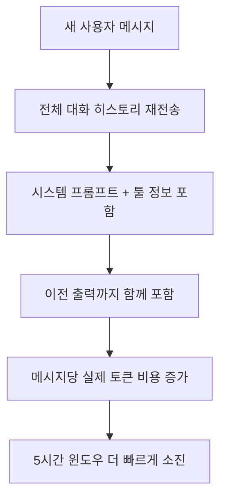
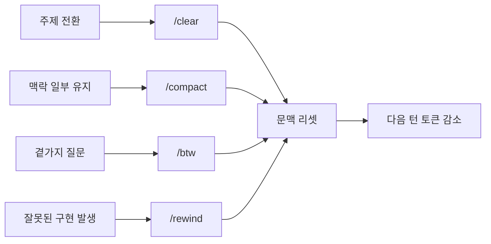
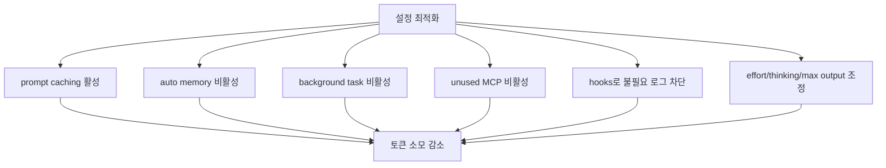

이 영상의 문제의식은 단순합니다. Claude Code의 1M 토큰 컨텍스트 윈도우가 생겼는데도, 체감상 한도는 오히려 더 빨리 닳는다는 것입니다. 발표자는 팀이 매일 Claude Code를 쓰면서 최근 몇 주 동안 한도가 너무 빨리 소진되는 문제를 겪었고, 그래서 세션 길이를 늘리고 토큰 소모를 줄이는 방법을 체계적으로 정리하게 됐다고 설명합니다. [0:00](https://youtu.be/YsdQE6juGXY?t=0) [0:13](https://youtu.be/YsdQE6juGXY?t=13)
<!--more-->

이 영상이 유용한 이유는 팁을 나열하는 데서 끝나지 않기 때문입니다. 먼저 Claude의 5시간 한도 구조가 어떻게 돌아가는지 설명하고, 그다음 누수 원인을 `source code issues`, `session-level`, `project-level`, `config-level` 로 분리해 보여 줍니다. 그래서 “토큰 절약”을 단순한 습관 문제가 아니라, **컨텍스트가 어떻게 쌓이고 어떻게 다시 전송되는가의 구조 문제** 로 이해하게 해 줍니다. [0:21](https://youtu.be/YsdQE6juGXY?t=21) [4:55](https://youtu.be/YsdQE6juGXY?t=295) [6:41](https://youtu.be/YsdQE6juGXY?t=401)

## Sources

- https://youtu.be/YsdQE6juGXY

## 1. Claude Code 한도는 ‘메시지 수’보다 ‘메시지당 문맥 크기’에 더 민감하다

영상은 먼저 Claude의 유료 플랜이 5시간 윈도우 기준으로 메시지 수 제한을 두고 있다고 설명합니다. 대략 Pro는 45개, Max는 225개, 더 상위 Max 20x는 900개 수준의 rough count를 예시로 들지만, 발표자는 이 숫자가 모델과 작업 유형에 따라 달라질 수 있다고 분명히 말합니다. 특히 Sonnet보다 Opus가 훨씬 많은 토큰을 소비하고, 여러 툴을 쓰는 복잡한 작업은 같은 메시지 수라도 훨씬 빨리 한도를 소모합니다. [0:30](https://youtu.be/YsdQE6juGXY?t=30) [1:28](https://youtu.be/YsdQE6juGXY?t=88) [2:10](https://youtu.be/YsdQE6juGXY?t=130)

핵심은 “메시지 한 번”이 항상 같은 비용이 아니라는 점입니다. 영상은 Claude가 새 응답을 만들 때마다 지금까지의 전체 대화, 시스템 프롬프트, 툴 정보, 이전 결과를 다시 보낸다고 설명합니다. 그래서 컨텍스트가 길어질수록 매 메시지의 실질 비용이 커지고, 1M 컨텍스트가 오히려 방심을 불러 더 큰 문맥 비대화를 낳을 수 있다는 해석이 가능합니다. [5:04](https://youtu.be/YsdQE6juGXY?t=304)

## 2. 문제는 공식 한도만이 아니라 숨은 컨텍스트 누수다

영상은 Claude Code 소스 누출 이후 지적된 몇 가지 비효율을 예로 듭니다. 대표적인 것이 잘린 응답, 즉 truncated response가 그대로 문맥에 남는 문제입니다. 예를 들어 rate limit 같은 오류로 응답이 중간에 끊겨도, 그 부분 응답과 에러 메시지가 다음 재시도에 문맥으로 함께 남아 컨텍스트를 부풀린다는 설명입니다. [3:55](https://youtu.be/YsdQE6juGXY?t=235)

또 하나는 skill listing 같은 정보가 빠른 접근을 위해 주입되지만 실제 가치에 비해 문맥을 차지할 수 있다는 지적입니다. 영상은 이런 요소들이 공식 문서에 잘 드러나지 않는 숨은 토큰 drain 이고, 사용자는 결국 “한도가 왜 이렇게 빨리 닳지?”라는 감각만 체험하게 된다고 말합니다. 포인트는 명확합니다. 한도를 아끼려면 단순히 덜 말하는 것이 아니라, **문맥에 남아 있는 쓰레기와 재전송 구조를 줄여야 한다** 는 것입니다. [4:00](https://youtu.be/YsdQE6juGXY?t=240) [4:17](https://youtu.be/YsdQE6juGXY?t=257)

## 3. 세션 수준에서는 `/clear`, `/compact`, `/btw`, `/rewind` 가 핵심이다

영상은 세션 레벨 최적화의 첫 번째 기본기로 `/clear` 와 `/compact` 를 듭니다. 구현을 끝내고 테스트로 넘어가는 식으로 작업 주제가 바뀌면 `/clear` 로 대화를 비우고 새 세션을 여는 편이 낫고, 이전 맥락 중 일부는 유지하고 싶다면 `/compact` 로 요약본만 남기는 것이 좋다는 설명입니다. [4:39](https://youtu.be/YsdQE6juGXY?t=279) [4:57](https://youtu.be/YsdQE6juGXY?t=297)

여기에 `/btw` 와 `/rewind` 가 더해집니다. `/btw` 는 본 작업창을 오염시키지 않고 곁가지 질문을 별도 세션으로 처리하게 해 주고, `/rewind` 는 Claude가 잘못된 방향으로 구현했을 때 틀린 결과를 문맥에 남긴 채 다시 프롬프트하는 대신, 그 이전 상태로 되돌린 뒤 정확한 지시로 다시 출발하게 합니다. 발표자는 `escape` 두 번으로 비슷한 동작도 가능하다고 말합니다. [5:20](https://youtu.be/YsdQE6juGXY?t=320) [5:57](https://youtu.be/YsdQE6juGXY?t=357)

이 네 가지 명령이 중요한 이유는 결국 잘못된 출력과 불필요한 대화가 다음 턴 비용을 계속 키우기 때문입니다. 즉 세션 관리는 UX 편의 기능이 아니라, **다음 메시지의 토큰 단가를 낮추는 비용 제어 장치** 라고 보는 편이 더 정확합니다.

## 4. 프로젝트 수준에서는 `CLAUDE.md` 를 짧게 유지하고 점진 로딩 구조로 바꿔야 한다

영상에서 가장 강하게 말하는 부분 중 하나가 `CLAUDE.md` 입니다. 발표자는 `/init` 으로 생성된 기본 파일이 과도하게 많은 내용을 담고 있고, 그중 상당수는 Claude가 원래 알고 있는 내용이라고 지적합니다. 예를 들어 일반적인 dev server 실행 명령이나 파일 이름만 봐도 추론 가능한 구조 설명은 굳이 상주 컨텍스트에 넣을 필요가 없다는 것입니다. [6:45](https://youtu.be/YsdQE6juGXY?t=405) [7:15](https://youtu.be/YsdQE6juGXY?t=435)

권장 방향은 명확합니다. `CLAUDE.md` 는 ideally 300줄 이하로 유지하고, 프로젝트 전반에 공통으로 적용되는 규칙만 남기며, 데이터베이스 스키마나 특정 영역 규칙은 별도 문서로 분리해 링크하라는 것입니다. 그러면 Claude가 필요한 문서만 점진적으로 불러오게 되어 불필요한 정보가 매 세션 시작부터 상주하지 않습니다. [7:26](https://youtu.be/YsdQE6juGXY?t=446) [8:08](https://youtu.be/YsdQE6juGXY?t=488)

영상은 여기서 더 나아가 path-specific rules, skills, scripts, references 활용도 권합니다. 반복 워크플로는 skills로, 결정적 작업은 스크립트로 옮기면 Claude가 일일이 자연어로 긴 절차를 다시 읽을 필요가 줄어듭니다. 요약하면 프로젝트 레벨 최적화의 핵심은 **모든 지식을 상주시키지 말고, 필요한 순간에만 불러오게 만드는 것** 입니다. [8:24](https://youtu.be/YsdQE6juGXY?t=504) [8:38](https://youtu.be/YsdQE6juGXY?t=518)

## 5. 설정 수준에서는 MCP·hooks·memory·thinking 을 다뤄야 한다

영상 후반부는 `.claude` 폴더 설정과 background behavior 에 집중합니다. 먼저 `disablePromptCaching` 은 `false` 로 두어 반복되는 prefix를 캐시하게 해야 하고, `auto memory` 와 `background task` 는 필요 없으면 꺼서 대화 외부의 백그라운드 토큰 소모를 줄이라고 설명합니다. 발표자는 auto memory 가 대화를 분석해 프로젝트 메모리 파일을 갱신하는 과정 자체가 토큰을 사용한다고 말합니다. [11:02](https://youtu.be/YsdQE6juGXY?t=662) [11:17](https://youtu.be/YsdQE6juGXY?t=677)

또 사용하지 않는 MCP는 비활성화하고, hooks 를 이용해 문맥에 들어가면 안 되는 내용을 필터링하라고 권합니다. 예시로 모든 테스트 로그 대신 실패한 테스트만 남기는 hook 을 소개하는데, 이 아이디어가 중요합니다. Claude가 고쳐야 할 것은 실패한 케이스이지, 이미 통과한 테스트의 긴 로그가 아니기 때문입니다. [10:28](https://youtu.be/YsdQE6juGXY?t=628) [10:44](https://youtu.be/YsdQE6juGXY?t=644)

마지막으로 모델 effort, thinking, max output tokens도 비용 제어 장치입니다. 단순 작업이면 low effort, 더 단순하면 thinking 자체를 꺼서 내부 추론 비용을 줄이고, 출력 길이가 필요 이상으로 길어지지 않도록 max output tokens 를 제한하라는 조언입니다. 이 부분에서 영상은 “낮은 effort” 와 “thinking 완전 비활성화”를 구분하는데, 전자는 생각의 강도를 줄이는 것이고 후자는 추론 단계를 아예 꺼 버리는 것입니다. [9:46](https://youtu.be/YsdQE6juGXY?t=586) [11:52](https://youtu.be/YsdQE6juGXY?t=712) [12:22](https://youtu.be/YsdQE6juGXY?t=742)

## 실전 적용 포인트

첫째, Claude Code 한도 문제는 단순히 모델이 비싸서가 아니라, 대화가 길어질수록 매 턴 재전송되는 문맥 구조 때문이라고 이해하는 편이 좋습니다.

둘째, 가장 빠른 개선은 세션 관리에서 옵니다. `/clear`, `/compact`, `/btw`, `/rewind` 네 가지를 습관화하면 잘못된 출력과 곁가지 대화가 다음 턴 비용으로 누적되는 일을 많이 줄일 수 있습니다.

셋째, 중장기적으로는 `CLAUDE.md` 다이어트와 점진 로딩 구조가 핵심입니다. 파일 하나에 모든 규칙을 몰아넣는 방식은 편해 보여도 가장 비싼 운영 방식일 수 있습니다.

넷째, hooks 와 설정값은 생각보다 영향이 큽니다. 테스트 로그, background memory, 사용하지 않는 MCP, 과한 thinking 은 눈에 안 보이지만 한도를 빨리 태우는 대표적인 요소입니다.

## 핵심 요약

- Claude Code 한도는 메시지 수보다도 메시지당 문맥 비대화에 크게 좌우된다.
- 잘린 응답과 skill listings 같은 숨은 컨텍스트 누수가 한도 소모를 가속할 수 있다.
- 세션 레벨에서는 `/clear`, `/compact`, `/btw`, `/rewind` 가 핵심 절약 장치다.
- 프로젝트 레벨에서는 `CLAUDE.md` 를 짧게 유지하고 규칙을 분리해 점진 로딩 구조로 바꾸는 것이 중요하다.
- 설정 레벨에서는 prompt caching, hooks, MCP, auto memory, thinking, max output tokens 조정이 실제 절감에 큰 영향을 준다.

## 결론

이 영상의 좋은 점은 Claude Code 한도 문제를 단순한 “요금제 탓”으로 돌리지 않는다는 데 있습니다. 진짜 병목은 더 큰 컨텍스트를 손에 넣은 뒤에도, 그 문맥을 어떻게 관리할지에 대한 운영 원칙이 없으면 결국 같은 정보를 더 비싼 방식으로 계속 재전송하게 된다는 점입니다.

결국 Claude Code를 오래 쓰는 방법은 한 번에 더 많은 문맥을 밀어 넣는 것이 아니라, **어떤 문맥을 상주시킬지, 무엇을 버릴지, 언제 다시 시작할지** 를 잘 설계하는 것입니다. 이 영상은 그 원칙을 세션·프로젝트·설정이라는 세 층으로 나눠 꽤 실용적으로 보여 줍니다.
