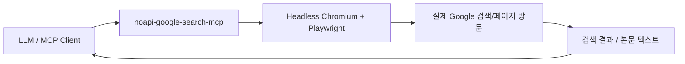
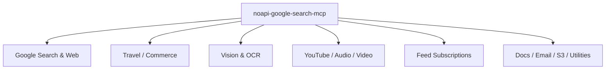

`noapi-google-search-mcp` 가 흥미로운 이유는 이름 그대로입니다. 보통 로컬 LLM이나 Claude Desktop 같은 MCP 클라이언트에 검색 기능을 붙이려면 Google API 키, Custom Search Engine 설정, 사용량 제한 같은 관문부터 통과해야 합니다. 그런데 이 프로젝트는 **브라우저가 직접 Google을 방문하는 방식으로 그 절차를 우회** 하려 합니다. PyTorchKR 포럼 글도 이 점을 핵심으로 소개합니다. [PyTorchKR 포럼](https://discuss.pytorch.kr/t/noapi-google-search-mcp-google-search-api-key-mcp/8968)
<!--more-->

다만 한 가지 흥미로운 점이 있습니다. 포럼 글은 2026년 2월 11일 시점의 요약이고, 원본 저장소 README는 2026년 4월 10일 기준 훨씬 더 넓은 범위를 설명합니다. 즉 처음에는 “API 키 없이 Google 검색을 붙이는 MCP 서버”로 읽히지만, 현재 README를 보면 이미 **검색 서버를 넘어 로컬 피드 수집, YouTube RAG, OCR, 비디오 클립 추출까지 확장된 종합 MCP 도구함** 에 가까워졌습니다. 이 글은 이 두 층위를 구분해서 정리합니다. [PyTorchKR 포럼](https://discuss.pytorch.kr/t/noapi-google-search-mcp-google-search-api-key-mcp/8968) [GitHub README](https://github.com/VincentKaufmann/noapi-google-search-mcp)

## Sources

- https://discuss.pytorch.kr/t/noapi-google-search-mcp-google-search-api-key-mcp/8968
- https://github.com/VincentKaufmann/noapi-google-search-mcp
- https://raw.githubusercontent.com/VincentKaufmann/noapi-google-search-mcp/main/README.md

## 1. 출발점은 단순하다: Google API 대신 브라우저를 돌린다

포럼 글 기준으로 `noapi-google-search-mcp` 의 핵심은 Headless Chromium과 Playwright를 이용해 브라우저가 실제 사용자의 검색처럼 결과를 가져오게 만든다는 점입니다. 그래서 Google Custom Search JSON API 없이도 실제 Google 검색 결과를 활용할 수 있고, 복잡한 GCP 설정이나 유료 할당량 없이 쓸 수 있다는 것이 장점으로 제시됩니다. [PyTorchKR 포럼](https://discuss.pytorch.kr/t/noapi-google-search-mcp-google-search-api-key-mcp/8968)

이 접근이 중요한 이유는 결과 품질 차이 때문입니다. 포럼 글은 공식 API 기반 MCP 서버가 `Custom Search Engine` 결과를 반환하는 반면, 이 프로젝트는 실제 사용자가 보는 Google 검색 결과에 더 가깝다고 설명합니다. 또 JavaScript 렌더링 페이지를 Chromium으로 직접 처리할 수 있다는 점도 API 기반 방식과 대비되는 장점으로 정리합니다. [PyTorchKR 포럼](https://discuss.pytorch.kr/t/noapi-google-search-mcp-google-search-api-key-mcp/8968)

## 2. 포럼 글 기준으로도 이미 ‘검색’ 이상의 Google 특화 도구 묶음이었다

포럼 글은 이 프로젝트를 단순 웹 검색 도구로만 소개하지 않습니다. `google_search` 외에도 쇼핑, 항공권, 호텔, 번역, 지도, 날씨, 금융, 뉴스, Scholar, 이미지 등 Google 특화 서비스가 개별 툴로 제공된다고 적고 있습니다. 또 `visit_page` 로 검색된 URL 본문을 직접 읽어 LLM에게 전달할 수 있다고 설명합니다. [PyTorchKR 포럼](https://discuss.pytorch.kr/t/noapi-google-search-mcp-google-search-api-key-mcp/8968)

즉 초기 버전만 봐도 이 프로젝트의 아이디어는 “검색 엔진 API 대체품”이라기보다, **Google을 하나의 거대한 툴셋으로 쪼개 MCP 도구로 노출하는 것** 에 더 가까웠습니다. 사용자는 함수명을 직접 외울 필요 없이 자연어로 요청하고, LLM이 그에 맞는 도구를 고르게 됩니다. 이런 점에서 noapi-google-search-mcp 는 검색기보다 “Google front-end를 LLM 툴로 변환한 서버”에 가깝습니다. [PyTorchKR 포럼](https://discuss.pytorch.kr/t/noapi-google-search-mcp-google-search-api-key-mcp/8968)

## 3. 2026년 4월 기준 README를 보면, 이 저장소는 이미 38개 도구로 확장됐다

원본 GitHub README를 보면 범위가 더 커져 있습니다. 첫 줄부터 “38 tools. Zero API keys.” 라고 소개하며, 검색뿐 아니라 live feeds, reverse image search, offline OCR, YouTube transcription, video clip extraction까지 포함한다고 밝힙니다. 저장소 설명도 “MCP server for Google search and page fetching” 이지만, 실제 README는 그보다 훨씬 넓은 로컬 intelligence toolkit 에 가깝습니다. [GitHub README](https://github.com/VincentKaufmann/noapi-google-search-mcp) [GitHub API](https://api.github.com/repos/VincentKaufmann/noapi-google-search-mcp)

README가 특히 강조하는 축은 세 가지입니다. 첫째는 Google 검색·쇼핑·지도·날씨·금융·Scholar 같은 Google 계열 툴, 둘째는 뉴스/RSS/Reddit/HN/GitHub/arXiv/YouTube/Twitter 구독과 검색을 포함한 live feed subscriptions, 셋째는 YouTube RAG·Whisper 전사·비디오 클립 추출·OCR·문서 읽기 같은 로컬 처리 기능입니다. 이 지점에서 noapi-google-search-mcp 는 사실상 **검색 MCP에서 개인 데이터 수집/전사/검색 레이어까지 넓어진 에이전트 인프라** 로 읽히기 시작합니다. [raw README](https://raw.githubusercontent.com/VincentKaufmann/noapi-google-search-mcp/main/README.md)

## 4. 가장 흥미로운 확장은 ‘YouTube RAG’ 와 피드 구독 구조다

현재 README에서 특히 눈에 띄는 것은 YouTube RAG 파이프라인입니다. 채널을 구독하고, `check_feeds` 를 실행하면 새 비디오를 가져와 faster-whisper로 자동 전사하고, SQLite FTS5에 저장해 전체 transcript를 검색할 수 있게 한다고 설명합니다. 그 위에 `extract_video_clip` 으로 관심 있는 대목을 잘라내는 기능까지 올려 둡니다. [raw README](https://raw.githubusercontent.com/VincentKaufmann/noapi-google-search-mcp/main/README.md)

이 부분은 단순 기능 추가 이상입니다. 원래 검색 MCP는 외부 정보를 한 번 가져와 답변에 쓰는 수준에 머무는 경우가 많습니다. 하지만 여기서는 구독 → 수집 → 전사 → 로컬 인덱싱 → 검색 → 클립 생성으로 이어지는 지속적 파이프라인이 들어갑니다. 즉 noapi-google-search-mcp 는 일회성 검색 툴을 넘어, **로컬 LLM을 위한 지속적 정보 수집 저장소** 역할까지 노리기 시작한 셈입니다.

## 5. 설치 철학은 여전히 간단함에 있다

포럼 글이 강조했던 간단한 설치 흐름은 현재도 유지됩니다. 포럼 글은 `pipx install noapi-google-search-mcp` 와 `playwright install chromium` 을 기본 설치 경로로 소개합니다. Claude Desktop에서는 `claude_desktop_config.json` 에 `command: "noapi-google-search-mcp"` 를 추가하는 식으로 연결합니다. [PyTorchKR 포럼](https://discuss.pytorch.kr/t/noapi-google-search-mcp-google-search-api-key-mcp/8968)

이 점은 중요합니다. 저장소가 기능적으로 커졌어도, 사용자의 첫 경험은 여전히 “API 키 없이 pip install 후 바로 붙여본다”는 간결함에 있습니다. 즉 프로젝트의 진입 장벽은 낮고, 기능 범위는 넓어졌습니다. 바로 이 비대칭이 noapi-google-search-mcp 의 매력입니다.

## 6. 이 프로젝트는 왜 요즘 MCP 생태계에서 눈에 띄는가

MCP 서버들이 흔히 빠지는 함정은 “툴은 하나 붙었지만 실제로는 별 도움이 안 되는 수준”에 머문다는 것입니다. 그러나 이 프로젝트는 검색·지도·금융 같은 당장 써먹을 기능을 많이 제공하고, 그 위에 OCR·YouTube 전사·문서 읽기·S3 업로드까지 얹어 놓았습니다. README가 API 기반 MCP 대안들과 OpenClaw built-in 을 비교하며 자신을 “더 많은 도구와 더 넓은 범위”로 포지셔닝하는 이유도 여기에 있습니다. [raw README](https://raw.githubusercontent.com/VincentKaufmann/noapi-google-search-mcp/main/README.md)

물론 이런 접근에는 트레이드오프도 있습니다. Headless Chromium 기반이므로 API 호출보다 무겁고, anti-bot 대응이나 CAPTCHA 처리 문제가 생길 수 있습니다. 실제 README도 2026년 4월 기준 anti-bot detection, stealth patches, CAPTCHA solver까지 설명합니다. 다시 말해 이 프로젝트는 **API 키를 없애는 대신 브라우저 자동화의 복잡성을 떠안는 방향** 을 택한 셈입니다. [raw README](https://raw.githubusercontent.com/VincentKaufmann/noapi-google-search-mcp/main/README.md)

## 실전 적용 포인트

첫째, API 키 없는 검색이 필요한 로컬 LLM 환경에서는 이 프로젝트가 꽤 현실적인 선택지가 될 수 있습니다. 특히 Claude Desktop, LM Studio, Ollama 계열에서 “일단 검색부터 붙여 보자”는 상황에 잘 맞습니다.

둘째, 다만 지금은 검색 MCP로만 보기엔 범위가 훨씬 넓습니다. 피드 수집, YouTube 전사, OCR, 비디오 클립 추출까지 필요하다면 오히려 이 프로젝트의 진짜 가치는 종합 로컬 정보 파이프라인 쪽에 있을 수 있습니다.

셋째, 브라우저 자동화 기반이라는 점은 장점이자 리스크입니다. 실제 Google 결과와 JS 렌더링 지원을 얻는 대신, CAPTCHA·봇 탐지·브라우저 유지비용을 감수해야 합니다.

## 핵심 요약

- `noapi-google-search-mcp` 의 출발점은 Google API 키 없이 실제 검색 결과를 MCP 도구로 가져오는 것이었다.
- 포럼 글 기준으로도 이미 검색, 쇼핑, 지도, 금융, Scholar, 방문 페이지 읽기 등 Google 특화 툴 묶음이었다.
- 2026년 4월 기준 README를 보면 이 저장소는 38개 도구를 가진 종합 MCP 서버로 확장됐다.
- 특히 YouTube RAG, feed subscriptions, OCR, 비디오 클립 추출이 현재 범위의 핵심 확장 포인트다.
- 이 프로젝트의 장점은 간단한 설치와 넓은 기능 범위, 단점은 브라우저 자동화와 anti-bot 대응 복잡성이다.

## 결론

`noapi-google-search-mcp` 는 처음에는 “API 키 없이 Google 검색을 붙이는 요령”처럼 보일 수 있습니다. 하지만 포럼 글과 최신 README를 함께 놓고 보면, 실제로는 훨씬 더 큰 방향을 향하고 있습니다. 검색 자체보다도, **브라우저 자동화와 로컬 인덱싱을 이용해 LLM의 외부 정보 접근층을 통째로 로컬에 끌어오려는 시도** 에 가깝습니다.

그래서 이 프로젝트를 평가할 때는 단순 검색 정확도만 볼 것이 아니라, 앞으로 로컬 에이전트가 어떤 종류의 실시간 정보 파이프라인을 갖게 될지를 보여 주는 사례로 보는 편이 더 흥미롭습니다. API 키 없는 Google 검색은 시작점일 뿐이고, 진짜 이야기는 그 위에 무엇을 계속 쌓고 있느냐에 있습니다.
