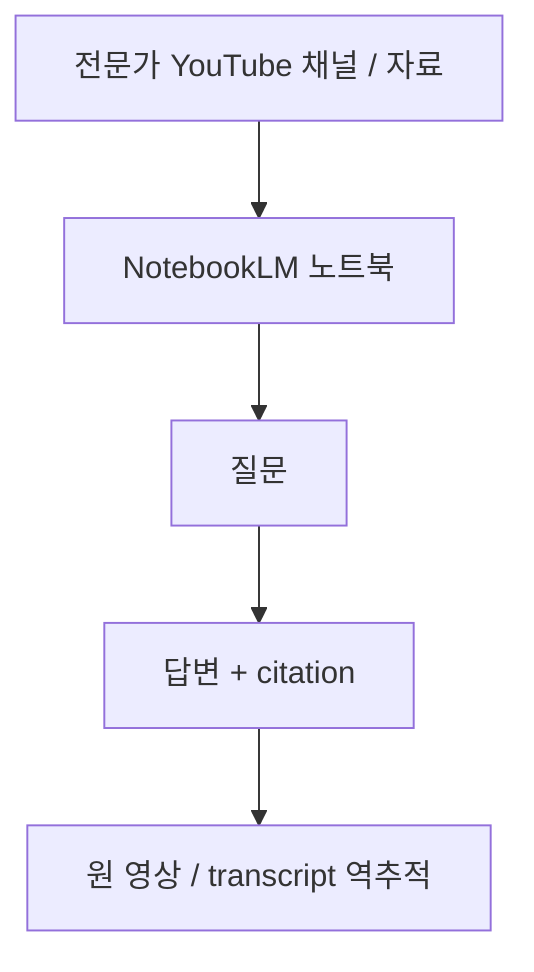
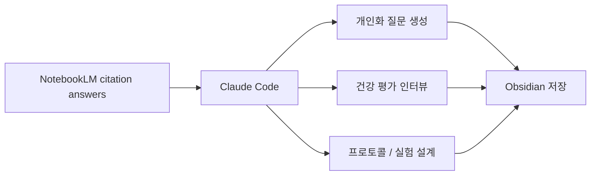
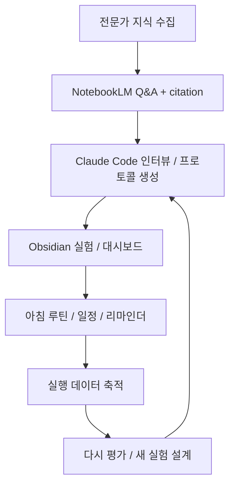

이 영상이 던지는 문제는 간단하지만 꽤 아픕니다. 대부분의 사람은 전문가 콘텐츠를 소비하고도 실제 행동은 거의 바꾸지 않습니다. 영상은 그 이유를 “학습은 했지만 루프를 닫지 못했기 때문”이라고 설명합니다. NotebookLM은 전문가 지식을 인용과 함께 정리해 주지만, 그다음에 **무엇을 실험하고, 언제 실행하고, 어떻게 복기할지** 까지는 책임지지 않는다는 것입니다. [0:00](https://youtu.be/KRpZSvtMiTI?t=0) [4:51](https://youtu.be/KRpZSvtMiTI?t=291)
<!--more-->

그래서 발표자는 세 도구를 연결합니다. NotebookLM은 검증 가능한 연구·인용 레이어, Claude Code는 목표 기반 인터뷰와 실행 설계 레이어, Obsidian은 실험 기록과 대시보드 레이어입니다. 이 세 층을 붙이면 “전문가 콘텐츠를 많이 본다”가 아니라, **전문가 지식 → 개인화 질문 → 행동 실험 → 매일 점검 → 결과 복기** 로 이어지는 시스템이 만들어집니다. [0:55](https://youtu.be/KRpZSvtMiTI?t=55) [6:07](https://youtu.be/KRpZSvtMiTI?t=367)

## Sources

- https://youtu.be/KRpZSvtMiTI

## 1. NotebookLM의 강점은 ‘요약’이 아니라 인용 가능한 리서치 베이스를 만든다는 데 있다

영상은 먼저 NotebookLM을 전문가 콘텐츠를 쌓아 두고 질문하는 리서치 레이어로 사용합니다. 예시로 Andrew Huberman의 YouTube 채널에서 건강 관련 최근 200개 안팎의 영상을 뽑아 새 노트북에 넣고, 그 위에서 건강 개선을 위한 질문을 던집니다. 발표자는 이를 통해 수백 개의 팟캐스트를 직접 듣지 않고도 필요한 주제를 빠르게 탐색할 수 있다고 설명합니다. [1:07](https://youtu.be/KRpZSvtMiTI?t=67) [2:44](https://youtu.be/KRpZSvtMiTI?t=164)

중요한 것은 답변에 citation 이 붙는다는 점입니다. 예를 들어 수면, 아침 햇빛, 스트레스 조절 같은 조언을 받으면 바로 원 출처 영상과 transcript로 거슬러 올라갈 수 있습니다. 이 때문에 NotebookLM은 단순 검색기보다 **전문가 지식의 검증 가능한 인용 레이어** 로 기능합니다. 발표자가 “verifiable and great knowledge base based on real facts and citations” 라고 표현한 이유가 바로 여기 있습니다. [2:57](https://youtu.be/KRpZSvtMiTI?t=177) [4:17](https://youtu.be/KRpZSvtMiTI?t=257)

## 2. 하지만 NotebookLM만으로는 ‘그래서 뭘 할 건데?’가 비어 있다

영상이 좋은 이유는 여기서 멈추지 않는다는 데 있습니다. 발표자는 NotebookLM이 질문에는 답하지만, 행동까지는 이어 주지 못한다고 분명히 말합니다. 더 일찍 일어나고 싶다, 운동을 더 꾸준히 하고 싶다, 캘린더에 실험을 넣고 싶다, 결과를 리뷰하고 싶다 같은 실제 행동 전환의 단계는 NotebookLM 인터페이스 밖에 있다는 것입니다. [4:48](https://youtu.be/KRpZSvtMiTI?t=288) [5:29](https://youtu.be/KRpZSvtMiTI?t=329)

이 지적은 중요합니다. 많은 리서치 워크플로가 “질문에 대한 좋은 답을 얻는 것”에서 끝나 버립니다. 하지만 행동 변화의 관점에서는 답변 자체보다, 그 답변을 **개인화된 프로토콜과 일정, 반복 점검 루프** 로 바꾸는 과정이 더 중요합니다.

## 3. Claude Code의 역할은 ‘전문가 지식을 개인화 인터뷰와 프로토콜로 번역하는 것’이다

영상에서 Claude Code는 NotebookLM 지식을 실행 가능한 형태로 바꾸는 에이전트로 등장합니다. 발표자는 Claude Code에 “건강을 개선하고 싶다”, “Huberman의 최근 에피소드 기반으로 건강 차원을 평가할 질문을 만들어 달라”, “질문과 답을 Obsidian에 저장하고 대시보드를 만들라”는 식으로 요청합니다. [6:07](https://youtu.be/KRpZSvtMiTI?t=367) [9:12](https://youtu.be/KRpZSvtMiTI?t=552)

흥미로운 점은 Claude Code가 단순 요약을 넘어서, 여러 질문을 병렬로 던지고 그 결과를 Obsidian 구조에 맞춰 정리한다는 점입니다. 영상에서는 여섯 개의 건강 관련 질문을 만들고, 수면·보충제·운동 같은 영역별 답변을 가져와, 각 답변의 citation과 함께 Obsidian 쪽 대시보드로 넣습니다. 발표자는 Claude가 citation 품질까지 점검해 7/8 strong matches 같은 형태로 근거성을 검토했다고 보여 줍니다. [9:48](https://youtu.be/KRpZSvtMiTI?t=588) [11:18](https://youtu.be/KRpZSvtMiTI?t=678)

## 4. Obsidian은 단순 저장소가 아니라 실험 운영판이 된다

영상 후반부의 핵심은 Obsidian 사용 방식입니다. 발표자는 이미 자신의 건강 실험을 Obsidian 노트로 관리하고 있고, 실험 타입, 목표, 실제 수행 데이터, 기분·에너지·수면 같은 결과값을 기록하고 있다고 보여 줍니다. 예를 들어 gym consistency 실험에서는 운동량, 주당 세션 수, 목표 대비 실제 값, 그리고 rest day와 gym day 이후의 에너지·기분·수면 품질을 비교합니다. [7:10](https://youtu.be/KRpZSvtMiTI?t=430) [8:02](https://youtu.be/KRpZSvtMiTI?t=482)

여기서 중요한 것은 Obsidian이 정적 노트 모음이 아니라는 점입니다. 발표자는 morning routine skill 을 통해 현재 active experiments 를 매일 확인하고, Claude가 “오늘 기분은 어떤가?”, “에너지는 어떤가?”, “이 실험에 대해 관찰된 점은 무엇인가?”를 묻게 만듭니다. 즉 Obsidian은 리서치 결과를 저장하는 곳이 아니라, **행동 실험을 운영하고 매일 상기시키는 인터페이스** 가 됩니다. [8:22](https://youtu.be/KRpZSvtMiTI?t=502) [8:47](https://youtu.be/KRpZSvtMiTI?t=527)

## 5. 이 시스템의 진짜 포인트는 ‘지식-행동 간격’을 줄인다는 데 있다

발표자는 이 구조를 통해 최종적으로 건강 프로토콜을 만들고, 그 프로토콜에서 실험을 뽑아, 매일 아침 review 하고, 일정에 넣어 실제 행동으로 옮기는 루프를 만들고자 합니다. Claude Code는 이미 저장된 Obsidian 실험 데이터까지 읽어 현재 상태와 목표 상태를 비교하고, gap assessment를 high/medium/low 식으로 해 줍니다. [12:10](https://youtu.be/KRpZSvtMiTI?t=730) [13:05](https://youtu.be/KRpZSvtMiTI?t=785)

이 방식이 의미 있는 이유는 리서치와 실행을 하나의 시스템으로 묶기 때문입니다. 보통은 “전문가 말 듣기”, “메모하기”, “캘린더 넣기”, “리뷰하기”가 서로 다른 앱에 흩어져 있고 연결이 약합니다. 하지만 이 영상은 NotebookLM, Claude Code, Obsidian을 연결해 **전문가 지식 → 내 상황 평가 → 실험 설계 → 일정 반영 → 데이터 복기** 가 하나의 폐루프가 되게 만듭니다.

## 실전 적용 포인트

첫째, NotebookLM을 쓸 때 “좋은 답을 받았다”에서 멈추지 말고, 그 답이 어떤 행동 실험으로 바뀔지까지 설계해야 합니다. 그렇지 않으면 리서치만 늘고 행동은 바뀌지 않습니다.

둘째, Claude Code 같은 에이전트는 검색 자체보다 인터뷰와 프로토콜 설계에 더 큰 가치를 줄 수 있습니다. 전문가 지식을 내 상황에 맞는 질문과 액션으로 바꿔 주는 역할이 핵심입니다.

셋째, Obsidian은 단순 노트 저장소보다 대시보드와 루틴 허브로 쓸 때 힘이 커집니다. 실험, 목표, 감정, 에너지, 수면 같은 지표를 같은 맥락에서 추적하면 Claude가 더 실제적인 피드백을 줄 수 있습니다.

## 핵심 요약

- NotebookLM은 전문가 지식을 citation과 함께 질의응답할 수 있는 검증 가능한 리서치 베이스를 만든다.
- 하지만 행동 변화에 필요한 실험 설계, 일정 반영, 일일 리뷰는 NotebookLM 밖에 있다.
- Claude Code는 NotebookLM의 지식을 개인화 질문, 인터뷰, 프로토콜로 번역하는 실행 설계 레이어로 쓰인다.
- Obsidian은 실험 로그와 건강 대시보드를 담는 운영판이 되어 매일 행동 루프를 유지하게 만든다.
- 이 세 도구를 연결하면 학습에서 끝나지 않고, 지식-행동-리뷰의 폐루프를 만들 수 있다.

## 결론

이 영상이 보여 주는 핵심은 도구 조합 자체보다, 리서치 시스템의 목표를 다시 정의하는 방식입니다. 중요한 것은 더 많은 전문가 콘텐츠를 소비하는 것이 아니라, 그 콘텐츠를 나에게 맞는 실험으로 바꾸고, 실제로 실행하고, 다시 측정하는 것입니다.

그 관점에서 NotebookLM, Claude Code, Obsidian의 조합은 꽤 설득력 있습니다. NotebookLM이 “무엇이 근거 있는 지식인가”를 책임지고, Claude Code가 “그 지식을 나에게 어떻게 적용할 것인가”를 묻고, Obsidian이 “내가 실제로 했는가”를 기록하게 만들기 때문입니다. 결국 학습에서 행동으로 넘어가려면, 답을 잘 찾는 도구보다 **루프를 닫아 주는 시스템** 이 더 중요합니다.
