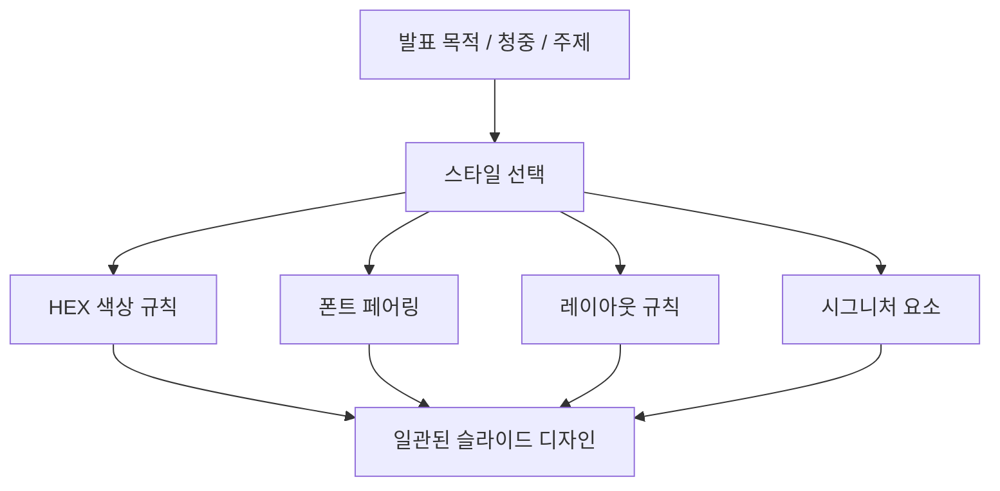
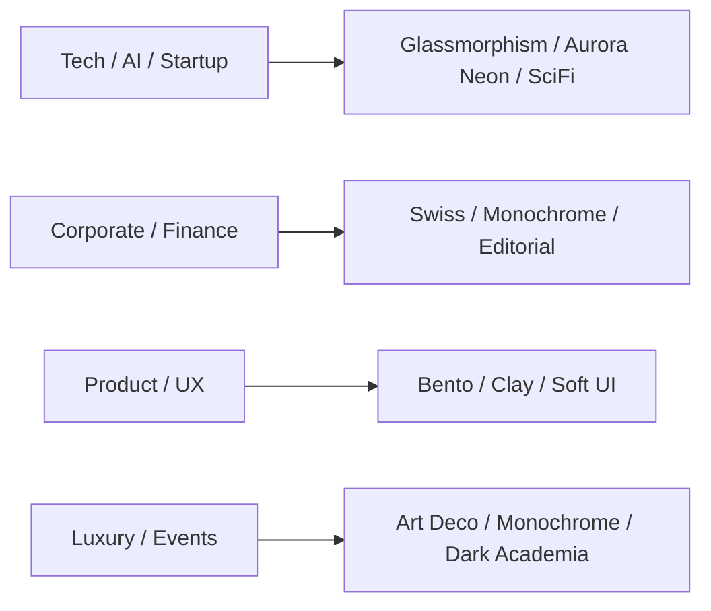

AI로 발표 자료를 만들 때 늘 부딪히는 문제는 ‘슬라이드가 만들어진다’와 ‘슬라이드가 의도적으로 디자인되어 보인다’ 사이의 차이입니다. `pptx-design-styles` 저장소가 흥미로운 이유는 바로 이 간극을 메우려 하기 때문입니다. 이 프로젝트는 PPTX 파일을 직접 생성하는 엔진이라기보다, **PPTX를 만들 때 어떤 미감 규칙을 따라야 하는지를 스킬 형태로 패키징한 디자인 레이어** 에 가깝습니다. [GitHub README](https://github.com/corazzon/pptx-design-styles) [raw README](https://raw.githubusercontent.com/corazzon/pptx-design-styles/main/README.md)
<!--more-->

README는 이 저장소를 “30 curated modern design styles” 를 담은 Claude.ai skill 로 소개합니다. 각 스타일마다 HEX 색상, 폰트 조합, 레이아웃 규칙, 시그니처 요소를 명시해 두었고, 이를 Claude Projects, Gemini Antigravity, Codex 같은 환경에서 지식 또는 스킬로 불러 쓰게 설계했습니다. 즉 이 저장소의 본질은 템플릿 묶음이라기보다, **프레젠테이션 디자인 판단을 재사용 가능한 규칙 세트로 만든 것** 입니다. [GitHub README](https://github.com/corazzon/pptx-design-styles) [raw SKILL.md](https://raw.githubusercontent.com/corazzon/pptx-design-styles/main/SKILL.md)

## Sources

- https://github.com/corazzon/pptx-design-styles
- https://raw.githubusercontent.com/corazzon/pptx-design-styles/main/README.md
- https://raw.githubusercontent.com/corazzon/pptx-design-styles/main/SKILL.md
- https://corazzon.github.io/pptx-design-styles/preview/modern-pptx-designs-30.html

## 1. 이 저장소의 핵심은 PPTX 생성이 아니라 ‘디자인 규칙의 외부화’다

보통 AI에게 “세련된 발표자료를 만들어줘”라고 하면 문제가 생기는 이유는, 세련됨이 구체적인 규칙으로 주어지지 않기 때문입니다. 이 저장소는 그 모호함을 30개의 스타일로 분해합니다. 예를 들어 Glassmorphism, Neo-Brutalism, Bento Grid, Swiss International, Aurora Neon, Risograph 같은 스타일이 각각 mood와 best-for 영역까지 함께 정의돼 있습니다. [GitHub README](https://github.com/corazzon/pptx-design-styles)

이 구조가 중요한 이유는 디자인 결정을 텍스트 프롬프트 속 감각적인 수식어에 맡기지 않고, **색상·타이포그래피·레이아웃·시그니처 요소** 라는 구체적 사양으로 빼냈기 때문입니다. 다시 말해 이 저장소는 “예쁘게 만들어”를 잘게 쪼개어, AI가 따라야 할 디자인 프로토콜로 바꿉니다.

## 2. `SKILL.md` 는 ‘언제 이 디자인 레이어를 켜야 하는가’까지 정의한다

`SKILL.md` 를 보면 이 프로젝트가 단순 참고문서가 아니라 실제 agent skill 로 설계됐다는 점이 드러납니다. 이름과 설명에서부터 30개 스타일 목록을 나열하고, “sleek”, “modern”, “trendy”, “stylish”, “visually striking” 같은 표현이 나오면 이 skill 을 활성화하라고 적어 둡니다. 즉 사용자가 스타일 이름을 직접 말하지 않아도, **프롬프트의 분위기 신호를 읽어 디자인 스킬을 켜는 트리거** 가 들어 있습니다. [raw SKILL.md](https://raw.githubusercontent.com/corazzon/pptx-design-styles/main/SKILL.md)

또 사용 절차도 명확합니다. 먼저 사용자가 원하는 스타일을 식별하거나 추천하고, 그다음 `references/styles.md` 의 상세 사양을 읽고, 마지막으로 core pptx skill 과 함께 실제 슬라이드 생성에 적용하라고 돼 있습니다. 이 순서는 중요합니다. 디자인 규칙은 이 저장소가 담당하지만, 실제 생성은 별도 PPTX 엔진/스킬이 맡는 분업 구조이기 때문입니다. [raw SKILL.md](https://raw.githubusercontent.com/corazzon/pptx-design-styles/main/SKILL.md)

## 3. 스타일 추천 매트릭스가 ‘감각’을 ‘업무 맥락’으로 번역해 준다

이 저장소에서 특히 실용적인 부분은 추천 매트릭스입니다. Tech/AI/Startup에는 Glassmorphism, Aurora Neon, Cyberpunk Outline, SciFi Holographic 을, Corporate/Finance에는 Swiss International, Monochrome Minimal, Editorial Magazine 을, Product/App/UX에는 Bento Grid, Claymorphism, Pastel Soft UI 를 추천하는 식입니다. [GitHub README](https://github.com/corazzon/pptx-design-styles) [raw SKILL.md](https://raw.githubusercontent.com/corazzon/pptx-design-styles/main/SKILL.md)

이 매트릭스의 가치는 단순 추천을 넘습니다. 보통 슬라이드 디자인 실패는 “예쁜 스타일”을 고르지 못해서가 아니라, **문서 목적과 분위기가 어긋나는 스타일을 고르기 때문** 입니다. 이 저장소는 바로 그 매칭 작업을 정리해 두어, AI가 스타일 선택 단계에서부터 맥락에 맞는 방향을 잡게 합니다.

## 4. 이 프로젝트는 ‘프롬프트로 미감 맞추기’ 대신 ‘사양으로 미감 고정하기’를 택한다

`SKILL.md` 의 production principles 를 보면 철학이 더 분명해집니다. 반드시 core pptx skill 과 함께 사용하고, 각 스타일의 배경·폰트·레이아웃 사양을 엄격히 따르며, 모든 슬라이드에 최소 하나 이상의 시각 요소를 넣고, 텍스트-only 슬라이드는 만들지 말라고 적혀 있습니다. 또한 시그니처 요소를 슬라이드 전체에서 반복하고, 폰트 페어링과 HEX 값을 정확히 맞추라고 강조합니다. [raw SKILL.md](https://raw.githubusercontent.com/corazzon/pptx-design-styles/main/SKILL.md)

이 원칙은 인상적입니다. 많은 AI 결과물이 어색해지는 이유는 모델이 한 장 한 장을 그때그때 “그럴듯하게” 꾸미기 때문입니다. 하지만 이 저장소는 슬라이드 디자인을 개별 장식의 문제가 아니라, **반복성과 제약을 가진 시스템** 으로 다룹니다. 결과적으로 이 접근은 창의성을 줄이기보다 오히려 일관성을 확보해 줍니다.

## 5. Claude Projects, Antigravity, Codex에서 모두 쓰게 만든 점이 흥미롭다

README는 사용처를 세 가지로 나눕니다. Claude.ai에서는 Project Knowledge에 `SKILL.md` 와 `references/styles.md` 를 올려 쓰고, Gemini Antigravity에서는 로컬 skill 디렉터리에 심볼릭 링크를 걸어 자동 감지하게 하며, Codex에서는 skills 폴더에 넣어 agent environment 에 통합하도록 안내합니다. [GitHub README](https://github.com/corazzon/pptx-design-styles)

이 점이 중요한 이유는 스타일 규칙이 특정 앱에 종속되지 않는다는 뜻이기 때문입니다. 슬라이드 디자인 감각을 프롬프트에 하드코딩하는 대신 skill 로 외부화하면, Claude든 Gemini든 Codex든 같은 규칙을 재사용할 수 있습니다. 즉 디자인이 도구의 기능이 아니라, **이식 가능한 지식 자산** 이 됩니다.

## 6. 결국 이 저장소는 ‘PPTX 디자인 시스템’을 오픈소스로 만든 셈이다

정리하면 `pptx-design-styles` 는 30개의 예쁜 테마 모음집이면서도, 더 깊게 보면 일종의 프레젠테이션 디자인 시스템입니다. 스타일마다 적용 범위가 정해져 있고, 색상·폰트·레이아웃·요소 규칙이 있으며, 추천 매트릭스로 선택 기준까지 제시되고, skill 구조로 여러 에이전트 환경에 이식됩니다. [GitHub README](https://github.com/corazzon/pptx-design-styles) [raw SKILL.md](https://raw.githubusercontent.com/corazzon/pptx-design-styles/main/SKILL.md)

이 프로젝트가 재미있는 이유도 바로 여기 있습니다. AI 시대의 디자인 자산은 더 이상 “템플릿 파일”만이 아니라, **에이전트가 따라야 하는 판단 규칙의 집합** 으로도 배포될 수 있다는 점을 보여 줍니다.

## 실전 적용 포인트

첫째, PPTX 자동화를 할 때는 생성 엔진과 디자인 규칙을 분리하는 편이 좋습니다. 파일 생성은 한 도구가, 디자인 시스템은 별도 skill 이 맡게 하면 도구를 바꿔도 미감을 유지할 수 있습니다.

둘째, “예쁘게” 같은 모호한 표현 대신 스타일 이름과 업무 맥락을 연결하는 매트릭스를 두는 것이 효과적입니다. 그래야 AI가 주제와 무관한 화려함에 빠지지 않습니다.

셋째, 텍스트-only 슬라이드를 금지하고 시그니처 요소를 반복하게 하는 식의 제약은 결과 품질을 크게 올립니다. 좋은 디자인은 자유도보다 반복 규칙에서 나오는 경우가 많기 때문입니다.

## 핵심 요약

- `pptx-design-styles` 는 PPTX 파일 생성기가 아니라 프레젠테이션 디자인 규칙을 패키징한 skill 레이어다.
- 30개 스타일 각각에 색상, 폰트, 레이아웃, 시그니처 요소가 정의돼 있다.
- `SKILL.md` 는 스타일 활성화 조건과 추천 매트릭스까지 포함해 agent가 언제 이 지식을 써야 하는지 알려 준다.
- Claude Projects, Antigravity, Codex 등 여러 환경에서 같은 디자인 규칙을 재사용할 수 있게 설계돼 있다.
- 이 프로젝트는 템플릿 배포를 넘어, 에이전트가 따르는 ‘PPTX 디자인 시스템’을 오픈소스로 만든 사례에 가깝다.

## 결론

AI로 발표 자료를 만드는 시대에는 “슬라이드를 만들 수 있느냐”보다 “슬라이드를 일관되게 디자인할 수 있느냐”가 더 중요한 경쟁력이 될 수 있습니다. `pptx-design-styles` 는 바로 그 지점을 겨냥합니다. 생성 자체는 다른 도구가 하더라도, 미감의 기준은 별도 skill 로 관리하게 만드는 방식입니다.

결국 이 저장소가 보여 주는 미래는 명확합니다. 앞으로 많은 디자인 자산은 PSD나 테마 파일만이 아니라, **에이전트가 읽고 적용하는 규칙 문서** 로도 배포될 가능성이 큽니다. 그리고 이 프로젝트는 그 가능성을 PPTX라는 아주 실용적인 영역에서 먼저 보여 주고 있습니다.
