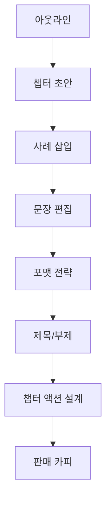

이 스레드의 자극적인 문장은 “나는 Claude로 3시간 만에 전자책 한 권을 만들었다” 입니다. 하지만 실제로 더 흥미로운 부분은 그 시간 자체보다, 작성자가 이어서 공개한 프롬프트 묶음입니다. 내용을 보면 단순히 “책 써줘” 한 줄이 아니라, **아웃라인 → 챕터 초안 → 사례 추가 → 편집 → 포맷 → 제목 → 액션 설계 → 판매 카피** 로 이어지는 생산 파이프라인에 가깝습니다. [Threads 원문](https://www.threads.com/@human__bro/post/DW_Y9WvEt4t) [Jina Reader 추출](https://r.jina.ai/http://https://www.threads.com/@human__bro/post/DW_Y9WvEt4t)
<!--more-->

즉 이 스레드가 보여 주는 건 “Claude가 책을 써 준다”는 단순 홍보보다도, 전자책 제작을 여러 전문 역할로 쪼개는 방식입니다. 콘텐츠 아키텍트, 드래프팅 어시스턴트, 케이스 스터디 디자이너, 편집자, 비주얼 전략가, 제목 카피라이터, 액션 디자이너, 마케팅 카피라이터처럼 역할을 분리해 각각 다른 프롬프트로 호출합니다. 결국 속도보다 중요한 것은 **작업을 어떤 단계와 역할로 분해했는가** 입니다. [Jina Reader 추출](https://r.jina.ai/http://https://www.threads.com/@human__bro/post/DW_Y9WvEt4t)

## Sources

- https://www.threads.com/@human__bro/post/DW_Y9WvEt4t?xmt=AQF0fT4ac6KqBzqht9GWjsOZXM4qZXToPdSVnN_f0HGl5QVh3oIrCMZK0LYhuwemb5k4dyAb&slof=1
- https://r.jina.ai/http://https://www.threads.com/@human__bro/post/DW_Y9WvEt4t

## 1. 이 스레드의 진짜 핵심은 ‘시간 단축’이 아니라 ‘역할 분해’다

원문 포스트만 보면 “3시간 만에 전자책 한 권”이라는 문구가 먼저 눈에 들어옵니다. 하지만 이어지는 스레드를 보면 실제로 공개한 것은 시간 절약 마법이 아니라 작업 순서입니다. 가장 먼저 아웃라인을 설계하고, 그다음 챕터 초안을 만들고, 사례를 넣고, 문장 흐름을 편집하고, 포맷 전략과 제목을 정하고, 마지막에는 액션 스텝과 판매용 카피까지 만듭니다. [Jina Reader 추출](https://r.jina.ai/http://https://www.threads.com/@human__bro/post/DW_Y9WvEt4t)

이 구조가 중요한 이유는 책을 한 번에 완성하려 하지 않기 때문입니다. 전자책은 보통 기획, 집필, 편집, 디자인, 마케팅이 뒤섞여 있어서 막막해지는데, 이 스레드는 그것을 8개의 별도 작업으로 자릅니다. 따라서 이 파이프라인의 진짜 가치는 Claude가 빨라서가 아니라, **사람이 해야 할 사고 과정을 단계별로 정리해 놓았다는 데** 있습니다.

## 2. 1~2단계는 ‘책 쓰기’보다 ‘집필 공정 만들기’에 가깝다

첫 번째 프롬프트는 “베스트셀러 전자책을 다수 기획한 콘텐츠 아키텍트” 역할을 부여하고, 10개 챕터 아웃라인을 설계하게 합니다. 각 챕터마다 핵심 목적, 소주제 3~5개, 현실적 예시, 독자가 얻게 될 결과를 넣으라고 요구합니다. 이건 목차 생성이라기보다 집필 로드맵 설계에 가깝습니다. [Jina Reader 추출](https://r.jina.ai/http://https://www.threads.com/@human__bro/post/DW_Y9WvEt4t)

두 번째 프롬프트는 Chapter X의 1차 초안을 쓰게 하지만, “너무 완벽하게 쓰지 말고 내가 추가·보완하기 쉬운 구조를 유지하라”고 지시합니다. 이게 중요합니다. 좋은 초안 프롬프트는 완성본을 요구하는 것이 아니라, **사람이 개입하기 쉬운 중간 산출물** 을 요청합니다. 이 스레드의 초반부 두 단계는 책의 질보다 집필 속도를 위해 구조를 먼저 잡는 설계로 읽힙니다. [Jina Reader 추출](https://r.jina.ai/http://https://www.threads.com/@human__bro/post/DW_Y9WvEt4t)

## 3. 3~4단계는 정보량보다 ‘읽히는 원고’로 바꾸는 작업이다

세 번째 프롬프트는 챕터 본문에 미니 사례 또는 실제 적용 예시 2개를 추가하게 합니다. 조건도 분명합니다. 허구라도 현실적으로 느껴져야 하고, 독자가 “나도 이 상황이다”라고 공감할 수 있어야 하며, 설명이 아니라 이해와 설득 목적이어야 한다는 것입니다. [Jina Reader 추출](https://r.jina.ai/http://https://www.threads.com/@human__bro/post/DW_Y9WvEt4t)

네 번째 프롬프트는 Clarity & Flow Editor 역할입니다. 중복과 군더더기를 줄이고, 책 전체 문체를 일관되게 유지하며, 독자가 중간에 멈추지 않도록 리듬감을 살리라고 지시합니다. 즉 여기서는 더 많은 정보를 넣는 것이 아니라, **이미 만든 초안을 읽히는 원고로 다듬는 단계** 가 따로 분리됩니다. 이 분리가 있어야 책이 “챗봇 답변 뭉치”에서 벗어납니다. [Jina Reader 추출](https://r.jina.ai/http://https://www.threads.com/@human__bro/post/DW_Y9WvEt4t)

## 4. 5~6단계는 내용 제작이 아니라 ‘패키징’ 단계다

다섯 번째 프롬프트는 Visual Content Strategist 역할로, Canva/Word/InDesign 같은 플랫폼 조건을 반영해 전자책 포맷 구조를 제안하게 합니다. 제목·소제목 체계, 강조 박스, 체크리스트, 요약 섹션 등 디자이너에게 그대로 전달 가능한 수준을 요구합니다. 즉 이 단계는 텍스트를 만드는 것이 아니라, **텍스트가 어떻게 읽히고 배치될지를 설계하는 단계** 입니다. [Jina Reader 추출](https://r.jina.ai/http://https://www.threads.com/@human__bro/post/DW_Y9WvEt4t)

여섯 번째 프롬프트는 전환율 중심의 title copywriter 역할로 제목+부제 10개를 생성하게 합니다. 독자가 얻는 결과가 명확해야 하고, 검색 키워드를 고려하며, 과장되지 않으면서 실전적인 느낌을 살리라고 지시합니다. 전자책을 만드는 사람 입장에서 이 부분은 종종 마지막에 대충 처리되는데, 스레드는 이를 별도 작업으로 떼어 둡니다. 즉 전자책 생산은 집필로 끝나지 않고, **패키징과 포지셔닝까지 포함한 제품화 과정** 으로 본다는 뜻입니다. [Jina Reader 추출](https://r.jina.ai/http://https://www.threads.com/@human__bro/post/DW_Y9WvEt4t)

## 5. 7~8단계는 ‘읽고 끝’이 아니라 ‘행동과 판매’까지 닫는 단계다

일곱 번째 프롬프트는 각 챕터를 읽고 난 뒤 독자가 바로 실행할 수 있는 액션 스텝 3개와 사고를 정리하는 질문 3개를 만들게 합니다. 초보자도 바로 실행 가능하고, 읽고 끝나는 것이 아니라 실제로 움직이게 만들어야 한다는 조건이 붙습니다. 이건 챕터 마무리를 단순 요약이 아니라 **독자 행동 설계** 로 본다는 뜻입니다. [Jina Reader 추출](https://r.jina.ai/http://https://www.threads.com/@human__bro/post/DW_Y9WvEt4t)

여덟 번째 프롬프트는 판매 페이지에 바로 붙일 수 있는 요약과 가치 제안을 만드는 단계입니다. 한 문장 핵심 요약, 해결하는 문제 3가지, 읽고 나면 얻게 되는 결과 5가지, 추천 대상 섹션을 뽑게 하며, “정보가 아니라 전환 중심 문장”이라는 기준을 줍니다. 즉 이 파이프라인은 책을 쓰는 것에서 끝나지 않고, **책을 팔기 위한 랜딩 문장까지 한 흐름으로 묶는다** 는 점에서 흥미롭습니다. [Jina Reader 추출](https://r.jina.ai/http://https://www.threads.com/@human__bro/post/DW_Y9WvEt4t)

## 6. 이 스레드가 보여 주는 건 프롬프트 한 줄이 아니라 ‘출판 워크플로’다

정리하면 이 스레드의 8개 프롬프트는 각각 독립적인 요령이 아니라, 기획자·집필 보조·사례 설계자·편집자·디자이너·카피라이터·액션 설계자·마케터라는 역할을 순서대로 호출하는 워크플로에 가깝습니다. [Jina Reader 추출](https://r.jina.ai/http://https://www.threads.com/@human__bro/post/DW_Y9WvEt4t)

그래서 이 스레드가 실제로 유용해지는 지점도 분명합니다. “Claude로 책을 3시간 만에 쓴다”는 문장 그대로를 믿기보다, 내가 만들려는 전자책 생산 과정을 어디까지 분해할 수 있는지, 그리고 각 단계에서 어떤 산출물을 요구해야 하는지를 배우는 쪽입니다. 결국 속도는 모델이 만들지만, **공정은 사람이 설계해야 합니다.**

## 실전 적용 포인트

첫째, 전자책을 AI에게 한 번에 쓰게 하지 말고, 반드시 아웃라인·초안·사례·편집·포맷·제목·CTA·판매 카피로 나누는 편이 좋습니다. 그래야 결과물이 “챗봇 산문”이 되지 않습니다.

둘째, 각 프롬프트에 역할 이름을 주는 방식은 꽤 유용합니다. 콘텐츠 아키텍트, 편집자, 카피라이터처럼 역할을 분리하면 모델이 각 단계에서 다른 품질 기준을 따르기 쉬워집니다.

셋째, 책을 만드는 작업과 파는 작업을 분리하지 않는 것이 중요합니다. 전자책은 원고가 완성됐다고 끝나는 것이 아니라, 제목·포맷·가치 제안까지 있어야 제품이 됩니다.

## 핵심 요약

- 이 스레드의 핵심은 “3시간”이 아니라 8단계로 분해된 전자책 제작 워크플로다.
- 초반 단계는 기획과 집필 로드맵, 중반 단계는 읽히는 원고와 포맷, 후반 단계는 독자 행동과 판매 카피를 다룬다.
- 역할 기반 프롬프트는 각 작업의 품질 기준을 분리하는 데 유용하다.
- 전자책 제작을 단순 집필이 아니라 기획·편집·디자인·마케팅까지 포함한 공정으로 본다는 점이 흥미롭다.
- 실제 활용 포인트는 속도 자랑보다도, 작업을 어디까지 잘게 쪼갤 수 있느냐에 있다.

## 결론

이 Threads 스레드는 흔한 “AI로 3시간 만에 무언가 만들었다” 류의 자랑처럼 보일 수 있습니다. 하지만 안쪽을 들여다보면 더 배울 만한 것은 시간보다 구조입니다. 전자책 한 권이 사실은 여러 역할과 공정을 거쳐 만들어진다는 점, 그리고 그 공정을 프롬프트 묶음으로 재현할 수 있다는 점이 핵심입니다.

결국 AI 시대의 생산성은 프롬프트 한 줄의 영감보다, **작업을 어떤 단계로 나누고 어떤 산출물을 순서대로 요구할지 설계하는 능력** 에 더 가까워 보입니다. 이 스레드는 그 점을 전자책 제작이라는 익숙한 예시로 꽤 잘 보여 줍니다.
