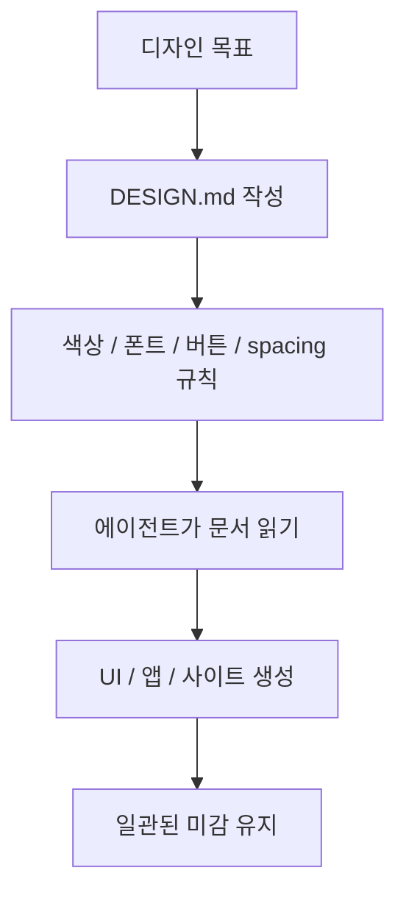
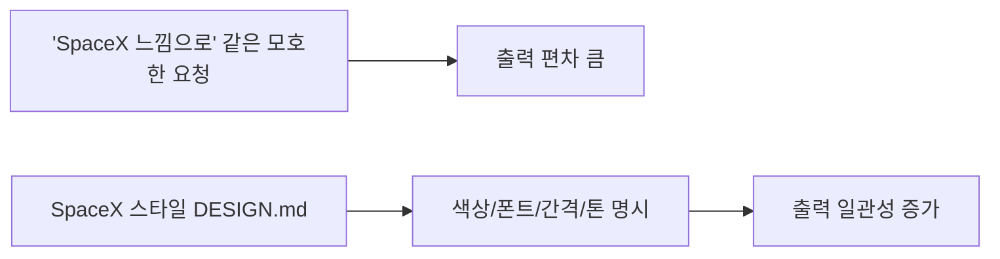

`DESIGN.md` 의 핵심은 의외로 단순합니다. 에이전트에게 “예쁘게 만들어줘”라고 말하는 대신, **어떤 색을 쓰고, 어떤 폰트를 쓰고, 버튼과 레이아웃이 어떤 느낌이어야 하는지를 마크다운 문서로 먼저 건네는 것** 입니다. 영상은 이것을 `agents.md`, `CLAUDE.md` 계열 문서와 같은 흐름으로 설명합니다. 에이전트가 코드를 만들 때 규칙 문서를 보듯, 디자인을 만들 때도 설계도 문서를 읽고 따라가게 하자는 것입니다. [0:51](https://youtu.be/gvCmeuWPVkc?t=51) [2:53](https://youtu.be/gvCmeuWPVkc?t=173)
<!--more-->

이 관점이 중요한 이유는 디자인 지시를 감각적인 프롬프트 문장에만 맡기지 않기 때문입니다. 영상에서 발표자는 Google의 Stitch를 예로 들며, 먼저 색상·폰트·버튼 규칙 같은 디자인 가이드 문서를 만들고, 그 문서를 바탕으로 UI를 생성하는 흐름을 보여 줍니다. 즉 DESIGN.md는 결과물을 그려내는 도구가 아니라, **결과물의 미감과 일관성을 강제하는 중간 규격 문서** 로 이해하는 편이 정확합니다. [1:15](https://youtu.be/gvCmeuWPVkc?t=75) [2:08](https://youtu.be/gvCmeuWPVkc?t=128)

## Sources

- https://youtu.be/gvCmeuWPVkc

## 1. DESIGN.md는 ‘플레인 텍스트 디자인 시스템’으로 볼 수 있다

영상은 DESIGN.md를 “human과 agent가 읽고, 고치고, 강제할 수 있는 문서”라는 식으로 설명합니다. 이 표현이 핵심입니다. 디자인 파일이 Figma나 이미지 시안만을 뜻하는 것이 아니라, 텍스트로 읽히는 규칙 문서라는 뜻이기 때문입니다. [2:38](https://youtu.be/gvCmeuWPVkc?t=158) [2:50](https://youtu.be/gvCmeuWPVkc?t=170)

이렇게 되면 디자인 시스템이 프런트엔드 코드 밖으로 빠져나옵니다. 버튼 색상, primary/secondary palette, body/headline font, spacing scale, overall tone 같은 것을 문장과 항목으로 먼저 고정한 뒤, 에이전트가 그 문서를 읽고 UI를 생성하는 구조가 됩니다. 발표자가 “디자인을 진행할 때 설계도를 보고 진행한다고 생각하면 된다”고 말한 이유가 바로 이것입니다. [0:58](https://youtu.be/gvCmeuWPVkc?t=58) [1:06](https://youtu.be/gvCmeuWPVkc?t=66)

## 2. Google Stitch 맥락은 ‘가이드 문서 → 결과물 생성’ 흐름을 잘 보여 준다

영상은 Google의 Stitch를 DESIGN.md 개념의 출발점처럼 소개합니다. Stitch는 먼저 디자인 가이드 문서를 만들고, 그 문서를 바탕으로 오른쪽에 UI를 생성하는 식의 흐름을 보여 준다고 설명합니다. 여기에는 primary/secondary color, font 선택, 버튼 스타일 같은 요소가 포함됩니다. [1:15](https://youtu.be/gvCmeuWPVkc?t=75) [1:50](https://youtu.be/gvCmeuWPVkc?t=110)

발표자가 보기에 이 방식의 문제는 눈으로 보기엔 좋지만 중간 과정이 번거롭다는 점이었고, 그래서 Google이 더 직접적으로 쓸 수 있는 `DESIGN.md` 같은 문서 흐름을 제안했다고 해석합니다. 이 맥락에서 DESIGN.md는 단지 유행하는 파일명이 아니라, **디자인 가이드를 인간 친화적이면서 에이전트 친화적인 텍스트 포맷으로 바꾸는 시도** 로 볼 수 있습니다. [2:03](https://youtu.be/gvCmeuWPVkc?t=123) [2:31](https://youtu.be/gvCmeuWPVkc?t=151)

## 3. 핵심은 ‘특정 사이트를 복제’하는 것이 아니라 ‘느낌의 기대값’을 강제하는 데 있다

영상에서 발표자는 여러 프리셋 예시를 보여 주며 “이 사이트를 그대로 복제한다는 뜻이 아니다”라고 분명히 말합니다. 예를 들어 ElevenLabs, SpaceX, Miro 같은 스타일 문서를 가져오더라도, 그것은 검정 기반, 큰 여백, 특정 타이포, 특정 spacing, 파스텔 톤 같은 **느낌의 기대값** 을 전달하는 도구라는 것입니다. [3:31](https://youtu.be/gvCmeuWPVkc?t=211) [4:05](https://youtu.be/gvCmeuWPVkc?t=245)

이게 중요한 이유는 디자인 참조를 스크린샷 모사 수준에서 멈추지 않게 해 주기 때문입니다. 보통 에이전트에게 “SpaceX 느낌으로”라고 말하면 각자가 상상하는 범위가 다르지만, DESIGN.md로 색상·서체·간격·레이아웃 규칙을 넘겨주면 훨씬 안정된 결과를 기대할 수 있습니다. 발표자가 “기대값을 굉장히 높일 수 있다”고 말한 이유도 여기에 있습니다. [4:38](https://youtu.be/gvCmeuWPVkc?t=278)

## 4. Cursor에서는 DESIGN.md 파일을 먼저 두고 에이전트 모드에서 작업한다

영상 전반부 실습에서 발표자는 Cursor 프로젝트 폴더를 만든 뒤 `DESIGN.md` 파일을 생성하고, 프리셋 문서를 복사해 붙여 넣습니다. 그런 다음 에이전트 모드와 플랜 모드를 켜고, 예를 들어 React Native 기반의 노트 테이킹 앱을 특정 스타일 기대값으로 스캐폴딩하도록 요청합니다. [6:22](https://youtu.be/gvCmeuWPVkc?t=382) [7:26](https://youtu.be/gvCmeuWPVkc?t=446)

여기서 중요한 것은 디자인 문서가 웹사이트 전용이 아니라는 점입니다. 발표자는 원래 웹 디자인 예시였던 SpaceX 스타일을 모바일 앱 UI의 기대값으로도 밀어 넣어 봅니다. 즉 DESIGN.md는 특정 화면 타입보다도, **어떤 제품이 어떤 미감을 가져야 하는지에 대한 상위 규격** 으로 작동합니다. [6:48](https://youtu.be/gvCmeuWPVkc?t=408) [7:44](https://youtu.be/gvCmeuWPVkc?t=464)

## 5. Claude Code에서도 방식은 같다: 문서를 파일로 저장하게 한 뒤 그 규격을 따르게 한다

후반부에서 발표자는 Claude Code도 본질적으로 같다고 설명합니다. 프로젝트 폴더를 만든 뒤 Claude를 실행하고, `DESIGN.md 파일로 다음 내용을 저장해 줘` 같은 지시로 먼저 문서를 파일로 만들게 합니다. 이후 그 파일을 기준으로 앱을 생성하면, 예시처럼 SpaceX 계열의 강한 시각 톤이 일관되게 반영된 결과가 나온다고 보여 줍니다. [10:14](https://youtu.be/gvCmeuWPVkc?t=614) [11:05](https://youtu.be/gvCmeuWPVkc?t=665)

이 장면이 흥미로운 이유는 Cursor든 Claude Code든 결국 과정이 같다는 점입니다. 차이는 UI와 진입 장벽에 있을 뿐, **프로젝트 폴더 안에 디자인 규격 문서를 두고 에이전트가 그 문서를 기준으로 결과물을 만들게 한다** 는 핵심 흐름은 동일합니다. 발표자도 터미널 환경 때문에 다르게 느껴질 뿐 결국은 같은 방식이라고 말합니다. [9:43](https://youtu.be/gvCmeuWPVkc?t=583) [10:44](https://youtu.be/gvCmeuWPVkc?t=644)

## 6. DESIGN.md가 필요한 진짜 이유는 기능을 더하는 것이 아니라 일관성을 유지하기 위해서다

영상의 실습 결과를 보면 발표자는 “무슨 기능을 추가해도 SpaceX 스타일로 디자인이 될 것” 이라고 말합니다. 이 말이 DESIGN.md의 본질을 잘 보여 줍니다. 프런트엔드에서 더 어려운 일은 첫 화면 하나를 예쁘게 만드는 것이 아니라, 기능이 늘어날수록 미감을 잃지 않는 것입니다. [11:15](https://youtu.be/gvCmeuWPVkc?t=675) [11:31](https://youtu.be/gvCmeuWPVkc?t=691)

결국 DESIGN.md는 기능 개발 문서가 아니라 일관성 유지 문서입니다. 새로운 화면을 추가하더라도 색상과 서체, 간격과 버튼 톤, 전반적 분위기가 계속 같은 방향으로 나가게 만드는 가드레일에 가깝습니다. 그런 점에서 `CLAUDE.md` 가 코드 작업의 행위 규칙이라면, `DESIGN.md` 는 시각 결과물의 **미감 규칙** 이라고 볼 수 있습니다.

## 실전 적용 포인트

첫째, 디자인 지시는 프롬프트 한 줄보다 문서 한 장이 더 강합니다. 프로젝트가 길어질수록 “느낌”을 구두로 반복 설명하는 대신, DESIGN.md로 고정해 두는 편이 결과 일관성이 높습니다.

둘째, 특정 사이트를 복제하려 하기보다 그 사이트의 색상·간격·타이포·레이아웃 감각을 추출해 규칙으로 바꾸는 것이 중요합니다. 그래야 저작물 모사 위험은 줄이고, 기대하는 미감은 유지할 수 있습니다.

셋째, DESIGN.md는 웹뿐 아니라 앱, 랜딩 페이지, 대시보드 등 화면 기반 작업 전반에 적용할 수 있습니다. 핵심은 결과물 종류보다 “시각적 설계도”를 먼저 만든다는 점입니다.

## 핵심 요약

- DESIGN.md는 에이전트가 읽고 따르는 플레인 텍스트 디자인 시스템 문서다.
- Google Stitch 맥락은 디자인 가이드 문서 → 결과물 생성 흐름을 보여 주는 예시다.
- 중요한 것은 특정 사이트 복제가 아니라, 그 사이트가 주는 미감의 기대값을 규칙으로 전달하는 것이다.
- Cursor와 Claude Code 모두 프로젝트 폴더 안에 DESIGN.md를 두고 같은 원리로 활용할 수 있다.
- DESIGN.md의 진짜 가치는 기능 추가보다도, 기능이 늘어나도 디자인 일관성을 유지하게 만드는 데 있다.

## 결론

에이전트 시대의 디자인 작업은 점점 더 “좋은 프롬프트를 쓰는 법”에서 “좋은 설계 문서를 남기는 법”으로 이동하는 것처럼 보입니다. DESIGN.md는 그 흐름을 가장 직관적으로 보여 주는 예시입니다. 감각을 말로 계속 설명하는 대신, 색상·폰트·간격·톤을 문서화해 두고 에이전트가 그 문서를 읽게 만드는 방식입니다.

결국 앞으로의 UI 작업에서 중요한 것은 에이전트가 얼마나 똑똑하냐만이 아니라, **우리가 어떤 규격 문서를 남겨 에이전트의 출력 편차를 얼마나 줄일 수 있느냐** 일지도 모릅니다. DESIGN.md는 그 질문에 꽤 실용적인 답을 주는 문서 형식입니다.
