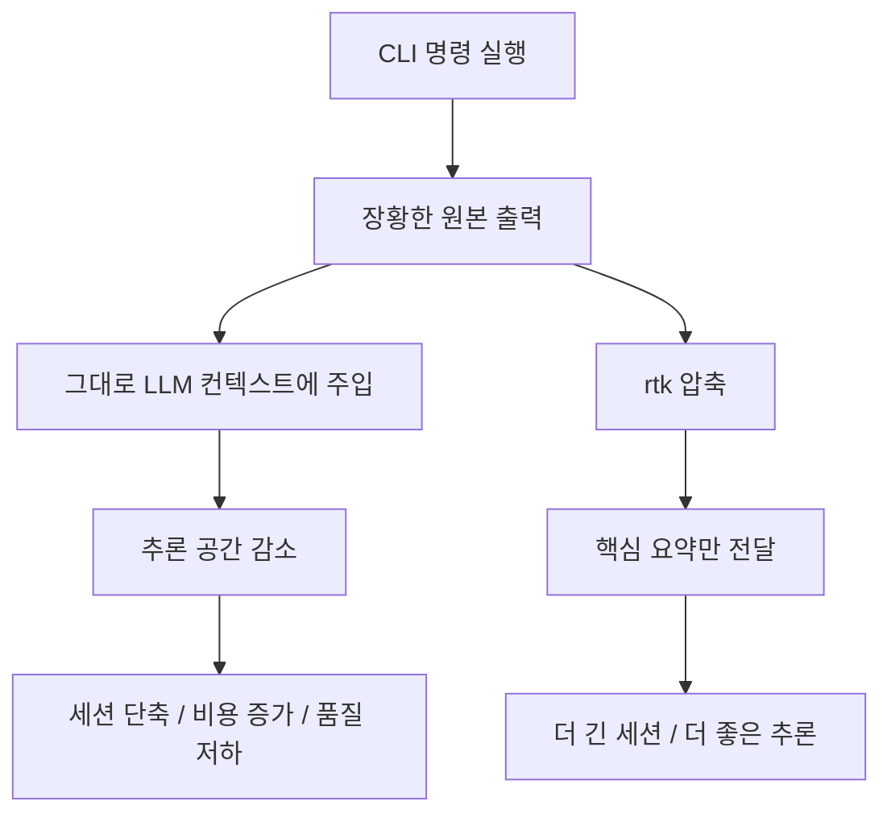
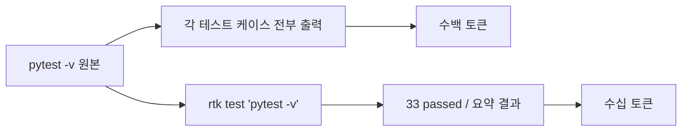

`rtk` 가 건드리는 문제는 생각보다 본질적입니다. AI 코딩 에이전트가 코드를 못 읽어서 멍청해지는 것이 아니라, **터미널이 쏟아내는 쓸모없는 출력이 컨텍스트를 너무 많이 차지해서** 정작 중요한 추론 공간이 줄어든다는 것입니다. 공식 사이트는 이를 “Your AI agent is drowning in CLI noise” 라고 직설적으로 표현합니다. [rtk 공식 사이트](https://www.rtk-ai.app/)
<!--more-->

이 프로젝트의 아이디어는 단순하면서도 실용적입니다. `cargo test`, `pytest -v`, `git diff`, `git status`, `cat` 같은 명령의 장황한 출력을 그대로 에이전트에게 넘기지 않고, 먼저 `rtk` 가 요약·압축한 뒤 컨텍스트 윈도우로 보내는 것입니다. 사이트는 평균 89% 노이즈 제거, 3배 더 긴 세션, 30개가 넘는 명령 지원을 전면에 내세웁니다. 즉 rtk는 새 모델이 아니라, **모델이 읽기 전에 출력물을 다듬는 입력 전처리 레이어** 입니다. [rtk 공식 사이트](https://www.rtk-ai.app/)

## Sources

- https://www.rtk-ai.app/
- https://github.com/rtk-ai/rtk

## 1. rtk는 ‘더 좋은 모델’이 아니라 ‘덜 읽게 만드는 레이어’다

사이트가 제시하는 문제의식은 명확합니다. `cargo test` 가 5,000토큰짜리 보일러플레이트를 뿜어 내면, 그 5,000토큰만큼 실제 코드 추론에 쓸 공간이 줄어듭니다. 결과적으로 reasoning 품질이 떨어지고, 세션이 짧아지며, flat-rate 플랜에서는 rate limit에 빨리 걸리고, pay-per-token 환경에서는 불필요한 비용이 늘어난다는 설명입니다. [rtk 공식 사이트](https://www.rtk-ai.app/)

이 프레임이 중요한 이유는 보통 토큰 절약을 “프롬프트를 짧게 써라” 수준으로 생각하기 쉽기 때문입니다. 하지만 rtk가 겨냥하는 건 사용자 프롬프트보다도 **도구 호출 결과의 잉여 토큰** 입니다. 즉 인간이 던지는 말보다, 에이전트가 스스로 불러오는 CLI 출력이 더 큰 낭비일 수 있다는 문제 제기입니다.

## 2. 핵심 메커니즘은 ‘명령을 바꾸는 것’이 아니라 ‘출력을 재작성하는 것’이다

사이트의 설치 섹션을 보면 흐름이 분명합니다. 먼저 `curl ... | sh` 나 `brew install rtk` 로 설치하고, 그다음 `rtk init --global` 을 실행합니다. 그러면 `PreToolUse hook` 이 설치되어 Bash 명령을 `rtk` 대응 명령으로 투명하게 재작성한다고 설명합니다. 즉 사용자는 평소처럼 명령을 실행하지만, 에이전트가 그 결과를 읽기 직전에 rtk가 개입해 압축된 형태로 바꿔 주는 구조입니다. [rtk 공식 사이트](https://www.rtk-ai.app/)

이 방식이 좋은 이유는 습관을 크게 바꾸지 않아도 되기 때문입니다. 사용자가 `git status`, `git diff`, `pytest -v` 같은 명령을 새로 외울 필요 없이, hook 이 자동으로 적절한 `rtk` 경로를 타게 만듭니다. 결과적으로 rtk는 CLI 자체를 대체하기보다, **CLI와 에이전트 사이에 끼어드는 얇은 프록시/필터층** 으로 동작합니다. [rtk 공식 사이트](https://www.rtk-ai.app/)

## 3. 데모가 보여 주는 건 ‘완전한 요약’이 아니라 ‘실무적으로 충분한 축약’이다

공식 사이트는 여러 실전 예시를 나열합니다. 예를 들어 `cargo test` 원본 출력은 경고, 테스트 로그, 수백 줄의 통과 메시지까지 길게 이어지지만, `rtk cargo test` 는 “262 passed” 같은 핵심 결과만 남깁니다. `pytest -v` 역시 각 테스트 케이스 나열을 크게 줄여 최종 summary 위주로 바꾸고, `git diff` 나 `git status`, `git log`, `cat`, `grep`, `find`, `ls` 도 각각 사람이 추론에 필요한 정보 중심으로 압축합니다. [rtk 공식 사이트](https://www.rtk-ai.app/)

이 점이 중요합니다. rtk의 목표는 CLI 출력을 멋있게 보여 주는 것이 아니라, 에이전트가 다음 결정을 내리는 데 필요한 정보만 남기는 것입니다. 그래서 완전한 원문 보존보다 **의사결정에 필요한 신호만 남기는 손실 압축** 에 더 가깝습니다.

## 4. 지원 명령이 넓다는 점이 핵심 경쟁력이다

사이트는 `cargo test`, `pytest`, `go test`, `git diff`, `git status`, `git log`, `cat`, `grep`, `find`, `ls`, `deps`, `read` 등 다양한 명령 예시를 직접 보여 줍니다. 이 범위가 중요합니다. 한두 개 명령만 압축해서는 전체 세션 품질이 크게 달라지지 않기 때문입니다. 실제 코딩 에이전트는 상태 확인, 검색, 파일 읽기, 테스트 실행, 변경점 확인을 계속 반복합니다. [rtk 공식 사이트](https://www.rtk-ai.app/)

따라서 rtk의 진짜 가치는 특정 명령 하나의 압축률보다도, **에이전트가 반복적으로 자주 쓰는 경로 대부분에 얇게 깔릴 수 있다는 점** 에 있습니다. 이것이 “평균 89%” 같은 수치가 의미를 갖는 이유이기도 합니다. 한 번의 거대한 절감보다, 수천 번의 작은 절감이 누적되는 구조이기 때문입니다.

## 5. 이 도구는 flat-rate와 API 요금제 양쪽 모두를 겨냥한다

사이트는 rtk의 가치를 두 가지 비용 구조에서 설명합니다. 하나는 Claude Code, Cursor, Gemini CLI 같은 flat-rate 또는 request-cap 기반 환경이고, 다른 하나는 Cline/Roo처럼 API 요금이 직접 붙는 환경입니다. flat-rate 쪽에서는 같은 한도 안에서 더 긴 세션을 유지하게 해 주고, API 쪽에서는 불필요한 출력 토큰을 줄여 직접 비용을 낮춘다는 것입니다. [rtk 공식 사이트](https://www.rtk-ai.app/)

특히 사이트는 Cline/Roo 같은 API 사용 환경에서는 heavy users가 월 200~500달러 이상 쓰기도 한다고 적으면서, 평균 89% 압축이 직접적인 bill 절감으로 이어진다고 주장합니다. 반대로 Claude Code 계열에서는 request 수보다 request당 실질 컨텍스트 효율을 높이는 쪽에 가치가 있습니다. 즉 rtk는 “요금제가 무엇이든, **에이전트가 덜 읽게 만들면 결국 이득** ” 이라는 가정 위에 서 있습니다. [rtk 공식 사이트](https://www.rtk-ai.app/)

## 6. RTK Cloud는 이 로컬 절감 논리를 팀 운영으로 확장하려는 시도다

사이트 후반부에는 `RTK Cloud` 예고도 있습니다. 여기는 per developer, per project, per tool 단위의 token analytics, 팀 savings reports, rate limit alerts, enterprise controls 를 제공하는 팀용 대시보드로 소개됩니다. 아직 “coming soon” 이지만 방향성은 분명합니다. 개인이 `rtk gain` 으로 절감량을 보는 데서 더 나아가, **팀 단위의 에이전트 비용 관측과 최적화** 로 나아가려는 것입니다. [rtk 공식 사이트](https://www.rtk-ai.app/)

이 지점은 흥미롭습니다. 지금까지 많은 AI 코딩 도구가 모델 선택과 프롬프트에 집중했다면, rtk는 “컨텍스트 위생”을 별도 운영 영역으로 끌어냅니다. 그리고 RTK Cloud는 그 위생 관리를 개인 습관이 아니라 팀 운영 지표로 만들려는 시도로 읽힙니다.

## 실전 적용 포인트

첫째, 에이전트 성능이 자꾸 들쭉날쭉하다면 프롬프트만 보지 말고, 테스트 로그와 diff, grep, cat 출력이 얼마나 장황하게 들어가는지도 봐야 합니다. 문제는 모델이 아니라 입력 노이즈일 수 있습니다.

둘째, rtk 같은 도구는 “압축률” 자체보다 누적 효과를 봐야 합니다. 하루에 수십 번 반복되는 `git status`, `grep`, `find`, `pytest` 출력이 줄어들면 세션 유지력이 확실히 달라질 수 있습니다.

셋째, 이런 도구는 특히 CLI 중심 에이전트에서 가치가 큽니다. Claude Code, Gemini CLI, Aider, Codex처럼 터미널 명령을 자주 쓰는 환경일수록 입력 정제가 직접 체감됩니다.

## 핵심 요약

- rtk는 CLI 출력을 압축해 에이전트 컨텍스트 오염을 줄이는 도구다.
- 핵심 문제의식은 모델 성능보다 터미널 노이즈가 추론 공간을 잡아먹는다는 데 있다.
- `rtk init --global` 은 PreToolUse hook 을 설치해 명령 출력을 자동으로 재작성한다.
- `cargo test`, `pytest`, `git diff`, `git status`, `grep`, `find`, `cat` 등 자주 쓰는 명령을 폭넓게 다룬다.
- flat-rate 환경에서는 세션을 늘리고, API 과금 환경에서는 직접 비용을 줄이는 것이 목표다.
- RTK Cloud는 이 절감 논리를 팀 단위 관측과 비용 관리로 확장하려는 방향이다.

## 결론

rtk가 보여 주는 통찰은 단순하지만 꽤 중요합니다. AI 코딩의 병목은 종종 “더 똑똑한 모델이 필요하다”가 아니라, **모델에게 너무 많은 쓰레기를 읽히고 있다** 는 데 있을 수 있다는 점입니다. 테스트 로그, diff 전체, grep 결과 수백 줄은 사람도 다 안 읽는데, 에이전트는 그걸 고스란히 컨텍스트로 소비합니다.

그렇다면 해결책도 모델 교체가 아니라 입력 전처리일 수 있습니다. rtk는 바로 그 전처리를 CLI 계층에서 수행합니다. 앞으로 에이전트 도구가 성숙할수록, 프롬프트 엔지니어링만큼이나 **컨텍스트 위생을 관리하는 도구** 가 중요해질 가능성이 큽니다. rtk는 그 흐름을 꽤 선명하게 보여 주는 사례입니다.
