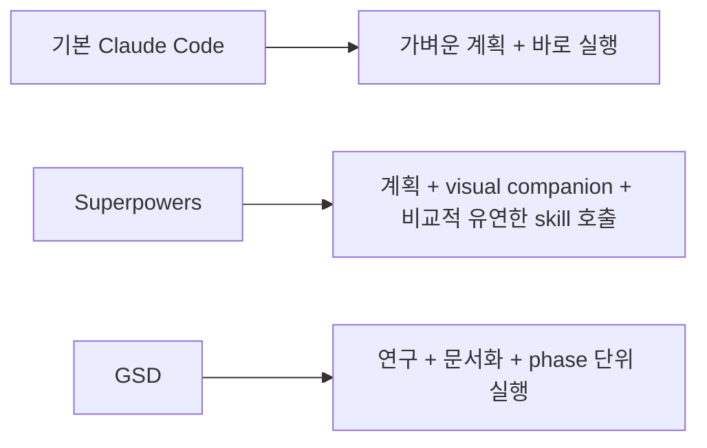
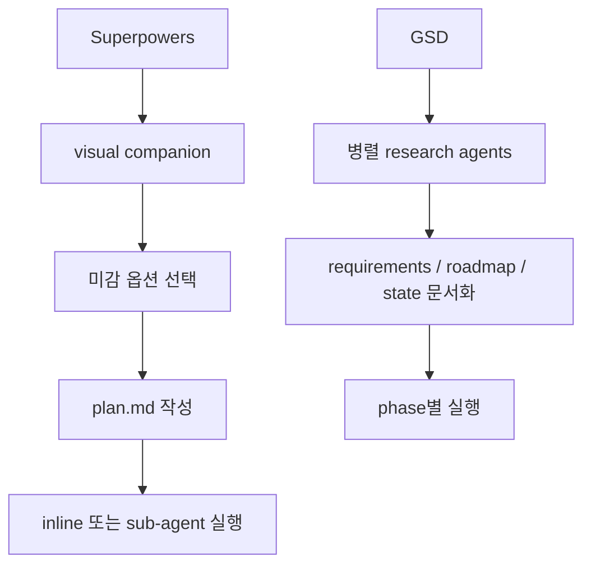
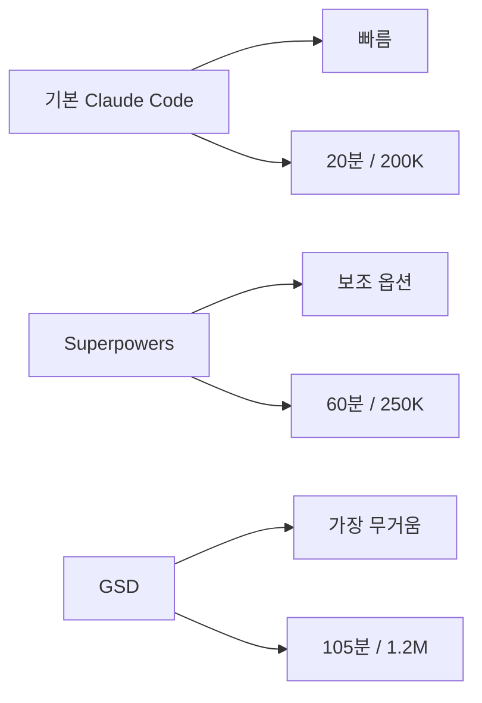

오케스트레이션 레이어를 Claude Code 위에 하나 더 얹으면 정말 결과가 더 좋아질까요? 이 영상은 바로 그 질문을 정면으로 다룹니다. `GSD`, `Superpowers`, 그리고 아무 플러그인도 없는 기본 `Claude Code` 에 같은 웹앱 과제를 맡기고, 최종 결과물·토큰 사용량·걸린 시간을 비교합니다. 영상의 결론은 꽤 의외입니다. 가장 화려한 레이어가 항상 이기는 건 아니고, 오히려 기본 Claude Code가 시간 대비 가장 실전적인 선택으로 평가됩니다. [YouTube 영상](https://youtu.be/celLbDMGy8w)
<!--more-->

이 비교가 흥미로운 이유는 세 도구가 사실 같은 문제를 서로 다른 방식으로 풀기 때문입니다. 영상 초반 설명에 따르면 GSD와 Superpowers는 둘 다 Claude Code 위에 올라가는 orchestration layer 입니다. 둘 다 더 강한 planning, testing, sub-agent execution을 도입하지만, GSD는 상태 문서와 phase-driven 실행을 더 강하게 밀고, Superpowers는 test-driven development와 좀 더 유연한 대화형 흐름을 강조합니다. [0:27](https://youtu.be/celLbDMGy8w?t=27) [2:55](https://youtu.be/celLbDMGy8w?t=175)

## Sources

- https://youtu.be/celLbDMGy8w?si=Bkznrp7HQwvVDMAm
- https://youtu.be/celLbDMGy8w?t=27
- https://youtu.be/celLbDMGy8w?t=237
- https://youtu.be/celLbDMGy8w?t=462
- https://youtu.be/celLbDMGy8w?t=888
- https://youtu.be/celLbDMGy8w?t=1164
- https://youtu.be/celLbDMGy8w?t=1464
- https://youtu.be/celLbDMGy8w?t=1785

## 1. 세 도구는 같은 목표를 향하지만 접근 방식이 다르다

영상은 먼저 GSD와 Superpowers가 “같은 계열”이라고 설명합니다. 둘 다 큰 프로젝트를 작은 원자적 작업으로 쪼개고, sub-agent를 활용해 context rot를 줄이며, 더 많은 planning과 verification 단계를 추가합니다. 하지만 Superpowers는 brainstorming, worktree, TDD, code review 흐름을 더 강조하고, GSD는 `requirements.md`, `roadmap.md`, phases 같은 상태 문서를 계속 생성하며 현재 위치와 다음 단계를 명시적으로 적어 둡니다. [0:36](https://youtu.be/celLbDMGy8w?t=36) [2:55](https://youtu.be/celLbDMGy8w?t=175)

반면 기본 Claude Code는 이런 추가 오케스트레이션 없이, 하나의 세션 안에서 plan mode와 실행을 이어가는 상대적으로 단순한 흐름을 택합니다. 즉 차이는 “무엇을 만들 수 있나”보다 **얼마나 많은 구조를 먼저 강제하느냐** 에 있습니다.

## 2. 테스트 과제는 단순 랜딩 페이지가 아니라 ‘콘텐츠 생성 웹앱’이었다

비교 과제는 Chase AI용 웹사이트 제작입니다. 요구사항은 세 가지였습니다. 첫째, 랜딩 페이지. 둘째, 게시글 목록과 상세를 볼 수 있는 블로그 페이지. 셋째, 숨겨진 admin 성격의 blog generator 페이지로, 유튜브 URL이나 기사 URL을 넣으면 해당 콘텐츠를 긁어와 Anthropic SDK로 블로그 글을 생성하고, 썸네일까지 저장하도록 만드는 것입니다. [4:05](https://youtu.be/celLbDMGy8w?t=245)

즉 이 테스트는 단순한 정적 웹페이지 비교가 아닙니다. 프런트엔드 감각, URL 처리, transcript 수집 전략, hero image 확보, 블로그 생성 프롬프트 설계 같은 해석의 여지가 남아 있는 작업입니다. 영상 제작자는 일부를 의도적으로 열어 두어, 세 시스템이 스스로 판단하는 차이를 보려 했다고 설명합니다. [5:20](https://youtu.be/celLbDMGy8w?t=320)

## 3. Superpowers는 시각적 의사결정 보조가 강하고, GSD는 연구와 문서화가 강하다

실행 전 단계에서 Superpowers는 visual companion을 통해 aesthetic 옵션을 여러 개 보여 주고, 그중에서 고르는 흐름을 제공합니다. 영상에서는 warm editorial, electric lime, monochrome, linear polish 같은 선택지가 나오고, 이후 hero section까지 시각 옵션을 좁혀 갑니다. 이 부분은 Superpowers의 가장 눈에 띄는 차별점으로 소개됩니다. [8:04](https://youtu.be/celLbDMGy8w?t=484) [9:28](https://youtu.be/celLbDMGy8w?t=568)

반대로 GSD는 네 개의 researcher agent를 병렬로 돌려 stack, features, architecture, pitfalls를 조사한 뒤 이를 synthesis하고, `project.md`, `requirements.md`, `roadmap.md`, `state.md` 등을 생성합니다. 작성자는 이 흐름이 더 robust하지만, straightforward한 웹앱 기준으로는 꽤 무겁게 느껴진다고 말합니다. [11:26](https://youtu.be/celLbDMGy8w?t=686) [14:52](https://youtu.be/celLbDMGy8w?t=892)

## 4. planning 단계부터 시간과 토큰 차이가 크게 벌어진다

영상에서 가장 먼저 드러나는 차이는 planning 단계 비용입니다. 작성자 기준 수치로 보면 기본 Claude Code의 planning은 약 10분, 5만 토큰 수준입니다. Superpowers는 약 40분, 20만 토큰입니다. GSD는 planning과 research만으로 약 40분, 대략 60만 토큰까지 올라갑니다. [15:52](https://youtu.be/celLbDMGy8w?t=952)

이 수치는 단순히 “GSD가 비싸다”는 뜻만은 아닙니다. GSD는 더 많은 조사와 문서화를 upfront에 수행하기 때문입니다. 문제는 이런 선행 비용이 실제 결과물 품질로 충분히 회수되는가입니다. 영상의 핵심 질문도 바로 이 지점으로 이어집니다. [16:57](https://youtu.be/celLbDMGy8w?t=1017)

## 5. 최종 실행 결과는 생각보다 큰 격차를 만들지 못했다

실행이 모두 끝난 뒤 작성자가 보여 주는 one-shot 결과물은 의외로 비슷합니다. GSD는 첫 시도에서 studio generator 링크가 404를 냈고, 수정 후에는 draft 편집과 preview가 가능한 꽤 괜찮은 blog generator로 고쳐집니다. Superpowers는 first pass에서 generator가 정상 동작했고, 썸네일과 글 내용도 맞게 생성됐습니다. 기본 Claude Code도 처음에는 404가 났지만, 수정 후에는 낮은 해상도의 썸네일과 함께 자동 생성이 동작합니다. [21:03](https://youtu.be/celLbDMGy8w?t=1263) [21:58](https://youtu.be/celLbDMGy8w?t=1318) [24:01](https://youtu.be/celLbDMGy8w?t=1441)

프런트엔드 디자인에 대해서는 작성자도 꽤 냉정합니다. 세 결과물이 모두 “AI가 만든 것 같은” 무난한 수준이고, 특별히 강한 차이를 느끼기 어렵다고 말합니다. 심지어 셋을 섞어 놓고 누가 만들었는지 맞히라고 하면 구분하기 힘들 것이라고까지 평가합니다. [22:30](https://youtu.be/celLbDMGy8w?t=1350) [24:59](https://youtu.be/celLbDMGy8w?t=1499)

## 6. 그래서 승자는 ‘기본 Claude Code’가 된다

영상 후반의 총정리를 보면 수치는 더 극적입니다. 기본 Claude Code는 전체 약 20분, 약 20만 토큰. Superpowers는 전체 약 1시간, 약 25만 토큰. GSD는 전체 약 1시간 45분, 약 120만 토큰입니다. [24:24](https://youtu.be/celLbDMGy8w?t=1464)

이 상태에서 작성자가 내린 결론은 명확합니다. 오늘 테스트의 승자는 기본 Claude Code이며, 그것도 “크게” 이겼다는 평가입니다. 이유는 토큰보다 시간입니다. 약간 더 거칠거나 결과가 덜 좋아 보여도, 남는 40분~80분 동안 사람이 직접 다듬을 수 있다면 최종 품질은 오히려 더 나아질 수 있다는 논리입니다. [26:40](https://youtu.be/celLbDMGy8w?t=1600)

## 7. 다만 Superpowers는 ‘백업용 무기’로는 여전히 유효하다고 본다

그렇다고 영상이 orchestration layer 전체를 부정하는 것은 아닙니다. 작성자는 정말 복잡한 작업이거나, 기본 Claude Code만으로는 구조화가 잘 안 될 것 같은 작업이라면 Superpowers를 고려할 수 있다고 말합니다. 이유는 GSD보다 상대적으로 lightweight하고, 사용감도 더 fluid하기 때문입니다. [27:22](https://youtu.be/celLbDMGy8w?t=1642)

반면 GSD에 대해서는 더 엄격합니다. phase마다 키보드 앞에서 상호작용해야 하고, 잘못 선택했을 때 시간과 토큰 손실이 너무 크며, 현재의 Claude Code가 예전보다 context handling과 harness 측면에서 많이 개선됐기 때문에 baseline과의 격차가 많이 줄었다고 평가합니다. [28:37](https://youtu.be/celLbDMGy8w?t=1717)

## 실전 적용 포인트

첫째, orchestration layer는 “항상 더 좋다”가 아니라 “복잡성이 특정 임계치를 넘을 때만 가치가 있을 수 있다”는 가정으로 접근하는 편이 좋습니다.

둘째, 복잡도가 애매한 작업에서는 먼저 기본 Claude Code로 빠르게 시작하는 편이 더 실용적일 수 있습니다. 실패하더라도 다시 고치는 시간이 여전히 남기 때문입니다.

셋째, 정말 추가 레이어가 필요하다면 영상 기준으로는 GSD보다 Superpowers가 더 현실적인 백업 카드로 평가됩니다.

## 핵심 요약

- GSD와 Superpowers는 둘 다 Claude Code 위 orchestration layer지만, GSD는 문서화·phase 관리, Superpowers는 시각 보조·유연한 흐름을 더 강조한다.
- 같은 웹앱 과제를 비교한 결과 planning 단계부터 시간과 토큰 차이가 크게 벌어졌다.
- 총 소요는 기본 Claude Code 약 20분/20만 토큰, Superpowers 약 1시간/25만 토큰, GSD 약 1시간 45분/120만 토큰이었다.
- 결과물 품질 차이는 예상보다 크지 않았고, Superpowers만 first pass에서 generator를 바로 동작시켰다.
- 영상의 최종 결론은 99%의 사용자와 99%의 작업에는 기본 Claude Code가 가장 실전적이라는 것이다.

## 결론

이 영상이 던지는 핵심 메시지는 단순합니다. 오케스트레이션이 많아질수록 더 똑똑해지는 것이 아니라, 더 느려지고 더 무거워질 수 있다는 것입니다. 특히 기본 Claude Code 자체가 예전보다 좋아진 지금은, 추가 레이어가 주는 이점보다 속도 손실이 더 크게 체감될 수 있습니다. [29:45](https://youtu.be/celLbDMGy8w?t=1785)

그래서 현재 시점의 실전 전략은 꽤 보수적입니다. 먼저 기본 Claude Code로 간다. 정말 복잡해서 구조화 보조가 필요할 때만 Superpowers를 꺼낸다. GSD는 아주 특수한 상황에서만 고려한다. 이 영상은 적어도 2026년 4월 기준으로는 그 판단이 꽤 합리적이라고 말하고 있습니다.
