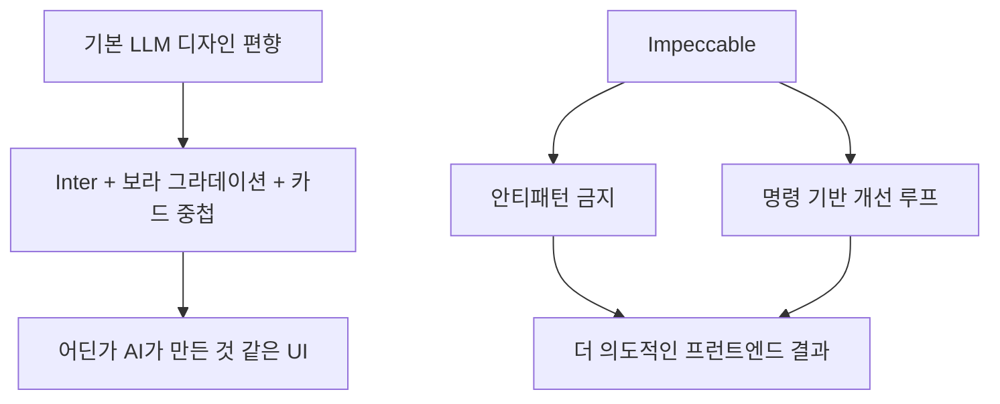
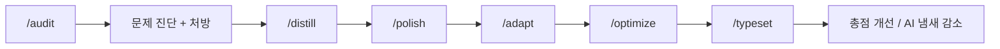

AI가 만든 프런트엔드를 오래 보다 보면 묘하게 비슷한 냄새가 납니다. 보라빛 블러, gradient text, 카드 안의 카드, 너무 익숙한 Inter 기반 조합, 한쪽에 두꺼운 컬러 스트라이프 같은 것들입니다. 이 Threads 스레드는 바로 그 “어딘가 AI가 만든 것 같다”는 느낌을 문제로 지목하고, `Impeccable` 이라는 프런트엔드 디자인 스킬로 개선한 과정을 보여 줍니다. [Threads 원문](https://www.threads.com/@cowboy76/post/DXCXWjimTp4) [Jina Reader 추출](https://r.jina.ai/http://https://www.threads.com/@cowboy76/post/DXCXWjimTp4)
<!--more-->

원문 저장소 README를 보면 이 프로젝트는 “The vocabulary you didn't know you needed” 라고 자신을 소개합니다. 하나의 스킬, 18개의 명령, curated anti-patterns를 통해 AI harness 가 더 나은 프런트엔드 결정을 내리게 만드는 구조입니다. 즉 이 프로젝트는 예쁜 컴포넌트 모음이 아니라, **AI가 자주 만드는 촌스러운 패턴을 금지하고 더 나은 대안을 유도하는 디자인 언어 층** 에 가깝습니다. [GitHub README](https://github.com/pbakaus/impeccable) [GitHub API](https://api.github.com/repos/pbakaus/impeccable)

## Sources

- https://www.threads.com/@cowboy76/post/DXCXWjimTp4?xmt=AQF0Pu-PEWrAtvHRDqOsxaGCfqeHyrlvmO0pCFbF-z8_RznBVvC-HG7BTVtFgo7bcyZY3zw&slof=1
- https://r.jina.ai/http://https://www.threads.com/@cowboy76/post/DXCXWjimTp4
- https://github.com/pbakaus/impeccable
- https://raw.githubusercontent.com/pbakaus/impeccable/main/README.md
- https://api.github.com/repos/pbakaus/impeccable

## 1. Impeccable이 겨냥하는 것은 ‘디자인 부족’보다 ‘AI 편향된 디자인 습관’이다

README는 모든 LLM이 비슷한 템플릿에서 학습됐기 때문에, 가이드가 없으면 비슷한 실수를 반복한다고 말합니다. Inter 폰트, 보라색 그라데이션, 카드 안의 카드, 컬러 배경 위 회색 텍스트 같은 패턴이 대표적입니다. Threads 스레드도 “자주 보는 보라빛 블러 효과”와 “카드 한쪽에 두꺼운 색 테두리”를 AI-generated UI의 대표적 냄새로 지적합니다. [GitHub README](https://github.com/pbakaus/impeccable) [Jina Reader 추출](https://r.jina.ai/http://https://www.threads.com/@cowboy76/post/DXCXWjimTp4)

이 문제 설정이 중요한 이유는, AI 프런트엔드의 실패가 단순히 예쁘지 않아서가 아니라 **편향된 기본값을 계속 재생산하기 때문** 이라는 점을 짚기 때문입니다. 즉 더 많은 레퍼런스를 보여 주는 것만으로는 부족하고, 무엇을 하지 말아야 하는지까지 시스템 차원에서 알려 줘야 합니다.

## 2. 이 프로젝트의 본질은 ‘더 예쁜 스타일’이 아니라 ‘더 좋은 판단 어휘’다

README는 Impeccable을 7개의 reference 파일과 18개의 명령으로 구성된 스킬로 설명합니다. typography, color-and-contrast, spatial-design, motion-design, interaction-design, responsive-design, ux-writing 같은 도메인이 분리되어 있고, `/audit`, `/critique`, `/polish`, `/distill`, `/optimize`, `/adapt`, `/typeset`, `/layout` 같은 명령으로 접근합니다. [GitHub README](https://github.com/pbakaus/impeccable)

이 구조의 의미는 “이쁘게 만들어” 대신 더 구체적인 어휘를 제공한다는 데 있습니다. 예를 들어 문제를 진단할 때는 `/audit`, 시각 복잡성을 덜어낼 때는 `/distill`, 폰트 체계를 바로잡을 때는 `/typeset`, 반응형/디바이스 적응은 `/adapt`, 최종 출하 전 정리는 `/polish` 같은 식으로 목적이 분리됩니다. 결국 Impeccable은 스타일 팩이라기보다, **프런트엔드 품질을 다루는 전문 용어 체계** 에 가깝습니다. [GitHub README](https://github.com/pbakaus/impeccable)

## 3. Threads 예시는 /audit → /distill → /polish → /adapt → /optimize → /typeset 흐름을 잘 보여 준다

스레드에서 작성자는 먼저 `/audit` 부터 돌렸다고 설명합니다. 이 명령은 접근성, 성능, 반응형, 테마, 안티패턴의 5개 차원을 자동으로 채점하고, 각 문제에 어떤 서브 스킬을 써야 하는지 처방까지 내려준다고 합니다. 진단 결과는 “Poor”, 총점 6/20 수준이었다고 적습니다. [Jina Reader 추출](https://r.jina.ai/http://https://www.threads.com/@cowboy76/post/DXCXWjimTp4)

그 다음 단계는 `/distill` 입니다. 가장 먼저 걸린 것이 섹션 헤더의 컬러 세로 스트라이프였고, 이는 Impeccable이 절대 금지로 보는 AI slop 패턴 중 하나라고 설명합니다. 여기서는 `border-left: 3px solid blue` 형태를 숫자 prefix 헤더로 바꾸어 신문이나 보고서 느낌으로 정제했다고 합니다. 이어서 `/polish` 로 토큰 체계를 정리하고, `/adapt` 로 aria-label, role, focus ring 같은 접근성 문제를 고치고, `/optimize` 로 번들 크기를 줄이며, `/typeset` 으로 실제 존재하지 않는 폰트 폴백 문제를 바로잡는 흐름이 이어집니다. [Jina Reader 추출](https://r.jina.ai/http://https://www.threads.com/@cowboy76/post/DXCXWjimTp4)

## 4. 안티패턴 금지 목록이 꽤 중요한 역할을 한다

README는 명시적으로 “Don't use overused fonts”, “Don't use gray text on colored backgrounds”, “Don't use pure black/gray”, “Don't wrap everything in cards or nest cards inside cards”, “Don't use bounce/elastic easing” 같은 금지 규칙을 적어 둡니다. Threads 스레드에서 언급된 thick colored stripe, gradient text 같은 항목도 이 안티패턴 계열의 일부로 읽힙니다. [GitHub README](https://github.com/pbakaus/impeccable) [Jina Reader 추출](https://r.jina.ai/http://https://www.threads.com/@cowboy76/post/DXCXWjimTp4)

이런 금지 목록은 생각보다 중요합니다. 프런트엔드 디자인에서 AI가 흔히 망하는 지점은 좋은 레퍼런스를 덜 배워서가 아니라, **너무 흔하고 과장된 안전빵 패턴으로 자꾸 도망가기 때문** 입니다. 금지 규칙은 바로 그 탈출구를 막습니다. 그래서 Impeccable의 힘은 “무엇을 하라”만큼이나 “무엇을 하지 말라”에 있습니다.

## 5. 성능·접근성·반응형까지 같이 본다는 점이 실전적이다

이 프로젝트가 단순 미감 스킬과 다른 이유는 성능과 접근성까지 한 흐름에 넣는다는 점입니다. 스레드 예시만 봐도 `/adapt` 로 스크린리더·키보드 사용성 문제를 고쳤고, `/optimize` 로 초기 번들을 204KB gzip에서 74KB gzip으로 줄였다고 설명합니다. 탭별 차트 컴포넌트를 `React.lazy()` 로 나누고, 번들 청크를 분리하는 식의 개선은 단순 디자인이 아니라 프런트엔드 엔지니어링 영역입니다. [Jina Reader 추출](https://r.jina.ai/http://https://www.threads.com/@cowboy76/post/DXCXWjimTp4)

README도 `/audit` 의 역할을 a11y, performance, responsive 중심 기술 점검으로 설명하고, `/optimize`, `/adapt`, `/harden` 같은 명령을 별도로 둡니다. 즉 Impeccable은 “겉모습만 다듬는 스킬”이 아니라, **보이는 품질과 보이지 않는 품질을 함께 끌어올리는 프런트엔드 품질 시스템** 으로 보는 편이 맞습니다. [GitHub README](https://github.com/pbakaus/impeccable)

## 6. 설치와 적용 범위가 넓다는 점도 눈에 띈다

README에 따르면 Impeccable은 Cursor, Claude Code, OpenCode, Gemini CLI, Codex CLI, Copilot, Trae, Rovo Dev 등 여러 AI harness 에 맞는 dist 폴더를 제공합니다. 웹사이트에서 ZIP을 받아 풀거나, 도구별 설정 디렉터리에 복사해 넣는 방식입니다. Codex CLI는 `/prompts:audit` 같은 별도 문법도 안내합니다. [GitHub README](https://github.com/pbakaus/impeccable)

이 점이 중요한 이유는 Impeccable이 특정 IDE 전용이 아니라는 뜻이기 때문입니다. 프런트엔드 디자인 품질을 위한 언어와 워크플로를 도구 바깥의 스킬 자산으로 빼냈다는 의미입니다. 2026년 4월 13일 기준 GitHub API 메타데이터를 보면 별 18,704개, 포크 833개로 상당한 주목을 받고 있기도 합니다. [GitHub API](https://api.github.com/repos/pbakaus/impeccable)

## 실전 적용 포인트

첫째, AI가 만든 화면이 늘 비슷해 보인다면 “디자인 센스가 부족하다”기보다 “안티패턴 금지 목록이 없다”는 문제일 수 있습니다. 금지 규칙은 surprisingly 큰 차이를 만듭니다.

둘째, `/audit` 부터 시작하는 접근이 좋습니다. 감으로 “예쁜가?”를 보지 말고, 접근성·반응형·성능·안티패턴을 먼저 채점한 뒤 순차적으로 고치는 편이 낫습니다.

셋째, 프런트엔드 디자인 품질은 시각 요소만으로 끝나지 않습니다. 타이포, 토큰 일관성, 번들 크기, 포커스 링, 라벨링까지 같이 봐야 실제 제품 수준으로 올라갑니다.

## 핵심 요약

- Impeccable은 AI가 자주 만드는 프런트엔드 안티패턴을 줄이기 위한 디자인 스킬이다.
- 7개 reference 영역과 18개 명령으로 프런트엔드 품질 개선 어휘를 제공한다.
- Threads 예시는 `/audit → /distill → /polish → /adapt → /optimize → /typeset` 흐름으로 실제 개선 과정을 보여 준다.
- 이 프로젝트의 힘은 좋은 스타일 제안뿐 아니라 명시적인 금지 목록에 있다.
- 성능·접근성·반응형까지 함께 본다는 점에서 단순 미감 도구보다 엔지니어링 품질 시스템에 가깝다.

## 결론

Impeccable이 흥미로운 이유는 “AI가 만든 티”를 단순 취향 문제가 아니라, 이름 붙일 수 있는 안티패턴의 집합으로 바꾸기 때문입니다. 이름을 붙일 수 있어야 고칠 수 있고, 고칠 수 있어야 다시 반복하지 않게 만들 수 있습니다.

결국 좋은 프런트엔드 결과물은 더 화려한 스타일을 추가하는 데서 나오는 것이 아니라, **촌스러운 기본값을 얼마나 잘 금지하고, 그 대신 어떤 개선 루프를 시스템화하느냐** 에서 나옵니다. Impeccable은 그 점을 꽤 명확하게 보여 주는 사례입니다.
