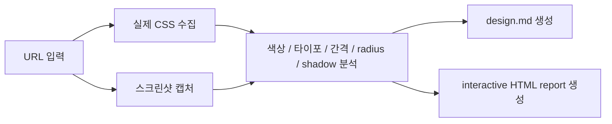
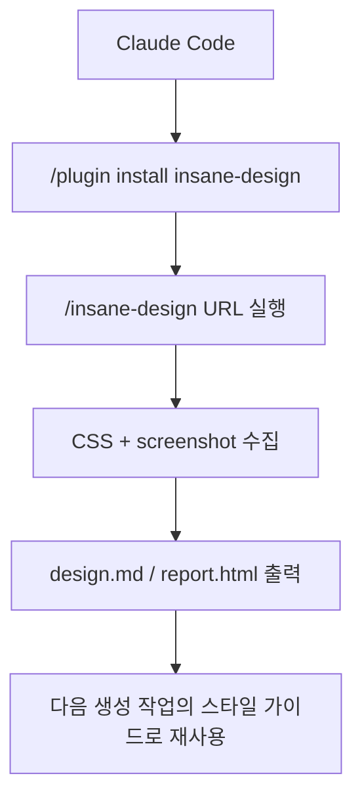

디자인 레퍼런스를 AI에게 줄 때 가장 흔한 프롬프트는 “Stripe 느낌으로”, “Vercel처럼”, “깔끔한 SaaS 스타일로” 같은 문장입니다. 하지만 이런 표현은 사람에게는 어느 정도 통하고, 에이전트에게는 생각보다 모호합니다. `insane-design` 은 바로 이 지점을 겨냥합니다. URL 하나를 넣으면 스크린샷만 보는 대신 실제 CSS를 수집하고, 색상·타이포·간격·반경 같은 토큰을 분석해 `design.md` 와 HTML 리포트로 바꾸는 도구입니다. [GitHub 저장소](https://github.com/fivetaku/insane-design) [README 원문](https://raw.githubusercontent.com/fivetaku/insane-design/main/README.md)
<!--more-->

이 저장소의 README는 자신을 “URL one-shot design system extractor” 라고 설명합니다. 즉 목적은 사이트를 그대로 복제하는 것이 아니라, **AI가 재사용할 수 있는 설계 문서로 디자인 시스템을 추출하는 것** 입니다. 2026년 4월 13일 기준 GitHub API 메타데이터를 보면 저장소는 2026년 4월 12일 생성됐고, 별 26개·포크 6개 규모의 아주 초기 프로젝트입니다. 아직 작지만, 디자인 레퍼런스를 CSS 토큰과 `design.md` 로 바꾸는 발상은 꽤 선명합니다. [GitHub API](https://api.github.com/repos/fivetaku/insane-design)

## Sources

- https://github.com/fivetaku/insane-design
- https://raw.githubusercontent.com/fivetaku/insane-design/main/README.md
- https://api.github.com/repos/fivetaku/insane-design
- https://fivetaku.github.io/insane-design/

## 1. insane-design이 푸는 문제는 ‘예쁜 참고 사이트가 있어도 에이전트가 쓸 수 있는 규칙은 남지 않는다’는 점이다

README는 보통의 디자인 레퍼런스 사용 방식이 screenshot reference 나 vibe reference 에 머무른다고 지적합니다. 사람은 화면을 보고 “이런 무드”를 이해할 수 있지만, AI 에이전트는 실제로 어떤 색 토큰을 쓰는지, 간격 체계가 어떻게 반복되는지, radius와 shadow가 어떤 규칙을 갖는지까지 구조화된 입력이 있어야 더 안정적으로 따라갑니다. [README 원문](https://raw.githubusercontent.com/fivetaku/insane-design/main/README.md)

그래서 insane-design은 “이 사이트 느낌으로 만들어 줘”를 그대로 전달하지 않습니다. 대신 참조 사이트에서 실제 CSS를 수집하고, 거기서 반복되는 디자인 토큰을 뽑아내며, 최종적으로 `design.md` 라는 에이전트 친화적 문서로 바꿉니다. 즉 스크린샷 기반 감상에서 **규칙 기반 추출** 로 넘어가는 셈입니다.

## 2. 핵심은 스크린샷 수집기가 아니라 ‘실제 CSS 분석기’라는 점이다

README의 설명을 보면 입력은 단순합니다. URL 하나를 주면 도구가 먼저 페이지의 실제 CSS를 수집하고, 동시에 시각 캡처를 위해 스크린샷도 남깁니다. 그다음 color ramp, typography scale, spacing, radius, shadow, font stack 같은 항목을 분석해 디자인 시스템을 구성합니다. [README 원문](https://raw.githubusercontent.com/fivetaku/insane-design/main/README.md)

이 점이 중요한 이유는, 레퍼런스 사이트를 눈으로만 흉내 내면 자주 놓치는 것이 있기 때문입니다. 예를 들어 화면상으로는 비슷해 보여도 실제 토큰 체계가 없으면, AI가 페이지를 몇 장 더 만들 때 일관성이 바로 깨집니다. 반면 CSS에서 직접 추출한 값은 “이 사이트가 반복해서 쓰는 규칙”을 더 잘 보존합니다.

## 3. 결과물이 `design.md` 라는 점이 에이전트 시대에 특히 중요하다

이 프로젝트의 출력은 단순 JSON 덤프가 아닙니다. README에 따르면 기본 결과물은 `{site-name}/design.md`, `report.ko.html`, 그리고 `screenshots/hero-cropped.png` 입니다. 여기서 핵심은 `design.md` 입니다. 이는 사람이 읽기 위한 문서이기도 하지만, 동시에 Claude Code 같은 에이전트가 스타일 지침으로 바로 참조할 수 있는 형식입니다. [README 원문](https://raw.githubusercontent.com/fivetaku/insane-design/main/README.md)

즉 insane-design은 디자인 분석 도구이면서, 동시에 **레퍼런스 사이트를 에이전트용 설계 문서로 컴파일하는 도구** 라고 볼 수 있습니다. 이 관점이 중요합니다. 좋은 디자인 시스템은 보기 좋은 리포트로 끝나는 것이 아니라, 이후 생성 단계에서 다시 쓰일 수 있어야 하기 때문입니다.

## 4. 설치 UX도 ‘Claude Code 안에서 바로 쓰는 스킬’에 가깝다

README는 설치 절차를 Claude Code plugin marketplace 기준으로 설명합니다. 먼저 `/plugin marketplace add https://github.com/fivetaku/gptaku_plugins.git` 로 마켓플레이스를 추가하고, 이어 `/plugin install insane-design` 을 실행한 뒤 Claude Code를 재시작하는 흐름입니다. 필수 조건은 Claude Code, Python 3.11+, Pillow이며, 더 나은 스크린샷을 위해 Playwright MCP를 선택적으로 권장합니다. 없으면 `curl` 기반 fallback을 사용합니다. [README 원문](https://raw.githubusercontent.com/fivetaku/insane-design/main/README.md)

이 구조는 결국 insane-design이 독립 실행형 디자인 SaaS라기보다, **에이전트 워크플로 안에 붙는 추출 스킬** 임을 보여 줍니다. 사용 예시도 `/insane-design https://stripe.com` 처럼 매우 직접적입니다.

## 5. 36개 서비스 분석 갤러리는 ‘가능성 데모’이자 신뢰 장치다

README는 Stripe, Vercel 등을 포함한 36개 서비스를 분석했다고 설명하고, 별도 GitHub Pages 갤러리를 제공합니다. 이 갤러리는 단순 showcase라기보다, 이 도구가 실제로 어떤 수준의 추출 결과를 낼 수 있는지 보여 주는 샘플 묶음에 가깝습니다. [갤러리](https://fivetaku.github.io/insane-design/) [README 원문](https://raw.githubusercontent.com/fivetaku/insane-design/main/README.md)

초기 프로젝트일수록 사용자는 “정말 쓸 만한 결과가 나오나?”를 먼저 묻습니다. 그런 점에서 다양한 유명 서비스의 분석 결과를 한곳에 모아 둔 것은 단순 홍보가 아니라, 추출 품질을 빠르게 감 잡게 하는 신뢰 장치 역할을 합니다.

## 6. 이 도구를 ‘복제기’가 아니라 ‘디자인 시스템 추출기’로 봐야 하는 이유

이 프로젝트를 잘못 읽으면 “남의 사이트 CSS를 뜯어와서 베끼는 도구”처럼 보일 수 있습니다. 하지만 README의 프레이밍은 조금 다릅니다. 핵심은 실제 CSS를 기반으로 디자인 규칙을 추출해, 새로운 제품을 만들 때 재사용 가능한 시스템 문서로 변환하는 데 있습니다. [README 원문](https://raw.githubusercontent.com/fivetaku/insane-design/main/README.md)

물론 이런 도구는 언제나 경계가 필요합니다. 참조 사이트의 구체적 구현을 그대로 복제하는 것은 별개의 문제이기 때문입니다. 하지만 레퍼런스의 분위기를 막연히 전달하는 대신, 토큰·스케일·원칙 수준으로 압축해 새 작업의 기준으로 삼는 것은 훨씬 생산적인 사용법입니다. 그래서 insane-design의 가치는 “복사”보다 **정제된 추출** 에 있습니다.

## 실전 적용 포인트

첫째, 디자인 레퍼런스를 줄 때 “어떤 느낌”보다 “어떤 토큰과 규칙”이 더 중요하다는 점을 팀에 공유할 때 유용합니다.

둘째, Claude Code나 다른 에이전트에 UI 작업을 맡길 때, 먼저 참조 사이트를 insane-design으로 분석해 `design.md` 를 만든 뒤 그 문서를 입력하는 방식이 더 안정적일 수 있습니다.

셋째, 디자인 시스템이 아직 없는 초기 제품이라면, 경쟁사나 선호 서비스의 스타일을 직접 모사하기보다 반복 규칙을 추출해 내부 기준 문서로 전환하는 용도로 쓸 수 있습니다.

## 핵심 요약

- insane-design은 URL 하나에서 실제 CSS를 수집해 디자인 시스템을 추출하는 도구다.
- 핵심 출력은 `design.md`, HTML 리포트, 스크린샷이다.
- 스크린샷 참고용 도구가 아니라 색상·타이포·간격·radius·shadow 같은 토큰 분석기가 핵심이다.
- Claude Code plugin 형태로 설치해 에이전트 워크플로 안에서 바로 사용할 수 있다.
- 가장 중요한 가치는 “느낌 복제”가 아니라 “에이전트가 재사용할 수 있는 디자인 규칙 추출”에 있다.

## 결론

AI에게 디자인을 맡길 때 결과가 들쭉날쭉한 가장 큰 이유 중 하나는, 우리가 여전히 “이런 느낌”이라는 사람 중심 언어로만 지시하기 때문입니다. 에이전트는 그 느낌을 규칙으로 바꿔 줄 중간층이 필요합니다.

insane-design은 바로 그 중간층을 만들려는 시도입니다. URL을 넣으면 CSS를 읽고, 디자인 토큰을 뽑고, 그것을 `design.md` 로 바꿔 이후 생성 작업의 기준으로 남깁니다. 작은 프로젝트지만, **레퍼런스 사이트를 에이전트용 설계 문서로 바꾸는 흐름** 을 가장 직관적으로 보여 주는 사례 중 하나입니다.
