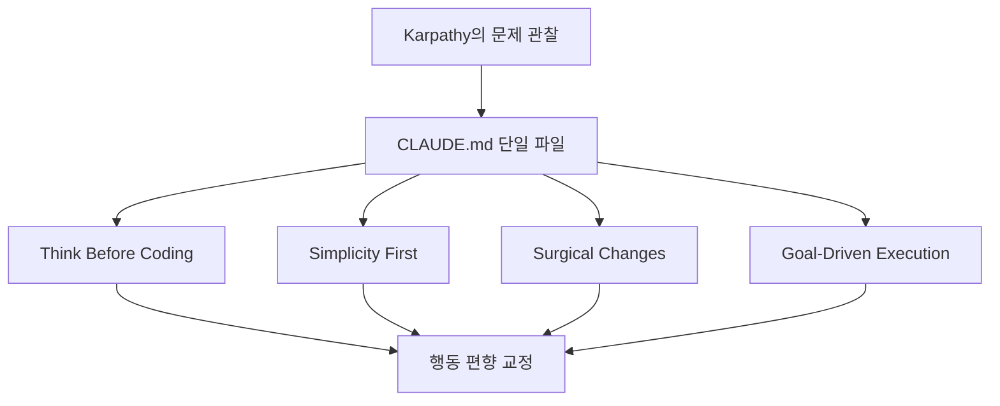
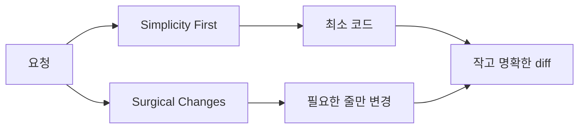

이 Threads 스레드는 꽤 강한 문장으로 시작합니다. Karpathy가 AI 코딩의 문제점을 짚었고, 누군가가 그것을 `CLAUDE.md` 한 파일로 해결했다는 것입니다. 실제로 링크된 `forrestchang/andrej-karpathy-skills` 저장소 README를 보면 이 프로젝트는 “A single `CLAUDE.md` file to improve Claude Code behavior” 라고 자신을 설명합니다. 즉 이 저장소의 핵심은 새 모델도, 긴 프롬프트 묶음도 아니라, **한 장의 규칙 문서로 에이전트 행동 편향을 바꾸려는 시도** 입니다. [Threads 원문](https://www.threads.com/@qjc.ai/post/DXB-wWeEzFr) [Jina Reader 추출](https://r.jina.ai/http://https://www.threads.com/@qjc.ai/post/DXB-wWeEzFr) [GitHub README](https://github.com/forrestchang/andrej-karpathy-skills)
<!--more-->

흥미로운 점은 이 프로젝트가 매우 작다는 데 있습니다. README는 Karpathy의 LLM coding pitfalls 관찰을 네 가지 원칙으로 압축했다고 말합니다. `Think Before Coding`, `Simplicity First`, `Surgical Changes`, `Goal-Driven Execution`. 즉 복잡한 프레임워크가 아니라, **에이전트가 자주 실패하는 방향을 시스템 프롬프트 차원에서 미리 꺾어 놓는 장치** 로 볼 수 있습니다. 2026년 4월 13일 기준 GitHub API에서 확인한 현재 저장소 규모도 꽤 큽니다. 별은 16,487개, 포크는 1,203개였습니다. 스레드가 말한 14,500 stars는 게시 시점 수치였고, 이후 더 늘어난 셈입니다. [GitHub API](https://api.github.com/repos/forrestchang/andrej-karpathy-skills)

## Sources

- https://www.threads.com/@qjc.ai/post/DXB-wWeEzFr?xmt=AQF0bZA_YCBmMkQ1fCXCBfiBlzGjl9Qxz4gpRhjBHxwvFkrQTb9aaBbXB1lNhmn6fbfjB8Ny&slof=1
- https://r.jina.ai/http://https://www.threads.com/@qjc.ai/post/DXB-wWeEzFr
- https://github.com/forrestchang/andrej-karpathy-skills
- https://raw.githubusercontent.com/forrestchang/andrej-karpathy-skills/main/README.md
- https://api.github.com/repos/forrestchang/andrej-karpathy-skills

## 1. 출발점은 Karpathy가 지적한 세 가지 코딩 에이전트 문제다

README는 Karpathy의 관찰을 직접 인용합니다. 모델은 잘못된 가정을 조용히 세우고 확인 없이 밀어붙이며, 혼란을 관리하지 않고, tradeoff를 드러내지 않고, 필요할 때 push back 하지 않는다는 것. 또 코드를 과하게 복잡하게 만들고, 죽은 코드를 치우지 않으며, 100줄이면 될 걸 1,000줄짜리 구조로 부풀린다는 것. 마지막으로 task와 직교하는 코드나 주석까지 건드리는 side effect 가 있다는 것입니다. [GitHub README](https://github.com/forrestchang/andrej-karpathy-skills)

Threads 스레드도 이 세 축을 거의 그대로 요약합니다. 잘못된 가정, 코드 과복잡화, 관련 없는 코드 수정. 이 프로젝트의 출발점은 결국 “모델이 똑똑하냐”보다, **모델이 자주 틀어지는 행동 습관을 어떻게 규칙으로 막을 것인가** 입니다. [Jina Reader 추출](https://r.jina.ai/http://https://www.threads.com/@qjc.ai/post/DXB-wWeEzFr)

## 2. 해결책은 surprisingly small하다: 원칙 네 개를 늘 켜 두는 것

이 저장소가 흥미로운 이유는 문제의 크기에 비해 해결책이 작다는 데 있습니다. 하나의 `CLAUDE.md` 파일 안에 네 가지 원칙을 넣고, 그것을 Claude Code에 상시 로드되게 합니다. 즉 에이전트에게 매 작업마다 장황한 프롬프트를 주는 대신, **항상 켜져 있는 행동 운영체제** 를 한 파일로 두는 방식입니다. [GitHub README](https://github.com/forrestchang/andrej-karpathy-skills)

이 설계가 실용적인 이유는 재사용성입니다. 프로젝트마다 복잡한 지침을 새로 쓰지 않아도, 공통적으로 문제가 되는 행동 편향을 먼저 잡아 둘 수 있습니다. Threads 스레드가 “설치 30초”를 강조한 것도, 이 도구의 매력이 거대한 기능 추가보다 도입 비용이 매우 낮다는 점에 있기 때문입니다. [Jina Reader 추출](https://r.jina.ai/http://https://www.threads.com/@qjc.ai/post/DXB-wWeEzFr) [GitHub README](https://github.com/forrestchang/andrej-karpathy-skills)

## 3. Think Before Coding은 ‘조용히 하나를 고르지 말라’는 규칙이다

첫 번째 원칙인 `Think Before Coding` 은 가장 중요한 출발점입니다. README는 불확실할 때는 추측 대신 질문하고, ambiguity가 있으면 여러 해석을 제시하고, 더 단순한 접근이 있다면 push back 하며, 헷갈릴 때는 무엇이 unclear 한지 드러내라고 설명합니다. [GitHub README](https://github.com/forrestchang/andrej-karpathy-skills)

이 원칙은 모델이 침묵 속에서 잘못된 전제를 세우는 문제를 직접 겨냥합니다. Threads 스레드가 “AI가 혼자 결정하는 걸 시스템으로 막는 거다”라고 요약한 부분과 정확히 겹칩니다. 결국 이 규칙의 핵심은 하나입니다. **모델이 조용히 선택하지 못하게 만들기**. 가정을 밖으로 끌어내면, 그때부터 사람은 승인하거나 수정할 수 있습니다. [Jina Reader 추출](https://r.jina.ai/http://https://www.threads.com/@qjc.ai/post/DXB-wWeEzFr)

## 4. Simplicity First와 Surgical Changes는 ‘코드 욕심’을 자르는 규칙이다

두 번째 원칙 `Simplicity First` 는 과잉 엔지니어링을 막습니다. 요청한 것 이상의 기능 금지, 한 번 쓰는 코드의 추상화 금지, 요청되지 않은 유연성 금지, 불가능한 시나리오를 위한 에러 핸들링 금지, 200줄이 50줄로 줄 수 있다면 줄이라는 식입니다. README는 “Would a senior engineer say this is overcomplicated?” 를 테스트로 제시합니다. [GitHub README](https://github.com/forrestchang/andrej-karpathy-skills)

세 번째 원칙 `Surgical Changes` 는 관련 없는 코드 변경을 막습니다. 인접 코드 개선 금지, 안 깨진 코드 리팩토링 금지, 스타일이 마음에 안 들어도 기존 스타일 유지, 관련 없는 dead code는 언급만 하고 지우지 말라는 식입니다. Threads 스레드가 “모든 변경된 줄이 사용자 요청에 직접 연결되어야 한다”라고 요약한 부분이 바로 이것입니다. [Jina Reader 추출](https://r.jina.ai/http://https://www.threads.com/@qjc.ai/post/DXB-wWeEzFr) [GitHub README](https://github.com/forrestchang/andrej-karpathy-skills)

## 5. Goal-Driven Execution은 ‘무엇을 하라’보다 ‘성공 기준을 줘라’에 가깝다

네 번째 원칙 `Goal-Driven Execution` 은 가장 agentic 합니다. README는 “Add validation” 대신 “Write tests for invalid inputs, then make them pass”, “Fix the bug” 대신 “Write a test that reproduces it, then make it pass” 같은 식으로 imperative task를 검증 가능한 goal로 바꾸라고 제안합니다. 또 멀티스텝 작업이면 각 단계마다 verification 체크를 붙이라고 권합니다. [GitHub README](https://github.com/forrestchang/andrej-karpathy-skills)

이게 중요한 이유는 강한 success criteria 가 있어야 에이전트가 독립적으로 루프를 돌 수 있기 때문입니다. README도 “Strong success criteria let the LLM loop independently” 라고 말합니다. Threads 스레드가 Karpathy의 선언적 접근이라 부른 부분도 결국 같은 의미입니다. **행동 지시보다 검증 목표가 더 강하다** 는 것입니다. [Jina Reader 추출](https://r.jina.ai/http://https://www.threads.com/@qjc.ai/post/DXB-wWeEzFr) [GitHub README](https://github.com/forrestchang/andrej-karpathy-skills)

## 6. 설치 방식은 작고 단순하지만, 효과는 상시적이다

README는 설치를 두 가지로 제시합니다. Claude Code plugin 방식은 `/plugin marketplace add ...` 와 `/plugin install ...` 두 줄이고, 프로젝트별 적용은 `curl -o CLAUDE.md ...` 로 파일을 받아오거나 기존 `CLAUDE.md` 뒤에 append 하는 방식입니다. Threads 스레드가 “30초면 끝”이라고 표현한 이유가 이해됩니다. [GitHub README](https://github.com/forrestchang/andrej-karpathy-skills) [Jina Reader 추출](https://r.jina.ai/http://https://www.threads.com/@qjc.ai/post/DXB-wWeEzFr)

여기서 중요한 것은 설치가 아니라 상시성입니다. 한 번 넣어 두면 매번 같은 실수를 반복적으로 줄일 수 있습니다. 즉 이 프로젝트는 거대한 skill pack 이라기보다, **에이전트의 기본 성향을 덜 위험한 쪽으로 바꾸는 베이스라인 가드레일** 에 가깝습니다.

## 실전 적용 포인트

첫째, 프로젝트마다 긴 규칙 문서를 새로 쓰기 전에, 먼저 이런 공통 가드레일을 넣는 것이 더 효율적일 수 있습니다. 잘못된 가정, 과복잡화, 관련 없는 변경은 거의 모든 코드베이스에서 반복되는 문제이기 때문입니다.

둘째, `Goal-Driven Execution` 은 특히 바로 써먹기 좋습니다. 버그 수정, 검증 추가, 리팩터링 요청을 모두 테스트나 success criteria로 바꿔 주면 에이전트가 훨씬 덜 흔들립니다.

셋째, 이 파일은 speed보다 caution에 약간 더 치우친다는 점도 기억할 만합니다. README도 trivial task 에서는 과도한 엄격함이 필요 없다고 적고 있습니다. 즉 만능 규칙이 아니라, **비용 큰 실수를 줄이기 위한 편향 조정** 으로 보는 편이 맞습니다.

## 핵심 요약

- 이 저장소는 Karpathy가 지적한 LLM 코딩 문제를 단일 `CLAUDE.md` 파일의 4원칙으로 정리한 프로젝트다.
- 네 가지 원칙은 `Think Before Coding`, `Simplicity First`, `Surgical Changes`, `Goal-Driven Execution` 이다.
- 핵심 목적은 모델 성능 향상이 아니라 행동 편향 교정이다.
- 특히 `Goal-Driven Execution` 은 imperative task를 검증 가능한 목표로 바꾸어 에이전트의 자율 루프를 강화한다.
- 2026년 4월 13일 기준 저장소는 GitHub 별 16,487개, 포크 1,203개를 기록하고 있었다.

## 결론

이 프로젝트가 시사하는 바는 꽤 분명합니다. AI 코딩 품질은 모델 스펙만으로 결정되지 않는다는 것, 그리고 생각보다 많은 차이가 “어떤 시스템 규칙을 상시로 걸어 두느냐”에서 나온다는 것입니다. `andrej-karpathy-skills` 는 그 사실을 가장 작은 단위, 즉 `CLAUDE.md` 한 장으로 보여 줍니다.

결국 앞으로의 코딩 에이전트 운영에서는 스펙 경쟁 못지않게, **에이전트가 어떤 실수를 덜 하도록 미리 편향을 조정할 것인가** 가 중요한 설계 과제가 될 가능성이 큽니다. 이 저장소는 그 질문에 대한 꽤 간단하고도 실용적인 답입니다.
