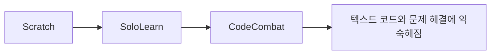
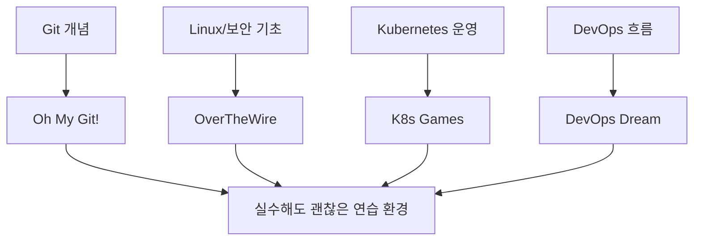

이 X 포스트는 메시지가 단순합니다. “Learn Coding by playing games.” 그리고 그 아래에 Kubernetes, DevOps, Linux, Git, Python, CSS & HTML, Cybersecurity, 모바일 코딩, 초보자용, 다언어용까지 10개의 링크를 붙입니다. [X 원문](https://x.com/i/status/2042467613348139138) [Jina Reader 추출](https://r.jina.ai/http://https://x.com/i/status/2042467613348139138)
<!--more-->

하지만 이런 링크 모음은 그냥 저장해 두면 오히려 잘 안 쓰게 됩니다. 그래서 이 글에서는 목록을 그대로 되풀이하기보다, **어떤 학습자에게 어떤 순서가 더 자연스러운지** 를 기준으로 다시 묶어 보려고 합니다. 추가로 2026년 4월 13일 기준 각 사이트 홈페이지 접근 상태도 빠르게 확인했습니다. listed 10개 사이트는 모두 접속 가능했습니다. 이 점은 중요합니다. 링크 큐레이션은 많지만, 실제로 지금 살아 있는지 확인된 목록은 생각보다 적기 때문입니다. [X 원문](https://x.com/i/status/2042467613348139138)

## Sources

- https://x.com/i/status/2042467613348139138
- https://r.jina.ai/http://https://x.com/i/status/2042467613348139138
- https://k8sgames.com/
- https://devops.games/
- https://overthewire.org/
- https://ohmygit.org/
- https://codecombat.com/
- https://codepip.com/
- https://picoctf.org/
- https://www.sololearn.com/
- https://scratch.mit.edu/
- https://www.codingame.com/

## 1. 이 리스트의 좋은 점은 ‘언어’가 아니라 ‘상황’을 게임화한다는 데 있다

원문이 소개한 10개 사이트를 보면 단순한 코딩 퀴즈 모음이 아닙니다. 어떤 것은 Kubernetes 클러스터 운영을 게임처럼 만들고, 어떤 것은 Git을 시각적으로 이해하게 하며, 어떤 것은 보안 문제 풀이 자체를 게임화합니다. 즉 이 큐레이션의 핵심은 “언어 문법을 외우게 한다”기보다, **실제 작업 맥락을 게임 규칙으로 바꿔서 학습 진입 장벽을 낮춘다** 는 데 있습니다. [Jina Reader 추출](https://r.jina.ai/http://https://x.com/i/status/2042467613348139138)

이 점이 중요합니다. 많은 사람이 코딩을 “문법 암기”로 시작하다가 지루해서 떠나지만, 게임형 학습은 목표·피드백·반복을 더 짧은 루프로 만들 수 있습니다. 특히 초보자에게는 “이 문법을 왜 배우는지”가 불분명한 순간이 많은데, 게임화된 환경은 그 문법이 실제로 무슨 문제를 푸는지 체감하게 해 줍니다.

## 2. 완전 초보라면 `Scratch → SoloLearn → CodeCombat` 흐름이 자연스럽다

리스트 중 가장 입문자 친화적인 축은 `scratch.mit.edu`, `sololearn.com`, `codecombat.com` 입니다. Scratch는 블록 기반으로 사고 순서를 익히게 하고, SoloLearn은 모바일에서도 가볍게 이어갈 수 있는 학습 리듬을 제공하며, CodeCombat은 Python 같은 언어를 실제로 입력하면서도 게임 목표를 통해 동기를 유지하게 합니다. [X 원문](https://x.com/i/status/2042467613348139138)

이 세 개를 한 흐름으로 묶는 이유는 난이도보다 “입력 방식의 변화” 때문입니다. Scratch는 블록, SoloLearn은 짧은 인터랙티브 레슨, CodeCombat은 실제 코드 입력과 문제 해결이라는 식으로 조금씩 실전성이 늘어납니다. 즉 처음부터 Git이나 Linux 미션에 던져 넣기보다, **조작 부담이 낮은 환경에서 점차 텍스트 코드와 규칙 기반 문제로 이동하는 경로** 가 초보자에게 더 자연스럽습니다.

## 3. 웹 프런트엔드 감각은 `Codepip` 류가 주는 즉시성이 크다

원문 리스트에서 CSS & HTML 항목으로 들어간 `codepip.com` 은 전형적인 웹 UI 지식과 게임화가 잘 맞는 사례입니다. CSS나 HTML은 정답을 맞히는 것보다, 스타일과 구조를 바꾸었을 때 바로 화면에 어떤 변화가 생기는지가 중요합니다. 그런 면에서 게임형 인터랙션은 웹 기초를 빠르게 체화하는 데 꽤 잘 어울립니다. [X 원문](https://x.com/i/status/2042467613348139138)

웹 입문자는 보통 “문법은 알겠는데 어디에 쓰는지 감이 안 온다”는 문제를 자주 겪습니다. 이런 류의 사이트는 작은 규칙을 적용했을 때 시각적으로 결과가 즉시 드러나기 때문에, 정적인 문서보다 훨씬 빠르게 손에 익는 경우가 많습니다.

## 4. 도구와 운영 개념은 `Oh My Git`, `OverTheWire`, `K8s Games`, `DevOps Dream` 류가 유리하다

이 리스트가 특히 재미있는 지점은 Git, Linux, Kubernetes, DevOps까지 게임형 리소스로 묶었다는 점입니다. `Oh My Git!` 은 Git 개념을 시각적으로 이해하게 하고, `OverTheWire` 는 Linux와 보안 감각을 단계적으로 익히게 하며, `k8sgames.com` 과 `devops.games` 는 운영 환경의 개념을 미션형 시뮬레이션처럼 접하게 만듭니다. [X 원문](https://x.com/i/status/2042467613348139138)

이 도구들이 중요한 이유는 운영 개념이 특히 문서만으로 배울 때 지루하기 쉽기 때문입니다. Git 브랜치, 리눅스 권한, 클러스터 관리, DevOps 흐름은 용어를 읽는 것보다 직접 실수하고 복구해 보며 배우는 편이 훨씬 빠릅니다. 게임형 환경은 그 실수 비용을 낮춥니다. 즉 이 카테고리는 언어 학습보다도, **도구와 시스템 감각을 안전하게 반복 연습하는 샌드박스** 로 보는 편이 적절합니다.

## 5. 보안과 실전 문제 풀이 감각은 `picoCTF` 가 성격이 다르다

사이버보안 항목으로 들어간 `picoctf.org` 는 리스트 안에서도 성격이 조금 다릅니다. 이것은 단순한 인터랙티브 튜토리얼보다, 문제 풀이 기반 대회형 학습에 더 가깝기 때문입니다. 따라서 완전 초보가 맨 처음 들어가기보다는, 기본적인 리눅스 사용과 문제 해결 감각을 조금 익힌 뒤 들어가는 편이 더 자연스럽습니다. [X 원문](https://x.com/i/status/2042467613348139138)

이런 플랫폼의 장점은 목표가 분명하다는 점입니다. 플래그를 찾고, 취약점을 이해하고, 문제를 해제하는 과정에서 추상적인 보안 개념이 훨씬 구체적으로 느껴집니다. 다만 진입 장벽은 다른 사이트보다 조금 높을 수 있습니다.

## 6. `Codingame` 은 결국 ‘한 언어’보다 ‘문제 해결 근육’ 쪽에 가깝다

리스트 마지막의 `codingame.com` 은 25개 이상의 프로그래밍 언어를 지원하는 쪽으로 소개됩니다. 이런 종류의 플랫폼은 특정 언어 입문서보다, 알고리즘적 사고와 문제 해결 루프를 게임처럼 유지하는 데 강점이 있습니다. [X 원문](https://x.com/i/status/2042467613348139138)

그래서 Codingame은 “Python부터 배울까, JavaScript부터 배울까”를 해결해 주기보다, 이미 어느 정도 문법을 아는 사람이 **반복적인 문제 해결 동기** 를 유지하는 데 더 잘 맞을 수 있습니다. 언어가 많다는 것이 곧 초보자 친화적이라는 뜻은 아니라는 점은 기억할 만합니다.

## 7. 2026년 4월 13일 기준 링크들은 모두 살아 있었다

이런 큐레이션에서 종종 아쉬운 점은 링크가 오래되어 죽어 있거나, 리브랜딩되었거나, 특정 지역에서 막혀 있는 경우가 많다는 것입니다. 이번 목록은 2026년 4월 13일 기준 홈페이지 접근을 확인했을 때 모두 정상 응답을 돌려주었습니다. `k8sgames.com`, `devops.games`, `overthewire.org`, `ohmygit.org`, `codecombat.com`, `codepip.com`, `picoctf.org`, `sololearn.com`, `scratch.mit.edu`, `codingame.com` 전부 기본 접속은 가능했습니다. 이 점은 이 목록을 저장해 둘 가치가 있는 이유 중 하나입니다.

## 실전 적용 포인트

첫째, 처음부터 전부 하려 하지 말고 지금 필요한 감각에 맞춰 고르는 편이 좋습니다. 완전 초보면 Scratch나 SoloLearn, 웹이면 Codepip, Git/Linux/인프라면 Oh My Git·OverTheWire·K8s Games 쪽이 더 맞을 수 있습니다.

둘째, 게임형 학습의 장점은 “재미” 그 자체보다 반복 유도에 있습니다. 작은 피드백과 목표가 계속 주어지면 학습 지속성이 높아집니다.

셋째, 다만 게임형 플랫폼이 문서를 대체하지는 않습니다. 실제 프로젝트에 연결하려면 결국 공식 문서와 함께 가야 합니다. 게임은 입구를 열어 주고, 문서는 깊이를 만듭니다.

## 핵심 요약

- 원문 X 포스트는 코딩을 게임처럼 배울 수 있다는 10개 링크를 큐레이션한 글이다.
- 이 리스트의 핵심은 언어 문법보다 작업 상황 자체를 게임화한다는 점에 있다.
- 입문자라면 Scratch → SoloLearn → CodeCombat 같은 흐름이 자연스럽다.
- Git, Linux, Kubernetes, DevOps는 게임형 샌드박스가 특히 잘 맞는 영역이다.
- `picoCTF` 와 `Codingame` 은 완전 초보보다는 문제 해결 감각을 키우는 쪽에 더 가깝다.
- 2026년 4월 13일 기준 링크된 10개 사이트는 모두 접근 가능했다.

## 결론

이 X 포스트가 좋은 이유는 “코딩은 원래 지루하다”는 전제를 슬쩍 뒤집는 데 있습니다. 사실 많은 초보자가 포기하는 이유는 능력이 부족해서보다, 초기 학습 루프가 너무 건조하고 보상이 느리기 때문입니다. 게임형 플랫폼은 그 루프를 더 짧고 자주 돌게 만들어 줍니다.

물론 게임만으로 실무 개발자가 되지는 않습니다. 하지만 시작을 지속하게 해 준다는 점에서, 이런 플랫폼은 생각보다 큰 역할을 합니다. 결국 중요한 것은 얼마나 많이 배웠느냐보다, **얼마나 오래 계속하게 만드느냐** 이고, 게임형 학습은 그 지점에서 꽤 강력한 도구가 될 수 있습니다.
