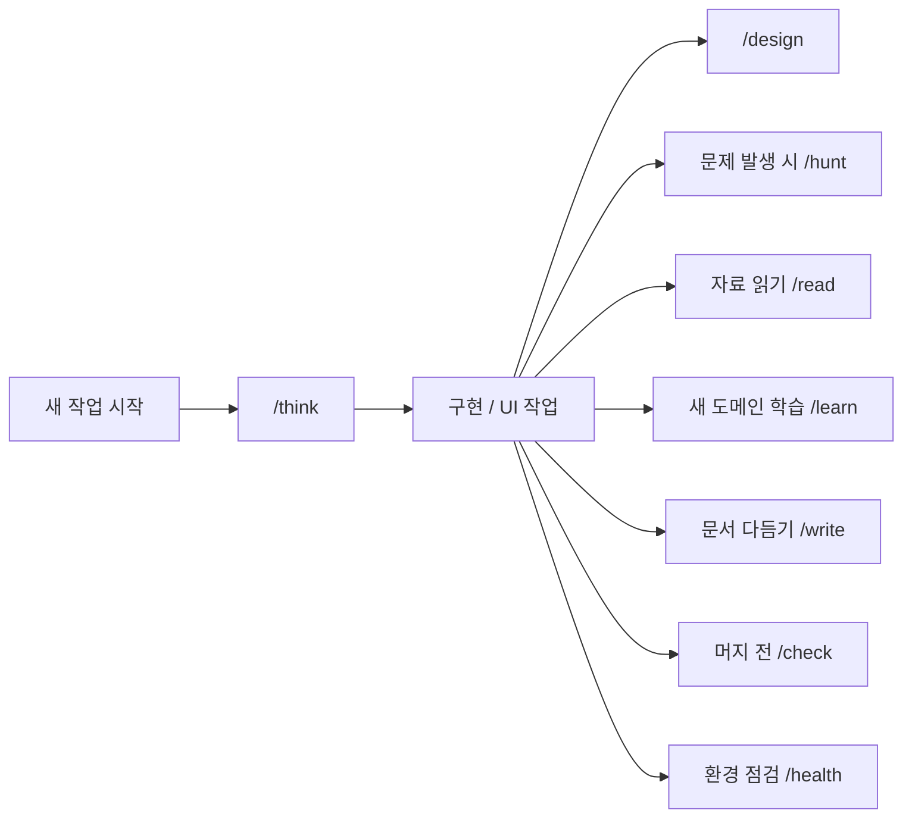
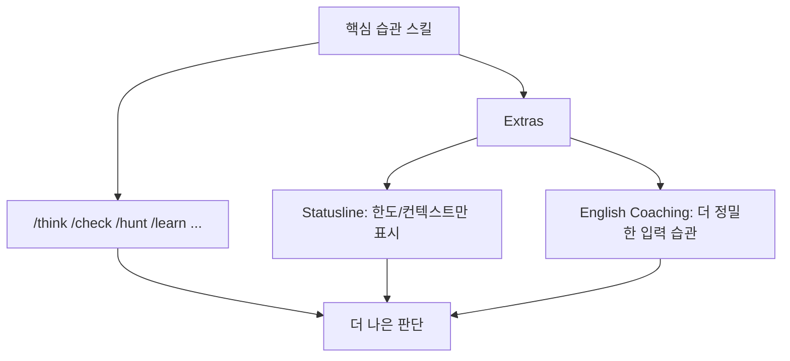

좋은 엔지니어는 코드를 빨리 쓰는 사람만은 아닙니다. 만들기 전에 먼저 생각하고, 이상한 동작이 나오면 체계적으로 디버깅하고, 머지 전에 스스로 점검하며, 낯선 분야를 공부할 때도 출력 중심으로 학습합니다. `Waza` 는 이런 습관을 “좋은 태도” 수준에서 말로만 남기지 않고, Claude나 Codex가 실제로 실행할 수 있는 스킬로 묶으려는 저장소입니다. [GitHub 저장소](https://github.com/tw93/Waza) [README 원문](https://raw.githubusercontent.com/tw93/Waza/main/README.md)
<!--more-->

README가 설명하듯, `Waza` 는 일본 무술에서 기술을 뜻하는 단어에서 이름을 가져왔습니다. 반복 훈련으로 몸에 배어 instinct가 된 동작처럼, 엔지니어링 습관도 에이전트가 반복 실행 가능한 플레이북으로 바꾸자는 발상입니다. 2026년 4월 13일 기준 GitHub API 메타데이터를 보면 이 저장소는 별 2,841개·포크 157개를 기록하고 있으며, 설명도 아주 직접적입니다. “Engineering habits you already know, turned into skills Claude can run.” [GitHub API](https://api.github.com/repos/tw93/Waza)

## Sources

- https://github.com/tw93/Waza
- https://raw.githubusercontent.com/tw93/Waza/main/README.md
- https://api.github.com/repos/tw93/Waza
- https://x.com/HiTw93/status/2041312649510822103

## 1. Waza의 핵심은 새 기능보다 ‘이미 알고 있는 좋은 습관의 자동 호출’에 있다

README의 Why 섹션은 문제를 꽤 정확히 짚습니다. AI는 사람을 더 빠르게 만들 수는 있지만, 더 신중하게 출하하게 만들거나 더 깊이 이해하게 만들지는 않는다는 것입니다. 요구사항을 다시 묻고, 설계를 압박 검증하고, 주관적 취향이 아닌 증거 기반으로 체크하고, 1차 자료를 읽는 습관은 여전히 따로 훈련돼야 합니다. [README 원문](https://raw.githubusercontent.com/tw93/Waza/main/README.md)

Waza는 이 간극을 메우려 합니다. 즉 “AI가 더 잘하게 해 주는 기능”보다 “좋은 엔지니어가 이미 하던 행동을 잊지 않게 해 주는 호출 지점”에 더 가깝습니다. 이 관점이 중요합니다. 많은 스킬 저장소가 도구 수를 늘리는 데 집중한다면, Waza는 **행동 순서를 고정하는 플레이북** 쪽에 더 무게를 둡니다.

## 2. 8개 스킬은 개발 생명주기의 핵심 습관에 대응한다

README에 따르면 기본 스킬은 `/think`, `/design`, `/check`, `/hunt`, `/write`, `/learn`, `/read`, `/health` 의 8개입니다. 각각은 특정 순간에 호출되도록 설계되어 있습니다. 예를 들어 새 기능 전에는 `/think`, 프런트엔드 작업에는 `/design`, 머지 전에는 `/check`, 버그가 날 때는 `/hunt`, 낯선 도메인을 파고들 때는 `/learn`, URL이나 PDF를 읽을 때는 `/read`, 현재 Claude Code 설정을 진단할 때는 `/health` 를 쓰는 식입니다. [README 원문](https://raw.githubusercontent.com/tw93/Waza/main/README.md)

여기서 중요한 것은 스킬 이름보다 트리거입니다. Waza는 “무엇을 할 수 있나”보다 “언제 불러야 하나”를 먼저 정리합니다. 그래서 툴박스보다 습관 보조 장치처럼 읽힙니다.

## 3. Waza는 ‘많을수록 좋다’보다 ‘적지만 또렷한 스킬’ 쪽을 택한다

README의 Background 섹션은 Superpowers나 gstack 같은 무거운 패키지를 직접 언급하며, 너무 많은 스킬과 설정은 오히려 학습 곡선을 키운다고 말합니다. 또 다른 중요한 지적은, 작성자가 규칙을 너무 많이 적을수록 모델의 상한선이 그 규칙에 갇힌다는 것입니다. [README 원문](https://raw.githubusercontent.com/tw93/Waza/main/README.md)

그래서 Waza는 정반대 방향을 택합니다. 각 스킬은 분명한 목표와 최소한의 제약만 두고, 나머지는 모델이 판단하게 둡니다. README 표현을 빌리면 “완전함”이 아니라 “딱 필요한 만큼 잘 된 상태”를 지향합니다. 즉 Waza의 설계 철학은 많은 지시가 아니라 **명확한 트리거 + 최소 제약 + 실제 실패에서 나온 gotcha** 에 있습니다.

## 4. 각 스킬이 폴더 단위라는 점도 눈에 띈다

README는 스킬이 단순한 Markdown 파일이 아니라 폴더라고 강조합니다. 각 스킬에는 reference docs, helper scripts, gotchas가 함께 들어가며, 이 gotcha는 실제 프로젝트 실패에서 나온 것이라고 설명합니다. 잘못된 코드 경로를 네 번 돌고 나서야 찾은 사례, 아티팩트 업로드 전에 릴리스를 올린 사례, 에러를 읽지 않고 서버를 여러 번 재시작한 사례 등이 예시로 제시됩니다. [README 원문](https://raw.githubusercontent.com/tw93/Waza/main/README.md)

이 부분이 의미 있는 이유는, 좋은 스킬이 단순히 “지시문 한 장”이 아니라는 점을 보여 주기 때문입니다. 실제로 반복되는 실패 패턴과 점검 절차가 묶여 있어야 재사용 가치가 생깁니다. 그래서 Waza는 프롬프트 팩보다 **작은 운영 매뉴얼 묶음** 에 더 가깝습니다.

## 5. 부가 기능도 결국 ‘노이즈를 줄이고 습관을 강화하는’ 방향이다

README는 스킬 외에도 두 가지 extras를 소개합니다. 하나는 Claude Code statusline이고, 다른 하나는 English Coaching입니다. statusline은 컨텍스트 사용량, 5시간 한도, 7일 한도만 보여 주는 최소 UI를 지향합니다. 불필요한 progress bar 없이 정말 중요한 것만 보여 준다는 설명이 붙어 있습니다. [README 원문](https://raw.githubusercontent.com/tw93/Waza/main/README.md)

English Coaching은 더 흥미롭습니다. 대부분의 AI 모델이 영어 데이터에 가장 많이 노출됐기 때문에, 모국어 프롬프트는 보이지 않는 번역층을 거친다는 문제의식에서 출발합니다. 그래서 영어로 쓰되, Claude가 문장 내 실수를 바로 교정하며 패턴 이름까지 붙여 준다는 방식입니다. 이것도 결국 더 많은 기능이 아니라, **더 선명한 사고와 더 나은 입력 습관** 을 만들려는 확장으로 읽힙니다.

## 6. 설치 대상이 Claude Code와 Codex 모두라는 점도 실용적이다

설치 방법은 매우 단순합니다. Claude Code는 `npx skills add tw93/Waza -a claude-code -g -y`, Codex는 `npx skills add tw93/Waza -a codex -g -y` 입니다. README는 `/health` 만 Claude Code 전용이고, 나머지 스킬은 호스트 환경의 질문·검색·fetch·agent 메커니즘에 맞춰 동작하도록 작성됐다고 설명합니다. [README 원문](https://raw.githubusercontent.com/tw93/Waza/main/README.md)

이 의미는 명확합니다. Waza는 특정 IDE 전용 비법이 아니라, **에이전트 런타임이 달라도 유지되는 엔지니어링 습관 레이어** 를 지향합니다. 플랫폼보다 플레이북이 오래 간다는 판단이 깔려 있습니다.

## 실전 적용 포인트

첫째, 팀에서 “AI를 잘 쓰는 법”을 추상적으로 말하기보다, 언제 `/think`, `/check`, `/hunt` 를 호출할지 같은 트리거 언어로 정리하면 훨씬 재현성이 높아집니다.

둘째, 좋은 스킬은 많을 필요가 없습니다. 오히려 가장 자주 반복되는 사고 습관 몇 개를 명확히 분리하는 편이 도입 장벽이 낮습니다.

셋째, Waza처럼 스킬 폴더 안에 gotcha와 helper script를 함께 넣는 구조는 꽤 좋은 패턴입니다. 프롬프트만으로는 재사용성이 금방 떨어지기 때문입니다.

## 핵심 요약

- Waza는 엔지니어링 습관을 Claude와 Codex가 실행 가능한 스킬로 바꾸는 저장소다.
- 핵심 스킬은 `/think`, `/design`, `/check`, `/hunt`, `/write`, `/learn`, `/read`, `/health` 의 8개다.
- 많은 기능보다 명확한 트리거와 최소 제약을 중시하는 설계 철학을 갖고 있다.
- 각 스킬은 Markdown 한 장이 아니라 reference, helper script, gotcha를 포함한 폴더 단위로 구성된다.
- statusline과 English Coaching도 결국 노이즈를 줄이고 더 나은 입력 습관을 만드는 방향으로 연결된다.

## 결론

Waza가 흥미로운 이유는 “AI용 새 기능”을 많이 추가하지 않기 때문입니다. 오히려 이미 좋은 엔지니어가 하던 행동을 더 잊지 않게 만들고, 적절한 순간에 다시 호출되게 만드는 데 집중합니다.

결국 생산성을 끌어올리는 것은 모델 자체만이 아니라, 어떤 순간에 어떤 플레이북을 꺼내 쓰게 만들 것인가입니다. 그런 의미에서 Waza는 스킬 모음집이라기보다, **엔지니어링 습관을 실행 가능한 의식으로 바꾸는 저장소** 에 더 가깝습니다.
