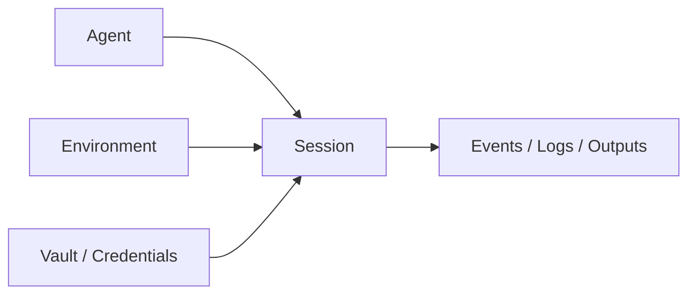
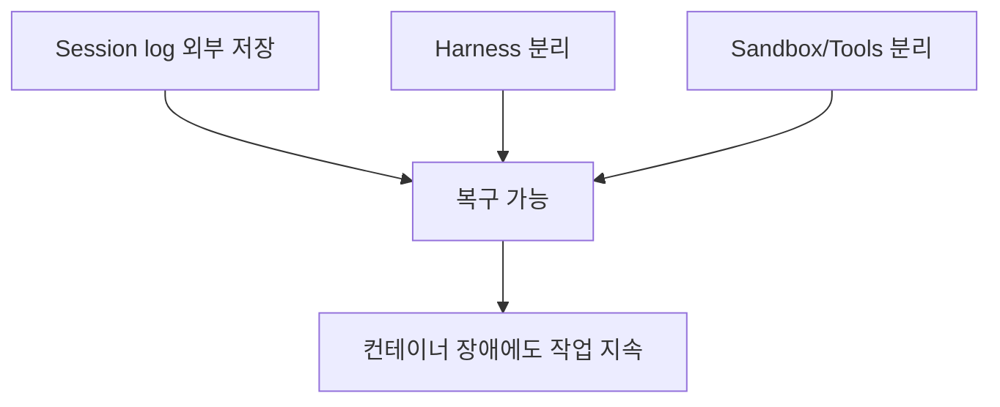

Claude Managed Agents를 겉으로만 보면 “Anthropic이 콘솔에서 에이전트를 쉽게 돌리게 해 주는 기능”처럼 보입니다. 하지만 이 영상이 강조하는 핵심은 조금 다릅니다. Managed Agents는 단순 UI 기능이 아니라, Anthropic이 생각하는 **가장 효율적인 agent harnessing 방식이 인프라 레벨에서 구현된 제품** 이라는 것입니다. [YouTube 영상](https://youtu.be/IAEV_fUAdWk) [0:49](https://youtu.be/IAEV_fUAdWk?t=49)
<!--more-->

공식 문서와 엔지니어링 블로그를 같이 보면 이 해석은 꽤 정확합니다. Anthropic은 Managed Agents를 “managed infrastructure 위에서 동작하는 pre-built, configurable agent harness” 로 설명하고, 더 나아가 engineering post에서는 이를 “meta-harness” 라고 부릅니다. 즉 특정 워크플로를 강제하는 제품이 아니라, 앞으로 바뀔 다양한 harness를 담을 수 있도록 만든 추상화 레이어라는 뜻입니다. [Managed Agents overview](https://platform.claude.com/docs/en/managed-agents/overview) [Engineering blog](https://www.anthropic.com/engineering/managed-agents)

## Sources

- https://youtu.be/IAEV_fUAdWk?si=jCyjPJmbEWfgPTL3
- https://youtu.be/IAEV_fUAdWk?t=49
- https://youtu.be/IAEV_fUAdWk?t=203
- https://youtu.be/IAEV_fUAdWk?t=541
- https://youtu.be/IAEV_fUAdWk?t=927
- https://platform.claude.com/docs/en/managed-agents/overview
- https://www.anthropic.com/engineering/managed-agents
- https://platform.claude.com/docs/en/about-claude/pricing

## 1. Managed Agents는 ‘에이전트 하나’가 아니라 네 가지 추상화의 조합으로 이해해야 한다

영상 초반 실습에서 소개되는 콘솔 구조는 네 가지입니다. agent, session, environment, vault 입니다. 영상에서는 각각을 이렇게 설명합니다. agent는 실제 기능 정의, session은 실행 기록과 로그, environment는 실행 환경과 권한, vault는 credential 관리입니다. [0:50](https://youtu.be/IAEV_fUAdWk?t=50) [1:53](https://youtu.be/IAEV_fUAdWk?t=113)

Anthropic 공식 overview 문서도 거의 같은 구성을 보여 줍니다. 문서 기준 핵심 개념은 agent, environment, session, events 입니다. agent는 모델·system prompt·tools·MCP servers·skills, environment는 패키지와 네트워크가 설정된 컨테이너 템플릿, session은 특정 작업을 수행하는 실행 인스턴스, events는 앱과 agent 사이에서 오가는 메시지와 상태 업데이트입니다. [Managed Agents overview](https://platform.claude.com/docs/en/managed-agents/overview)

즉 Managed Agents를 이해하는 첫 번째 포인트는 “에이전트를 만든다”가 아니라, **정의(agent) / 환경(environment) / 실행(session) / 기록(events or logs) / 비밀(vault)** 을 분리해서 본다는 점입니다.

## 2. 실습 예제가 support agent인 이유는 이 분리가 가장 잘 드러나기 때문이다

영상은 support agent 예제로 설명합니다. Notion과 Slack을 연결한 뒤, 예를 들어 Airbnb 숙소 안내 정보를 Notion 페이지에 넣어 두고, 사용자가 와이파이 비밀번호를 물으면 해당 정보를 검색해 답하는 형태입니다. [3:23](https://youtu.be/IAEV_fUAdWk?t=203) [7:21](https://youtu.be/IAEV_fUAdWk?t=441)

여기서 중요한 건 “RAG 비슷한 답변이 된다”가 아닙니다. agent는 support 역할을 정의하고, environment는 실행 권한을 정의하고, vault는 Notion/Slack 인증을 저장하고, session은 실제 문의 흐름을 기록합니다. 같은 자격증명을 여러 session이나 agent 조합에 재사용할 수 있다는 점도 영상에서 강조됩니다. 발표자가 “개발자라면 인터페이스 레이어로 나눈 것이라는 감이 올 것”이라고 말하는 이유가 바로 여기에 있습니다. [6:09](https://youtu.be/IAEV_fUAdWk?t=369)

## 3. Anthropic이 이 구조를 택한 이유는 long-running agent의 인프라 문제가 너무 뻔했기 때문이다

영상 후반은 Anthropic engineering post를 길게 해설합니다. 핵심 메시지는 명확합니다. 처음에는 session, harness, sandbox를 하나의 컨테이너에 넣는 방식으로 시작했지만, 이 구조는 결국 “pet” 컨테이너 문제를 낳았습니다. 컨테이너가 죽으면 session이 날아가고, 응답하지 않으면 엔지니어가 직접 살려야 하며, 어디서 실패했는지 디버깅도 어려워집니다. [9:01](https://youtu.be/IAEV_fUAdWk?t=541) [Engineering blog](https://www.anthropic.com/engineering/managed-agents)

Anthropic 공식 글은 이 문제를 “brain”과 “hands”의 분리로 설명합니다. brain은 Claude와 harness, hands는 sandbox와 tools, 그리고 이 둘과 별도로 session log를 둡니다. 이렇게 하면 컨테이너가 죽어도 session 기록은 남고, harness가 죽어도 다시 `wake(sessionId)` 류의 방식으로 복구할 수 있으며, 손상된 부분만 교체할 수 있습니다. [Engineering blog](https://www.anthropic.com/engineering/managed-agents)

## 4. 결국 핵심은 ‘무엇이 실패해도 전체가 함께 죽지 않게 하자’는 설계다

영상은 이 부분을 아주 개발자 친화적으로 풉니다. 만약 environment가 실패해도 session 로그는 남아 있고, agent 정의도 남아 있고, vault에 저장한 credentials도 남아 있으니, 새 environment를 다시 띄워 마지막 session 상태에서 이어서 작업할 수 있다는 것입니다. [12:58](https://youtu.be/IAEV_fUAdWk?t=778)

Anthropic 공식 글도 같은 논리를 말합니다. session은 Claude의 context window 자체가 아니라, 외부에 durably 저장된 event log 입니다. harness는 그 로그를 읽고 필요한 부분만 context로 가져오면 되고, sandbox는 그냥 `execute(name, input) -> string` 인터페이스를 가진 도구처럼 취급됩니다. 이 추상화 덕분에 구체 구현은 바뀌어도 인터페이스는 유지됩니다. [Engineering blog](https://www.anthropic.com/engineering/managed-agents)

## 5. Anthropic은 이 구조를 ‘메타 하네스’라고 부른다

공식 engineering post의 결론부가 중요한데, Anthropic은 Managed Agents를 특정 harness의 구현이 아니라 “future harnesses를 수용하는 시스템”으로 설명합니다. 즉 Claude Code 같은 훌륭한 harness도 있고, 좁은 도메인에 특화된 harness도 있을 수 있지만, Managed Agents는 그 위에 더 일반화된 인터페이스를 제공하는 시스템이라는 주장입니다. [Engineering blog](https://www.anthropic.com/engineering/managed-agents)

영상에서도 같은 지점을 강조합니다. 앞으로 어떤 하네싱 방식이 유행하더라도, agent/session/environment/vault 같은 추상화 안으로 수용될 수 있게 만들려는 것이고, 그래서 “meta-harness” 라고 부를 수 있다는 설명입니다. [14:27](https://youtu.be/IAEV_fUAdWk?t=867)

이 해석이 중요한 이유는, Managed Agents를 “Claude API의 상위 서비스” 정도로만 보면 그 진짜 포지션이 안 보이기 때문입니다. 이것은 단순 agent builder가 아니라, **Anthropic이 agent 운영 계층 자체를 제품화하기 시작했다는 신호** 에 가깝습니다.

## 6. 비용 모델도 전형적인 서버리스 감각에 가깝다

영상 마지막은 pricing을 짚습니다. 하나는 기존 Claude 모델 토큰 비용이고, 다른 하나는 session runtime 비용입니다. 공식 pricing 문서에 따르면 Claude Managed Agents는 tokens + session runtime 두 축으로 청구되며, session runtime은 `running` 상태 동안만 시간당 0.08달러입니다. idle, rescheduling, terminated 상태는 과금되지 않습니다. [15:27](https://youtu.be/IAEV_fUAdWk?t=927) [Pricing docs](https://platform.claude.com/docs/en/about-claude/pricing)

이 부분은 운영 관점에서 꽤 중요합니다. Anthropic은 environment 자체를 오래 띄워 두는 비용이 아니라, session이 실제로 돌고 있을 때의 runtime에 과금하는 식으로 제품을 설계했습니다. 발표자가 이를 서버리스 감각과 비슷하다고 설명하는 이유도 여기 있습니다. 즉 사용자는 컨테이너를 직접 돌보는 대신, **실행 중인 agent 세션의 시간과 토큰** 에 비용을 지불하는 구조입니다. [Pricing docs](https://platform.claude.com/docs/en/about-claude/pricing)

## 실전 적용 포인트

첫째, Managed Agents는 로컬에서 Claude Code를 잘 쓰는 사람을 위한 대체재라기보다, API 기반 서비스에서 long-running agent를 운영해야 하는 팀에게 더 맞습니다.

둘째, 이 제품의 진짜 가치는 agent 성능보다 세션 지속성, 복구 가능성, 권한 분리, credential 안전성 같은 인프라 문제를 플랫폼이 대신 가져간다는 데 있습니다.

셋째, `agent / environment / session / vault` 를 분리해서 생각하는 습관은 Managed Agents를 쓰지 않더라도 자체 agent 시스템 설계에 그대로 도움이 됩니다.

## 핵심 요약

- Managed Agents는 Anthropic이 생각하는 효율적인 agent harnessing을 인프라 제품으로 만든 것이다.
- 핵심 개념은 agent, environment, session, events(그리고 콘솔 관점의 vault) 분리다.
- 이 분리는 컨테이너 장애, 세션 복구, credential 격리, long-running task 안정성을 위해 필요하다.
- Anthropic 공식 engineering post는 이를 “brain과 hands의 분리”, 나아가 “meta-harness” 라고 설명한다.
- 공식 pricing은 토큰 비용 + `running` 상태 기준 시간당 0.08달러의 session runtime 비용으로 구성된다.

## 결론

Managed Agents가 흥미로운 이유는 새로운 agent 기능을 더 붙였기 때문이 아닙니다. 오히려 agent를 계속 돌릴 때 반드시 부딪히는 인프라 문제를 Anthropic이 먼저 추상화하고, 그 추상화를 그대로 서비스 경계로 만든 점이 더 중요합니다.

그래서 이 제품은 “Claude가 대신 일한다”보다 “Claude를 일하게 만드는 운영 계층을 Anthropic이 맡는다”는 선언에 가깝습니다. 그런 의미에서 Managed Agents는 기능 출시라기보다, **하네스를 제품으로 판다** 는 전략의 시작점으로 보는 편이 맞습니다.
