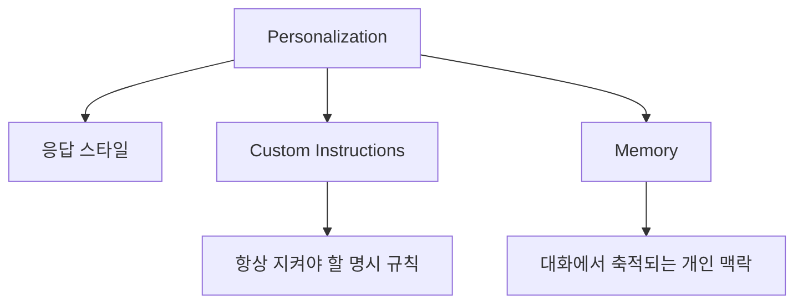
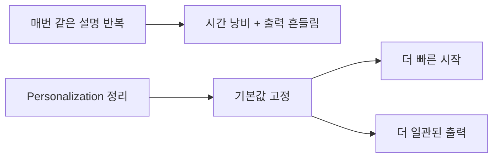

ChatGPT를 더 잘 쓰는 방법을 물으면 많은 사람이 프롬프트 기술부터 떠올립니다. 하지만 이 영상은 그보다 앞단에 있는 `Personalization` 설정을 먼저 손보라고 말합니다. 응답 톤, Custom Instructions, Memory, Record mode 같은 설정을 정리해 두면, 매번 같은 설명을 반복하지 않아도 되고 결과물도 훨씬 덜 흔들린다는 관점입니다. [YouTube 영상](https://youtu.be/eHZQzzILHH0)
<!--more-->

이 방향은 대체로 맞습니다. 다만 영상은 개념을 아주 쉽게 설명하는 대신, 최신 제품 경계까지는 자세히 구분하지 않습니다. 그래서 이번 글에서는 영상 흐름을 따라가되, OpenAI 공식 도움말 기준으로 `Custom Instructions` 와 `Memory` 의 차이, `Record mode` 의 실제 범위, 그리고 어떤 정보까지 넣는 게 적절한지까지 함께 정리해 보겠습니다. [Custom Instructions FAQ](https://help.openai.com/en/articles/8096356-chatgpt-custom-instructions-faq) [What is Memory?](https://help.openai.com/en/articles/8983136-what-is-memory) [ChatGPT Record](https://help.openai.com/en/articles/11487532-chatgpt-record/)

## Sources

- https://youtu.be/eHZQzzILHH0?si=7m4HO7gB5ebJ0VsF
- https://help.openai.com/en/articles/8096356-chatgpt-custom-instructions-faq
- https://help.openai.com/en/articles/8983136-what-is-memory
- https://help.openai.com/en/articles/8983151-is-memory-different-from-custom-instructions
- https://help.openai.com/en/articles/11487532-chatgpt-record/

## 1. Personalization의 첫 층은 응답 스타일이다

영상 초반은 Personalization 탭에서 먼저 응답 스타일을 조정하는 방법을 보여 줍니다. 더 친근하게 할지, 더 전문적이고 사실 중심으로 할지, 이모지를 얼마나 쓸지, 리스트 위주로 할지 문단 위주로 할지 등을 고를 수 있다는 설명입니다. [0:34](https://youtu.be/eHZQzzILHH0?t=34)

이 설정은 생각보다 중요합니다. 많은 사람이 ChatGPT 출력이 들쭉날쭉하다고 느끼는 이유는, 모델이 못해서가 아니라 매번 기대하는 출력 형태를 새로 추측해야 하기 때문입니다. 응답 스타일은 그 추측 비용을 줄여 주는 기본값입니다. 즉 프롬프트를 잘 쓰기 전에 먼저 **내가 선호하는 출력 포맷을 기본값으로 만드는 단계** 라고 보면 됩니다.

## 2. Custom Instructions는 “명시적으로 항상 지켜야 할 것”을 적는 곳이다

영상은 Custom Instructions에 자신이 원하는 지시를 명시적으로 넣으라고 권합니다. 발표자는 예시로 “assume positive intent” 나 “ask questions for clarification” 같은 규칙을 넣어 두었다고 말합니다. 별명, 직업, 간단한 소개, 작업 방식도 여기에 넣을 수 있다고 설명합니다. [1:49](https://youtu.be/eHZQzzILHH0?t=109)

OpenAI 공식 도움말도 이 구분을 지지합니다. Custom Instructions는 ChatGPT에게 “무엇을 알고 있어야 하는지”와 “어떻게 응답해야 하는지”를 직접 알려 주는 기능입니다. 즉 명시적이고 안정적으로 유지되어야 하는 지시, 예를 들어 내 역할, 선호하는 응답 형식, 피하고 싶은 표현 방식 같은 것은 여기에 두는 편이 맞습니다. [Custom Instructions FAQ](https://help.openai.com/en/articles/8096356-chatgpt-custom-instructions-faq)

## 3. Memory는 Custom Instructions와 다르고, 더 ‘축적형’이다

영상은 ChatGPT가 기억을 따로 저장하고 관리할 수 있다고 설명하면서, 필요하면 메모리를 삭제하거나 관리할 수 있다고 안내합니다. [3:03](https://youtu.be/eHZQzzILHH0?t=183)

OpenAI 공식 도움말은 이 차이를 더 분명히 설명합니다. Custom Instructions는 사용자가 직접 넣는 명시적 지시이고, Memory는 대화 중 공유된 정보 중 일부를 ChatGPT가 기억해 다음 대화에 활용하는 기능입니다. 또 Memory는 saved memories와 chat history reference라는 두 방식으로 작동합니다. [What is Memory?](https://help.openai.com/en/articles/8983136-what-is-memory) [Is memory different from Custom Instructions?](https://help.openai.com/en/articles/8983151-is-memory-different-from-custom-instructions)

즉 간단히 정리하면 이렇습니다.
- `Custom Instructions` = 내가 미리 적어 두는 운영 규칙
- `Memory` = 대화 중 나온 정보 중 앞으로 도움이 될 것을 기억하는 층

이 차이를 모르면 설정이 뒤엉킵니다. 예를 들어 “내가 한국어를 선호한다”, “답변은 짧고 실무적으로 해 달라” 같은 것은 Custom Instructions 쪽이 더 적합합니다. 반면 “나는 이번 달에 전환율 개선 프로젝트를 하고 있다”, “자주 쓰는 도구는 Notion과 Slack이다” 같은 반복 맥락은 Memory가 더 자연스럽습니다.

## 4. “More about you”는 길게 쓰는 자기소개보다 작업에 도움이 되는 정보가 중요하다

영상은 자기소개나 바이오가 없다면 음성으로 brain dump를 해서라도 넣으라고 제안합니다. [2:31](https://youtu.be/eHZQzzILHH0?t=151)

이 조언의 방향은 좋지만, 실전에서는 조금 더 좁혀 쓰는 편이 낫습니다. 너무 긴 자기서사는 모델이 계속 참고해야 하는 잡음이 될 수 있기 때문입니다. 실제로는 “직업/역할”, “자주 하는 작업”, “주요 독자나 고객”, “선호하는 산출물 형식”, “피하고 싶은 톤” 정도가 더 유용합니다.

즉 `More about you` 는 인생 소개문보다 **작업 프로필 카드** 에 가깝게 쓰는 편이 효과적입니다. 그래야 이후 응답에서 불필요한 맥락 비용을 줄이면서도 원하는 결과를 더 쉽게 유도할 수 있습니다.

## 5. Record mode는 편리하지만, 범위와 한계를 정확히 알아야 한다

영상은 Record mode가 회의나 음성 메모를 녹음하고, 이를 요약이나 전사로 활용할 수 있다고 설명합니다. [3:58](https://youtu.be/eHZQzzILHH0?t=238)

이 설명은 방향상 맞지만, 공식 도움말 기준으로는 몇 가지 경계가 있습니다. `ChatGPT Record` 는 음성을 전사하고 요약해 canvas 형태로 저장하며, 이후 계획안이나 이메일, 코드 같은 결과물로 이어질 수 있습니다. 하지만 OpenAI 도움말은 이를 **macOS 데스크톱 앱 전용 기능** 으로 설명하고, 사용 가능 플랜도 특정 유료 계층 중심으로 안내합니다. 또 다른 사람을 녹음할 때는 반드시 관련 법과 동의를 확인하라고 명시합니다. [ChatGPT Record](https://help.openai.com/en/articles/11487532-chatgpt-record/)

따라서 Record mode는 “언제 어디서나 되는 기본 기능”으로 이해하기보다, **일부 환경과 플랜에서 쓸 수 있는 회의/메모 전사 도구** 로 보는 편이 정확합니다.

## 6. 결국 핵심은 ‘매번 설명하지 않게 만드는 것’이다

영상의 마지막 요약도 여기에 가깝습니다. 결국 꼭 채워야 할 것은 `More about you` 와 `Custom Instructions` 라는 이야기입니다. [5:02](https://youtu.be/eHZQzzILHH0?t=302)

이 조언은 지금도 유효합니다. ChatGPT를 잘 쓰는 사람들의 공통점은 한 번의 멋진 프롬프트보다, 자신이 반복해서 원하는 맥락을 제품 설정에 미리 녹여 둔다는 점입니다. 개인화는 마법 버튼이 아니라, 반복 지시를 제품 설정으로 옮겨 놓는 작업입니다. 잘 세팅하면 매 세션의 시작 비용이 줄고, 모델이 내 일을 더 빨리 이해하게 됩니다.

## 실전 적용 포인트

첫째, Personalization을 채울 때는 자기소개를 길게 쓰기보다 작업 프로필처럼 써 보세요. 역할, 주요 작업, 선호 형식, 피하고 싶은 표현만 있어도 충분히 효과가 납니다.

둘째, 항상 지켜야 할 규칙은 Custom Instructions에, 대화 속에서 자연스럽게 축적되면 좋은 정보는 Memory에 두는 식으로 역할을 나누는 게 좋습니다.

셋째, Record mode는 유용하지만 사용 환경과 법적 동의 문제를 먼저 확인해야 합니다. 특히 회의 녹음은 더 그렇습니다.

## 핵심 요약

- Personalization은 응답 스타일, Custom Instructions, Memory, Record mode를 함께 다루는 설정 층이다.
- Custom Instructions는 명시적 운영 규칙을 넣는 곳이고, Memory는 대화에서 축적된 정보를 활용하는 층이다.
- `More about you` 는 긴 자기소개보다 작업 프로필 카드처럼 쓰는 편이 더 실용적이다.
- Record mode는 전사와 요약에 유용하지만, 공식 도움말 기준으로는 범위와 사용 환경에 제한이 있다.
- 개인화의 목적은 ChatGPT를 더 똑똑하게 만드는 것이 아니라, 매번 같은 설명을 반복하지 않게 만드는 데 있다.

## 결론

ChatGPT를 잘 쓰는 방법은 결국 두 층으로 나뉩니다. 하나는 프롬프트를 잘 쓰는 것이고, 다른 하나는 애초에 프롬프트를 덜 쓰게 만드는 것입니다. Personalization은 바로 후자에 가깝습니다.

그래서 이 설정은 사소한 취향 옵션이 아닙니다. Custom Instructions와 Memory를 제대로 구분하고, 필요한 정보만 넣어 두는 순간 ChatGPT는 단순 채팅창이 아니라 **점점 내 작업 방식을 학습하는 작업 환경** 에 가까워집니다.
