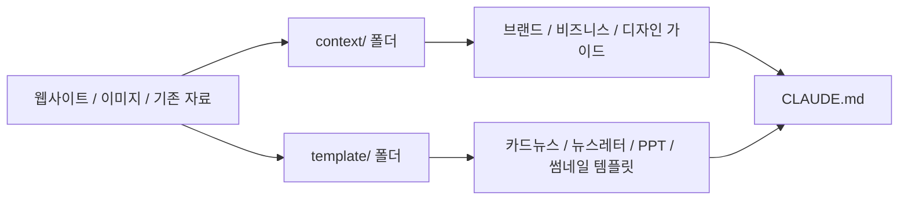
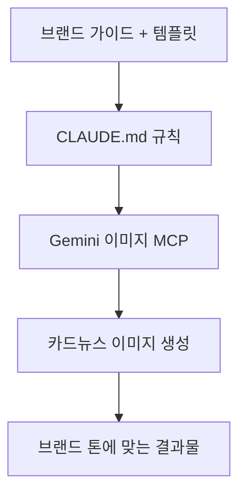
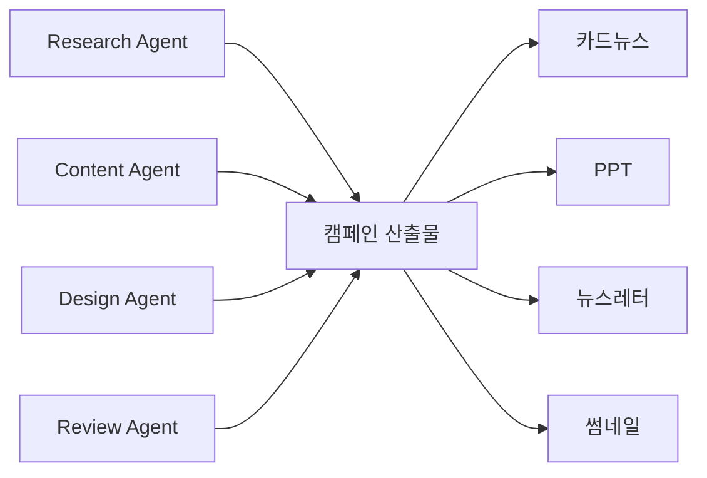

이 영상의 메시지는 꽤 명확합니다. Claude Code에서 고품질 마케팅 자동화를 만들고 싶다면, 실행보다 세팅이 훨씬 더 중요하다는 것입니다. 발표자는 아예 “퀄리티를 위해서는 한네스 세팅에 95%의 시간을 써야 한다”고 말합니다. 즉 뉴스레터, 카드뉴스, 유튜브 썸네일, PPT 같은 산출물을 자동으로 뽑아내는 핵심은 모델 한 번 잘 부르는 데 있지 않고, **컨텍스트·템플릿·스킬·서브에이전트·MCP를 먼저 설계해 두는 것** 에 있다는 이야기입니다. [YouTube 영상](https://youtu.be/6MJ-pmckowQ) [1:08](https://youtu.be/6MJ-pmckowQ?t=68)
<!--more-->

영상은 단순히 “Claude가 PPT도 만들고 카드뉴스도 만든다” 수준에서 끝나지 않습니다. 실제로는 프로젝트 폴더를 만들고, `context/` 와 `template/` 폴더를 채우고, `CLAUDE.md` 를 프로젝트 SOP처럼 세팅하고, 공식 document skill을 설치하고, Gemini 이미지 MCP를 연결하고, 그 위에 research/content/design/review 역할의 서브에이전트 팀을 얹는 방식입니다. 마지막에는 Buffer API로 소셜 예약 포스팅 방향까지 연결합니다. [3:01](https://youtu.be/6MJ-pmckowQ?t=181) [10:40](https://youtu.be/6MJ-pmckowQ?t=640) [21:39](https://youtu.be/6MJ-pmckowQ?t=1299) [32:59](https://youtu.be/6MJ-pmckowQ?t=1979)

## Sources

- https://youtu.be/6MJ-pmckowQ?si=6ns8h50xWAZAUm29
- https://youtu.be/6MJ-pmckowQ?t=68
- https://youtu.be/6MJ-pmckowQ?t=181
- https://youtu.be/6MJ-pmckowQ?t=640
- https://youtu.be/6MJ-pmckowQ?t=795
- https://youtu.be/6MJ-pmckowQ?t=1008
- https://youtu.be/6MJ-pmckowQ?t=1317
- https://youtu.be/6MJ-pmckowQ?t=1755
- https://youtu.be/6MJ-pmckowQ?t=1979

## 1. 시작점은 새 프로젝트가 아니라 `context/` 와 `template/` 폴더다

영상 초반에 발표자는 새 폴더를 만든 뒤 가장 먼저 `context` 와 `template` 폴더를 만들라고 합니다. `context` 에는 브랜드 가이드라인, 디자인 스타일 가이드, 비즈니스 맥락 같은 문서를 Markdown으로 넣고, `template` 에는 카드뉴스, 뉴스레터, PPT, 썸네일 등의 참고 이미지나 구조 템플릿을 모아 둡니다. [3:01](https://youtu.be/6MJ-pmckowQ?t=181) [6:46](https://youtu.be/6MJ-pmckowQ?t=406)

핵심은 AI가 가장 잘 읽는 형식이 결국 Markdown 문서라는 점입니다. 웹사이트 스크린샷을 넣어 브랜드 가이드라인과 비즈니스 컨텍스트를 역으로 생성하게 하고, 이미지 레퍼런스를 다시 Markdown 템플릿으로 환원해 이후 토큰 비용을 줄이는 흐름이 반복됩니다. 즉 여기서의 목표는 자료를 많이 쌓는 것이 아니라, **에이전트가 계속 재사용할 수 있는 설명 가능한 입력** 으로 바꾸는 것입니다. [4:57](https://youtu.be/6MJ-pmckowQ?t=297) [9:54](https://youtu.be/6MJ-pmckowQ?t=594)

## 2. `CLAUDE.md` 는 프로젝트의 시스템 문서이자 SOP 역할을 한다

컨텍스트와 템플릿을 준비한 뒤 발표자가 바로 시키는 일은 `CLAUDE.md` 생성입니다. 영상에서는 이것을 “전체 프로젝트의 시스템 문서”에 가깝게 설명합니다. 여기에는 폴더 구조, 각 에이전트가 어떻게 일해야 하는지, 어떤 스킬을 써야 하는지, 프로젝트 맥락이 무엇인지 등을 정리합니다. [10:40](https://youtu.be/6MJ-pmckowQ?t=640)

이 문서가 필요한 이유도 명확하게 말합니다. AI가 매번 폴더를 다 읽고 구조를 해석하고 규칙을 추측하게 두면 시간이 오래 걸리고 결과도 일관되지 않기 때문입니다. 영상은 이를 비즈니스의 SOP, 즉 표준 업무 규약에 비유합니다. 결국 `CLAUDE.md` 는 에이전트에게 “우리 팀은 이렇게 일한다”를 계속 상기시키는 운영 문서입니다. [11:44](https://youtu.be/6MJ-pmckowQ?t=704)

## 3. 공식 document skill을 먼저 설치해 문서 산출물의 형식을 고정한다

영상 중반에서는 Anthropic이 제공하는 공식 skills를 먼저 설치하는 흐름이 나옵니다. 발표자는 특히 document 계열 스킬을 설치해 PPT, PDF, DOCX 같은 산출물을 Claude가 제멋대로 만들지 않게 하고, 더 일관된 형식으로 빠르게 생성할 수 있게 해야 한다고 설명합니다. [13:15](https://youtu.be/6MJ-pmckowQ?t=795)

이 부분의 핵심은 “좋은 결과를 원하면 먼저 출구 형식을 고정하라”입니다. 즉 프롬프트를 늘리는 대신, 출력 포맷과 제작 경로를 먼저 스킬화하는 것입니다. 영상에서 PPTX 스킬을 이용해 회사 소개서를 테스트 생성하는 장면도 같은 맥락입니다. 브랜드 가이드라인과 템플릿이 반영되도록 한 번 더 명시하고, 잘 안 되면 `CLAUDE.md` 에 보완까지 시키는 식으로 feedback loop를 구성합니다. [15:02](https://youtu.be/6MJ-pmckowQ?t=902)

## 4. 카드뉴스 품질은 Claude 자체보다 이미지 MCP가 좌우한다

카드뉴스 예시로 넘어가면 발표자는 현재 기준으로 Gemini 이미지 API가 필요하다고 단언합니다. 그래서 `nana banana` 계열 Gemini MCP를 연결해 카드뉴스를 만들도록 합니다. 설치 흐름은 GitHub 설치 가이드를 Claude Code에 그대로 붙여 넣고, Google AI Studio에서 API 키를 발급받아 연결하는 방식입니다. [16:48](https://youtu.be/6MJ-pmckowQ?t=1008) [18:01](https://youtu.be/6MJ-pmckowQ?t=1081)

설치 후 `/mcp` 목록에서 서버가 보이는지 확인하고, 이후 “우리 가이드라인에 맞는 회사 소개 카드뉴스 다섯 장을 생성해 달라”라고 지시합니다. 여기서 중요한 포인트는 카드뉴스 이미지 생성 자체보다도, 이미 `CLAUDE.md` 에 카드뉴스 폴더와 규칙을 적어 두었기 때문에 Claude가 먼저 브랜드 가이드와 템플릿을 확인한 뒤 작업한다는 점입니다. [19:17](https://youtu.be/6MJ-pmckowQ?t=1157) [19:53](https://youtu.be/6MJ-pmckowQ?t=1193)

## 5. 그다음 단계는 개별 도구가 아니라 ‘마케팅 서브에이전트 팀’이다

영상 후반부의 핵심은 여기서부터입니다. 발표자는 Claude Code에게 공식 가이드라인을 따라 이 프로젝트에 맞는 마케팅 에이전트 팀 계획도를 제시해 달라고 요청합니다. Claude는 research, content creation, design, review의 4단계 파이프라인을 제안합니다. [21:57](https://youtu.be/6MJ-pmckowQ?t=1317) [22:24](https://youtu.be/6MJ-pmckowQ?t=1344)

이후 중요한 작업은 그 구조를 바탕으로 실제 에이전트를 만들고, `CLAUDE.md` 에 routing rule을 추가하는 것입니다. 발표자는 routing rule이 있어야 Claude Code가 특정 작업마다 어떤 에이전트를 써야 하는지 참조할 수 있다고 설명합니다. 이는 결국 조직 운영에서 역할 분담표를 만드는 것과 비슷합니다. [23:07](https://youtu.be/6MJ-pmckowQ?t=1387)

또 하나 중요한 점은 “공식 서브에이전트 제작 가이드를 따르라”고 명시해야 한다는 것입니다. 그렇지 않으면 Claude가 임의 구조를 만들 가능성이 크다는 설명이 붙습니다. 즉 에이전트 팀 설계조차도 자유 생성이 아니라 **공식 스펙 위에 얹는 작업** 이어야 한다는 것입니다. [24:05](https://youtu.be/6MJ-pmckowQ?t=1445)

## 6. 에이전트는 개별 테스트 후 병렬 팀 플레이로 돌리는 것이 핵심이다

생성된 에이전트는 바로 대규모 작업에 넣지 않고 먼저 개별적으로 테스트합니다. 영상에서는 research agent에 “AI 자동화 트렌드” 리서치를 시키고, design agent에는 카드뉴스 샘플을 생성하게 해 결과를 확인합니다. 이때 품질을 좌우하는 것은 단순한 모델 성능보다, 회사 맥락에 맞는 범위와 역할을 좁혀 준 정도라고 설명합니다. [25:57](https://youtu.be/6MJ-pmckowQ?t=1557) [27:10](https://youtu.be/6MJ-pmckowQ?t=1630)

그다음 가장 강력한 방식으로 제시되는 것이 병렬 팀 플레이입니다. 발표자는 “뉴스레터, 카드뉴스, 유튜브 썸네일, 프레젠테이션까지 모두 만들어 달라”는 식으로 캠페인 단위를 지시하고, agent 폴더의 모든 팀을 가동해 output 폴더에 저장하게 합니다. 이 전체 파이프라인은 약 10분 정도 걸린다고 설명합니다. [29:15](https://youtu.be/6MJ-pmckowQ?t=1755) [30:25](https://youtu.be/6MJ-pmckowQ?t=1825)

## 7. 최종 목적지는 생성이 아니라 예약 배포까지 이어지는 운영 자동화다

영상 마지막은 Buffer API 이야기로 이어집니다. Buffer를 이용하면 LinkedIn, Threads, X 같은 여러 채널에 동시에 예약 업로드할 수 있고, 이를 통해 사람이 매번 소셜 미디어 관리자처럼 수동 업로드하지 않아도 되는 방향을 설명합니다. [32:59](https://youtu.be/6MJ-pmckowQ?t=1979)

즉 이 영상의 진짜 목표는 “콘텐츠를 하나 잘 만든다”가 아닙니다. 브랜드 맥락을 읽고, 다양한 산출물로 변환하고, 소셜 포스팅 일정까지 이어지는 **마케팅 운영 파이프라인 전체를 Claude Code 중심으로 구성하는 것** 입니다. 생성 자동화가 끝이 아니라 배포 자동화까지 포함하는 셈입니다.

## 실전 적용 포인트

첫째, 마케팅 자동화의 품질은 모델보다 컨텍스트 문서와 템플릿 정리 상태가 더 크게 좌우할 수 있습니다.

둘째, 이미지 결과물이 중요하다면 Claude 내부 생성만 고집하기보다 외부 이미지 MCP를 붙이는 쪽이 훨씬 현실적일 수 있습니다.

셋째, 단일 프롬프트보다 `research → content → design → review` 같은 에이전트 분업 구조를 먼저 설계하는 편이 반복 운영에 유리합니다.

## 핵심 요약

- 영상은 Claude Code 마케팅 자동화의 핵심이 실행보다 세팅에 있다고 본다.
- 시작점은 `context/` 와 `template/` 폴더를 Markdown 중심으로 정리하는 것이다.
- `CLAUDE.md` 는 프로젝트 SOP이자 라우팅 기준 문서 역할을 한다.
- 공식 document skill로 산출물 형식을 고정하고, 이미지 생성은 Gemini MCP 같은 외부 도구로 보강한다.
- research/content/design/review 서브에이전트 팀을 만든 뒤 병렬로 돌려 카드뉴스, PPT, 뉴스레터, 썸네일을 함께 생성한다.
- 마지막 단계는 Buffer API 같은 도구와 연결해 소셜 예약 포스팅까지 운영 자동화하는 것이다.

## 결론

이 영상이 보여 주는 건 “Claude Code가 마케팅도 한다”는 자랑이 아닙니다. 오히려 좋은 자동화는 대부분 프롬프트 한 줄에서 나오지 않고, 문서 구조와 역할 분담과 도구 연결을 먼저 설계하는 데서 나온다는 점을 보여 줍니다.

그래서 이 사례를 한 줄로 요약하면 이렇습니다. **마케팅 에이전트 팀은 모델이 아니라 하네스를 만드는 일이다.** 컨텍스트, 템플릿, `CLAUDE.md`, 공식 스킬, 이미지 MCP, 서브에이전트, 배포 API가 연결될 때 비로소 “100% 자동화”에 가까운 흐름이 만들어집니다.
