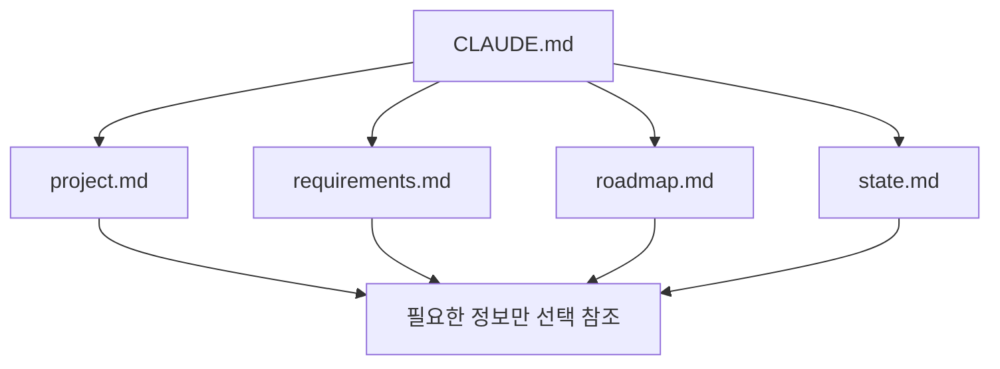
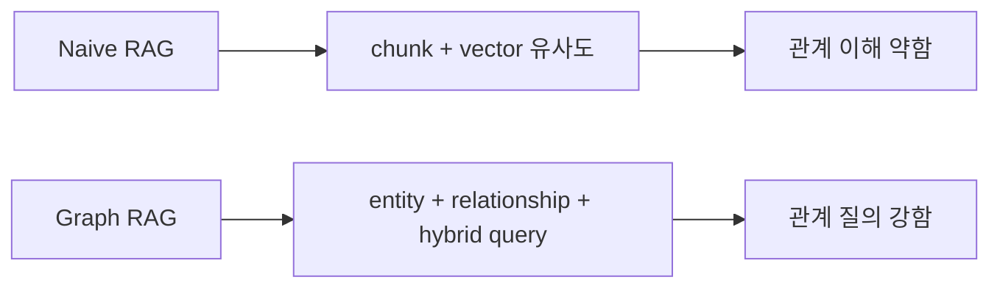

이 영상은 단순히 “RAG가 좋다”를 말하지 않습니다. 오히려 Claude Code와 memory 문제를 어디서부터 어떻게 풀어야 하는지 단계별로 분해합니다. 핵심 질문은 이것입니다. 과거 대화나 거대한 문서 묶음에 대해 AI가 더 정확하게 답하게 하려면, 우리는 언제 그냥 `CLAUDE.md` 로 버틸 수 있고, 언제 Obsidian 정도면 충분하며, 언제 진짜 RAG 시스템으로 넘어가야 할까요? [YouTube 영상](https://youtu.be/kQu5pWKS8GA)
<!--more-->

영상은 이 문제를 7단계로 나눕니다. `Level 1 = Auto Memory`, `Level 2 = CLAUDE.md`, `Level 3 = 여러 상태 파일`, `Level 4 = Obsidian 기반 지식베이스`, `Level 5 = Naive RAG`, `Level 6 = Graph RAG`, `Level 7 = Agentic / Multimodal RAG` 입니다. 흥미로운 점은 최종 결론이 “다들 7단계까지 가야 한다”가 아니라는 것입니다. 오히려 발표자는 대부분의 사람에게는 Obsidian이 거의 99% 해법일 수 있다고 말합니다. [0:52](https://youtu.be/kQu5pWKS8GA?t=52) [16:24](https://youtu.be/kQu5pWKS8GA?t=984)

## Sources

- https://youtu.be/kQu5pWKS8GA?si=tfQ_SbHUIVFcriL0
- https://youtu.be/kQu5pWKS8GA?t=171
- https://youtu.be/kQu5pWKS8GA?t=541
- https://youtu.be/kQu5pWKS8GA?t=745
- https://youtu.be/kQu5pWKS8GA?t=952
- https://youtu.be/kQu5pWKS8GA?t=1556
- https://youtu.be/kQu5pWKS8GA?t=2129
- https://youtu.be/kQu5pWKS8GA?t=2365

## 1. Level 1은 Auto Memory와 과도한 세션 유지다

첫 단계는 대부분의 사람이 머무는 곳입니다. 아무런 구조를 추가하지 않고, Claude Code가 자동으로 만들어 주는 memory 파일과 긴 세션에 의존하는 상태입니다. 영상은 `.claude/projects/.../memory` 아래에 자동 생성되는 Markdown 파일들을 예로 들며, 이것이 일종의 포스트잇 메모처럼 작동한다고 설명합니다. [2:49](https://youtu.be/kQu5pWKS8GA?t=169)

문제는 여기서 바로 context rot가 시작된다는 점입니다. 사용자는 “기억을 잃을까 봐” 세션을 끝내지 못하고, 계속 같은 창에서 대화를 이어 갑니다. 그러면 문맥은 비대해지고 효율은 떨어지고 사용량도 더 빨리 닳습니다. 영상이 말하는 첫 번째 함정은 바로 이것입니다. **기억 문제를 세션 길이로 해결하려 들면, 성능 저하와 비용 증가를 동시에 맞게 된다** 는 것입니다. [5:07](https://youtu.be/kQu5pWKS8GA?t=307) [6:02](https://youtu.be/kQu5pWKS8GA?t=362)

## 2. Level 2는 `CLAUDE.md` 로 기억을 명시적으로 주입하는 단계다

레벨 2는 많은 사람이 “드디어 해답을 찾았다”고 느끼는 단계입니다. `CLAUDE.md` 파일에 규칙, 관례, 프로젝트 설명, 기억해야 할 정보를 넣고 Claude Code가 거의 모든 프롬프트에서 이를 참조하게 만드는 것입니다. [9:03](https://youtu.be/kQu5pWKS8GA?t=543)

하지만 영상은 여기서 곧바로 경고를 붙입니다. `CLAUDE.md` 가 강력한 이유, 즉 거의 모든 프롬프트에 주입된다는 점이 동시에 독이 될 수 있다는 것입니다. 관련성이 낮은 규칙이나 기억을 과하게 넣으면 context pollution이 생기고, 오히려 모델 성능이 떨어질 수 있습니다. 발표자의 메시지는 분명합니다. `CLAUDE.md` 는 “다 넣는 파일”이 아니라, **거의 모든 프롬프트에 공통으로 필요한 고신호 규칙만 담는 파일** 이어야 합니다. [10:25](https://youtu.be/kQu5pWKS8GA?t=625)

## 3. Level 3은 `CLAUDE.md` 하나가 아니라 여러 상태 파일로 기억을 분리하는 단계다

그래서 레벨 3에서는 `CLAUDE.md` 하나에 모든 것을 몰아넣지 않습니다. 대신 `project.md`, `requirements.md`, `roadmap.md`, `state.md` 같은 여러 Markdown 파일로 기억을 분리합니다. 영상은 GSD 같은 오케스트레이션 도구가 이 패턴을 잘 보여 준다고 설명합니다. [12:25](https://youtu.be/kQu5pWKS8GA?t=745)

이 단계의 핵심 아이디어는 간단합니다. `CLAUDE.md` 는 인덱스나 라우터 역할만 하고, 구체적 정보는 적절한 파일로 흩어 놓는 것입니다. 그러면 모델은 필요한 정보가 어디 있는지 따라갈 수 있고, 모든 문서를 매번 통째로 주입하는 비효율도 줄일 수 있습니다. 이는 작은 규모에서의 “수제 chunking 시스템” 같은 역할을 합니다. [13:47](https://youtu.be/kQu5pWKS8GA?t=827)

## 4. Level 4는 Obsidian 기반 지식베이스다

레벨 4는 영상이 가장 실용적인 단계로 추천하는 구간입니다. 발표자는 Andrej Karpathy식 LLM knowledge base를 예로 들며, Obsidian을 vault 기반 지식 시스템으로 쓰는 방식을 설명합니다. 구조는 대체로 `raw/`, `wiki/`, `master index` 식입니다. 원자료는 raw에 모으고, 정리된 문서는 wiki에 넣고, master index가 전체 길잡이 역할을 합니다. [15:52](https://youtu.be/kQu5pWKS8GA?t=952) [19:08](https://youtu.be/kQu5pWKS8GA?t=1148)

이 단계가 중요한 이유는 두 가지입니다. 첫째, Claude Code 입장에서는 명확한 계층 구조 덕분에 문서를 찾기 쉬워집니다. 둘째, 사람 입장에서는 Obsidian의 링크 구조 덕분에 어떤 문서가 어떤 문서와 연결돼 있는지 눈으로 파악할 수 있습니다. 발표자는 대부분의 사람에게는 이 단계가 사실상 99% 해법일 수 있다고까지 말합니다. 무료이고, 운영 오버헤드가 거의 없고, 솔로 운영자에게는 충분하다는 것입니다. [16:24](https://youtu.be/kQu5pWKS8GA?t=984) [18:02](https://youtu.be/kQu5pWKS8GA?t=1082)

## 5. Level 5는 진짜 RAG의 기초, 즉 Naive RAG를 이해하는 단계다

레벨 5부터 비로소 “진짜 RAG” 이야기가 나옵니다. 여기서는 임베딩, 벡터 데이터베이스, 검색-증강-생성의 흐름을 이해해야 합니다. 문서를 chunk로 나누고, 각 chunk를 embedding model로 벡터화해 vector DB에 넣고, 질문이 들어오면 그 질문도 벡터로 바꿔 가장 가까운 chunk들을 찾은 뒤 답변에 섞는 구조입니다. [25:56](https://youtu.be/kQu5pWKS8GA?t=1556)

하지만 발표자는 Naive RAG를 해답으로 제시하지 않습니다. 오히려 이것은 “기초를 이해하는 단계”에 가깝다고 말합니다. 왜냐하면 단순 chunk 검색은 문맥 단절 문제, chunk 간 관계 상실 문제, 문서 구조 의존성 문제를 자주 일으키기 때문입니다. 이 단계의 함정은 결국 **조금 복잡한 검색 엔진을 만들고 RAG라고 부르는 것** 입니다. 발표자는 이런 시스템을 과장 광고로 파는 사례도 경계합니다. [31:12](https://youtu.be/kQu5pWKS8GA?t=1872) [33:30](https://youtu.be/kQu5pWKS8GA?t=2010)

## 6. Level 6은 Graph RAG, 특히 LightRAG 같은 관계 중심 시스템이다

레벨 6은 진짜 관계를 다루는 RAG입니다. 여기서는 chunk를 따로따로 뽑는 대신, entity와 relationship를 추출해 그래프 구조를 만들고, hybrid vector + graph query 형태로 정보를 찾습니다. 영상은 LightRAG를 대표 예시로 설명하며, naive RAG보다 훨씬 높은 성능을 보여 주는 비교 수치를 언급합니다. [35:29](https://youtu.be/kQu5pWKS8GA?t=2129) [36:15](https://youtu.be/kQu5pWKS8GA?t=2175)

중요한 차이는 Obsidian 링크와의 차이입니다. Obsidian의 연결은 사람이 수동으로 넣거나 Claude가 문서 생성 시 붙여 준 연결인 반면, Graph RAG의 관계는 실제 임베딩과 엔티티 추출을 기반으로 계산된 연결입니다. 즉 겉보기에 둘 다 “연결 그래프”처럼 보여도, 내부 의미론의 밀도는 훨씬 다릅니다. [36:55](https://youtu.be/kQu5pWKS8GA?t=2215)

## 7. Level 7은 Agentic / Multimodal RAG와 데이터 파이프라인 문제다

마지막 단계는 text만 다루는 RAG를 넘어서는 구간입니다. 영상은 `RAG Anything`, `Gemini Embedding`, 스캔 PDF, 이미지, 비디오까지 포함한 멀티모달 ingestion을 언급합니다. 여기서는 질문이 들어왔을 때 그래프 RAG를 볼지, 일반 SQL DB를 칠지, 다른 데이터 소스를 칠지 AI가 스스로 경로를 선택하는 agentic layer가 중요해집니다. [39:25](https://youtu.be/kQu5pWKS8GA?t=2365) [41:33](https://youtu.be/kQu5pWKS8GA?t=2493)

또 하나 중요한 것은 ingestion pipeline 입니다. 발표자는 실제 production RAG에서 대부분의 인프라가 retrieval보다도 데이터 수집, 정제, 동기화, 중복 제거, 버전 관리에 더 많이 들어간다고 강조합니다. 어떤 문서가 업데이트되었을 때 그래프를 어떻게 갱신할지, 누가 업로드 권한을 가질지, 팀 환경에서 어떻게 유지할지 같은 운영 문제가 핵심이 된다는 것입니다. [40:43](https://youtu.be/kQu5pWKS8GA?t=2443) [42:39](https://youtu.be/kQu5pWKS8GA?t=2559)

## 실전 적용 포인트

첫째, 대부분의 사람은 1단계에서 7단계로 점프할 필요가 없습니다. 영상의 메시지처럼 먼저 `CLAUDE.md`, 상태 파일, Obsidian 순서로 올라가 보는 편이 현실적입니다.

둘째, RAG를 도입할 때는 “정답을 맞히느냐”만 볼 것이 아니라 속도, 토큰 비용, 유지보수 오버헤드까지 같이 봐야 합니다.

셋째, Graph RAG나 Agentic RAG는 멋져 보이지만, 그 단계가 필요한지 먼저 확인해야 합니다. 필요가 분명하지 않다면 과도한 복잡성만 얻게 될 수 있습니다.

## 핵심 요약

- 이 영상은 Claude Code와 memory 문제를 7단계로 분해한다.
- Level 1은 Auto Memory와 긴 세션 의존, Level 2는 `CLAUDE.md`, Level 3은 여러 상태 파일 구조다.
- Level 4의 Obsidian은 대부분의 사람에게 거의 충분한 실용 해법으로 제시된다.
- Level 5의 Naive RAG는 기초 개념을 이해하는 단계이지, 최종 해법으로 권장되지는 않는다.
- Level 6은 Graph RAG, Level 7은 Agentic/Multimodal RAG와 ingestion pipeline 문제를 다룬다.
- 가장 중요한 메시지는 “항상 더 높은 단계가 필요한 것은 아니다”는 점이다.

## 결론

RAG와 memory 이야기가 어려운 이유는, 사람마다 필요한 수준이 전혀 다르기 때문입니다. 어떤 사람은 `CLAUDE.md` 만 잘 써도 충분하고, 어떤 사람은 Obsidian만으로도 몇천 문서를 꽤 잘 다룰 수 있습니다. 반면 어떤 팀은 정말로 Graph RAG와 멀티모달 ingestion, 데이터 동기화 파이프라인까지 필요합니다.

그래서 이 영상의 진짜 가치는 기술 설명 그 자체보다도, “내가 지금 어느 단계에 있는가”를 판단하게 해 준다는 데 있습니다. 그리고 그 판단이 서면, 가장 단순한 구조에서 시작해서 필요한 만큼만 올라가는 것이 결국 가장 좋은 전략이라는 메시지를 남깁니다.
