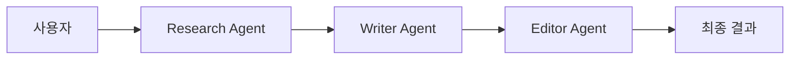
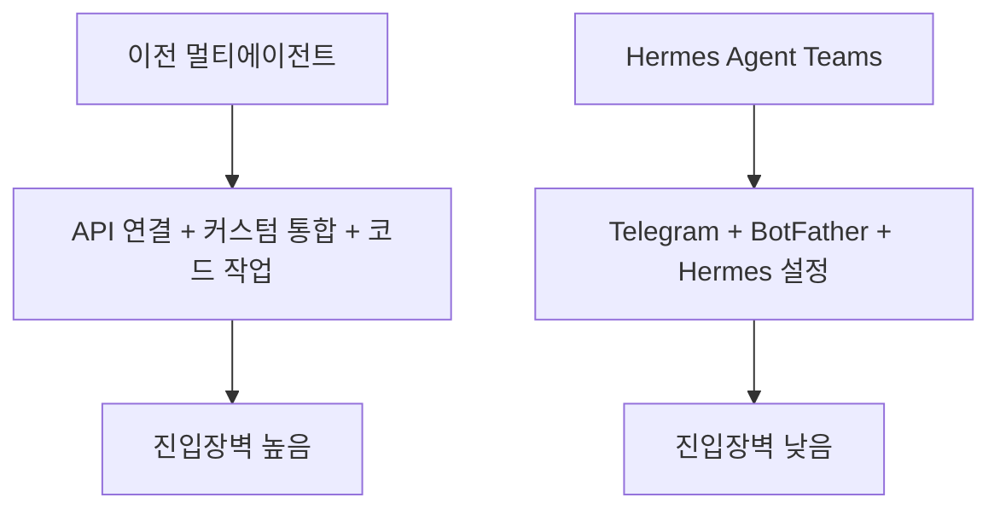

이 영상이 강조하는 포인트는 단순합니다. 이제 Hermes 에이전트들이 Telegram 안에서 서로 직접 메시지를 주고받을 수 있게 되었고, 그 결과 “에이전트 한 명”이 아니라 “에이전트 팀”을 무료로 운영할 수 있게 되었다는 것입니다. 영상은 이를 거의 선언처럼 말합니다. AI agents just learned how to talk to each other for free. [YouTube 영상](https://youtu.be/JYo6f09i7jU)
<!--more-->

실제로 이 변화는 꽤 큽니다. 예전의 멀티에이전트 시스템은 보통 API 연결, 오케스트레이션 코드, 커스텀 통합 같은 것이 필요했습니다. 반면 이 영상이 설명하는 방식은 Telegram의 BotFather 설정 하나와 Hermes의 gateway 구성을 이용해, 역할이 다른 여러 봇을 같은 그룹에 넣고 서로 일을 넘기게 하는 방식입니다. 여기에 Hermes 공식 저장소를 같이 보면, 이 기능은 단발성 데모가 아니라 원래부터 존재하던 messaging gateway·skills·memory·subagent 구조 위에 올라가는 확장으로 읽는 편이 정확합니다. [3:00](https://youtu.be/JYo6f09i7jU?t=180) [Hermes README](https://raw.githubusercontent.com/NousResearch/Hermes-Agent/main/README.md)

## Sources

- https://youtu.be/JYo6f09i7jU?si=guS843wwH5PQlQLQ
- https://youtu.be/JYo6f09i7jU?t=16
- https://youtu.be/JYo6f09i7jU?t=89
- https://youtu.be/JYo6f09i7jU?t=216
- https://youtu.be/JYo6f09i7jU?t=279
- https://youtu.be/JYo6f09i7jU?t=349
- https://github.com/NousResearch/hermes-agent
- https://raw.githubusercontent.com/NousResearch/Hermes-Agent/main/README.md
- https://api.github.com/repos/NousResearch/hermes-agent

## 1. 이번 업데이트의 핵심은 ‘에이전트 한 명’이 아니라 ‘에이전트 팀’이다

영상은 Hermes가 이제 Telegram에서 agent-to-agent 메시징을 지원한다고 설명합니다. 예시도 매우 직관적입니다. 리서치 에이전트가 자료를 찾고, 그 결과를 writer 에이전트에게 넘기고, writer가 초안을 만든 뒤 editor 에이전트에게 넘겨 마무리하는 식입니다. 사용자는 중간에서 복사·붙여넣기를 하지 않고 결과만 지켜보면 됩니다. [0:16](https://youtu.be/JYo6f09i7jU?t=16) [1:56](https://youtu.be/JYo6f09i7jU?t=116)

이런 구성이 중요한 이유는, 이전까지는 여러 AI 도구를 병렬로 돌리더라도 결국 사람이 라우터 역할을 해야 했기 때문입니다. 반면 이 업데이트는 봇 사이의 직접 전달을 통해 그 라우팅을 자동화합니다. 즉 이것은 기능 하나가 추가된 것이 아니라, **에이전트 사용 방식이 개인 도우미에서 분업 팀으로 바뀌는 변화** 에 가깝습니다.

## 2. 기술적으로는 Telegram의 `set bot to bot` 설정이 관문이다

영상이 설명하는 설정은 놀랄 만큼 단순합니다. 먼저 BotFather에서 여러 Telegram 봇을 만들고, 각 봇의 토큰을 발급받습니다. 그다음 핵심 단계로 `set bot to bot` 설정을 켭니다. 영상은 이 한 설정이 모든 것을 바꾼다고 표현합니다. 이 옵션이 켜져야 봇끼리 직접 메시지를 주고받을 수 있기 때문입니다. [1:29](https://youtu.be/JYo6f09i7jU?t=89) [3:36](https://youtu.be/JYo6f09i7jU?t=216)

이후 Hermes 프로젝트의 `auth.env` 에 토큰을 넣고, `config.yaml` 에서 각 에이전트의 역할을 정의한 뒤, 같은 Telegram 그룹에 봇들을 넣고 Hermes를 실행하면 됩니다. 영상은 이 전체 흐름을 5~15분 안에 가능하다고 설명합니다. [4:02](https://youtu.be/JYo6f09i7jU?t=242) [5:49](https://youtu.be/JYo6f09i7jU?t=349)

## 3. 이 업데이트가 설득력 있는 이유는 Hermes가 원래부터 messaging gateway를 중심에 두고 있었기 때문이다

Hermes 공식 README를 보면, 이 프로젝트는 처음부터 CLI만이 아니라 Telegram, Discord, Slack, WhatsApp, Signal 등 여러 플랫폼을 하나의 gateway 프로세스로 연결하는 구조를 갖고 있습니다. 즉 이번 Telegram 에이전트 팀 기능은 갑자기 하늘에서 떨어진 기능이 아니라, 기존 messaging gateway 구조가 더 강해진 결과로 보는 편이 맞습니다. [Hermes README](https://raw.githubusercontent.com/NousResearch/Hermes-Agent/main/README.md)

README는 또 Hermes를 “self-improving AI agent” 로 설명합니다. skills를 경험으로 만들고, memory를 쌓고, 과거 대화를 검색하고, 여러 플랫폼에서 이어서 대화하는 구조가 이미 들어 있습니다. 여기에 agent-to-agent 메시징이 붙으면, 단순히 “채널이 많다”가 아니라 **메시징 기반 협업 런타임** 으로 보이기 시작합니다.

## 4. 무료 멀티에이전트 진입장벽을 낮췄다는 점이 가장 크다

영상은 이번 업데이트가 중요한 이유를 계속 “복잡한 멀티에이전트 시스템이 무료이고 단순한 버전으로 내려왔다”는 데 둡니다. 예전에는 멀티에이전트를 쓰려면 직접 코딩하고 API와 통합 로직을 꿰매야 했지만, 이제는 Telegram과 Hermes만 있으면 된다는 설명입니다. [3:00](https://youtu.be/JYo6f09i7jU?t=180)

이 주장은 다소 과장된 톤이지만 완전히 틀리지는 않습니다. 공식 README를 봐도 Hermes는 오픈소스이며 MIT 라이선스이고, 로컬 노트북뿐 아니라 저렴한 VPS나 서버리스 환경에서도 돌아가도록 설계되어 있습니다. 2026년 4월 14일 기준 GitHub API 메타데이터를 보면 저장소는 별 76,898개, 포크 10,282개 규모입니다. 즉 이 프로젝트는 이미 상당히 큰 기반 위에서 발전하고 있습니다. [GitHub API](https://api.github.com/repos/NousResearch/hermes-agent)

## 5. 실제로 가능한 활용 예시는 콘텐츠, 고객지원, 리서치 쪽이다

영상이 제시하는 예시는 세 가지입니다. 첫째, 유튜브 스크립트 제작 파이프라인처럼 research → writing → editing 으로 이어지는 콘텐츠 팀. 둘째, incoming question 처리 → knowledge base 조회 → reply 작성으로 이어지는 고객지원 팀. 셋째, 질문을 받아 여러 에이전트가 분담 조사한 뒤 하나의 브리핑으로 묶는 리서치 팀입니다. [4:39](https://youtu.be/JYo6f09i7jU?t=279)

이 예시들이 현실적으로 보이는 이유는, 모두 “역할 분리가 쉬운 텍스트 파이프라인”이라는 공통점이 있기 때문입니다. 반대로 말하면, 에이전트 간 핸드오프 규칙이 불명확하거나 산출물 포맷이 엄격하지 않은 작업은 아직 사람이 중간 품질 관리자로 들어가야 할 가능성이 큽니다. 그러니 이 업데이트를 만능 자동화보다 **메시징 기반의 역할 분담기** 로 이해하는 편이 더 정확합니다.

## 6. Hermes의 진짜 강점은 팀 기능이 아니라 팀 기능을 받쳐 주는 주변 시스템에 있다

영상은 주로 Telegram 협업에 초점을 맞추지만, README를 보면 Hermes의 더 큰 강점은 그 주변 기능에 있습니다. 예를 들어 skill 시스템, persistent memory, cron scheduler, MCP integration, subagent spawning, cross-platform conversation continuity 같은 요소들이 이미 들어 있습니다. [Hermes README](https://raw.githubusercontent.com/NousResearch/Hermes-Agent/main/README.md)

이 말은 곧, Telegram agent teams는 단독 기능으로 볼 것이 아니라 기존 Hermes 생태계의 한 조각으로 봐야 한다는 뜻입니다. 에이전트가 서로 이야기하는 것만으로는 부족합니다. 누가 어떤 skill을 쓰는지, 과거 작업을 어떻게 기억하는지, 어떤 플랫폼으로 결과를 전달하는지까지 연결돼야 진짜 운영 시스템이 됩니다. Hermes가 흥미로운 이유는 바로 그 연결고리를 이미 갖고 있다는 점입니다.

## 실전 적용 포인트

첫째, 에이전트 팀을 처음 만들 때는 두 개 역할만으로 시작하는 편이 좋습니다. 예를 들어 research bot과 writer bot처럼 최소 구성을 먼저 검증하는 방식이 낫습니다.

둘째, Telegram bot-to-bot이 된다고 해서 바로 고품질 결과가 보장되지는 않습니다. 각 봇의 역할 정의와 핸드오프 규칙을 `config.yaml` 에 얼마나 명확히 쓰느냐가 중요합니다.

셋째, 장기적으로는 Telegram 팀 기능만 보지 말고 Hermes의 memory, skills, cron, MCP와 같이 붙여 보는 편이 훨씬 큰 그림에 가깝습니다.

## 핵심 요약

- 이번 Hermes 업데이트의 핵심은 Telegram에서 에이전트끼리 직접 메시지를 주고받게 된 것이다.
- 설정의 핵심은 BotFather에서 여러 봇을 만들고 `set bot to bot` 을 켜는 것이다.
- 역할이 다른 Hermes 봇들을 같은 그룹에 넣으면 research → writing → editing 같은 협업 체인을 만들 수 있다.
- 이 기능은 기존 Hermes의 messaging gateway, skills, memory, subagent 구조 위에 올라가는 확장으로 보는 편이 정확하다.
- 2026년 4월 14일 기준 Hermes 저장소는 별 76,898개, 포크 10,282개 규모다.

## 결론

Hermes Agent Teams 업데이트가 중요한 이유는 AI가 더 똑똑해졌기 때문이 아닙니다. 오히려 여러 에이전트가 서로 일감을 넘기고 결과를 연결하는 가장 귀찮은 부분이, Telegram이라는 익숙한 인터페이스 안으로 내려왔기 때문입니다.

그래서 이 업데이트의 핵심은 “무료”보다 “분업이 쉬워졌다”에 있습니다. 이제 많은 사람들에게 멀티에이전트는 거창한 연구 시스템이 아니라, Telegram 그룹 안에서 굴려 볼 수 있는 운영 패턴이 되기 시작했습니다.
