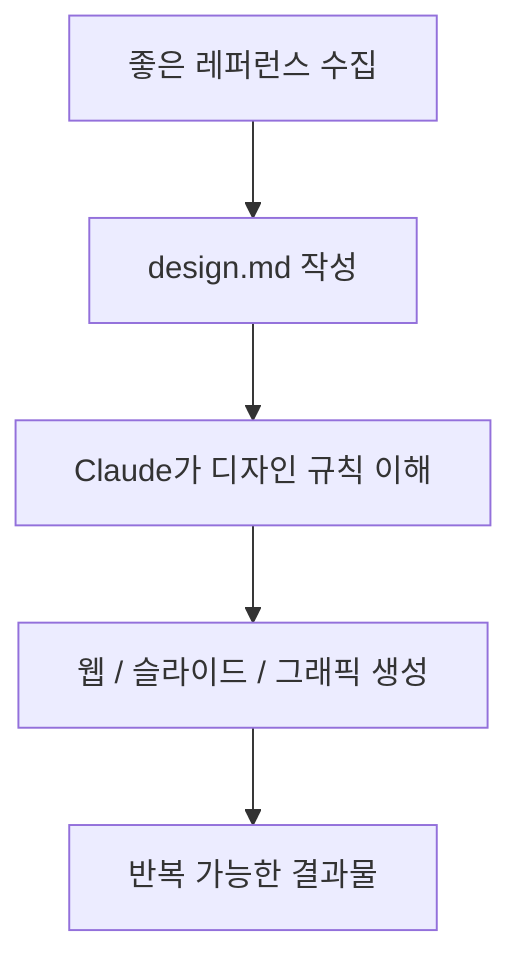
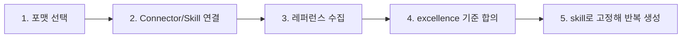

이 영상의 핵심 주장은 꽤 공격적입니다. Claude Code가 이제 사실상 최고의 디자인 도구가 되었고, 대부분의 사람은 아직 그 변화를 체감하지 못하고 있다는 것입니다. 물론 과장된 표현은 섞여 있지만, 영상이 짚는 핵심 메커니즘은 흥미롭습니다. **좋은 디자인을 코드와 규칙으로 설명할 수 있다면, Claude Code는 그 미감을 반복 생산할 수 있다** 는 것입니다. [YouTube 영상](https://youtu.be/z9CwM-DAe5Q)
<!--more-->

이 주장을 뒷받침하는 사례로 영상은 `awesome-design` 이라는 GitHub 스킬을 보여 줍니다. 이 저장소의 아이디어는 단순합니다. Figma 파일이나 복잡한 JSON 스키마 대신, `design.md` 같은 평문 문서로 디자인 시스템을 설명하고, Claude가 이를 읽어 웹사이트, 슬라이드, 그래픽, 브랜딩 결과물을 한 번에 생성하게 만드는 것입니다. 발표자는 이 저장소보다도 그 뒤에 있는 전략이 더 중요하다고 말합니다. 즉 특정 툴이 아니라 **“좋은 디자인을 언어와 규칙으로 고정하는 방식”** 자체가 핵심이라는 뜻입니다. [2:34](https://youtu.be/z9CwM-DAe5Q?t=154) [3:53](https://youtu.be/z9CwM-DAe5Q?t=233)

## Sources

- https://youtu.be/z9CwM-DAe5Q?si=9VDRmNPzHOmLCZqW
- https://youtu.be/z9CwM-DAe5Q?t=33
- https://youtu.be/z9CwM-DAe5Q?t=154
- https://youtu.be/z9CwM-DAe5Q?t=302
- https://youtu.be/z9CwM-DAe5Q?t=430
- https://youtu.be/z9CwM-DAe5Q?t=817

## 1. 출발점은 ‘AI slop’ 문제다

영상은 먼저 AI가 만든 디자인이 다 비슷해 보이는 이유를 지적합니다. 보라색 그라데이션, Inter 폰트, 둥근 카드 세 개, 익숙한 hero section 같은 패턴이 대표적입니다. 이런 결과물은 한눈에 “AI가 만들었다”는 티가 난다는 것입니다. [0:48](https://youtu.be/z9CwM-DAe5Q?t=48)

이 문제 제기가 중요한 이유는, Claude Code의 디자인 한계가 모델 성능의 한계라기보다 **좋은 미감이 규칙으로 주어지지 않았기 때문** 이라는 해석으로 이어지기 때문입니다. 영상은 디자인을 감각의 문제가 아니라 시스템의 문제로 재정의합니다. 타이포 스케일, spacing system, color tokens, layout grid처럼 설명 가능한 요소를 갖추면 디자인 역시 코드처럼 재현 가능하다는 주장입니다. [1:18](https://youtu.be/z9CwM-DAe5Q?t=78)

## 2. 핵심 아이디어는 design.md다

영상이 보여 주는 design system은 사실 특별한 전용 포맷이 아닙니다. Markdown 파일 하나입니다. 발표자는 `design.md` 의 핵심을 이렇게 설명합니다. Claude가 “좋은 디자인이 무엇인지” 이해하게 만들고, 그 이해를 평문 문서로 고정해 둔 뒤, 이후에는 원하는 결과물을 계속 찍어내게 만드는 것입니다. [3:53](https://youtu.be/z9CwM-DAe5Q?t=233)

여기서 design.md의 역할은 스타일 레퍼런스 모음집이 아닙니다. 오히려 **디자인 언어의 사양서** 에 가깝습니다. 어떤 브랜드의 색감을 어떻게 가져갈지, 여백과 타이포를 어느 톤으로 맞출지, 어떤 종류의 인터랙션과 비주얼 분위기를 허용할지를 글로 정의합니다. 이렇게 되면 Claude Code는 단순히 “예쁘게 해 줘”를 받는 게 아니라, 이미 고정된 미적 규칙을 읽고 그 안에서 결과물을 생산하게 됩니다.

## 3. `awesome-design` 은 그 철학을 바로 보여 주는 예시다

영상에서 소개되는 `awesome-design` 저장소는 55개 이상의 브랜드 시스템을 제공하며, Spotify, Stripe, BMW, Apple 등 다양한 스타일을 design.md 형태로 정리해 둔 예시로 등장합니다. 발표자는 이 스킬을 설치한 뒤 Claude Code에서 특정 스타일을 기반으로 lovable, Ollama, SpaceX 풍의 웹사이트를 한 번에 생성하는 데모를 보여 줍니다. [2:34](https://youtu.be/z9CwM-DAe5Q?t=154) [5:08](https://youtu.be/z9CwM-DAe5Q?t=308)

중요한 건 이 데모가 “그 브랜드를 복제한다”는 데 있지 않습니다. 오히려 각각의 스타일이 어떤 조형 원리와 톤을 갖고 있는지 Claude가 읽을 수 있게 정리해 두면, 비슷한 미감의 결과를 빠르게 반복 생성할 수 있다는 점에 있습니다. 즉 `awesome-design` 은 결과물이 아니라 **디자인 설명 방식의 사례집** 으로 보는 편이 더 정확합니다.

## 4. 발표자가 말하는 실전 시스템은 5단계다

영상 후반부에서 발표자는 이 방식을 어떤 디자인 작업에도 복제할 수 있는 5단계 프로세스로 설명합니다. 첫째, 포맷을 정합니다. 웹사이트인지, 슬라이드인지, 보고서인지, 소셜 포스트인지 결정합니다. 둘째, Claude에게 필요한 connectors와 skills를 줍니다. 셋째, 훌륭한 레퍼런스를 수집합니다. 넷째, “무엇이 excellent인가”를 합의하면서 style spec을 만듭니다. 다섯째, 그 합의된 기준을 skill로 고정해 이후 반복 실행합니다. [7:10](https://youtu.be/z9CwM-DAe5Q?t=430) [13:37](https://youtu.be/z9CwM-DAe5Q?t=817)

이 흐름이 중요한 이유는 디자인을 프롬프트 한 줄짜리 작업이 아니라 **시스템 구축 작업** 으로 보기 때문입니다. 즉 처음 한 번은 품이 들지만, 규칙이 codify되면 그 뒤에는 반복 비용이 급격히 줄어듭니다.

## 5. Connectors는 단순 편의 기능이 아니라 ‘재료 수집기’ 역할을 한다

영상은 디자인 작업을 할 때 Firecrawl 같은 connector를 붙여 두는 이유도 설명합니다. 단순 스크래핑보다 더 풍부하게 사이트의 브랜드 자산, 로고, 액센트 컬러, 타이포 정보를 추출해 줄 수 있기 때문입니다. 이렇게 하면 Claude는 표면만 흉내 내는 것이 아니라, 실제 사이트의 스타일 단서를 재료로 가져올 수 있습니다. [9:20](https://youtu.be/z9CwM-DAe5Q?t=560) [10:40](https://youtu.be/z9CwM-DAe5Q?t=640)

여기에 Gmail, Calendar, Granola 같은 도구가 붙으면, 단순히 예쁜 디자인을 만드는 것을 넘어 “어떤 회의 후속 자료를 어떤 톤의 슬라이드로 만들 것인가” 같은 업무 맥락까지 연결됩니다. 결국 connectors는 편의 기능이 아니라, **디자인 시스템이 실제 업무 자료를 먹고 작동하게 만드는 입력 파이프라인** 역할을 합니다.

## 6. 이 방식의 진짜 가치는 ‘특정 디자인 하나’가 아니라 ‘반복 가능성’이다

발표자는 영상 내내 “한 번 codify하면 무한히 복제할 수 있다”는 점을 반복합니다. 이는 웹사이트 세 장을 잘 뽑는 데모보다 더 중요합니다. 진짜 이점은 같은 수준의 미감을 다음 프로젝트, 다음 발표 자료, 다음 영업 제안서에도 계속 재사용할 수 있다는 데 있습니다. [0:37](https://youtu.be/z9CwM-DAe5Q?t=37)

즉 Claude Code 디자인의 강점은 즉흥적인 영감이 아니라 재현성입니다. 과거에는 좋은 디자이너가 머릿속에 갖고 있던 조형 감각이 개인의 손기술에 묶여 있었다면, 지금은 그 감각 일부를 design.md와 skills 형태로 바깥에 꺼내 둘 수 있게 된 것입니다.

## 실전 적용 포인트

첫째, 무작정 “예쁘게 만들어 줘”보다 먼저 내가 반복해서 만드는 산출물이 무엇인지 정하는 편이 낫습니다. 웹, 슬라이드, 제안서 중 하나만 잡아도 시스템화가 쉬워집니다.

둘째, 좋은 디자인 시스템은 레퍼런스 링크 모음이 아니라 “왜 이게 좋은가”를 언어로 설명한 문서에 더 가깝습니다. 그 설명이 `design.md` 입니다.

셋째, 가능하면 Firecrawl 같은 도구를 써서 실제 사이트의 브랜드 단서를 재료로 수집하는 편이, 단순 스크린샷 참고보다 훨씬 재현력이 높습니다.

## 핵심 요약

- 영상의 핵심 문제의식은 AI 디자인이 전부 비슷해지는 `AI slop` 문제다.
- 해결책은 디자인을 감각이 아니라 설명 가능한 시스템으로 보고 `design.md` 로 고정하는 것이다.
- `awesome-design` 은 그 철학을 보여 주는 사례집이며, 브랜드별 스타일을 평문 design system으로 정리해 둔다.
- 발표자는 이를 어떤 디자인 작업에도 적용할 수 있는 5단계 프로세스로 설명한다.
- 이 방식의 진짜 가치는 특정 결과물 하나보다, 같은 미감을 반복 생산할 수 있다는 재현성에 있다.

## 결론

Claude Code 디자인이 강해졌다는 말은, 모델이 갑자기 천재 디자이너가 되었다는 뜻이 아닙니다. 더 정확히는 우리가 좋은 미감을 규칙과 언어로 바꿔서 모델이 계속 재사용할 수 있게 되었다는 뜻에 가깝습니다.

그래서 앞으로 중요한 건 “어떤 디자인 툴을 쓰느냐”보다 “내가 원하는 미감을 얼마나 잘 codify했느냐”일 가능성이 큽니다. design.md와 skill은 바로 그 변화를 보여 주는 아주 현실적인 인터페이스입니다.
