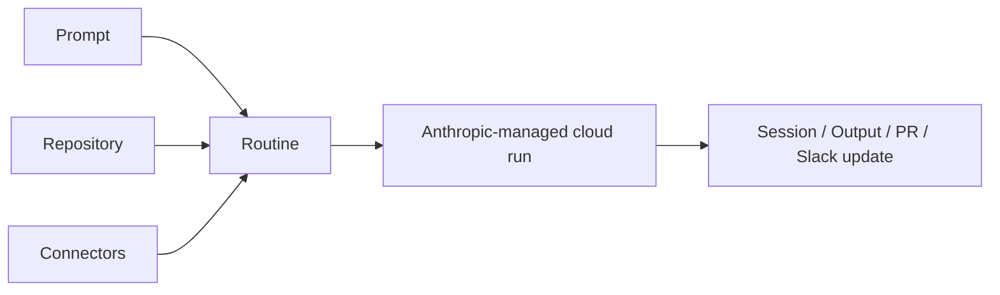
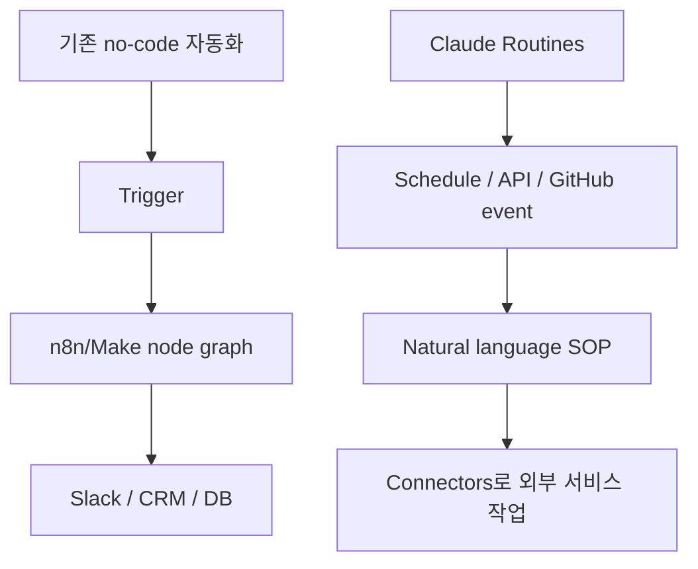

Anthropic이 Claude Code에 `Routines` 를 추가하면서, Claude Code는 단순한 대화형 코딩 도구에서 한 발 더 나아갔습니다. 이제 Claude는 일정, API 호출, GitHub 이벤트를 트리거로 삼아 클라우드에서 자동으로 실행될 수 있습니다. 영상의 표현을 빌리면, 이것은 n8n이나 Make 같은 no-code 자동화 도구와 직접 겹치기 시작한 변화입니다. [YouTube 영상](https://youtu.be/j3aXJNu9804) [Claude Code Routines docs](https://code.claude.com/docs/en/routines)
<!--more-->

공식 문서는 Routines를 “saved Claude Code configuration” 으로 설명합니다. 하나의 routine은 prompt, 하나 이상의 repository, connectors를 묶어 두고, 이를 Anthropic-managed cloud infrastructure 위에서 자동 실행합니다. 트리거는 schedule, API, GitHub event 세 가지 축입니다. 영상에서는 Gmail을 읽어 아침 이메일 요약과 답장 초안을 만들고 Slack으로 알림을 보내는 예시, Fireflies transcript를 API로 넣어 proposal을 생성하는 예시가 등장합니다. [0:27](https://youtu.be/j3aXJNu9804?t=27) [3:30](https://youtu.be/j3aXJNu9804?t=210)

## Sources

- https://youtu.be/j3aXJNu9804?si=v_rOsKcue-sRrA8t
- https://code.claude.com/docs/en/routines
- https://platform.claude.com/docs/en/api/claude-code/routines-fire
- https://youtu.be/j3aXJNu9804?t=27
- https://youtu.be/j3aXJNu9804?t=210
- https://youtu.be/j3aXJNu9804?t=371
- https://youtu.be/j3aXJNu9804?t=542
- https://youtu.be/j3aXJNu9804?t=826

## 1. Routine은 “저장된 Claude Code 세션 설정”이다

영상은 Routines를 처음 보여 주며 “Cloud Code와 동일한 작업이지만, 내 컴퓨터가 아니라 표준화된 클라우드 컨테이너에서 일어난다”고 설명합니다. 즉 prompt를 주고, connector를 붙이고, Claude가 tool call을 수행하는 것은 비슷하지만, 실행 위치와 트리거 방식이 달라집니다. [0:40](https://youtu.be/j3aXJNu9804?t=40)

공식 문서도 같은 구조를 말합니다. routine은 prompt, repositories, connectors를 저장해 둔 패키지이고, 실행은 Anthropic-managed cloud infrastructure에서 이루어집니다. 그래서 노트북이 꺼져 있어도 동작할 수 있습니다. 이 점이 단순 `/schedule` 로 로컬에서 예약 작업을 돌리는 것과 가장 큰 차이입니다. [Claude Code Routines docs](https://code.claude.com/docs/en/routines)

## 2. 트리거는 schedule, API, GitHub event 세 가지다

영상에서 먼저 보여 주는 것은 schedule입니다. 이메일 triage routine을 오전 5시 10분에 매일 실행되도록 설정하고, Gmail connector로 unread를 읽은 뒤, 답장 초안을 만들고 Slack으로 업데이트를 보내는 흐름입니다. [3:30](https://youtu.be/j3aXJNu9804?t=210)

공식 문서 기준으로도 routine은 하나 이상의 trigger를 가질 수 있습니다. schedule은 hourly, daily, weekdays, weekly 같은 반복 실행을 지원하고, API trigger는 routine별 HTTP endpoint에 bearer token으로 POST하면 새 session을 시작합니다. GitHub trigger는 pull request, push, issue, release 같은 repository event에 반응합니다. [Claude Code Routines docs](https://code.claude.com/docs/en/routines) [Trigger a routine via API](https://platform.claude.com/docs/en/api/claude-code/routines-fire)

이 구조가 중요한 이유는 routine이 단순 예약 작업을 넘어, 외부 시스템에서 호출 가능한 자동화 endpoint가 되기 때문입니다.

## 3. 영상의 첫 데모는 “아침 이메일 요약 + 답장 초안”이다

가장 단순한 데모는 daily mailbox summary plus draft routine입니다. Claude가 Gmail을 검색해 unread를 찾고, 기존 대화가 있는지 확인한 뒤, 답장 초안을 만들고 Slack DM으로 요약과 결과를 보냅니다. 발표자는 이 과정이 기존에 로컬 Claude Code로 직접 하던 일과 비슷하지만, 클라우드에서 자동으로 돌아간다는 점이 다르다고 설명합니다. [1:12](https://youtu.be/j3aXJNu9804?t=72) [2:32](https://youtu.be/j3aXJNu9804?t=152)

여기서 중요한 것은 “메일 답장을 잘 쓴다”가 아닙니다. routine은 사용자가 조작하지 않는 상태에서 실행되므로, prompt가 skill이나 SOP처럼 더 명확해야 합니다. 발표자도 routine description은 평소 skill보다 더 precise해야 한다고 강조합니다. 실행 중에 방향을 틀어 줄 사람이 없기 때문입니다. [9:55](https://youtu.be/j3aXJNu9804?t=595)

## 4. 두 번째 데모는 transcript → proposal 생성이다

다음 예시는 Fireflies transcript를 API request로 routine에 넘기고, Claude가 proposal을 생성하는 흐름입니다. 영상에서는 Claude Code 인스턴스에서 curl request를 보내고, 해당 payload가 routine을 트리거해 클라우드에서 proposal 생성 작업이 실행됩니다. [4:30](https://youtu.be/j3aXJNu9804?t=270)

이 예시는 Routines가 왜 중요한지 잘 보여 줍니다. 단순 일정 기반 자동화가 아니라, 외부 이벤트나 데이터 payload를 받아 Claude Code 세션을 시작할 수 있기 때문입니다. 공식 API 문서도 POST 요청이 새 routine session을 만들고 session ID와 URL을 반환한다고 설명합니다. 다만 이 endpoint는 실험적이며, SDK에 포함된 일반 Anthropic API와는 별도 성격입니다. [Trigger a routine via API](https://platform.claude.com/docs/en/api/claude-code/routines-fire)

## 5. n8n/Make와의 차이는 ‘중간 로직을 자연어로 대체한다’는 데 있다

영상에서 가장 중요한 비교는 기존 no-code 자동화와의 차이입니다. 기존 방식은 schedule이나 webhook 같은 event가 n8n으로 들어오고, 사용자가 drag-and-drop node를 연결해 로직을 구성한 뒤, Slack이나 CRM, database로 결과를 보내는 구조였습니다. [6:11](https://youtu.be/j3aXJNu9804?t=371)

Routines의 새 방식은 event는 그대로 유지하되, 중간의 복잡한 node graph 대신 자연어 instruction을 넣는 것입니다. 즉 “무엇을 찾아라, 어떤 조건을 확인하라, 어떤 형식으로 결과를 보내라”를 prompt/SOP 형태로 적어 Claude가 처리하게 합니다. 발표자는 Routines가 n8n의 기능과 1:1로 겹치기 시작했다고 말합니다. 다만 모든 workflow를 옮기라는 뜻은 아니고, 토큰 비용이 있으므로 계산 기반 workflow와 LLM 기반 판단 workflow를 구분해야 한다고 덧붙입니다. [7:15](https://youtu.be/j3aXJNu9804?t=435) [14:42](https://youtu.be/j3aXJNu9804?t=882)

## 6. UX는 grid, calendar, run history 중심이다

영상 중반에는 실제 Routines UX도 보여 줍니다. `claude.ai/code/routines` 에서 routine 목록을 grid 형태로 보고, calendar view에서 실행 예정 시간을 확인할 수 있습니다. 새 routine을 만들 때는 이름, prompt, repository, model, cloud environment, trigger, connector를 순서대로 설정합니다. [9:02](https://youtu.be/j3aXJNu9804?t=542)

공식 문서 역시 각 run이 새로운 session을 만들고, 사용자가 Claude가 무엇을 했는지 검토하고, 필요하면 pull request를 만들 수 있다고 설명합니다. 이 부분은 일반 자동화 도구와 다른 중요한 차이입니다. Routines의 실행 결과는 단순 로그가 아니라 Claude Code session으로 남습니다. [Claude Code Routines docs](https://code.claude.com/docs/en/routines)

## 7. 기존 n8n workflow를 routine으로 변환하는 흐름도 가능하다

영상 마지막 예시는 n8n workflow JSON을 Claude Code에 붙여 넣고, routine generator skill로 이를 routine 형태로 바꾸는 장면입니다. 예시 workflow는 Hacker News Algolia API에서 stories를 가져오고, hits를 추출해 markdown report로 만들고 commit하는 흐름입니다. [13:46](https://youtu.be/j3aXJNu9804?t=826)

이 접근이 의미 있는 이유는 기존 no-code workflow가 곧바로 버려지는 것이 아니라, 자연어 routine의 spec으로 변환될 수 있다는 점입니다. 다만 발표자는 모든 n8n/Make workflow를 이식하라고 권하지 않습니다. 계산과 필드 매핑 위주의 작업은 여전히 no-code가 더 저렴하고 안정적일 수 있고, Routines는 LLM 판단과 도구 사용이 결합된 지식 작업에 더 강합니다. [14:42](https://youtu.be/j3aXJNu9804?t=882)

## 실전 적용 포인트

첫째, routine prompt는 일반 채팅 프롬프트보다 더 엄격해야 합니다. 실행 중에 사용자가 개입하지 않기 때문에 definition of done, 예외 처리, 알림 위치를 명확히 적어야 합니다.

둘째, 기존 자동화를 모두 옮기기보다 LLM이 판단해야 하는 workflow부터 옮기는 것이 좋습니다. 단순 ETL이나 필드 매핑은 여전히 전통적 자동화 도구가 더 나을 수 있습니다.

셋째, API trigger token은 routine별로 발급되며 유출되면 해당 routine을 실행할 수 있으므로 안전하게 보관해야 합니다. 공식 문서는 token이 한 번만 표시되고, 새 token 생성 시 이전 token이 revoke된다고 설명합니다.

## 핵심 요약

- Routines는 prompt, repository, connectors를 저장해 클라우드에서 자동 실행하는 Claude Code 구성이다.
- trigger는 schedule, API, GitHub event를 지원하며 여러 trigger를 하나의 routine에 붙일 수 있다.
- 영상 예시는 Gmail triage와 Fireflies transcript 기반 proposal 생성이다.
- 핵심 차이는 n8n/Make의 node graph 중간 로직을 자연어 SOP로 대체한다는 점이다.
- Routines는 모든 자동화를 대체하기보다, LLM 판단이 필요한 지식 작업 자동화에 특히 잘 맞는다.
- 공식 문서 기준 Routines는 research preview이며 동작과 API surface가 바뀔 수 있다.

## 결론

Claude Code Routines가 흥미로운 이유는 자동화 트리거가 생겼기 때문만은 아닙니다. 중요한 변화는 Claude Code 세션 자체가 클라우드에서 반복 실행 가능한 작업 단위가 되었다는 점입니다.

이제 자동화의 가운데 로직을 node graph로 그릴지, 자연어 SOP로 쓸지 선택할 수 있게 되었습니다. 그리고 지식 작업, 요약, 초안 작성, 코드 리뷰, 문서 동기화처럼 판단이 필요한 흐름에서는 후자가 점점 더 강력한 선택지가 될 가능성이 큽니다.
