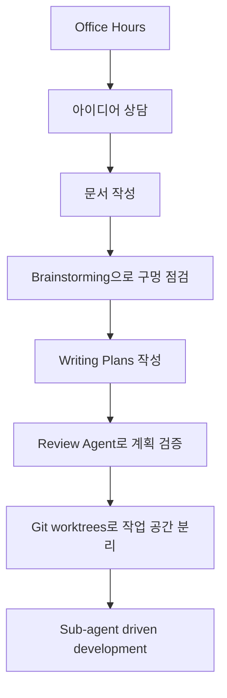

Claude Code를 쓰다 보면 어느 순간 플러그인과 스킬을 계속 붙이고 싶어집니다. 그런데 실제 작업에서는 기능이 많을수록 더 좋아지는 것이 아니라, 오히려 컨텍스트가 오염되고 흐름이 복잡해지는 경우가 많습니다. 이 영상의 출발점도 바로 그 지점입니다. 발표자는 여러 플러그인을 거의 다 지우고, `GStack` 과 `Superpowers` 두 개만 남겼더니 오히려 Claude Code가 가장 잘 써졌다고 말합니다. [YouTube 영상](https://youtu.be/af3OJ0L1jEU)
<!--more-->

핵심은 도구의 개수가 아니라 흐름입니다. GStack은 시작 전에 아이디어를 명확히 하고 디자인 방향을 점검하는 쪽에 강하고, Superpowers는 큰 작업을 나누고 계획서를 만들고 독립 작업 공간에서 실행하는 쪽에 강합니다. 영상의 메시지는 “자동 사냥처럼 맡겨라”가 아닙니다. 오히려 **생각 정리 → 문서화 → 계획서 → 리뷰 → 분리 실행** 으로 이어지는 협업 흐름을 만드는 것이 중요하다는 이야기입니다. [0:16](https://youtu.be/af3OJ0L1jEU?t=16)

## Sources

- https://youtu.be/af3OJ0L1jEU?si=gSwKIbx8iSYJ62EY
- https://youtu.be/af3OJ0L1jEU?t=102
- https://youtu.be/af3OJ0L1jEU?t=156
- https://youtu.be/af3OJ0L1jEU?t=249
- https://youtu.be/af3OJ0L1jEU?t=314
- https://youtu.be/af3OJ0L1jEU?t=458

## 1. 문제는 Claude Code가 못하는 게 아니라, 시작 전에 생각이 덜 정리된다는 점이다

영상 초반에서 발표자는 Claude Code를 처음 쓸 때는 세상이 바뀐 것처럼 느꼈지만, 시간이 지나면서 “이게 아닌데?” 하는 결과가 반복됐다고 말합니다. 리모델링 업체에 “리모델링 해 주세요”라고만 말하면 원하는 스타일이 안 나오는 것처럼, Claude Code도 생각이 덜 정리된 상태에서 바로 “만들어 줘”를 던지면 자기 나름대로 해석해 버립니다. [0:36](https://youtu.be/af3OJ0L1jEU?t=36)

이 문제는 큰 작업에서 더 커집니다. 여러 군데를 동시에 고치다 보면 한쪽을 고치다가 다른 쪽을 망가뜨리고, 다시 되돌리는 식으로 흐름이 흔들립니다. 그래서 필요한 것은 더 많은 기능이 아니라, **작업을 시작하기 전 방향을 맞추고, 실행 중에는 컨텍스트를 분리하는 구조** 입니다.

## 2. GStack의 Office Hours는 시작 전 아이디어 상담 시간이다

GStack에서 발표자가 가장 먼저 소개하는 기능은 `Office Hours` 입니다. 이름 그대로 상담 시간입니다. 바로 만들기 시작하는 대신 “이런 걸 만들고 싶은데 어떻게 생각해?”라고 시작하면, Claude가 인터뷰하듯 질문을 던집니다. 왜 만들고 싶은지, 어떤 상황에서 쓸지, 비슷한 도구에서 무엇이 불편했는지 묻는 식입니다. [1:42](https://youtu.be/af3OJ0L1jEU?t=102)

이 단계의 효과는 분명합니다. 사용자는 자신이 원하는 것이 생각보다 불명확하다는 사실을 먼저 발견합니다. 영상에서는 이 대화가 15~20분 정도 걸리지만, 끝나고 나면 흐릿한 아이디어가 글로 정리된 느낌이 된다고 설명합니다. [4:09](https://youtu.be/af3OJ0L1jEU?t=249)

## 3. GStack의 Design Review는 AI slop을 줄이는 점검 장치다

두 번째 GStack 기능은 `Design Review` 입니다. 발표자는 이 기능이 과도한 그라데이션, 과도한 이모지, 흔한 AI slop 패턴을 잡아내는 데 도움이 된다고 말합니다. 즉 결과물이 “바이브 코딩 냄새”가 나지 않게 중간중간 디자인 방향을 점검하는 역할입니다. [2:24](https://youtu.be/af3OJ0L1jEU?t=144)

이 기능은 특히 프런트엔드나 UI 결과물에서 중요합니다. AI가 만든 화면은 대체로 그럴듯하지만, 조금만 보면 같은 패턴이 반복됩니다. Design Review는 그 반복 패턴을 줄이고, 사용자가 원하는 스타일 방향으로 계속 수정하게 만드는 피드백 루프에 가깝습니다.

## 4. Superpowers는 큰 작업을 팀 작업처럼 나누는 데 강하다

Superpowers 쪽에서 핵심은 `Sub-agent driven development` 입니다. 큰 작업을 한 세션 안에서 모두 처리하는 대신, 작업을 작게 쪼개고 각각의 작은 Claude가 자기 파트에만 집중하게 하는 방식입니다. 발표자는 이를 기획팀, 디자인팀, 개발팀, QA팀으로 나눠 일하는 회사에 비유합니다. [2:36](https://youtu.be/af3OJ0L1jEU?t=156)

이 접근은 context rot를 줄이는 데 도움이 됩니다. 한 에이전트가 모든 것을 들고 다니지 않기 때문에 각 하위 작업은 더 깨끗한 문맥에서 진행됩니다. 영상의 표현처럼, 큰 프로젝트를 혼자 다 하게 하면 실수가 늘지만 역할을 나누면 품질이 달라집니다.

## 5. Git worktrees는 작업 공간을 분리하는 책상이다

Superpowers의 또 다른 핵심은 `git worktrees` 입니다. 발표자는 이를 책상 비유로 설명합니다. 프로젝트 A 서류와 프로젝트 B 서류가 같은 책상에 섞이면 실수하기 쉽지만, 책상을 나누면 각 작업이 깔끔해집니다. [3:13](https://youtu.be/af3OJ0L1jEU?t=193)

worktree의 의미도 같습니다. 여러 작업을 동시에 처리할 때 각각을 독립된 공간에서 진행하게 하여, A를 고치다가 B를 망가뜨리는 일을 줄입니다. 여기에 Superpowers는 의미 있는 작업 단위마다 기록도 남겨 주기 때문에, 나중에 언제 무엇이 바뀌었는지도 추적하기 쉬워집니다. [3:43](https://youtu.be/af3OJ0L1jEU?t=223)

## 6. 발표자가 실제로 쓰는 순서는 Office Hours → 문서화 → Brainstorming → Writing Plans → Review → Worktrees다

영상의 가장 실용적인 부분은 실제 순서입니다. 발표자는 새 기능이나 프로젝트를 시작할 때 바로 만들지 않고, 먼저 Office Hours로 대화를 시작합니다. 그다음 대화 내용을 문서로 정리하고, Superpowers의 Brainstorming skill로 놓친 부분을 한 번 더 봅니다. [4:09](https://youtu.be/af3OJ0L1jEU?t=249)

그 다음에는 `Writing Plans` 를 실행합니다. 영상에서는 이를 공사 전 설계 도면에 비유합니다. 1단계에서 무엇을 하고, 2단계에서 무엇을 하고, 3단계에서 무엇을 확인할지 적은 계획서를 먼저 만든 뒤 작업에 들어갑니다. 발표자는 이 계획서가 모든 작업의 기준점이 되며, 추가로 리뷰 에이전트를 사용해 이중 검증한다고 말합니다. [5:14](https://youtu.be/af3OJ0L1jEU?t=314) [7:12](https://youtu.be/af3OJ0L1jEU?t=432)

## 7. 이 조합의 장점은 기능 수가 아니라 자연스러운 연결이다

영상의 결론은 단순합니다. GStack과 Superpowers가 좋은 이유는 기능이 많아서가 아니라, 사용자의 작업 흐름과 자연스럽게 맞물리기 때문입니다. GStack은 시작 전 생각 정리와 디자인 점검을 맡고, Superpowers는 계획·분리·실행·기록을 맡습니다. [8:18](https://youtu.be/af3OJ0L1jEU?t=498)

발표자는 다른 플러그인들은 기능은 많지만 실제 흐름과 따로 놀거나, 자동 사냥처럼 팀 모드를 돌려 AI slop을 양산하는 느낌이었다고 말합니다. 반면 이 두 도구는 사용자가 입맛에 맞게 컨트롤하면서도 흐름이 끊기지 않는다고 평가합니다. [5:55](https://youtu.be/af3OJ0L1jEU?t=355)

## 실전 적용 포인트

첫째, Claude Code에 플러그인을 붙이기 전에 먼저 내 작업 흐름을 정리해야 합니다. 도구는 흐름을 보완해야지, 흐름을 대신 만들어 주지 않습니다.

둘째, 새 프로젝트는 바로 구현하지 말고 Office Hours나 Brainstorming으로 먼저 요구사항을 말로 풀어내는 편이 좋습니다.

셋째, 큰 작업은 Writing Plans로 설계도를 만든 뒤 worktree와 sub-agent로 나누는 방식이 안정적입니다.

## 핵심 요약

- 영상은 여러 Claude Code 플러그인을 줄이고 GStack + Superpowers만 남긴 실제 사용 흐름을 소개한다.
- GStack의 Office Hours는 시작 전 아이디어를 명확히 하는 상담 단계다.
- GStack의 Design Review는 AI slop과 디자인 방향 흔들림을 줄이는 점검 장치다.
- Superpowers는 Brainstorming, Writing Plans, git worktrees, sub-agent driven development로 큰 작업을 구조화한다.
- 핵심은 자동화가 아니라 `생각 정리 → 계획 → 리뷰 → 분리 실행` 흐름을 만드는 것이다.

## 결론

Claude Code를 잘 쓰는 길은 플러그인을 많이 설치하는 데 있지 않습니다. 오히려 어떤 순간에 어떤 도구를 꺼낼지 정해 둔 흐름이 있을 때 훨씬 안정적으로 작동합니다.

이 영상의 GStack + Superpowers 조합은 그 점을 잘 보여 줍니다. 시작 전에는 생각을 정리하고, 실행 전에는 계획서를 쓰고, 실행 중에는 작업 공간과 컨텍스트를 분리합니다. 결국 좋은 결과물은 “더 많은 AI”보다 **더 나은 작업 순서** 에서 나옵니다.
