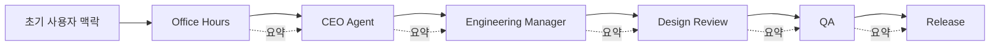
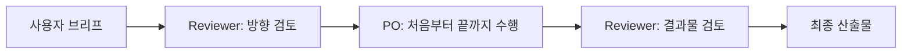

AI 에이전트를 팀처럼 꾸미는 방식은 꽤 그럴듯해 보입니다. CEO 에이전트가 방향을 잡고, 기획자 에이전트가 플랜을 짜고, 디자이너 에이전트가 UI를 보고, 개발자 에이전트가 코드를 만들고, QA 에이전트가 검수하는 식입니다. 그런데 이 영상은 그 구조가 오히려 AI를 가장 못 쓰는 방법일 수 있다고 말합니다. 핵심 논지는 단순합니다. **인간 조직도는 인간의 한계를 해결하기 위해 생겼지만, AI는 같은 이유로 역할을 나눌 필요가 없다는 것** 입니다. [YouTube 영상](https://youtu.be/iI4O8HCW8tY)
<!--more-->

발표자는 GStack 같은 역할 기반 프레임워크를 예로 들며, CEO, 엔지니어링 매니저, 디자이너, QA, 릴리즈 엔지니어처럼 AI 에이전트를 회사 조직도처럼 구성하는 방식이 본질적으로 인간 조직의 문제를 그대로 복제한다고 지적합니다. 각 역할이 사실상 같은 모델에 다른 프롬프트만 씌운 것이라면, 타이틀 자체는 능력을 만들지 못하고, 오히려 핸드오프가 늘어나면서 컨텍스트만 죽는다는 주장입니다. 이 글은 그 문제의식을 따라가며 왜 `PO + Reviewer` 구조가 더 설득력 있게 들리는지 정리해 보겠습니다.

## Sources

- https://youtu.be/iI4O8HCW8tY

## 1. 인간의 역할 분리는 “정보 전달 비용”의 산물이었다

영상이 먼저 짚는 것은 인간 조직도가 왜 생겼는가입니다. 회사에서 CEO, 매니저, 디자이너, 개발자, QA처럼 역할을 나누는 이유는 한 사람이 모든 정보를 다 처리할 수 없기 때문입니다. 인간은 인지 능력과 전문성이 제한되어 있어서, 누군가는 전체 방향을 보고, 누군가는 세부 구현을 담당하고, 누군가는 품질을 점검하는 구조를 만들 수밖에 없습니다.

하지만 발표자는 AI는 출발점이 다르다고 봅니다. 같은 모델에게 마케팅 전략을 물어도 답하고, React 코드를 짜 달라고 해도 답하고, 보안 취약점을 찾아 달라고 해도 답하고, UI 리뷰를 요청해도 반응합니다. 물론 완벽하지는 않지만, 적어도 “전문 영역이 달라서 완전히 다른 사람으로 나눠야 한다”는 인간식 전제가 그대로 적용되지는 않는다는 것입니다.

이 지점에서 영상은 중요한 문장을 던집니다. 인간이 역할을 나눈 이유는 한 사람이 모든 것을 처리할 수 없기 때문인데, AI는 그 이유가 훨씬 약하다는 것입니다. 즉 조직도는 자연의 법칙이 아니라, 인간의 제약에 대한 오래된 해결책이라는 해석입니다.

## 2. “CEO 에이전트”라는 이름은 능력을 만들지 못한다

영상에서 발표자가 가장 강하게 비판하는 지점은 타이틀 환상입니다. CEO 에이전트, 엔지니어링 매니저 에이전트, 디자이너 에이전트, QA 에이전트라는 이름을 붙여도, 실제로는 같은 모델에 다른 시스템 프롬프트를 씌운 경우가 많습니다. 이때 역할 이름이 더 나은 판단을 보장하지는 않습니다.

발표자의 표현을 빌리면, 타이틀은 능력을 만들지 않고 컨텍스트가 능력을 만듭니다. CEO라는 이름을 붙인다고 전략 판단이 갑자기 더 정확해지는 것이 아니고, Staff Engineer라는 이름을 붙인다고 코드 품질이 더 자동으로 올라가는 것도 아닙니다. 오히려 어떤 배경 정보와 결정 맥락을 얼마나 온전히 유지하느냐가 판단의 질을 좌우합니다.

이 주장은 꽤 중요합니다. 우리는 종종 AI 에이전트를 설계할 때 “역할 이름을 잘 붙이면 잘 일하겠지”라고 생각하지만, 실제로는 역할보다 입력 컨텍스트와 작업 구조가 더 크게 작동합니다. 이름은 보기 좋은 인터페이스일 수는 있어도, 그 자체로 사고력을 생성하지는 않습니다.

## 3. 진짜 문제는 역할 분리가 아니라 핸드오프다

영상이 말하는 가장 치명적인 문제는 역할 수 자체보다 핸드오프입니다. Office Hours 에이전트가 질문하고, 그 요약이 CEO 에이전트로 넘어가고, 다시 엔지니어링 매니저 에이전트로 넘어가고, 디자인 리뷰와 QA, 릴리즈로 계속 넘겨지는 구조에서는 매 단계마다 원래 맥락이 줄어듭니다.

처음 대화에서 왜 그런 방향을 택했는지, 어떤 대안을 검토했고 왜 버렸는지, 어떤 트레이드오프가 있었는지가 다음 에이전트에게 그대로 전달되지 않으면, 뒤의 판단은 점점 얕아집니다. 요약문만 보고 판단하는 구조가 되기 때문입니다. 발표자는 이것이 인간 조직에서 정보가 계층을 타고 내려오며 왜곡되는 현상과 다르지 않다고 봅니다.

즉 역할 기반 에이전트 프레임워크는 인간 조직의 문제를 해결하기는커녕, 오히려 AI 환경 안에 다시 심어 넣을 수 있습니다. AI는 원래 한 세션 안에서 폭넓은 맥락을 유지하며 일할 수 있는데, 우리가 불필요한 조직도를 만들어 그 장점을 스스로 없애 버린다는 비판입니다.

## 4. 역할이 많아질수록 실패 지점이 늘어난다

영상은 23개 역할을 예로 들며, 복잡성이 곧 성능 향상을 뜻하지 않는다고 말합니다. 첫째, 사용자는 지금 어떤 상황에서 어느 역할을 호출해야 하는지 계속 판단해야 합니다. 둘째, 역할이 많을수록 핸드오프 횟수가 늘어 컨텍스트 손실 가능성이 커집니다. 셋째, 새로 들어온 팀원은 이 모든 스킬과 호출 순서를 학습해야 합니다.

이 문제는 실제로 프레임워크를 써 본 사람일수록 더 공감할 가능성이 큽니다. 명령이 많을수록 강력해 보이지만, 막상 실전에서는 “지금 CEO 리뷰를 돌릴까, 디자인 리뷰를 먼저 할까, QA를 어느 시점에 붙일까” 같은 운영 판단이 새로운 작업이 됩니다. 결국 사용자는 제품을 만드는 대신 프레임워크를 관리하게 됩니다.

발표자의 결론은 명확합니다. 복잡성은 견고함을 만드는 것이 아니라 실패 지점을 만듭니다. 단순한 시스템이 더 강하다는 것입니다.

## 5. 대안은 PO 하나가 끝까지 소유하고, Reviewer가 앞뒤만 본다

그래서 영상이 제안하는 구조가 `PO + Reviewer` 입니다. 여기서 PO는 단순 기획자가 아니라 제품 전체를 소유하는 에이전트입니다. 방향 설정, 기획, 구현, 디자인 판단까지 한 흐름 안에서 계속 가져갑니다. 즉 중간중간 다른 역할에게 넘기지 않고 처음부터 끝까지 맥락을 유지합니다.

Reviewer는 두 번만 등장합니다. 첫 번째는 작업 시작 전에 방향이 맞는지 검토하는 시점입니다. 발표자는 이를 plan review처럼 설명합니다. 두 번째는 결과물이 나온 뒤 기준을 충족하는지 확인하는 시점입니다. 예를 들어 레이아웃, 타이포그래피, 가독성, 품질 기준 같은 것을 마지막에 점검합니다.

이 구조의 핵심은 PO가 전체 맥락을 유지한 채 끝까지 책임지고, Reviewer는 시작과 끝에서 품질 게이트 역할만 한다는 점입니다. 많은 역할로 책임을 분산시키는 대신, 한 에이전트가 맥락을 보존하고 보조 리뷰가 최소한의 체크포인트만 제공하는 방식입니다.

## 6. 이 주장은 “단일 에이전트 만능론”이라기보다 컨텍스트 우선론에 가깝다

이 영상을 “그냥 단일 에이전트 하나만 쓰면 된다”로 읽으면 조금 단순화될 수 있습니다. 발표자가 실제로 강조하는 것은 역할 이름보다 컨텍스트 흐름이 더 중요하다는 점입니다. 즉 역할을 반드시 없애라는 말이라기보다, **역할 분리가 정말 필요한가** 를 먼저 의심하라는 제안에 가깝습니다.

예를 들어 리뷰는 여전히 유효합니다. 오히려 영상에서도 Reviewer는 남깁니다. 다만 중간중간 수많은 역할에게 넘기며 조직도를 재현하지 말고, 핵심 작업은 한 에이전트가 끝까지 가져가게 하라는 것입니다. 이 관점은 AI 시스템을 설계할 때 “사람 팀처럼 보이게 만들기”보다 “컨텍스트가 살아 있게 만들기”에 더 집중하라는 뜻으로 읽을 수 있습니다.

## 실전 적용 포인트

첫째, 지금 쓰고 있는 에이전트 구조를 점검해 볼 필요가 있습니다. CEO, PM, Designer, Developer, QA처럼 역할이 많다면, 실제로 각각이 다른 판단을 만들고 있는지, 아니면 같은 모델에 이름만 다르게 붙인 것인지 확인해 볼 만합니다.

둘째, 핸드오프가 많은 구조라면 중간 요약이 실제 맥락을 충분히 살리는지 살펴봐야 합니다. 대안 검토 이유, 트레이드오프, 버린 선택지 같은 정보가 빠지면 뒤 단계의 품질이 흔들릴 가능성이 큽니다.

셋째, 구현 에이전트와 리뷰 에이전트를 분리하는 것은 여전히 유용할 수 있습니다. 다만 구현 자체를 여러 중간 역할로 쪼개기보다, `주 작업 담당 1 + 리뷰 1`처럼 최소 구조로 시작하는 편이 더 현실적입니다.

넷째, 프레임워크의 화려함보다 운영 비용을 먼저 봐야 합니다. 커맨드 수가 많고 역할이 많을수록 좋아 보일 수 있지만, 실제 팀에서 계속 사용할 수 있는지는 별개 문제입니다.

## 핵심 요약

- 인간 조직도는 인간의 인지 한계와 정보 전달 비용을 해결하기 위해 생겼다.
- AI는 같은 모델이 전략, 코드, UI 리뷰, 보안 검토까지 어느 정도 수행할 수 있어 인간식 역할 분리 전제가 약하다.
- CEO 에이전트, 디자이너 에이전트 같은 타이틀은 그 자체로 능력을 만들지 못한다.
- 역할 기반 구조의 가장 큰 문제는 핸드오프로 인한 컨텍스트 손실이다.
- 역할이 많아질수록 운영 복잡성, 실패 지점, 학습 비용이 늘어난다.
- 영상은 대안으로 `PO + Reviewer` 구조를 제안한다.
- 핵심은 역할 이름이 아니라 맥락을 처음부터 끝까지 유지하는 구조다.

## 결론

이 영상이 던지는 메시지는 꽤 날카롭습니다. 우리는 AI를 잘 쓰기 위해 자꾸 인간 조직도를 복제하지만, 그 방식이 오히려 AI의 장점을 죽일 수 있다는 것입니다. 특히 같은 모델에 서로 다른 직함을 붙여 가며 핸드오프를 반복하는 구조는, 보기에는 정교해도 실제로는 컨텍스트 손실과 운영 복잡성을 키울 가능성이 큽니다.

그래서 `PO + Reviewer` 제안이 흥미롭습니다. 한 에이전트가 전체 맥락을 끝까지 들고 가고, 시작과 끝에서만 품질 게이트를 두는 구조는 AI를 인간처럼 일시키기보다 AI답게 일시키려는 시도에 가깝습니다. 역할을 늘리는 것보다, **맥락이 끊기지 않는 작업 구조를 만드는 것**. 이 영상의 핵심은 바로 그 지점에 있습니다.
