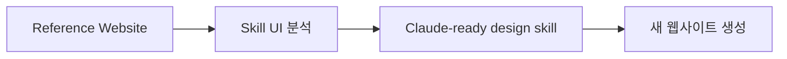
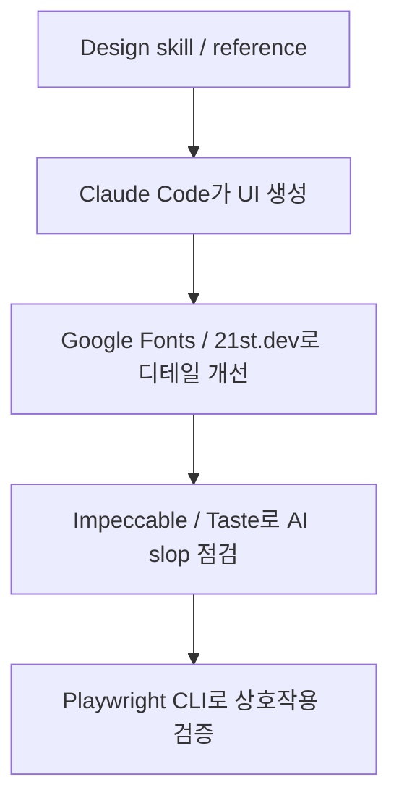

Claude Code는 코딩에는 강하지만, 프런트엔드 디자인에서는 여전히 쉽게 “AI slop” 으로 빠집니다. 보라색 그라데이션, Inter 폰트, 둥근 카드 세 개, 비슷한 SaaS hero section이 반복되는 문제입니다. 이 영상은 그런 반복을 줄이기 위한 Claude Code 디자인 도구 10개를 소개합니다. 흥미로운 점은 단순히 “예쁜 스킬” 모음이 아니라, 각각이 서로 다른 방식으로 디자인 품질을 끌어올린다는 점입니다. [YouTube 영상](https://youtu.be/Q9ty3eopOPs)
<!--more-->

영상에서 소개되는 10개는 `Impeccable`, `Skill UI`, `WebGPU skill`, `awesome-design.md`, `Google Stitch`, `UI UX Pro Max`, `21st.dev`, `Taste skill`, `Google Fonts`, `Playwright CLI` 입니다. 이들을 한 줄로 묶으면, “Claude Code에게 디자인 감각을 직접 주입하거나, 좋은 레퍼런스를 구조화하거나, 완성 후 실제 동작을 검증하는 도구들”이라고 볼 수 있습니다. [0:41](https://youtu.be/Q9ty3eopOPs?t=41)

## Sources

- https://youtu.be/Q9ty3eopOPs?si=QetCda1PoO2y86iN
- https://youtu.be/Q9ty3eopOPs?t=41
- https://youtu.be/Q9ty3eopOPs?t=187
- https://youtu.be/Q9ty3eopOPs?t=373
- https://youtu.be/Q9ty3eopOPs?t=458
- https://youtu.be/Q9ty3eopOPs?t=572
- https://youtu.be/Q9ty3eopOPs?t=710
- https://youtu.be/Q9ty3eopOPs?t=808
- https://youtu.be/Q9ty3eopOPs?t=950
- https://youtu.be/Q9ty3eopOPs?t=1085

## 1. Impeccable: AI slop을 이름 붙여 금지하는 스킬

첫 번째 도구는 `Impeccable` 입니다. 하나의 skill이지만 18개 command를 포함하고 있고, UX 오류, error message, responsive adaptation, anti-pattern 검사 같은 여러 영역을 다룹니다. 영상에서 특히 강조하는 점은 Impeccable이 anti-pattern을 잘 다룬다는 것입니다. border accent, side tab accent, spark line, glassmorphism 같은 흔한 AI slop 패턴을 “이게 바로 AI slop이다”라고 모델에게 직접 가르치는 방식입니다. [0:43](https://youtu.be/Q9ty3eopOPs?t=43)

이 도구의 가치는 단순히 “예쁘게 만들어라”가 아니라, **무엇을 하지 말아야 하는지 명시한다** 는 데 있습니다. Claude Code의 기본 frontend design skill이 “AI slop 하지 마” 수준이라면, Impeccable은 구체적 패턴 이름과 대안을 제공합니다.

## 2. Skill UI: 원하는 웹사이트를 Claude용 design skill로 역공학한다

두 번째는 `Skill UI` 입니다. 영상 기준으로 매우 새로 나온 도구이며, 핵심은 기존 웹사이트를 분석해 Claude-ready skill로 바꿔 준다는 점입니다. 예시에서는 Stripe 사이트를 가리키고, 그 스타일을 기반으로 가짜 Stripe풍 웹사이트를 one-shot으로 생성합니다. [3:07](https://youtu.be/Q9ty3eopOPs?t=187)

이 접근은 단순 HTML 분석보다 한 단계 더 나갑니다. ultra mode에서는 Playwright를 사용해 스크롤 스크린샷, hover interaction 같은 요소까지 살펴본다고 설명합니다. 즉 Skill UI는 **레퍼런스 사이트를 프로젝트 수준 디자인 스킬로 바꾸는 도구** 에 가깝습니다.

## 3. WebGPU skill: 웹페이지에 그래픽 카드 기반 인터랙션을 넣는 방향

세 번째는 `WebGPU skill` 입니다. 발표자도 이 도구가 가장 실험적이고 자신의 전문 영역 밖이라고 말합니다. WebGPU는 웹페이지가 그래픽 카드와 상호작용해 shader, renderer, node-based material 같은 고급 비주얼을 만들 수 있게 해 줍니다. [6:13](https://youtu.be/Q9ty3eopOPs?t=373)

이 도구는 카드 모양을 조금 바꾸는 수준이 아니라, WebGL·shader·custom animation 계열의 고급 인터랙션을 Claude Code가 작성하게 돕는 쪽입니다. 모든 프로젝트에 필요한 도구는 아니지만, “평범한 SaaS 페이지”에서 벗어나고 싶을 때는 차별화 포인트가 됩니다.

## 4. awesome-design.md: 브랜드별 design.md 프롬프트 라이브러리

네 번째는 `awesome-design.md` 입니다. 영상에서는 최근 가장 뜨거운 AI repo 중 하나로 소개하며, 여러 웹사이트의 design markdown을 모아 둔 라이브러리라고 설명합니다. Stitch에서 영감을 받은 design.md 구조를 사용해, 색상, typography, form elements, card examples, buttons, heading 같은 요소를 매우 구체적으로 정리합니다. [7:38](https://youtu.be/Q9ty3eopOPs?t=458)

Skill UI가 “원하는 사이트를 지금 분석해 skill로 만든다”에 가깝다면, awesome-design.md는 이미 정리된 브랜드 스타일 사전입니다. 11Labs, Bugatti 같은 다양한 사이트의 building block을 보고, 내가 만들 사이트에 맞게 가져다 쓰는 방식입니다. [9:04](https://youtu.be/Q9ty3eopOPs?t=544)

## 5. Google Stitch: 시각적으로 먼저 보고 고르는 design.md 생성기

다섯 번째는 Google의 `Stitch` 입니다. 영상에서는 awesome-design.md의 영감이 된 도구로 소개합니다. Stitch는 prompt나 inspiration screenshot을 입력하면 색상, typography, label, button 등을 담은 design.md 류의 시스템과 함께 여러 시각적 variant를 생성합니다. [9:32](https://youtu.be/Q9ty3eopOPs?t=572)

이 도구가 유용한 이유는 Claude Code처럼 코드를 만들고 dev server를 띄워 매번 확인하는 과정을 거치지 않고, 여러 시각 옵션을 한 화면에서 비교할 수 있기 때문입니다. 마음에 드는 variant를 고른 뒤 코드를 복사하거나 Figma, AI Studio, Claude Code 쪽으로 넘길 수 있습니다. [10:21](https://youtu.be/Q9ty3eopOPs?t=621)

## 6. UI UX Pro Max: 방향을 모를 때 쓰는 지능형 디자인 시스템 생성기

여섯 번째는 `UI UX Pro Max` 입니다. 발표자는 이를 Anthropic의 frontend design skill이 되었어야 할 “spiritual successor”처럼 소개합니다. 이 스킬은 어떤 웹사이트인지, 서비스가 무엇인지 질문하고, 그 기능에 맞춰 디자인 방향을 정합니다. 영상에 따르면 161개 industry-specific reasoning rule과 stack-specific guidance가 들어 있습니다. [11:50](https://youtu.be/Q9ty3eopOPs?t=710)

즉 이 도구는 특정 레퍼런스를 이미 알고 있을 때보다, “어디로 가야 할지 모르겠다”는 상황에 적합합니다. Skill UI와 awesome-design은 참조할 사이트가 있을 때 좋고, UI UX Pro Max는 아직 취향이나 방향이 정해지지 않은 초기 단계에 좋습니다.

## 7. 21st.dev: 작은 컴포넌트 디테일로 프리미엄감을 만든다

일곱 번째는 `21st.dev` 입니다. 이 사이트는 hero, button, card 같은 컴포넌트를 골라 Claude Code에 붙여 넣을 수 있는 prompt를 제공합니다. 영상에서는 Spline robot이 들어간 hero section, 마우스를 따라 빛나는 button, lighting animation card 같은 예시를 보여 줍니다. [13:28](https://youtu.be/Q9ty3eopOPs?t=808)

흥미로운 조언은 “hero 전체를 가져오는 것보다 작은 컴포넌트에서 더 큰 가치를 얻을 수 있다”는 점입니다. 작은 버튼 효과, 카드 hover, glow shadow 같은 디테일이 웹페이지를 더 신경 쓴 것처럼 보이게 만듭니다. 21st.dev는 완성품 복사 도구라기보다, **좋은 인터랙션의 어휘를 배우는 레퍼런스 라이브러리** 로 보는 편이 좋습니다. [14:27](https://youtu.be/Q9ty3eopOPs?t=867)

## 8. Taste skill: Claude에게 ‘취향’을 skill로 주입하려는 시도

여덟 번째는 `Taste skill` 입니다. 영상은 “AI has no taste” 라는 말을 뒤집어, taste를 skill로 주면 어떨까라는 관점에서 소개합니다. 여러 subskill과 설정이 있고, 얼마나 abstract하게 만들지 조정할 수 있다고 설명합니다. [15:50](https://youtu.be/Q9ty3eopOPs?t=950)

결과물이 항상 놀랍지는 않지만, 중요한 것은 다름입니다. bento box, 흔한 SaaS template, purple gradient에서 벗어나게 만드는 것만으로도 가치가 있습니다. 특히 기본 Claude Code 결과물과 비교해 “조금 다른 방향”을 얻고 싶을 때 테스트해 볼 만합니다.

## 9. Google Fonts: Inter 감옥에서 벗어나는 가장 쉬운 방법

아홉 번째는 너무 단순하지만 매우 중요한 `Google Fonts` 입니다. 발표자는 많은 사람이 Google Fonts의 존재를 모르거나 제대로 활용하지 않는다고 지적합니다. Claude Code가 자꾸 Inter를 쓰는 문제를 해결하려면, 직접 원하는 느낌의 폰트를 고르거나 Claude에게 사이트의 분위기에 맞는 Google Fonts 후보를 추천하게 하면 됩니다. [16:58](https://youtu.be/Q9ty3eopOPs?t=1018)

타이포그래피는 디자인 인상의 큰 부분을 차지합니다. 색상과 카드 구조를 바꾸기 전에 폰트만 제대로 잡아도 AI slop 느낌이 크게 줄어듭니다.

## 10. Playwright CLI: 디자인이 실제로 작동하는지 검증한다

마지막은 `Playwright CLI` 입니다. 영상은 Playwright CLI가 디자인 도구 자체는 아니지만, 프런트엔드 디자인 프로세스를 훨씬 빠르게 만든다고 말합니다. 이유는 단순합니다. 폼 제출, 버튼 클릭, hover, navigation 같은 상호작용을 실제 브라우저에서 자동으로 테스트할 수 있기 때문입니다. [18:05](https://youtu.be/Q9ty3eopOPs?t=1085)

발표자는 Playwright MCP보다 CLI가 더 효과적이라고 말하며, Claude Code에게 “이 웹페이지의 모든 interaction을 Playwright CLI로 테스트해 달라”고 지시하는 방식을 제안합니다. 디자인은 보기만 좋아서는 안 되고, 실제로 작동해야 합니다. 그래서 Playwright CLI는 form and function을 함께 확인하는 마지막 안전장치입니다.

## 실전 적용 포인트

첫째, 시작점이 없다면 UI UX Pro Max나 Stitch로 방향을 잡는 것이 좋습니다.

둘째, 원하는 레퍼런스 사이트가 있다면 Skill UI나 awesome-design.md 계열이 더 잘 맞습니다.

셋째, 완성도를 올리고 싶다면 Impeccable, Taste skill, 21st.dev, Google Fonts를 조합해 AI slop을 줄이고 디테일을 보강하세요.

넷째, 마지막에는 반드시 Playwright CLI로 실제 동작을 확인해야 합니다. 디자인은 화면 캡처가 아니라 작동하는 인터페이스이기 때문입니다.

## 핵심 요약

- Claude Code의 프런트엔드 약점은 AI slop, 즉 반복되는 기본 디자인 패턴이다.
- Impeccable은 anti-pattern을 명시적으로 금지하는 데 강하다.
- Skill UI와 awesome-design.md는 레퍼런스 사이트를 Claude가 쓸 수 있는 디자인 규칙으로 바꿔 준다.
- Stitch는 시각적 variant를 먼저 보고 고르는 데 유용하다.
- UI UX Pro Max는 방향이 없을 때 질문 기반으로 디자인 시스템을 만든다.
- 21st.dev, Google Fonts, Taste skill은 디테일과 취향을 보강한다.
- Playwright CLI는 최종 UI가 실제로 동작하는지 검증하는 도구다.

## 결론

Claude Code가 프런트엔드 디자인에 약하다는 것은 오히려 기회입니다. 모두가 같은 보라색 그라데이션과 Inter 기반 SaaS 템플릿을 뽑고 있다면, 조금만 다른 도구와 workflow를 써도 결과물이 확 달라질 수 있기 때문입니다.

이 영상의 10개 도구는 각각 다른 역할을 합니다. 어떤 것은 taste를 주입하고, 어떤 것은 레퍼런스를 skill로 바꾸고, 어떤 것은 컴포넌트 디테일을 주고, 어떤 것은 실제 동작을 검증합니다. 중요한 건 하나를 만능처럼 쓰는 것이 아니라, **디자인 방향 설정 → 레퍼런스 구조화 → 디테일 보강 → 동작 검증** 흐름으로 조합하는 것입니다.
