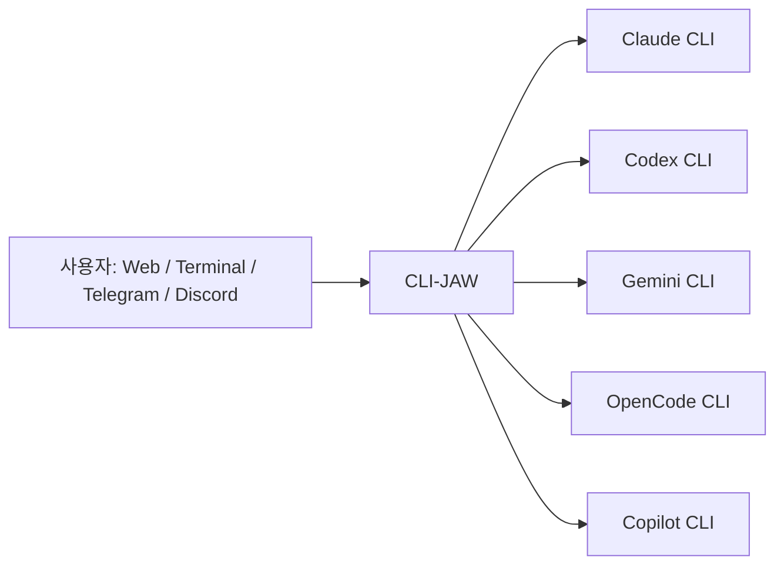
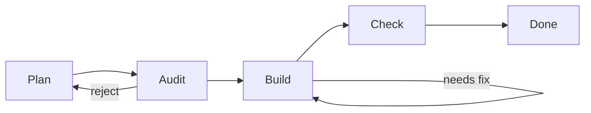

AI 도구가 많아질수록 이상한 문제가 생깁니다. Claude는 Claude대로, Codex는 Codex대로, Gemini는 Gemini대로, Copilot은 Copilot대로 따로 로그인하고 따로 설정해야 합니다. `CLI-JAW` 는 이 문제를 “하나의 개인 비서 UI” 로 감싸려는 프로젝트입니다. Claude, Codex, Gemini, OpenCode, Copilot이라는 5개 AI engine을 공식 CLI를 통해 연결하고, Web·Terminal·Telegram·Discord에서 사용할 수 있게 만듭니다. [GitHub 저장소](https://github.com/lidge-jun/cli-jaw) [README 원문](https://raw.githubusercontent.com/lidge-jun/cli-jaw/master/README.md)
<!--more-->

저장소 설명은 꽤 직설적입니다. “2-line install personal AI assistant. 5 engines, 108 skills, zero ban risk.” 여기서 중요한 키워드는 `official CLIs` 입니다. README는 API key scraping이나 reverse engineering이 아니라, 각 제공자의 공식 CLI를 사용하기 때문에 TOS-safe하다고 강조합니다. 즉 CLI-JAW는 새로운 모델이라기보다, **여러 AI CLI를 안전하게 묶는 로컬 오케스트레이션 런타임** 에 가깝습니다. 2026년 4월 16일 기준 GitHub API 메타데이터는 별 68개, 포크 9개, 기본 브랜치 `master`, MIT 라이선스로 확인됩니다. [GitHub API](https://api.github.com/repos/lidge-jun/cli-jaw)

## Sources

- https://github.com/lidge-jun/cli-jaw
- https://raw.githubusercontent.com/lidge-jun/cli-jaw/master/README.md
- https://api.github.com/repos/lidge-jun/cli-jaw
- https://lidge-jun.github.io/cli-jaw/

## 1. CLI-JAW의 핵심은 “모델 하나”가 아니라 “공식 CLI 5개를 묶는 것”이다

README에 따르면 CLI-JAW는 Claude, Codex, Gemini, OpenCode, Copilot을 하나의 assistant로 묶습니다. 사용자는 Web, Terminal, Telegram, Discord 같은 인터페이스에서 요청을 보내고, CLI-JAW는 사용 가능한 AI CLI를 감지해 적절한 engine을 호출합니다. 하나가 바쁘거나 사용할 수 없으면 다른 engine으로 fallback할 수 있다는 점도 강조됩니다. [README 원문](https://raw.githubusercontent.com/lidge-jun/cli-jaw/master/README.md)

이 구조가 흥미로운 이유는, AI assistant의 중심을 모델이 아니라 **사용자 인터페이스와 실행 환경** 에 두기 때문입니다. 모델은 여러 개일 수 있고, 사용자는 하나의 비서와 대화합니다. 즉 “어떤 모델을 쓸 것인가”보다 “내 작업이 어디서 들어오고 어디로 나가느냐”를 먼저 다루는 프로젝트입니다.

## 2. 설치 철학은 “2줄로 로컬 비서 띄우기”다

기본 설치는 단순합니다. `npm install -g cli-jaw` 후 `jaw serve` 를 실행하면 `http://localhost:3457` 에서 웹 UI가 뜹니다. Node.js 22 이상과 최소 하나의 AI CLI 인증이 필요합니다. Windows 사용자는 WSL용 설치 스크립트도 제공하고, macOS/Linux용 one-click install 스크립트도 별도로 안내합니다. [README 원문](https://raw.githubusercontent.com/lidge-jun/cli-jaw/master/README.md)

또 하나 눈에 띄는 점은 shared path policy입니다. README는 기본적으로 `~/.cli-jaw/*` 를 사용하며, 명시적으로 opt-in하지 않는 한 `~/.agents/*`, `~/.agent/*`, `~/.claude/*` 같은 공유 harness 경로를 수정하지 않는다고 설명합니다. 여러 AI CLI와 skill/harness가 뒤섞이는 환경에서는 이런 오염 방지 정책이 꽤 중요합니다.

## 3. 100개 이상의 skill을 active/reference로 나눠 관리한다

CLI-JAW의 skill system은 active skills와 reference skills로 나뉩니다. README 기준 active skills는 22개이고, reference skills는 94개입니다. active skills는 모든 AI prompt에 자동 주입되어 항상 사용 가능하고, reference skills는 필요한 작업이 들어왔을 때 on-demand로 읽히는 방식입니다. [README 원문](https://raw.githubusercontent.com/lidge-jun/cli-jaw/master/README.md)

active skills에는 browser, github, notion, memory, telegram-send, pdf/docx/xlsx/pptx/hwp, screen-capture, video, dev 계열 스킬들이 포함됩니다. 이 구조는 모든 지식을 항상 주입하지 않고, 자주 쓰는 실행면만 active로 두고 나머지는 reference로 분리한다는 점에서 실용적입니다. 컨텍스트 비용과 기능 확장성 사이의 절충입니다.

## 4. Telegram과 voice/STT는 “책상 밖의 assistant”를 만든다

README는 CLI-JAW가 책상 위 터미널에 묶이지 않는다고 강조합니다. Telegram bot을 만들고 token을 설정하면, 휴대폰에서 assistant와 대화하고, voice message를 보내고, 파일이나 사진을 첨부할 수 있습니다. 응답도 markdown, 생성 이미지, PDF, 문서, scheduled task 결과, browser screenshot 형태로 받을 수 있습니다. [README 원문](https://raw.githubusercontent.com/lidge-jun/cli-jaw/master/README.md)

voice/STT도 web UI와 Telegram 양쪽에서 지원됩니다. OpenAI-compatible STT, Google Vertex AI, custom endpoint를 설정할 수 있고, 음성+텍스트+첨부 파일을 함께 보내는 multimodal workflow도 지원합니다. 이것은 CLI-JAW가 단순 개발자 CLI wrapper가 아니라, **개인 업무 assistant** 를 지향한다는 신호입니다.

## 5. PABCD orchestration은 복잡한 작업을 phase로 강제한다

CLI-JAW의 multi-agent orchestration은 `PABCD` 라는 5단계 finite state machine으로 설명됩니다. Plan, Audit, Build, Check, Done입니다. Plan에서는 boss AI가 diff-level implementation plan을 작성하고, Audit에서는 read-only worker가 feasibility를 검증하며, Build에서는 boss가 구현하고 worker가 검증합니다. Check에서는 `tsc --noEmit` 같은 최종 검증과 문서 일관성 확인을 하고, Done에서 요약합니다. [README 원문](https://raw.githubusercontent.com/lidge-jun/cli-jaw/master/README.md)

중요한 설계 결정도 명확합니다. DB-persisted FSM으로 서버 재시작에도 상태가 유지되고, phase마다 hard stop이 있으며, worker는 read-only라서 audit/verify 단계가 파일을 실수로 수정하지 못합니다. 이것은 최근 Claude Code 생태계에서 자주 등장하는 “계획-검증-실행-재검증” 하네스 패턴을 제품 표면으로 끌어낸 구조입니다.

## 6. MCP는 한 번 설치해서 여러 AI 엔진에 동기화한다

또 하나 실용적인 부분은 MCP 설정입니다. README는 `jaw mcp install @anthropic/context7` 처럼 한 번 설치하면 Claude, Codex, Gemini, OpenCode, Copilot, Antigravity로 자동 sync된다고 설명합니다. 여러 AI CLI를 같이 쓰는 사람이라면 MCP 설정 파일을 여러 곳에 반복 편집하는 일이 꽤 번거로운데, CLI-JAW는 이를 중앙화하려 합니다. [README 원문](https://raw.githubusercontent.com/lidge-jun/cli-jaw/master/README.md)

이 기능은 CLI-JAW의 방향성과 잘 맞습니다. 각 engine은 공식 CLI로 분리되어 있지만, assistant 입장에서는 skill, MCP, memory, UI, orchestration을 한곳에서 다루고 싶습니다. CLI-JAW는 그 중앙 hub 역할을 하려는 것입니다.

## 7. v1.6.0은 단순 assistant에서 운영 환경으로 확장된 버전이다

README의 v1.6.0 섹션을 보면, 이 버전은 v1.2.0 이후의 제품 확장을 정리한 documentation catch-up release로 소개됩니다. PABCD orchestration, structured memory runtime, Discord + voice channels, web UI expansion, diagram/widget rendering, CLI/TUI usability, ops/CI/installability, Office automation maturity가 주요 변화입니다. [README 원문](https://raw.githubusercontent.com/lidge-jun/cli-jaw/master/README.md)

즉 CLI-JAW는 단순 “웹 UI 붙은 AI chat”에서 벗어나고 있습니다. memory, scheduling, skill, browser, office automation, Telegram/Discord, MCP sync, multi-agent orchestration이 한데 묶이면, 작은 개인 운영체제 같은 성격이 생깁니다.

## 실전 적용 포인트

첫째, 이미 Claude, Codex, Gemini, Copilot 등을 따로 쓰고 있다면 CLI-JAW의 가치는 “모델 성능”이 아니라 통합 운영에 있습니다.

둘째, Telegram과 STT를 붙이면 책상 앞에서만 쓰는 개발 도구가 아니라 일상 업무 assistant에 가까워집니다.

셋째, PABCD처럼 phase를 강제하는 하네스는 복잡한 작업에서 AI가 무작정 build로 뛰어드는 것을 막는 데 유용합니다.

넷째, 여러 CLI와 MCP를 섞어 쓰는 환경에서는 shared path policy와 중앙화된 MCP sync가 특히 중요합니다.

## 핵심 요약

- CLI-JAW는 Claude, Codex, Gemini, OpenCode, Copilot을 공식 CLI 기반으로 묶는 로컬 개인 AI assistant다.
- Web, Terminal, Telegram, Discord를 지원하고 voice/STT와 파일 입력도 다룬다.
- 22개 active skills와 94개 reference skills를 통해 100개 이상의 skill을 관리한다.
- PABCD orchestration은 Plan → Audit → Build → Check → Done 흐름으로 복잡한 작업을 관리한다.
- MCP는 한 번 설치해 여러 AI engine에 동기화하는 구조를 지향한다.
- 2026년 4월 16일 기준 저장소는 별 68개, 포크 9개, MIT 라이선스다.

## 결론

CLI-JAW가 흥미로운 이유는 또 하나의 AI 모델을 만들지 않기 때문입니다. 대신 이미 존재하는 AI CLI들을 하나의 assistant 표면으로 묶고, skill, memory, Telegram, browser, MCP, orchestration을 그 위에 올립니다.

앞으로 개인 AI assistant의 핵심은 특정 모델 하나가 아니라, 여러 모델과 도구를 얼마나 안전하고 일관되게 묶느냐가 될 가능성이 큽니다. CLI-JAW는 그 방향을 로컬 우선, 공식 CLI 우선, multi-engine fallback이라는 방식으로 밀어붙이는 사례입니다.
