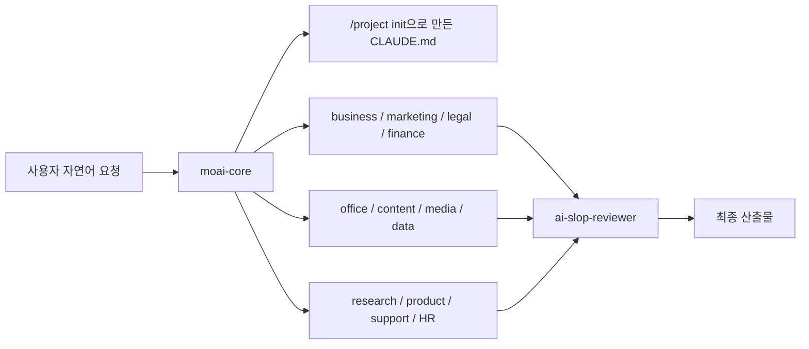
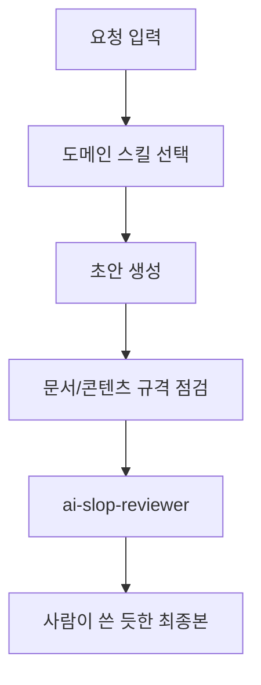

`modu-ai/cowork-plugins` 는 Claude Cowork를 위한 도메인 전문가 AI 마켓플레이스입니다. 핵심 아이디어는 단순합니다. 사용자가 “사업계획서 써줘”, “계약서 검토해줘”, “PPT 만들어줘”, “데이터 분석해줘”, “특허 찾아줘”처럼 자연어로 요청하면, Claude가 적절한 플러그인과 스킬 체인을 골라 업무 산출물을 만들도록 하는 것입니다. [GitHub 저장소](https://github.com/modu-ai/cowork-plugins) [README 원문](https://raw.githubusercontent.com/modu-ai/cowork-plugins/main/README.md)
<!--more-->

README와 marketplace 설정 기준으로 이 저장소는 17개 플러그인, 71개 스킬을 제공합니다. 비즈니스, 마케팅, 법률, 재무, HR, 콘텐츠, 운영, 교육, 라이프스타일, 제품, 고객지원, 오피스 문서, 커리어, 데이터 분석, 연구/특허, AI 미디어 제작까지 꽤 넓은 범위를 다룹니다. 특히 v1.3.0에서 `/moai` 대신 `/project` 커맨드로 전환하고, 모든 텍스트 산출물 끝에 `ai-slop-reviewer`를 붙인 점이 눈에 띕니다. [marketplace.json](https://raw.githubusercontent.com/modu-ai/cowork-plugins/main/.claude-plugin/marketplace.json) [CHANGELOG](https://raw.githubusercontent.com/modu-ai/cowork-plugins/main/CHANGELOG.md)

2026년 4월 16일 기준 GitHub API에서 확인한 저장소 메타데이터는 별 96개, 포크 28개, 기본 브랜치 `main`, MIT 라이선스, 주 언어 Python입니다. GitHub 저장소 description에는 아직 16 plugins · 64 skills로 표시되어 있지만, README와 `.claude-plugin/marketplace.json`은 v1.3.0 기준 17 plugins · 71 skills를 명시합니다. 이 글에서는 실제 카탈로그와 README 기준 수치를 사용합니다. [GitHub API](https://api.github.com/repos/modu-ai/cowork-plugins)

## Sources

- https://github.com/modu-ai/cowork-plugins
- https://raw.githubusercontent.com/modu-ai/cowork-plugins/main/README.md
- https://raw.githubusercontent.com/modu-ai/cowork-plugins/main/.claude-plugin/marketplace.json
- https://raw.githubusercontent.com/modu-ai/cowork-plugins/main/CHANGELOG.md
- https://api.github.com/repos/modu-ai/cowork-plugins

## 1. 핵심은 “플러그인 모음”이 아니라 업무 라우터다

겉으로 보면 cowork-plugins는 Claude Cowork에 설치하는 플러그인 묶음입니다. 하지만 구조적으로는 업무 라우터에 더 가깝습니다. 사용자가 자연어로 요청하면 `moai-core`가 요청을 해석하고, 설치된 도메인 플러그인 중 적합한 스킬을 호출합니다. 예를 들어 사업계획서는 business 계열, 계약서는 legal 계열, PPT는 office 계열, 카드뉴스는 content/media 계열로 라우팅됩니다. [README 원문](https://raw.githubusercontent.com/modu-ai/cowork-plugins/main/README.md)

이 방식의 장점은 사용자가 스킬 이름을 외울 필요가 없다는 것입니다. Claude Cowork 안에서 “무엇을 만들고 싶은지”만 말하면, 프로젝트 컨텍스트와 설치된 플러그인을 기준으로 적절한 실행 체인을 구성합니다. 즉 cowork-plugins는 “기능 목록”보다 “업무 산출물 중심의 실행 경로”를 제공하는 쪽에 가깝습니다.

## 2. 설치 흐름은 marketplace 추가 → moai-core 우선 설치 → 프로젝트 초기화다

README가 안내하는 기본 흐름은 명확합니다. Claude Cowork에서 개인 플러그인 영역에 `modu-ai/cowork-plugins` 마켓플레이스를 추가하고, 플러그인 목록을 동기화한 뒤 필요한 플러그인을 설치합니다. 이때 `moai-core`를 먼저 설치해야 합니다. 이유는 core가 프로젝트 초기화, 라우팅, 스킬 체인 설계, AI 슬롭 검수, 피드백 허브 역할을 하기 때문입니다. [README 원문](https://raw.githubusercontent.com/modu-ai/cowork-plugins/main/README.md)

설치 후에는 Cowork 프로젝트를 만들고 채팅창에서 `/project init`을 실행합니다. 이 초기화 과정은 사용자의 업무 분야, 주로 쓸 플러그인, 필요한 커넥터와 API 키를 확인한 뒤 프로젝트 맞춤형 `CLAUDE.md`를 생성합니다. 즉 플러그인을 설치하는 것에서 끝나는 것이 아니라, 프로젝트별 운영 규칙을 만들어 Claude가 지속적으로 같은 방식으로 일하게 만드는 구조입니다.

## 3. v1.3.0의 중요한 변화는 `/project`와 ai-slop-reviewer다

CHANGELOG 기준 v1.3.0의 가장 큰 변화는 `/moai` 커맨드가 `/project`로 바뀐 것입니다. 이유는 Claude Code 프로젝트 레벨 스킬과 이름이 충돌해 Tab 자동완성이 깨지는 문제를 피하기 위해서입니다. 따라서 기존 `/moai init`, `/moai catalog`, `/moai status` 같은 명령은 `/project init`, `/project catalog`, `/project status` 방식으로 옮겨야 합니다. [CHANGELOG](https://raw.githubusercontent.com/modu-ai/cowork-plugins/main/CHANGELOG.md)

또 하나는 `ai-slop-reviewer` 스킬입니다. 이 스킬은 Claude가 만든 텍스트에서 기계적인 표현, 획일적인 문장 구조, AI식 도입과 결말, 과도한 목록화 같은 패턴을 점검하고 더 자연스러운 톤으로 다듬는 역할을 합니다. README와 CHANGELOG 모두 이 스킬을 모든 텍스트 산출물 체인의 마지막 단계로 배치한다고 설명합니다. 단순히 “잘 써줘”가 아니라, 생성 후 검수 단계를 워크플로우에 강제한다는 점이 중요합니다.

## 4. 17개 플러그인은 업무 부서처럼 나뉜다

marketplace에는 17개 플러그인이 등록되어 있습니다. `moai-business`는 사업계획서, 시장조사, 재무모델, 투자제안서를 담당합니다. `moai-marketing`은 브랜드, SEO, SNS, 캠페인, 이메일 시퀀스를 다룹니다. `moai-legal`은 계약서, 컴플라이언스, NDA를 맡고, `moai-finance`는 원천징수, 부가세, K-IFRS, 결산, 예산 분석을 다룹니다. [marketplace.json](https://raw.githubusercontent.com/modu-ai/cowork-plugins/main/.claude-plugin/marketplace.json)

그 외에도 HR, 콘텐츠, 운영, 교육, 라이프스타일, 제품, 고객지원, 오피스 문서, 커리어, 데이터 분석, 연구/특허가 각각 별도 플러그인으로 분리되어 있습니다. 이 구성이 좋은 이유는 “한 플러그인에 모든 기능을 우겨 넣는” 방식이 아니라, 업무 도메인별로 설치와 활성화 범위를 조절할 수 있다는 점입니다. 예를 들어 개발자가 개인 블로그와 제안서 작업만 한다면 content, office, marketing 정도만 설치해도 됩니다. 법무나 HR 업무가 필요할 때는 해당 플러그인을 추가하면 됩니다.

## 5. moai-office와 moai-media는 산출물 자동화의 폭을 넓힌다

`moai-office`는 PPT, DOCX, XLSX, HWPX 문서 생성을 담당합니다. Word, PowerPoint, Excel, 한글 문서까지 포함하기 때문에 한국 업무 환경에 꽤 직접적으로 맞춰져 있습니다. README는 Word/PPT/Excel/한글 생성 요청 시 Claude 기본 도구보다 이 플러그인을 우선 사용하도록 안내합니다. [README 원문](https://raw.githubusercontent.com/modu-ai/cowork-plugins/main/README.md)

`moai-media`는 v1.2.0 이후 추가된 AI 미디어 스튜디오입니다. Nano Banana 이미지, Ideogram 한국어 타이포그래피, Kling 숏폼 영상, ElevenLabs 음성, fal.ai 게이트웨이를 다룹니다. 여기서 흥미로운 점은 텍스트 업무 자동화에서 끝나지 않고, 이미지·영상·음성까지 Cowork 프로젝트 안의 산출물 체인으로 끌어오려 한다는 것입니다. 마케팅 카드뉴스, 숏폼 영상, 제품 상세페이지, 발표자료 제작 같은 흐름에서는 이 조합이 꽤 강력해질 수 있습니다.

## 6. `/project init`은 CLAUDE.md를 자동 생성하는 프로젝트 온보딩이다

`/project init`은 단순 설정 마법사가 아닙니다. README와 CHANGELOG를 보면 초기화 과정은 업무 인터뷰, 설치 플러그인 감지, 산출물별 스킬 체인 설계, 사용자 확인, `CLAUDE.md` 생성으로 이어집니다. 그리고 생성된 `CLAUDE.md`에는 문서 생성 우선순위와 AI 슬롭 후처리 같은 HARD 규칙이 들어갑니다. [CHANGELOG](https://raw.githubusercontent.com/modu-ai/cowork-plugins/main/CHANGELOG.md)

이 접근은 최근 AI 에이전트 환경에서 자주 보이는 “프로젝트별 운영 헌법” 패턴과 맞닿아 있습니다. 매번 프롬프트에서 “PPT는 이 방식으로, 블로그는 이 톤으로, 계약서는 위험 조항을 먼저 봐줘”라고 말하지 않고, 프로젝트 초기화 시점에 규칙과 체인을 박아두는 것입니다. 반복 업무가 많을수록 이 방식은 효과가 큽니다.

## 7. MCP와 커넥터는 도메인 스킬의 현실성을 높인다

README는 여러 MCP와 커넥터를 언급합니다. 예를 들어 DART MCP는 기업 공시와 재무제표 조회에, korean-law MCP는 법령과 판례 검색에, WordPress/Canva 커넥터는 콘텐츠 발행에, Airtable/Google Sheets 커넥터는 데이터 분석에 활용됩니다. [README 원문](https://raw.githubusercontent.com/modu-ai/cowork-plugins/main/README.md)

이 지점이 중요합니다. 도메인 전문가 AI가 실제 업무에 쓰이려면 일반 지식만으로는 부족합니다. 법률이면 최신 법령과 판례, 재무면 공시와 세율, 콘텐츠면 발행 채널, 데이터면 실제 파일과 시트가 필요합니다. cowork-plugins는 이 외부 도구 연결을 플러그인 설명과 스킬 체인 안에 포함시키면서, “말만 하는 AI”에서 “자료를 조회하고 문서를 만드는 AI” 쪽으로 이동하려 합니다.

## 실전 적용 포인트

첫째, 모든 플러그인을 한 번에 설치하기보다 `moai-core`를 먼저 설치하고, 실제로 반복되는 업무 도메인부터 추가하는 것이 좋습니다. 블로그와 마케팅 업무가 많다면 content, marketing, office를 먼저 쓰고, 계약서 검토가 필요해질 때 legal을 추가하는 식입니다.

둘째, 기존 사용자라면 `/moai` 커맨드를 `/project`로 바꿔야 합니다. v1.3.0에서 이 변경은 단순 이름 변경이 아니라 Claude Code/Cowork 생태계의 스킬 shadowing 문제를 피하기 위한 호환성 조치입니다.

셋째, 텍스트 산출물은 `ai-slop-reviewer`를 최종 단계로 두는 설계를 참고할 만합니다. 블로그, 제안서, 랜딩페이지, 이메일, 보고서처럼 사람이 읽는 산출물은 “생성”보다 “검수와 톤 조정”에서 품질 차이가 크게 납니다.

넷째, 오피스 문서와 미디어 제작은 API 키와 로컬 의존성이 필요할 수 있습니다. 특히 AI 이미지·영상·음성 생성은 Gemini, fal.ai, ElevenLabs 같은 외부 서비스 키가 연결되어야 하므로, 팀 환경에서는 키 관리와 비용 정책을 먼저 정리해야 합니다.

## 핵심 요약

- `modu-ai/cowork-plugins`는 Claude Cowork용 도메인 전문가 플러그인 마켓플레이스입니다.
- README와 marketplace 기준으로 17개 플러그인, 71개 스킬을 제공합니다.
- `moai-core`는 `/project init`, 스킬 체인 라우팅, AI 슬롭 검수, 피드백 허브를 담당합니다.
- v1.3.0에서 `/moai` 커맨드는 `/project`로 변경되었습니다.
- `ai-slop-reviewer`가 모든 텍스트 산출물의 마지막 검수 단계로 들어간 점이 중요합니다.
- business, marketing, legal, finance, HR, content, office, data, research, media 등 실제 업무 부서처럼 플러그인이 나뉩니다.
- 오피스 문서와 AI 미디어 생성까지 포함해 Claude Cowork를 업무 산출물 제작 환경으로 확장하려는 시도입니다.

## 결론

cowork-plugins는 Claude Cowork를 단순 대화형 AI에서 “업무별 전문가 팀”처럼 쓰게 만드는 프로젝트입니다. 핵심은 많은 스킬 숫자 자체가 아니라, 자연어 요청을 도메인별 스킬 체인으로 라우팅하고, 프로젝트별 `CLAUDE.md`에 운영 규칙을 고정하며, 최종 산출물을 `ai-slop-reviewer`로 검수하는 흐름입니다.

특히 한국 업무 환경에서 자주 필요한 HWPX, 세무, 노무, 법률, 네이버/카카오 마케팅, 특허, 공공데이터, PPT 문서 생성까지 범위에 넣은 점이 흥미롭습니다. Claude Cowork를 실제 업무 자동화 도구로 쓰고 싶다면, 이 저장소는 “어떤 스킬을 어떻게 묶어야 하는가”를 보여주는 좋은 레퍼런스입니다.
