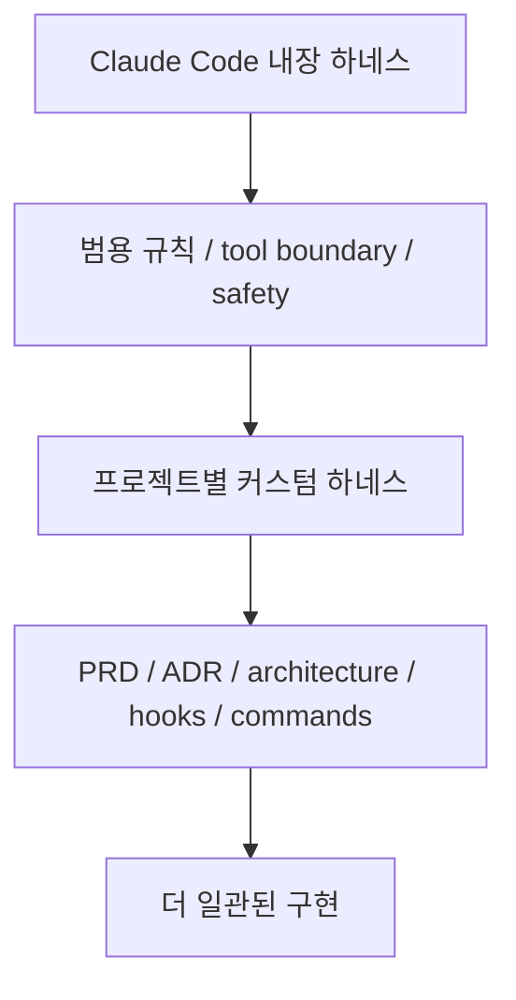
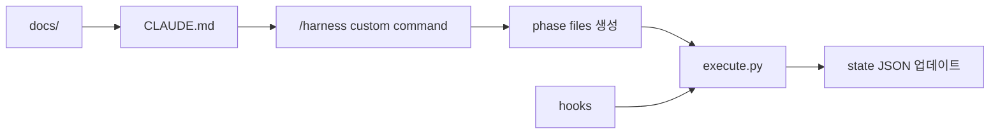

하네스 엔지니어링이라고 하면 거창한 프레임워크부터 떠올리기 쉽습니다. 하지만 이 영상의 첫 문장은 오히려 반대입니다. “여러분은 이미 하네스를 쓰고 있다.” Claude Code, Codex, OpenClaw 같은 도구 자체가 이미 context, tools, permissions, feedback loop를 내장한 하네스이고, 우리가 할 일은 그 위에 **내 프로젝트에 맞는 한 층을 더 쌓는 것** 입니다. [YouTube 영상](https://youtu.be/AQOvNx87Urs)
<!--more-->

영상은 이 개념을 추상적으로 설명하는 데서 끝나지 않고, 빈 프로젝트에서 커스텀 하네스를 직접 만드는 과정을 보여 줍니다. 예제 프로젝트는 유튜브 댓글을 분석해 sentiment, 피드백, 개선점, 잘하고 있는 점을 리포트로 보여 주는 `Feedback Pulse` 입니다. 핵심 구성은 `docs/`, `CLAUDE.md`, custom command, `settings.json` hooks, `execute.py` phase loop, state JSON 입니다. [10:31](https://youtu.be/AQOvNx87Urs?t=631) [18:04](https://youtu.be/AQOvNx87Urs?t=1084)

## Sources

- https://youtu.be/AQOvNx87Urs
- https://youtu.be/AQOvNx87Urs?t=122
- https://youtu.be/AQOvNx87Urs?t=299
- https://youtu.be/AQOvNx87Urs?t=631
- https://youtu.be/AQOvNx87Urs?t=828
- https://youtu.be/AQOvNx87Urs?t=931
- https://youtu.be/AQOvNx87Urs?t=1439
- https://youtu.be/AQOvNx87Urs?t=1979

## 1. Claude Code 자체가 이미 하네스다

영상은 Claude Code 내부 코드 유출 사례를 언급하며, 시스템 프롬프트 안에 이미 여러 규칙이 들어 있었다고 설명합니다. 예를 들어 main branch에 force push 하지 말라, 위험한 명령어를 막아라, 새 commit을 만들어 history를 보존하라 같은 규칙입니다. 발표자는 이것이 context files, gating, tool boundary, feedback loop 같은 하네스의 네 기둥이 이미 Claude Code 안에 들어 있다는 뜻이라고 말합니다. [2:02](https://youtu.be/AQOvNx87Urs?t=122)

즉 하네스 엔지니어링은 완전히 새 시스템을 만드는 일이 아닙니다. 이미 존재하는 범용 하네스를 이해하고, 그 위에 프로젝트별 규칙과 문맥을 얹는 일입니다. Claude Code가 모두를 위한 기본 하네스라면, 내가 만드는 커스텀 하네스는 특정 프로젝트를 위한 운영층입니다.

## 2. 범용 하네스의 한계는 프로젝트 도메인 규칙을 모른다는 점이다

Claude Code의 내장 하네스는 훌륭하지만 범용적입니다. 내 프로젝트의 API 호출은 반드시 wrapper를 거쳐야 한다거나, 외부 라이브러리를 쓰지 않는다거나, DB schema는 절대 건드리지 말아야 한다거나, 특정 UI 패턴을 금지해야 한다는 식의 도메인 규칙은 알 수 없습니다. [3:50](https://youtu.be/AQOvNx87Urs?t=230)

그래서 프로젝트만의 규칙, 아키텍처 결정, 기술 선택 이유, 문서화된 요구사항을 AI에게 알려 주는 일이 필요합니다. 영상은 이것을 내장 하네스 위에 “2층을 올리는 것”이라고 표현합니다. 이 2층은 오픈소스 하네스를 가져와도 되고, 직접 가벼운 커스텀 하네스를 만들어도 됩니다. [4:51](https://youtu.be/AQOvNx87Urs?t=291)

## 3. 오픈소스 하네스는 좋지만, 처음부터 풀세팅이 필요하지는 않다

영상은 예시로 `oh-my-claude-code` 계열 오픈소스 하네스를 소개합니다. 19개 전문 에이전트, plan → PRD → execute → verify → fix 같은 파이프라인, 37개 이상의 skill을 가진 구조입니다. 하나의 AI가 모든 일을 하는 대신 analyst, architect, code review, explorer 같은 역할로 나눠 팀처럼 굴리는 방식입니다. [4:59](https://youtu.be/AQOvNx87Urs?t=299)

이런 오픈소스 하네스는 시작점으로 좋지만, 단점도 있습니다. 여전히 내 프로젝트의 맥락은 모르고, 처음부터 너무 많은 에이전트와 파이프라인과 skill이 들어오면 무겁게 느껴질 수 있습니다. 발표자는 프로젝트가 커질 때 하나씩 붙여 나가는 접근을 권합니다. [8:46](https://youtu.be/AQOvNx87Urs?t=526)

## 4. 커스텀 하네스의 뼈대는 `docs/`, `CLAUDE.md`, command, hooks, executor다

영상의 핵심은 직접 만든 가벼운 하네스 프레임워크입니다. 구조는 단순합니다. `CLAUDE.md` 는 프로젝트 헌법이고, `docs/` 는 프로젝트의 뇌입니다. `docs/` 안에는 PRD, architecture, ADR, UI guide가 들어갑니다. custom command는 이 문서를 읽고 phase를 나누고 실행을 시작합니다. `settings.json` hooks는 TDD 강제, 위험 명령 차단, circuit breaker 같은 자동 검증을 담당합니다. `scripts/execute.py` 는 phase를 순차적으로 실행하고 상태를 관리하는 루프입니다. [10:31](https://youtu.be/AQOvNx87Urs?t=631)

이 구조가 중요한 이유는 AI에게 “알아서 해”라고 던지는 것이 아니라, 작업 전후의 경로를 정해 주기 때문입니다. 문서를 읽고, 논의할 게 있으면 묻고, 구현 계획을 phase로 쪼개고, phase 파일을 만들고, executor가 상태를 관리하며 순차 실행합니다. [14:05](https://youtu.be/AQOvNx87Urs?t=845)

## 5. `docs/` 를 채우는 기획 단계가 가장 중요하다

영상에서 반복해서 강조하는 것은 기획입니다. PRD에는 목표, 사용자, 핵심 기능, MVP 제외 사항을 넣고, architecture에는 디렉터리 구조, 패턴, 데이터 흐름을 넣습니다. ADR에는 왜 이런 아키텍처 결정을 했는지, 어떤 trade-off를 감수했는지를 씁니다. UI guide는 선택이지만 디자인 일관성에 도움이 됩니다. [13:05](https://youtu.be/AQOvNx87Urs?t=785)

발표자는 특히 MVP 제외 사항을 꼭 넣으라고 말합니다. AI는 명시하지 않으면 자꾸 다 만들려고 하기 때문입니다. 이 지점이 커스텀 하네스의 실전 핵심입니다. 좋은 하네스는 “무엇을 하라”만 적는 것이 아니라 **무엇을 하지 말라** 도 명확히 적습니다.

## 6. phase별 headless 실행과 state JSON이 context rot를 줄인다

영상에서는 `claude -p` headless mode를 phase마다 실행한다고 설명합니다. 하나의 Claude 세션에서 모든 phase를 돌리면 context가 쌓여 품질이 떨어지기 때문에, phase마다 별도 실행으로 컨텍스트를 분리하는 것입니다. 단점은 기억이 없어진다는 점인데, 이를 보완하기 위해 state JSON을 둡니다. [15:31](https://youtu.be/AQOvNx87Urs?t=931)

state JSON은 각 phase가 어디까지 끝났는지, 어떤 에러가 났는지, 어떤 테스트가 통과했는지 AI가 다시 읽을 수 있는 형태로 남깁니다. 즉 phase 실행은 stateless하게 가져가되, 진행 상태는 외부 파일로 저장해 복구 가능한 루프를 만듭니다. 이는 작은 규모의 managed agent runtime처럼 작동합니다.

## 7. hooks는 AI가 실수하기 전에 막는 자동 검증 장치다

hooks는 영상에서 “AI가 실수하기 전에 차단하는 장치”로 설명됩니다. 예를 들어 TDD hook은 테스트 없이 구현하려 하면 멈추고 테스트를 먼저 쓰게 만듭니다. 위험 명령 차단 hook은 `rm -rf`, main branch push, reset 같은 위험한 명령을 막습니다. circuit breaker hook은 같은 에러가 여러 번 반복될 때 무한 루프에 빠지지 않게 중단하거나 다른 전략을 요구합니다. [16:14](https://youtu.be/AQOvNx87Urs?t=974)

이 부분은 하네스의 본질에 가깝습니다. 좋은 하네스는 모델에게 좋은 지시를 주는 것만이 아니라, 잘못된 행동을 시스템적으로 막습니다. 지시문이 soft constraint라면, hook은 hard constraint에 가깝습니다.

## 8. 실제 예제는 유튜브 댓글 분석 앱 Feedback Pulse다

실습 프로젝트는 `Feedback Pulse` 입니다. 사용자가 유튜브 URL을 넣으면 댓글을 가져와 sentiment analysis를 하고, 개선할 점과 잘하고 있는 점을 리포트로 보여 주는 앱입니다. 로그인과 서버는 빼고, MVP로 가볍게 만든다는 조건도 명시합니다. [18:04](https://youtu.be/AQOvNx87Urs?t=1084) [20:00](https://youtu.be/AQOvNx87Urs?t=1200)

흥미로운 점은 바로 실행하지 않는다는 것입니다. 먼저 PRD, architecture, ADR, `CLAUDE.md` 를 채우고, 한 번 더 리뷰하고, 다시 보강합니다. 발표자는 첫 번째 결과를 절대 믿지 말고 네다섯 번 갈궈야 한다고 말합니다. 특히 에러 케이스, edge case, error handling, UX 관점을 계속 추가하라고 강조합니다. [23:59](https://youtu.be/AQOvNx87Urs?t=1439) [30:37](https://youtu.be/AQOvNx87Urs?t=1837)

## 실전 적용 포인트

첫째, 커스텀 하네스를 만들 때 처음부터 복잡한 multi-agent framework를 붙일 필요는 없습니다. `docs/`, `CLAUDE.md`, hooks, executor loop만으로도 충분히 시작할 수 있습니다.

둘째, 가장 많은 시간을 써야 하는 곳은 구현이 아니라 PRD, architecture, ADR, UI guide를 채우는 기획 단계입니다.

셋째, phase별 실행을 분리하려면 기억을 외부화해야 합니다. state JSON이나 phase log가 없으면 headless 실행은 오히려 맥락 손실을 만들 수 있습니다.

넷째, 반복 개선에는 테스트가 필수입니다. 테스트가 있어야 AI에게 “더 개선해 줘”라고 반복 요청해도 regression을 막을 수 있습니다.

## 핵심 요약

- Claude Code 자체가 이미 범용 하네스이며, 커스텀 하네스는 그 위에 프로젝트별 규칙을 얹는 것이다.
- 오픈소스 하네스는 강력하지만 처음부터 풀세팅이 필요하지는 않다.
- 가벼운 커스텀 하네스는 `docs/`, `CLAUDE.md`, custom command, hooks, `execute.py`, state JSON으로 만들 수 있다.
- `docs/` 에는 PRD, architecture, ADR, UI guide를 넣고, `CLAUDE.md` 는 프로젝트 헌법 역할을 한다.
- phase별 headless 실행은 context rot를 줄이지만, state JSON으로 기억을 외부화해야 한다.
- hooks는 TDD 강제, 위험 명령 차단, circuit breaker 같은 hard constraint 역할을 한다.

## 결론

하네스 엔지니어링은 거대한 프레임워크를 설치하는 일이 아닙니다. AI가 좋은 방향으로 움직이도록 문맥을 정리하고, 실행 순서를 만들고, 위험 행동을 막고, 상태를 남기는 일입니다.

이 영상의 커스텀 하네스는 그 원리를 아주 작게 보여 줍니다. 프로젝트의 뇌는 `docs/` 에 두고, 헌법은 `CLAUDE.md` 에 두고, 실행은 phase loop로 나누고, 실수는 hooks로 막습니다. 이 정도만 해도 “그냥 만들어 줘”와는 완전히 다른 수준의 바이브 코딩이 됩니다.
