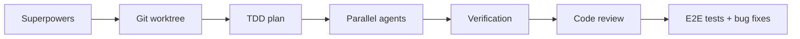
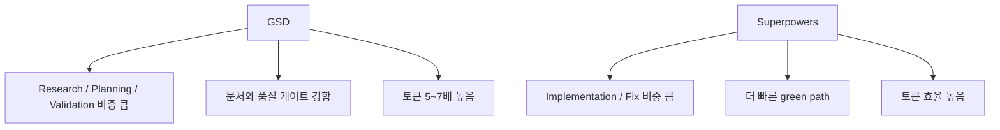

Superpowers와 GSD는 둘 다 Claude Code 위에서 planning과 execution을 더 잘하게 만들려는 스펙트럼 개발 프레임워크입니다. 하지만 새 프로젝트가 아니라 이미 존재하는 brownfield codebase에 기능을 추가할 때는 어느 쪽이 더 나을까요? 이 영상은 food ordering system이라는 기존 프로젝트에 E2E 테스트 인프라를 추가하는 동일 과제를 두 프레임워크에 맡기고 비교합니다. [YouTube 영상](https://youtu.be/GJmlik1C4Tg)
<!--more-->

이 비교가 흥미로운 이유는 단순 “누가 더 예쁘게 만들었나”가 아니라, 실제 코드베이스에서 테스트 수, 통과율, functional coverage, 발견한 버그, 수정 사이클, 토큰 사용량, 품질 게이트를 비교했다는 점입니다. 결론부터 말하면 영상의 최종 판단은 Superpowers 쪽입니다. GSD는 더 많은 문서화와 품질 게이트를 제공하지만, 이 과제에서는 Superpowers가 더 적은 토큰과 반복 횟수로 비슷하거나 약간 더 나은 결과를 냈다고 평가됩니다. [10:45](https://youtu.be/GJmlik1C4Tg?t=645)

## Sources

- https://youtu.be/GJmlik1C4Tg
- https://youtu.be/GJmlik1C4Tg?t=17
- https://youtu.be/GJmlik1C4Tg?t=108
- https://youtu.be/GJmlik1C4Tg?t=178
- https://youtu.be/GJmlik1C4Tg?t=447
- https://youtu.be/GJmlik1C4Tg?t=592
- https://youtu.be/GJmlik1C4Tg?t=645
- https://youtu.be/GJmlik1C4Tg?t=856

## 1. 테스트 조건은 기존 food ordering system에 E2E coverage를 추가하는 것이었다

영상의 프로젝트는 greenfield가 아니라 brownfield입니다. 이미 존재하는 food ordering system에 end-to-end testing coverage를 늘리는 과제입니다. 작성자는 GStack으로 brainstorm한 requirements file을 기준으로 삼고, git worktree를 이용해 같은 코드베이스를 Superpowers용 환경과 GSD용 환경으로 나누었습니다. [0:17](https://youtu.be/GJmlik1C4Tg?t=17)

평가 기준도 꽤 명확합니다. 결과의 정확도, 토큰 소모량, 그리고 코딩 에이전트를 올바른 경로로 안내하는 능력을 비교합니다. 즉 이 영상은 “복잡한 프레임워크가 멋져 보이는가”보다, 실제 유지보수 프로젝트에서 **비용 대비 정확한 변경을 만들 수 있는가** 를 보는 테스트입니다. [0:47](https://youtu.be/GJmlik1C4Tg?t=47)

## 2. Superpowers는 git worktree, TDD, parallel agent, verification 흐름으로 진행했다

Superpowers 쪽 흐름은 상대적으로 간결합니다. 먼저 git worktree skill로 독립 환경을 만들고, test-driven development로 테스트를 먼저 만든 뒤 구현합니다. 이후 dispatch parallel agent로 구현을 진행하고, verification과 code review를 거쳐 별도 branch로 마무리합니다. [1:48](https://youtu.be/GJmlik1C4Tg?t=108)

실행 결과 Superpowers는 전체 107개 테스트를 만들었고, 그중 103개가 실행되고 4개는 의도적으로 skip된 상태였습니다. functional coverage는 94개 기능 중 43개를 커버해 약 46% 수준으로 보고됩니다. 또 E2E 테스트를 돌리는 과정에서 sidebar selection, region button, table row lookup 등 약 10개 버그를 발견해 수정했다고 설명합니다. [3:56](https://youtu.be/GJmlik1C4Tg?t=236) [5:14](https://youtu.be/GJmlik1C4Tg?t=314)

## 3. GSD는 더 많은 단계와 품질 게이트를 거쳤다

GSD는 자체 worktree skill이 없어서 Superpowers의 worktree 기능을 빌려 독립 환경을 만든 뒤 시작합니다. 이후 GSD project 초기화, phase planning, infrastructure plan과 critical path tests plan 분리, sub-agent 실행, code review, auto fix, validation, verification, security audit, learning extraction까지 진행합니다. [7:27](https://youtu.be/GJmlik1C4Tg?t=447)

GSD의 특징은 문서와 단계가 훨씬 많다는 점입니다. 발표자는 GSD가 매번 context window를 50% 아래로 유지하려고 세션을 나누고, research, planning, validation, security, learning documentation에 많은 토큰을 쓴다고 설명합니다. 이 구조는 더 철저하지만, 그만큼 무겁습니다. [8:16](https://youtu.be/GJmlik1C4Tg?t=496) [9:20](https://youtu.be/GJmlik1C4Tg?t=560)

## 4. GSD의 최종 테스트 결과는 coverage가 더 높지만 버그 수정 수는 적었다

GSD 결과는 110개 테스트 중 102개 통과, 8개 skip, 약 2분 runtime으로 제시됩니다. functional coverage는 약 53%로, Superpowers의 약 46%보다 높습니다. 특히 login 100%, customers 90%, orders 약 80% 수준의 페이지별 coverage가 언급됩니다. [9:52](https://youtu.be/GJmlik1C4Tg?t=592)

하지만 버그 수정 수는 Superpowers보다 적었습니다. GSD는 orders page와 server 쪽에서 총 4개 버그를 수정한 것으로 정리되고, Superpowers는 약 10개 버그를 수정했습니다. 영상에서는 이 차이를 단순 우열로 보기보다, GSD가 더 높은 coverage와 더 많은 quality artifact를 남겼지만 Superpowers가 더 실용적으로 여러 문제를 빠르게 잡았다는 식으로 해석합니다. [10:28](https://youtu.be/GJmlik1C4Tg?t=628)

## 5. 최종 비교에서 Superpowers가 이긴 이유는 토큰 효율과 반복 횟수다

영상 후반부에서 작성자는 여러 지표를 비교합니다. 최종 테스트 결과는 둘 다 비슷하지만, Superpowers가 약간 더 낫다고 봅니다. commit 수와 planning artifact는 GSD가 더 많고, fixed cycle도 GSD는 두 번의 major fix cycle이 있었던 반면 Superpowers는 한 번으로 끝났습니다. [10:45](https://youtu.be/GJmlik1C4Tg?t=645)

가장 큰 차이는 토큰입니다. 작성자는 GSD가 Superpowers보다 약 5~7배 더 많은 토큰을 사용했다고 말합니다. GSD의 토큰 중 실제 코드에 쓰인 것은 약 25%이고, 나머지는 research, planning, validation 등에 쓰였습니다. 반면 Superpowers는 60~70%가 implementation, 20~30%가 fix, 10%가 code review에 쓰였다고 정리합니다. 즉 같은 deliverable 기준으로 Superpowers가 훨씬 토큰 효율적이었다는 평가입니다. [11:58](https://youtu.be/GJmlik1C4Tg?t=718) [13:21](https://youtu.be/GJmlik1C4Tg?t=801)

## 6. GSD가 이기는 영역도 분명히 있다

영상이 Superpowers를 최종 승자로 평가하긴 하지만, GSD가 무조건 나쁘다는 결론은 아닙니다. GSD는 code review, UAT, validation, security 같은 quality gates에서 더 낫다고 평가됩니다. 또 learning extraction을 통해 세션에서 얻은 결정, 패턴, 교훈을 추출해 다음 작업에 활용할 수 있는 점도 장점으로 언급됩니다. [9:20](https://youtu.be/GJmlik1C4Tg?t=560) [11:43](https://youtu.be/GJmlik1C4Tg?t=703)

즉 GSD는 비용을 써서 traceability와 governance를 얻는 쪽입니다. 팀 규모가 크고, 보안·감사·UAT 기록이 중요하며, 의사결정과 학습을 장기적으로 축적해야 하는 환경이라면 GSD의 무거움이 단점만은 아닐 수 있습니다.

## 7. 이 프로젝트 유형에서는 Superpowers가 더 실용적이었다

최종 scorecard에서는 test accuracy, token efficiency, code quality, maintainability, innovation을 비교합니다. 작성자는 test accuracy에서 Superpowers가 더 나은 pass rate를 보였고, token efficiency에서 5~7배 우위였으며, maintainability에서도 cleaner Git history와 less noise로 더 낫다고 평가합니다. 반면 code quality는 GSD가 더 좋다고 봅니다. 최종적으로는 Superpowers가 전체 승자로 정리됩니다. [14:16](https://youtu.be/GJmlik1C4Tg?t=856)

이 결론은 꽤 실무적입니다. brownfield codebase에서 E2E 테스트 인프라를 추가하는 정도의 작업에서는, GSD의 무거운 연구·문서화·품질 게이트보다 Superpowers의 가벼운 계획·TDD·parallel implementation 흐름이 더 비용 대비 효율적이었다는 뜻입니다.

## 실전 적용 포인트

첫째, Superpowers는 기존 코드베이스에 테스트나 기능을 추가하는 실무형 작업에서 토큰 효율과 반복 속도가 강점으로 보입니다.

둘째, GSD는 비용이 크지만 security, validation, UAT, learning extraction 같은 품질 관리와 기록이 중요한 환경에서 더 의미가 있을 수 있습니다.

셋째, 두 프레임워크를 비교할 때는 최종 테스트 통과 수만 보지 말고, 토큰, fix cycle, commit noise, 문서 artifact까지 같이 봐야 합니다.

## 핵심 요약

- 영상은 food ordering brownfield 프로젝트에 E2E 테스트 인프라를 추가하는 과제로 Superpowers와 GSD를 비교한다.
- Superpowers는 107개 테스트, 약 46% functional coverage, 약 10개 버그 수정을 기록했다.
- GSD는 110개 테스트, 약 53% functional coverage, 4개 버그 수정을 기록했다.
- GSD는 code quality gate와 문서화가 더 강하지만, 토큰 사용량이 Superpowers보다 약 5~7배 높았다.
- 최종 scorecard에서는 Superpowers가 전체 승자로 평가됐다.

## 결론

이 영상의 결론은 “GSD는 나쁘고 Superpowers는 좋다”가 아닙니다. 더 정확히는, 같은 목표를 달성할 때 얼마나 많은 계획과 문서화와 품질 게이트를 감수할 것인가의 문제입니다.

이번 brownfield E2E 테스트 과제에서는 Superpowers가 더 적은 비용으로 충분히 좋은 결과를 냈습니다. 반면 GSD는 더 많은 비용을 쓰는 대신 더 많은 기록과 검증 단계를 남겼습니다. 그래서 선택 기준은 명확합니다. 빠르게 green path를 만들고 싶다면 Superpowers, 추적 가능성과 governance가 더 중요하다면 GSD입니다.
