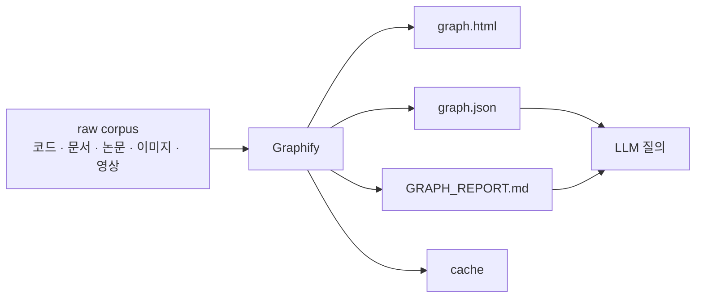
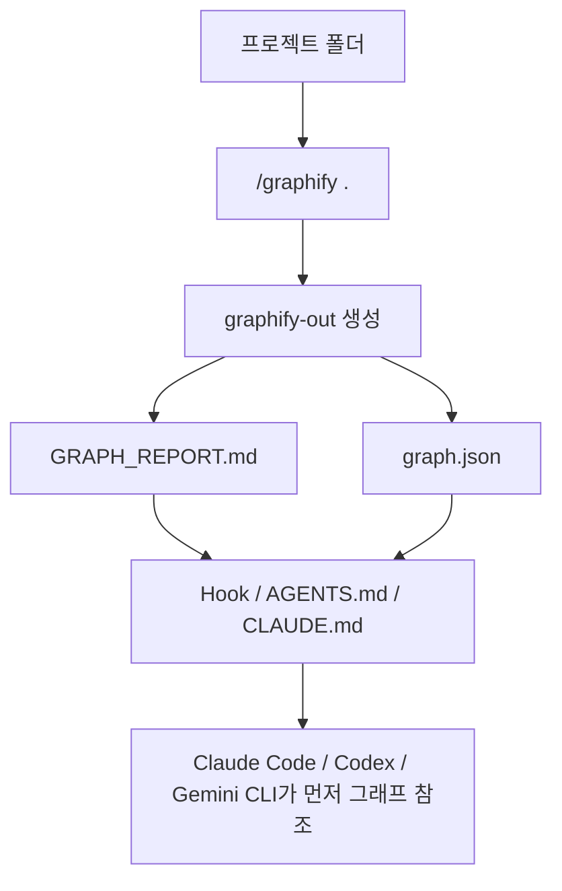

LLM에게 큰 코드베이스나 방대한 문서 폴더를 그대로 읽게 하면, 대부분의 비용은 “찾아다니는 데”서 발생합니다. 관련 없는 파일까지 훑고, 다시 grep 하고, 또 읽고, 요약하면서 토큰을 계속 소모합니다. `Graphify` 는 이 문제를 정면으로 겨냥합니다. 먼저 폴더를 한 번 구조화된 지식 그래프로 바꿔 두고, 이후에는 원문 전체가 아니라 그래프를 중심으로 탐색하게 만드는 방식입니다. [YouTube 영상](https://youtu.be/Ma8e25AOtao) [GitHub 저장소](https://github.com/safishamsi/graphify)
<!--more-->

영상은 이 접근이 안드레이 카파시의 `/raw` 폴더 아이디어와 맞닿아 있다고 설명합니다. 논문, 스크린샷, 트윗, 메모, 코드, 문서를 한곳에 모으되, 그다음 단계에서 LLM이 매번 raw corpus를 통째로 훑지 않도록 “지도”를 만들어 두는 것입니다. Graphify README는 이 방식을 `71.5x fewer tokens per query` 라고 설명합니다. 즉 질문할 때마다 원문 전체를 재독해하는 대신, 구조화된 그래프와 요약 리포트를 먼저 보게 함으로써 토큰 비용과 탐색 오류를 동시에 줄이려는 설계입니다. [README 원문](https://raw.githubusercontent.com/safishamsi/graphify/v4/README.md)

2026년 4월 17일 기준 GitHub API 메타데이터를 보면 Graphify는 별 28,613개, 포크 3,130개, 기본 브랜치 `v4`, MIT 라이선스, Python 프로젝트입니다. 영상에서는 tree-sitter로 20개 언어를 지원한다고 소개하지만, 현재 README는 25개 언어 지원으로 업데이트되어 있습니다. 따라서 이 글에서는 영상의 설명과 함께 **현재 저장소 기준 최신 정보** 를 같이 반영합니다. [GitHub API](https://api.github.com/repos/safishamsi/graphify)

## Sources

- https://youtu.be/Ma8e25AOtao
- https://github.com/safishamsi/graphify
- https://raw.githubusercontent.com/safishamsi/graphify/v4/README.md
- https://api.github.com/repos/safishamsi/graphify

## 1. Graphify의 핵심은 “검색”이 아니라 “사전 구조화”다

영상이 강조하는 첫 번째 포인트는, 폴더 안의 내용을 매번 LLM에게 직접 찾게 하는 방식이 비싸고 부정확하다는 점입니다. LLM은 본질적으로 확률 모델이라서 같은 질문에도 항상 같은 경로로 탐색하지 않습니다. 코드베이스가 커질수록 관련 없는 파일을 많이 읽고, 문맥을 놓치고, 때로는 애매한 추론을 섞을 가능성도 커집니다.

Graphify는 여기서 접근을 바꿉니다. 파일을 질문 때마다 읽게 하지 않고, 먼저 코드·문서·이미지·영상·오디오를 분석해서 **지식 그래프** 로 바꿉니다. 그 결과 `graph.html`, `GRAPH_REPORT.md`, `graph.json`, `cache/` 같은 산출물이 생기고, 이후 질문은 이 구조화된 출력물을 중심으로 진행됩니다. 다시 말해 Graphify는 “검색을 잘하는 LLM”이 아니라, “LLM이 탐색할 지도를 먼저 만드는 도구”에 가깝습니다. [README 원문](https://raw.githubusercontent.com/safishamsi/graphify/v4/README.md)

## 2. 토큰 절감의 비밀은 “원문 재독해”를 줄이는 데 있다

영상 제목의 71.5배 토큰 절감은 마법 같은 압축 알고리즘이라기보다, 질문 시점의 탐색 전략 변화에 가깝습니다. 기존 방식에서는 LLM이 필요한 답을 찾기 위해 디렉터리 전체를 훑고, 여러 파일을 읽고, 다시 요약하며 토큰을 씁니다. 반면 Graphify 방식에서는 먼저 생성된 그래프와 리포트가 어느 파일과 개념이 연결되어 있는지 알려 주기 때문에, 모델이 좁은 범위만 보고 답하도록 유도할 수 있습니다.

README도 같은 맥락을 설명합니다. 항상 `graph.json` 전체를 프롬프트에 넣는 것이 아니라, 먼저 `GRAPH_REPORT.md`로 큰 그림을 보고, 필요하면 `graphify query`로 작은 서브그래프를 꺼내 질문에 맞는 컨텍스트만 전달하라는 것입니다. 즉 절감 포인트는 “모든 것을 넣어서 모델이 알아서 찾게 하는 것”이 아니라, **그래프가 이미 관련 범위를 줄여 준 상태에서 LLM은 정리 역할만 하게 만드는 것** 입니다. [README 원문](https://raw.githubusercontent.com/safishamsi/graphify/v4/README.md)

## 3. 구조 추출은 AST, 의미 추출은 LLM, 연결은 그래프가 맡는다

Graphify의 구현은 세 단계로 요약할 수 있습니다. 첫째, 코드 파일은 AST 기반의 결정적 분석으로 구조를 뽑습니다. README는 클래스, 함수, import, 호출 관계, docstring, rationale comment 등을 LLM 없이 추출한다고 설명합니다. 영상에서도 이 점을 강조하면서, code를 code로 분석하기 때문에 결정적이고 할루시네이션 가능성을 줄여 준다고 말합니다.

둘째, 문서·논문·이미지·트랜스크립트 같은 비정형 자료는 LLM이 병렬 추출합니다. 영상은 Whisper로 영상을 텍스트로 바꾼 다음 그래프로 변환한다고 설명하고, README는 faster-whisper를 이용해 오디오와 비디오를 전사한다고 적고 있습니다. 셋째, 이렇게 얻은 관계를 NetworkX 그래프로 합치고, Leiden community detection으로 커뮤니티를 찾습니다. 이때 README는 **클러스터링은 embedding이 아니라 graph topology 기반** 이라고 밝힙니다. [README 원문](https://raw.githubusercontent.com/safishamsi/graphify/v4/README.md)

즉 Graphify는 “전부 임베딩해서 벡터 검색”하는 계열과 조금 다릅니다. 구조 추출은 정적 분석, 의미 추출은 LLM, 군집화는 그래프 위상으로 나누어 처리합니다. 이 조합이 영상에서 말하는 “결정적” 특성과 “토큰 절감”의 근거가 됩니다.

## 4. 중요한 것은 그래프 자체보다 “정직한 관계 표기”다

README에서 특히 좋은 점은 모든 관계를 같은 수준의 진실처럼 다루지 않는다는 점입니다. 각 관계는 `EXTRACTED`, `INFERRED`, `AMBIGUOUS` 같은 태그를 붙여, 소스에서 직접 찾은 것인지, 그럴듯한 추론인지, 검토가 필요한 애매한 연결인지를 구분합니다. [README 원문](https://raw.githubusercontent.com/safishamsi/graphify/v4/README.md)

이 설계는 실무에서 꽤 중요합니다. LLM 기반 도구가 위험해지는 순간은 “추론한 내용도 사실처럼 보일 때”입니다. Graphify는 추출과 추론을 한 그래프 안에 넣되, 둘을 동일한 신뢰도로 취급하지 않게 만듭니다. 그래서 사용자는 무엇이 확정된 구조이고 무엇이 의미적 추론인지 더 명확히 볼 수 있습니다.

## 5. 캐시와 업데이트 전략이 있어야 지식 그래프가 실제로 쓸 만해진다

영상에서도 언급되지만, Graphify는 `cache/`를 두고 변경된 파일만 다시 처리하는 식으로 업데이트 비용을 줄입니다. README 역시 SHA256 캐시를 사용해 바뀐 파일만 재처리한다고 설명합니다. [README 원문](https://raw.githubusercontent.com/safishamsi/graphify/v4/README.md)

이 부분은 생각보다 중요합니다. 지식 그래프 도구가 처음 한 번만 멋있고 이후 유지가 불편하면, 결국 다시 raw 파일 탐색으로 돌아가게 됩니다. Graphify는 아예 `--update`, `--cluster-only`, `.graphifyignore` 같은 옵션을 제공해 재생성 비용을 낮춥니다. 즉 “대형 코드베이스를 매번 처음부터 다시 읽는 도구”가 아니라, **지속적으로 유지되는 보조 인덱스** 로 쓰도록 설계되어 있습니다.

## 6. Claude Code, Codex, Gemini CLI에 항상 그래프를 먼저 보게 만드는 것이 핵심이다

Graphify는 단순히 그래프 파일을 만드는 데서 끝나지 않습니다. README를 보면 Claude Code, Codex, OpenCode, Cursor, Gemini CLI, GitHub Copilot CLI, VS Code Copilot Chat, Aider, OpenClaw, Factory Droid, Trae, Hermes, Kiro, Google Antigravity 같은 다양한 도구에 설치할 수 있게 되어 있습니다. [README 원문](https://raw.githubusercontent.com/safishamsi/graphify/v4/README.md)

특히 흥미로운 부분은 “always-on” 설치 방식입니다. 예를 들어 Claude Code에는 `CLAUDE.md` 섹션과 PreToolUse hook을 깔아서, Glob이나 Grep를 호출하기 전에 `GRAPH_REPORT.md`를 먼저 보라고 유도합니다. Codex도 `AGENTS.md`와 hook을 이용해 비슷한 효과를 냅니다. 즉 Graphify의 진짜 힘은 그래프 생성 자체보다, **AI coding assistant가 raw 파일 검색보다 그래프 탐색을 먼저 하게 만드는 운영 연결** 에 있습니다.

## 7. 영상의 법령 예시는 “그래프가 클수록 더 유리하다”는 점을 잘 보여 준다

영상은 박정환 님의 `legalize-kr` 같은 방대한 대한민국 법령 저장소를 예로 들며, 이런 대형 문서 집합일수록 Graphify가 유리하다고 설명합니다. 법령처럼 문서 수가 많고 연결 관계가 복잡한 데이터는 LLM이 그때그때 raw corpus를 읽게 하면 비용이 크고, 답변도 흔들리기 쉽습니다. 반대로 그래프를 먼저 만들어 두면, 특정 법 조항이나 개념과 연결된 노드들을 중심으로 탐색 범위를 줄일 수 있습니다.

이 예시는 코드베이스뿐 아니라 문서 아카이브, 논문 폴더, 정책 자료, 사내 위키 dump처럼 “많은 파일 사이의 관계”가 중요한 경우에도 Graphify가 먹힌다는 점을 보여 줍니다. 결국 Graphify는 검색 엔진이라기보다, **복잡한 폴더를 개념 지도로 바꾸는 도구** 로 이해하는 편이 맞습니다.

## 실전 적용 포인트

첫째, 대형 코드베이스에서 “어디를 먼저 읽어야 할지 모르겠다”는 문제가 자주 생긴다면 Graphify가 특히 유효합니다. 아키텍처 이해, 호출 관계, 문서와 코드의 연결을 빠르게 파악하는 데 유리합니다.

둘째, Graphify를 쓴다고 해서 원문을 안 읽어도 되는 것은 아닙니다. 올바른 사용법은 `GRAPH_REPORT.md`로 큰 그림을 보고, `graphify query`로 작은 서브그래프를 꺼낸 뒤, 정말 필요한 원문만 추가로 확인하는 것입니다.

셋째, 비정형 자료가 많은 팀일수록 가치가 커집니다. 코드뿐 아니라 PDF, 마크다운, 이미지, 스크린샷, 영상까지 한 그래프에 합칠 수 있기 때문입니다.

넷째, 영상은 설치를 “AI에게 설치시키는 방식”으로 소개하지만, 현재 공식 README 기준 설치 명령은 `pip install graphifyy && graphify install` 입니다. 패키지 이름이 `graphifyy` 인 점도 헷갈리기 쉬우니 주의할 필요가 있습니다.

## 핵심 요약

- Graphify는 폴더를 질문 때마다 읽는 대신, 먼저 지식 그래프로 구조화한다.
- 핵심 산출물은 `graph.html`, `GRAPH_REPORT.md`, `graph.json`, `cache/` 이다.
- 토큰 절감은 압축 자체보다 “원문 재독해를 줄이는 탐색 전략”에서 나온다.
- 코드 구조는 AST 기반으로 결정적으로 추출하고, 문서·이미지·영상은 LLM과 Whisper를 활용한다.
- 클러스터링은 embedding이 아니라 graph topology 기반으로 수행된다.
- 관계를 `EXTRACTED`, `INFERRED`, `AMBIGUOUS`로 구분해 정직하게 표기한다.
- Claude Code, Codex, Gemini CLI 등에서 hook과 규칙 파일을 통해 그래프를 항상 먼저 보게 만들 수 있다.

## 결론

Graphify가 흥미로운 이유는 “더 똑똑한 모델”을 약속하지 않기 때문입니다. 대신 LLM이 raw 파일을 무작정 뒤지는 상황 자체를 줄이려 합니다. 코드베이스와 문서 폴더를 먼저 그래프로 바꿔 두고, 이후 질의는 이 구조를 중심으로 좁혀 가게 만듭니다. 토큰을 71.5배 줄인다는 말도 결국 이 운영 철학의 결과입니다.

앞으로 AI coding assistant를 잘 쓰는 방법은 모델을 바꾸는 것만이 아니라, **모델이 탐색하는 환경을 어떻게 구조화하느냐** 에 더 가까워질 가능성이 큽니다. 그런 관점에서 Graphify는 단순한 시각화 도구가 아니라, “LLM이 큰 코드베이스를 읽는 방식” 자체를 바꾸는 실험으로 볼 만합니다.
