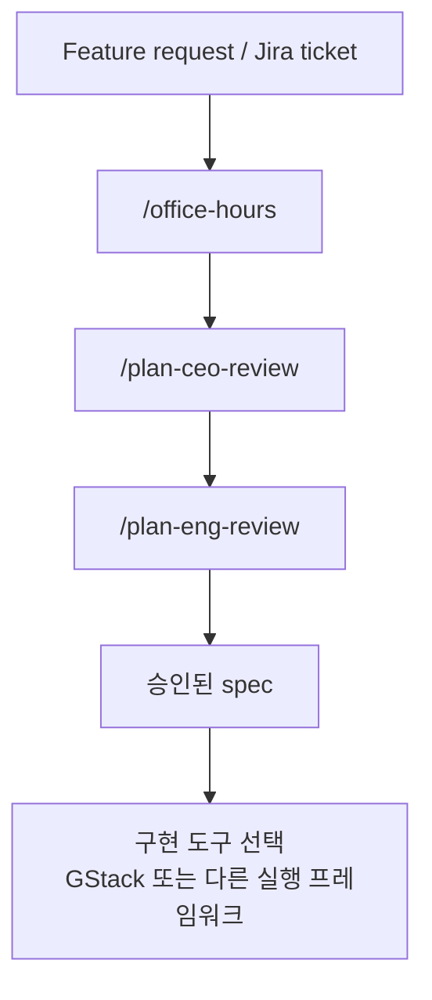

AI 코딩 도구를 쓰다 보면 보통 관심은 구현 속도에 쏠립니다. 얼마나 빨리 코드를 쓰는지, 테스트를 얼마나 자동화하는지, QA를 얼마나 대신해 주는지 같은 부분입니다. 그런데 이 영상은 GStack에서 진짜 사람들이 과소평가하는 부분이 `planning workflow` 라고 말합니다. 요지는 간단합니다. **코딩 전에 문제 정의와 범위를 제대로 줄이면, 뒤에서 고칠 일을 몇 주 단위로 줄일 수 있다** 는 것입니다. [YouTube 영상](https://youtu.be/6kM27uGP4n4)
<!--more-->

영상의 사례는 실제 유료 고객이 있는 SaaS 프로젝트에 AI chat 기능을 붙이는 과정입니다. 사용자는 “지출 데이터를 자연어로 질문하고 SQL로 변환해 조회하는 기능”을 만들고 싶어 하지만, 막상 요구사항을 늘어놓기 시작하자 요약, 이상 지출 탐지, 차트, 표, 대시보드 저장, 대화 저장, 크레딧 시스템 연동까지 한꺼번에 붙습니다. 여기서 GStack planning은 “좋은 아이디어를 빨리 구현하는 도구”라기보다, **그 아이디어가 지금 만들어도 되는 범위인지부터 따지는 도구** 로 작동합니다.

공식 gstack 설명도 비슷한 방향을 가리킵니다. gstack은 blank prompt 대신 ordered workflow를 제공하고, `/office-hours`, `/plan-ceo-review`, `/plan-eng-review`, `/review`, `/qa`, `/ship` 같은 순서로 sprint를 운영한다고 설명합니다. 2026년 4월 17일 기준 GitHub 저장소 페이지에는 별 74.4k, 포크 10.5k가 표시됩니다. [gstack.lol](https://gstack.lol/) [GitHub 저장소](https://github.com/garrytan/gstack)

## Sources

- https://youtu.be/6kM27uGP4n4
- https://gstack.lol/
- https://github.com/garrytan/gstack

## 1. planning이 시간을 아끼는 이유는 “더 잘 짜서”가 아니라 “덜 만들게 해서”다

영상 초반에 발표자가 보여 주는 장면은 인상적입니다. 코드를 한 줄도 쓰기 전에 CEO, 디자인, 엔지니어링, QA, devil's advocate 관점에서 스펙을 검토하게 만듭니다. 언뜻 보면 단계가 많아져서 느려질 것 같지만, 발표자의 결론은 반대입니다. 이렇게 먼저 좁혀 두는 시간이 결국 몇 주를 아낀다는 것입니다.

이 말이 설득력 있는 이유는 많은 개발 지연이 구현 난이도보다 **잘못 잡은 범위** 에서 나오기 때문입니다. 처음부터 플랫폼 수준의 기능을 MVP처럼 들고 가면, 구현 시간이 오래 걸리는 것보다 더 큰 문제가 생깁니다. 무엇이 핵심인지 불분명해지고, 성공 기준도 흔들리고, 나중에 대부분을 뜯어고치게 됩니다. planning pipeline은 이 과잉 범위를 미리 잘라내는 역할을 합니다.

## 2. `/office-hours` 는 요구사항을 더 받는 단계가 아니라, 문제를 다시 쓰는 단계다

공식 사이트와 GitHub 설명에서 `/office-hours` 는 feature request를 더 날카로운 문제와 더 나은 wedge로 바꾸는 단계로 설명됩니다. 영상에서도 비슷하게 작동합니다. 사용자가 “AI chat 기능”이라고 말하면, GStack은 바로 구현 계획으로 들어가지 않고 먼저 질문을 던집니다. 이 프로젝트는 해커톤용인지, 이미 paying customer가 있는지, 지금 중요한 지표가 무엇인지, 기존 프로젝트의 코딩 패턴을 복사해도 되는지 같은 질문들입니다. [gstack.lol](https://gstack.lol/) [GitHub 저장소](https://github.com/garrytan/gstack)

이 질문들이 중요한 이유는, 같은 기능 이름이라도 상황에 따라 정답이 달라지기 때문입니다. 유료 고객이 이미 있는 제품이라면, 새로운 기능의 “멋짐”보다 이번 주에 실제로 쓰일 가장 작은 버전이 무엇인지가 더 중요합니다. 영상에서 GStack이 던지는 “이번 주에 유료 고객이 실제로 쓸 최소 버전은 무엇인가?”라는 질문은 바로 그 점을 찌릅니다.

## 3. `/plan-ceo-review` 의 핵심은 scope pushback이다

영상에서 가장 인상적인 장면은 사용자가 한 번에 너무 많은 요구사항을 넣었을 때, GStack이 그대로 받아 적지 않는 부분입니다. spend analysis, 차트, 저장, 대시보드 커스터마이징, 크레딧 과금까지 한꺼번에 넣자, GStack은 이것이 wedge가 아니라 platform이라고 되받아칩니다. 즉 “좋은 아이디어가 많다”는 사실과 “지금 만들어야 한다”는 판단을 분리합니다.

GitHub README도 `/plan-ceo-review` 를 단순 검토가 아니라 “Find the 10-star product hiding inside the request”라고 설명합니다. 또한 Expansion, Selective Expansion, Hold Scope, Reduction 같은 네 가지 모드를 둬 범위를 넓힐지, 선택적으로 넓힐지, 유지할지, 줄일지를 판단하게 합니다. [GitHub 저장소](https://github.com/garrytan/gstack)

이 단계가 주는 가치가 큽니다. 대부분의 AI 코딩 워크플로는 사용자가 말한 범위를 가능한 한 빨리 구현하려고 합니다. 반면 GStack planning은 오히려 **왜 그 범위를 지금 구현하면 안 되는지** 를 먼저 따집니다. 개발 속도를 높이는 비결이 “더 빨리 만들기”가 아니라 “지금 안 만들 것을 정확히 버리기”에 있다는 점을 보여 줍니다.

## 4. `/plan-eng-review` 는 아이디어를 시스템 제약으로 번역한다

공식 설명에 따르면 `/plan-eng-review` 는 architecture, data flow, edge cases, tests를 고정시키는 단계입니다. 영상에서도 planning 세션은 단순 PM 대화에서 멈추지 않고, 기존 코드베이스의 AI chat 구조, 데이터 모델, 서비스 레이어를 먼저 파악한 다음 그 위에서 계획을 세웁니다. [GitHub 저장소](https://github.com/garrytan/gstack)

이 부분이 중요한 이유는 scope를 줄이는 것만으로는 충분하지 않기 때문입니다. “이번 MVP는 이상 지출 요약만 하자”라고 정했다고 해도, 실제 구현으로 들어가면 여전히 데이터 접근 경로, SQL 생성 방식, 실패 모드, UI 표현 방식, 테스트 범위 같은 문제가 남습니다. `/plan-eng-review` 는 막연한 제품 요구를 **구현 가능한 시스템 계약** 으로 바꾸는 단계라고 볼 수 있습니다.

특히 README가 “ASCII diagrams for data flow, state machines, error paths, test matrix, failure modes, security concerns”라고 설명하는 부분은, 이 단계가 단순 설계 문서 쓰기가 아니라 구현자가 빠뜨리기 쉬운 제약을 미리 드러내는 과정임을 보여 줍니다.

## 5. planning pipeline은 “무엇을 만들까”보다 “왜 지금 이 버전이어야 하나”를 묻는다

영상에서 GStack이 던지는 질문은 꽤 product-minded합니다. 사용자를 직접 지켜본 적이 있는지, 예상과 다르게 쓰는 부분이 있었는지, 정말로 이번 주에 입소문을 만들 수 있는 기능은 무엇인지 묻습니다. 이런 질문은 종종 개발자가 귀찮아하는 영역이지만, 실제로는 MVP 설계에서 가장 중요한 질문입니다.

흥미로운 점은 GStack이 planning을 추상적인 브레인스토밍으로 끝내지 않는다는 것입니다. 공식 설명처럼 `/office-hours` 가 design doc을 만들고, 그 design doc을 `/plan-ceo-review` 가 읽고, 이어서 `/plan-eng-review` 와 `/qa`, `/ship` 까지 이어집니다. 즉 planning은 별도의 문서 작업이 아니라, 이후 전 과정을 묶는 첫 번째 컨텍스트입니다. [GitHub 저장소](https://github.com/garrytan/gstack)

## 6. 영상의 교훈은 “GStack은 구현보다 planning에서 더 빛날 수 있다”는 점이다

발표자는 이 프로젝트에서 구현 파이프라인은 Superpower 같은 다른 도구를 더 선호할 수 있다고 말합니다. 왜냐하면 test-driven 요소는 다른 프레임워크가 더 강할 수 있기 때문입니다. 대신 그는 GStack이 특히 빛나는 부분으로 planning을 꼽습니다. 이 말은 GStack을 무조건 end-to-end로 다 써야 한다는 뜻이 아니라, **planning stage에서만 가져와도 충분히 값어치가 크다** 는 뜻으로 읽힙니다.

이 관점은 실전적입니다. 어떤 프레임워크든 전부 채택하려고 하면 무거워지기 쉽습니다. 하지만 “기능 요청을 wedge로 좁히고, scope pushback을 받고, 설계·테스트 관점의 결함을 코딩 전에 드러낸다”는 planning 부분만 가져와도, 많은 팀에서 충분히 효과를 볼 수 있습니다.

## 실전 적용 포인트

첫째, AI에게 기능을 던지기 전에 “이번 주에 실제 사용자가 쓰게 될 최소 기능이 무엇인가?”라는 질문을 먼저 던져 보는 것만으로도 효과가 큽니다. planning pipeline의 핵심은 바로 이 질문입니다.

둘째, 요구사항을 한꺼번에 모아서 “다 필요하다”고 느껴질 때일수록 `/plan-ceo-review` 같은 scope pushback이 유용합니다. 지금 필요한 것은 기능 목록이 아니라, 입소문을 만들 핵심 wedge일 수 있습니다.

셋째, planning 결과는 구현 문서와 테스트 기준으로 이어져야 합니다. 그렇지 않으면 planning은 그럴듯한 대화로 끝나고, 실제 코딩은 다시 즉흥적으로 흘러갑니다.

넷째, GStack을 전부 채택하지 않더라도 planning workflow만 선택적으로 가져오는 전략이 가능합니다. 영상의 사례도 그 방향을 보여 줍니다.

## 핵심 요약

- 이 영상은 GStack에서 가장 과소평가되는 기능으로 planning workflow를 꼽는다.
- planning이 시간을 아끼는 이유는 코드를 더 빨리 쓰게 해서가 아니라, 범위를 미리 줄여서다.
- `/office-hours` 는 문제를 다시 정의하고 더 나은 wedge를 찾는 단계다.
- `/plan-ceo-review` 는 scope pushback을 통해 플랫폼 수준 요구를 MVP로 줄인다.
- `/plan-eng-review` 는 제품 요구를 architecture, data flow, failure mode, test plan으로 번역한다.
- GStack은 구현 프레임워크이기 전에 sprint 순서를 강제하는 workflow system에 가깝다.
- 실전에서는 GStack 전체보다 planning 파트만 먼저 도입해도 효과를 볼 수 있다.

## 결론

이 영상이 보여 주는 가장 큰 포인트는, AI 코딩에서 진짜 병목이 종종 구현 속도가 아니라 **무엇을 만들지 제대로 못 정한 상태** 라는 점입니다. 잘못 잡은 범위는 아무리 빠르게 코드를 써도 결국 되돌아오고, 그 비용은 며칠이 아니라 몇 주가 될 수 있습니다.

그런 의미에서 GStack planning pipeline은 “코딩 전 회의가 하나 더 늘어난다”는 도구가 아닙니다. 오히려 코딩 전에 scope를 줄이고, 유료 고객이 이번 주에 실제로 쓸 가장 작은 wedge를 찾고, 그 뒤에야 실행하게 만드는 제동 장치에 가깝습니다. 개발 속도를 높이는 가장 현실적인 방법 중 하나가 **덜 만들 것을 먼저 결정하는 것** 이라면, 이 planning workflow는 분명 값어치가 있습니다.
