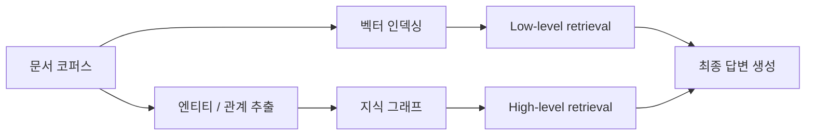
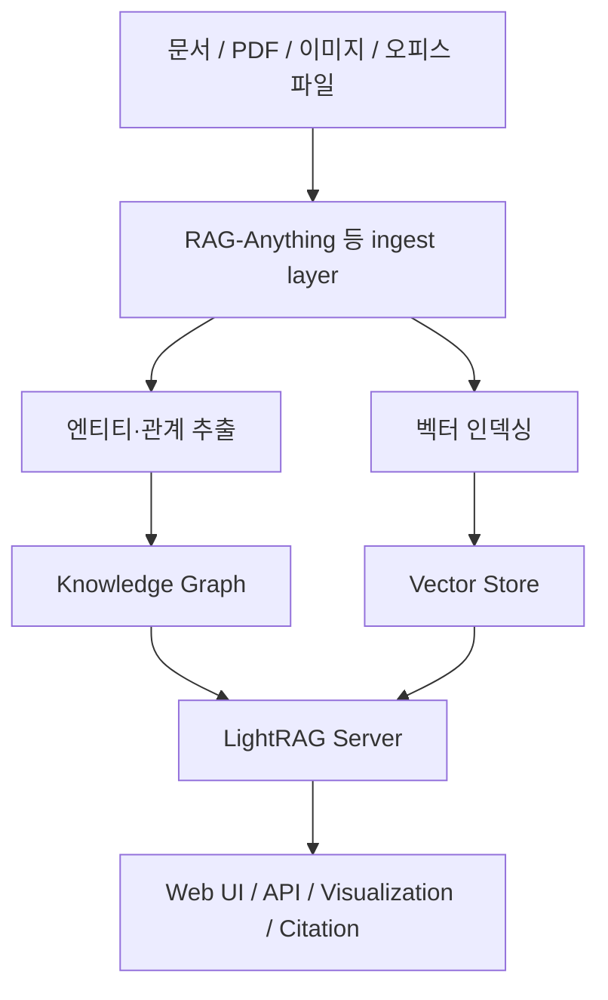

LightRAG는 이제 단순히 “Graph RAG 오픈소스 하나”로 보기 어려운 프로젝트가 됐습니다. 출발은 `Simple and Fast Retrieval-Augmented Generation` 이었지만, 현재 저장소를 보면 Web UI, API 서버, 여러 스토리지 백엔드, reranker, citation, tracing, evaluation, 멀티모달 연동까지 붙으면서 사실상 하나의 RAG 플랫폼처럼 진화하고 있습니다. [GitHub 저장소](https://github.com/HKUDS/LightRAG)
<!--more-->

논문 초록이 설명하는 LightRAG의 본질은 분명합니다. 기존 RAG가 평평한 chunk 표현과 약한 문맥 인식 때문에 복잡한 상호관계를 놓치기 쉽다는 문제를 겨냥해, LightRAG는 텍스트 인덱싱과 검색에 그래프 구조를 통합합니다. 그리고 low-level / high-level의 **dual-level retrieval** 로 세부 사실과 상위 개념을 함께 찾도록 설계합니다. [arXiv](https://arxiv.org/abs/2410.05779)

2026년 4월 18일 기준 GitHub API 메타데이터를 보면 LightRAG는 별 33,678개, 포크 4,776개, 기본 브랜치 `main`, MIT 라이선스, Python 프로젝트입니다. 최근 업데이트를 보면 OpenSearch 통합, setup wizard, local deployment via Docker, RAGAS 평가, Langfuse tracing, reranker default mode, 문서 삭제 후 KG 재생성, PostgreSQL·MongoDB·Neo4j·OpenSearch 같은 스토리지 선택지까지 이미 꽤 폭넓게 들어와 있습니다. [GitHub API](https://api.github.com/repos/HKUDS/LightRAG) [README 원문](https://raw.githubusercontent.com/HKUDS/LightRAG/main/README.md)

## Sources

- https://github.com/HKUDS/LightRAG
- https://raw.githubusercontent.com/HKUDS/LightRAG/main/README.md
- https://api.github.com/repos/HKUDS/LightRAG
- https://arxiv.org/abs/2410.05779

## 1. LightRAG의 핵심은 “벡터 검색 + 그래프 검색”이 아니라 두 레벨의 문맥 회수다

논문 초록은 LightRAG가 graph structures를 indexing과 retrieval 과정에 통합한다고 설명합니다. 중요한 것은 단순히 그래프를 추가했다는 사실보다, 이것이 **low-level knowledge discovery** 와 **high-level knowledge discovery** 를 함께 가능하게 한다는 점입니다. [arXiv](https://arxiv.org/abs/2410.05779)

이 말은 결국 질문의 종류가 둘이라는 뜻입니다. 하나는 “정확히 어떤 사실이 어디에 있나” 같은 로컬 질문이고, 다른 하나는 “이 문서 집합 전체에서 어떤 패턴과 관계가 보이나” 같은 전역 질문입니다. 일반적인 벡터 RAG는 첫 번째에는 어느 정도 강하지만, 두 번째에서는 관계가 잘게 끊기기 쉽습니다. LightRAG는 entity와 relation을 그래프로 묶어 두기 때문에, 검색이 단순 chunk 유사도에서 끝나지 않고 관계 구조를 타고 이어질 수 있습니다.

## 2. “Simple and Fast”는 구현이 가볍다는 뜻이 아니라, Graph RAG의 복잡성을 감춘다는 뜻에 가깝다

LightRAG가 처음 주목받았던 이유 중 하나는 Graph RAG의 성능적 장점을 비교적 단순한 개발 경험으로 제공했기 때문입니다. README를 보면 지금도 core와 server를 나눠 제공하고, 예제 코드와 Web UI, Docker Compose, PyPI 패키지까지 준비되어 있습니다. [README 원문](https://raw.githubusercontent.com/HKUDS/LightRAG/main/README.md)

이 점이 중요합니다. Graph RAG는 원래 엔티티 추출, 관계 추출, 그래프 저장, 벡터 저장, 쿼리 결합 같은 단계가 많아 구현 난도가 높습니다. LightRAG는 이 복잡한 내부를 감추고, 사용자는 문서를 넣고 질의하고 시각화하는 경험을 비교적 짧은 경로로 얻을 수 있게 만듭니다. “simple”은 알고리즘이 단순하다는 말이 아니라, **사용자가 감당해야 하는 복잡성이 상대적으로 낮다** 는 뜻으로 읽는 편이 맞습니다.

## 3. 2026년의 LightRAG는 라이브러리보다 서버 제품에 가깝다

현재 README에서 가장 눈에 띄는 변화는 `LightRAG Server` 가 사실상 전면으로 나와 있다는 점입니다. Web UI, API, knowledge graph visualization, Ollama-compatible interface까지 제공하고, `lightrag-server` 로 바로 올릴 수 있게 되어 있습니다. [README 원문](https://raw.githubusercontent.com/HKUDS/LightRAG/main/README.md)

이 변화는 실무적으로 큽니다. 예전에는 RAG 라이브러리를 붙이면 결국 팀이 별도 UI와 운영 레이어를 만들어야 했습니다. 하지만 LightRAG는 이제 문서 삽입, 질의, 시각화, API 제공을 하나의 서버 경험으로 묶어 줍니다. 즉 “논문 구현체”에서 “운영 가능한 서비스 컴포넌트” 쪽으로 무게중심이 옮겨갔다고 볼 수 있습니다.

## 4. 최근 업데이트를 보면 프로젝트 방향이 선명하다: 통합 스토리지, reranker, 평가, 추적

README의 뉴스 섹션은 단순 changelog 이상입니다. 프로젝트가 어디로 가는지가 드러납니다. [README 원문](https://raw.githubusercontent.com/HKUDS/LightRAG/main/README.md)

- OpenSearch를 unified storage backend로 통합
- setup wizard 추가
- Docker를 통한 embedding, reranking, storage backend 로컬 배포 지원
- RAGAS 평가와 Langfuse tracing 통합
- reranker 지원 및 mixed query 기본 모드 권장
- 문서 삭제와 자동 KG regeneration
- PostgreSQL, MongoDB, Neo4j, OpenSearch 등 다양한 스토리지 지원

이것이 의미하는 바는 분명합니다. LightRAG는 단순 retrieval 품질 경쟁만 하는 프로젝트가 아니라, **운영성과 관측 가능성, 그리고 스토리지 선택권** 까지 포함하는 방향으로 확장되고 있습니다. 실전 RAG는 정확도만으로 끝나지 않습니다. 어떤 문맥이 회수됐는지, 추적이 가능한지, 재인덱싱과 삭제가 쉬운지, 저장소를 어떻게 가져갈지까지 모두 중요합니다.

## 5. LightRAG가 요구하는 모델 스펙은 생각보다 높다

README는 LightRAG의 LLM 요구사항이 traditional RAG보다 높다고 분명히 적습니다. 문서 인덱싱 단계에서 엔티티-관계 추출을 해야 하기 때문입니다. 최소 32B급 LLM, 최소 32KB 컨텍스트, 가능하면 64KB 컨텍스트를 권장하고, 인덱싱 단계에서는 reasoning model을 추천하지 않습니다. 쿼리 단계에서는 인덱싱에 쓴 모델보다 더 강한 모델을 권장합니다. [README 원문](https://raw.githubusercontent.com/HKUDS/LightRAG/main/README.md)

이 부분은 LightRAG를 오해하지 않게 해 줍니다. Graph RAG가 잘 작동하는 이유는 마법 같은 인덱스 때문만이 아니라, 초기 문서 처리 단계에서 LLM이 더 어려운 일을 하기 때문입니다. 즉 나이브 RAG보다 성능이 좋아질 수 있지만, 그만큼 인덱싱 비용과 모델 요구 수준도 올라갈 수 있습니다.

## 6. reranker와 mix mode는 현재 LightRAG의 실전 기본값에 가깝다

README는 reranker를 켜면 mixed query mode를 기본으로 두는 것을 권장합니다. 이 문장은 사소해 보이지만 중요합니다. LightRAG의 retrieval이 이제 단순 “벡터냐 그래프냐”가 아니라, **검색 단계의 여러 신호를 다시 정렬하는 체계** 로 진화하고 있다는 뜻이기 때문입니다. [README 원문](https://raw.githubusercontent.com/HKUDS/LightRAG/main/README.md)

실무에서 retrieval 품질은 첫 번째 후보를 얼마나 잘 뽑느냐뿐 아니라, 그 후보들을 최종 질문에 맞게 얼마나 잘 재정렬하느냐에 크게 좌우됩니다. Graph RAG라고 해서 reranker가 필요 없어지는 것이 아니고, 오히려 다양한 회수 경로를 섞을수록 reranker의 가치가 커집니다. LightRAG가 mixed mode + reranker를 기본값처럼 밀고 있는 이유도 여기에 있습니다.

## 7. 멀티모달 확장은 별도 프로젝트이지만, 이제는 LightRAG 생태계 안으로 들어왔다

README는 `RAG-Anything` 통합을 통해 텍스트뿐 아니라 PDFs, images, Office documents, tables, formulas까지 처리할 수 있다고 설명합니다. 엄밀히 말하면 멀티모달 문서 처리는 LightRAG 자체보다 확장 생태계에 가깝지만, 사용자 관점에서는 이미 같은 흐름으로 연결됩니다. [README 원문](https://raw.githubusercontent.com/HKUDS/LightRAG/main/README.md)

이 점은 LightRAG의 위상을 바꿉니다. 예전에는 “텍스트용 Graph RAG”였다면, 지금은 멀티모달 ingest와 서버 UI, 평가/추적, 스토리지 선택지까지 연결된 중심 허브 역할을 하고 있습니다. 특히 사내 지식베이스처럼 PDF, 표, 스캔 문서, 프레젠테이션이 섞인 환경에서는 이 생태계화가 중요합니다.

## 실전 적용 포인트

첫째, 단순 FAQ 검색이나 짧은 chunk 회수만 필요하다면 LightRAG가 과할 수 있습니다. 하지만 문서 간 관계, 인물/개체 연결, 전역 요약, 상위 개념 질의가 중요해지는 순간 LightRAG의 듀얼 레벨 검색이 의미를 갖습니다.

둘째, 인덱싱 모델을 가볍게 고르면 Graph RAG 품질도 흔들릴 수 있습니다. README가 32B 이상 모델과 충분한 컨텍스트를 권장하는 이유를 무시하기 어렵습니다.

셋째, 지금의 LightRAG는 라이브러리만 보는 것보다 server/Web UI/API 기준으로 검토하는 편이 현실적입니다. 팀 협업과 운영을 생각하면 이쪽이 실제 도입 경로가 될 가능성이 큽니다.

넷째, production에 가까운 환경이라면 reranker, tracing, evaluation, citation 기능까지 함께 봐야 합니다. retrieval 품질은 “찾았다/못 찾았다”보다 “왜 그 문맥이 선택됐는가”를 추적할 수 있어야 관리가 됩니다.

## 핵심 요약

- LightRAG의 핵심은 graph structure를 indexing과 retrieval에 통합하는 것이다.
- 논문은 이를 low-level / high-level의 dual-level retrieval로 설명한다.
- 현재 LightRAG는 단순 라이브러리보다 서버 제품에 가까운 형태로 진화했다.
- OpenSearch, PostgreSQL, MongoDB, Neo4j 등 다양한 스토리지를 지원한다.
- reranker, citation, RAGAS evaluation, Langfuse tracing까지 포함해 운영 기능이 강화됐다.
- LightRAG는 traditional RAG보다 더 강한 인덱싱 LLM과 더 신중한 설정을 요구한다.
- 멀티모달 확장은 RAG-Anything와 연결되며 생태계 수준으로 확장되고 있다.

## 결론

LightRAG를 다시 볼 이유는 단순히 유명한 Graph RAG 프로젝트라서가 아닙니다. 이 프로젝트는 “벡터 검색에 그래프를 조금 얹었다” 수준을 넘어, 관계 중심 회수와 상위 수준 문맥 탐색을 하나의 경험으로 묶으려 합니다. 그리고 그 위에 server, visualization, reranker, 평가, 추적, 멀티모달 ingest까지 쌓으면서 실제 운영 가능한 RAG 플랫폼 쪽으로 이동하고 있습니다.

즉 지금의 LightRAG는 논문 구현체와 제품형 시스템의 중간 어디쯤이 아니라, 이미 꽤 많이 제품형에 가까워졌습니다. 문서 간 관계와 전역 문맥이 중요한 RAG를 고민하고 있다면, LightRAG는 여전히 “왜 Graph RAG가 필요한가”를 가장 설득력 있게 보여 주는 오픈소스 중 하나입니다.
