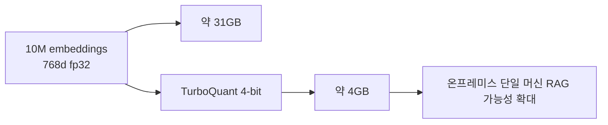

RAG를 실제로 오래 굴려 본 사람이라면, 문제는 모델보다도 벡터 저장소에서 먼저 터지는 경우가 많다는 걸 압니다. 문서 수가 커질수록 임베딩 저장 공간이 커지고, 인덱싱 과정도 무거워지며, 온프레미스 환경에서는 메모리 예산이 곧 설계 제약이 됩니다. 이번 Threads 포스트가 흥미로운 이유는 바로 그 지점을 찌르기 때문입니다. Google Research의 `TurboQuant` 알고리즘을 RAG 쪽으로 가져온 `pyturboquant`가 공개됐고, 1,000만 chunk 규모에서 기존 float32 기준 약 31GB가 필요하던 인덱스를 약 4GB 수준으로 줄일 수 있다고 소개합니다. [Threads 원문](https://www.threads.com/@feelfree_ai/post/DXQ4zBMgF9W?xmt=AQF03oUnKsN-CjG0sqM7MqP6iOmFI3_Q_HYJoDXNuNOfNc2YhM-kId6WyfW4YRSDa4Y6LcA&slof=1)
<!--more-->

이 수치는 README에도 거의 같은 맥락으로 설명됩니다. `BGE-base` 같은 768차원 임베딩을 4비트 inner-product quantizer로 저장하면, 벡터 하나당 약 392바이트만 쓰게 됩니다. float32의 3,072바이트와 비교하면 10M chunk에서 대략 31GB vs 4GB 정도가 됩니다. 핵심은 단순 압축률이 아닙니다. **학습 없는 온라인 양자화라서 새 문서를 넣을 때 codebook 재학습이나 대규모 재인덱싱이 필요 없다는 점** 이 더 중요합니다. [README 원문](https://raw.githubusercontent.com/jorgebmann/pyturboquant/main/README.md)

2026년 4월 18일 기준 GitHub API 메타데이터를 보면 `jorgebmann/pyturboquant`는 별 59개, 포크 4개, 기본 브랜치 `main`, MIT 라이선스, Python 프로젝트입니다. 저장소 설명은 “A Python implementation of Google's TurboQuant framework (WIP)”로 되어 있고, 현재 LangChain 지원이 들어가 있으며 LlamaIndex는 roadmap에 올라 있습니다. [GitHub API](https://api.github.com/repos/jorgebmann/pyturboquant) [GitHub 저장소](https://github.com/jorgebmann/pyturboquant)

## Sources

- https://www.threads.com/@feelfree_ai/post/DXQ4zBMgF9W?xmt=AQF03oUnKsN-CjG0sqM7MqP6iOmFI3_Q_HYJoDXNuNOfNc2YhM-kId6WyfW4YRSDa4Y6LcA&slof=1
- https://github.com/jorgebmann/pyturboquant
- https://raw.githubusercontent.com/jorgebmann/pyturboquant/main/README.md
- https://api.github.com/repos/jorgebmann/pyturboquant
- https://arxiv.org/abs/2504.19874

## 1. 왜 이 이야기가 RAG에서 중요한가: 병목이 “모델”이 아니라 “벡터 저장소”일 수 있어서다

RAG를 작게 돌릴 때는 벡터 하나가 몇 KB인지 잘 체감되지 않습니다. 하지만 chunk 수가 수백만~수천만 개로 커지면 얘기가 달라집니다. 768차원 임베딩을 float32로 저장하면 벡터 하나당 3,072바이트가 필요합니다. 1,000만 개면 30GB가 훌쩍 넘어갑니다. 여기에 메타데이터와 문서 payload, 검색 엔진 오버헤드까지 붙으면 단일 머신 예산이 빠르게 커집니다. [README 원문](https://raw.githubusercontent.com/jorgebmann/pyturboquant/main/README.md)

그래서 pyturboquant의 포인트는 단순히 “압축도 된다”가 아닙니다. **온프레미스나 air-gapped 환경에서, 임베딩 저장소를 여전히 한 대의 워크스테이션이나 서버 안에 우겨 넣을 수 있게 만든다** 는 점입니다. Threads가 프라이버시와 로컬 환경을 같이 강조한 이유도 여기에 있습니다.

## 2. TurboQuant의 핵심은 데이터-독립 온라인 양자화다

논문 초록은 TurboQuant를 `data-oblivious algorithms, suitable for online applications` 라고 설명합니다. 즉 기존 Product Quantization 계열처럼 샘플을 뽑아 codebook을 학습하고, 데이터 분포가 바뀌면 다시 훈련해야 하는 방식과 다릅니다. [arXiv](https://arxiv.org/abs/2504.19874)

README도 같은 점을 더 실용적으로 풀어 줍니다. `zero indexing time -- no codebook training, no k-means, no data passes` 라고 적습니다. 벡터는 랜덤 회전과 미리 계산된 Lloyd-Max codebook을 통해 **서로 독립적으로** 양자화됩니다. 이 말은 새 문서가 들어와도 기존 인덱스를 다시 훈련할 필요가 없다는 뜻입니다. 스트리밍 ingest에 잘 맞는 이유가 바로 여기 있습니다. [README 원문](https://raw.githubusercontent.com/jorgebmann/pyturboquant/main/README.md)

## 3. “31GB → 4GB”는 마케팅 문구가 아니라 768차원 임베딩의 계산 결과다

README는 per-vector storage cost를 명시적으로 적습니다. inner-product quantizer에서 `bits=b`일 때 저장 비용은 `d*b/8 + 8` 바이트입니다. [README 원문](https://raw.githubusercontent.com/jorgebmann/pyturboquant/main/README.md)

예를 들어 `BGE-base / Gemma embeddings` 같은 768차원 임베딩은:

- float32: 3,072 bytes
- fp16: 1,536 bytes
- 4-bit quantization: 392 bytes

입니다. 이걸 1,000만 개에 곱하면:

- float32: 약 30.7GB
- 4-bit: 약 3.9GB

가 됩니다. Threads의 “31GB가 4GB가 된다”는 표현은 바로 이 계산을 대중적으로 풀어 쓴 것입니다. 중요한 건 이 압축이 단순 파일 압축이 아니라, **유사도 검색에 바로 쓸 수 있는 형태로 벡터를 줄인 것** 이라는 점입니다.

## 4. 양자화가 빠른 이유는 “벡터마다 독립 처리”되기 때문이다

일반적인 벡터 압축 방식이 귀찮은 이유는 사전 학습입니다. 샘플을 뽑고, k-means로 codebook을 만들고, 분포가 바뀌면 드리프트를 걱정해야 합니다. pyturboquant는 이 부분을 크게 줄입니다. README의 비교 표에서도 FAISS IVF/PQ와 ScaNN은 training required이고 drift 시 rebuild가 필요하다고 적혀 있습니다. 반면 pyturboquant는 training이 없고 online ingestion이 가능하다고 설명합니다. [README 원문](https://raw.githubusercontent.com/jorgebmann/pyturboquant/main/README.md)

이 차이는 운영에서 큽니다. 대규모 RAG는 한번 색인하고 끝나는 경우보다, 문서가 계속 들어오는 경우가 더 많습니다. 문서가 들어올 때마다 재학습과 재인덱싱이 필요하면 운영 비용이 크게 올라갑니다. 반대로 벡터가 독립적으로 양자화된다면, 인덱스는 append-friendly한 형태를 유지할 수 있습니다.

## 5. 이 방법은 임베딩 모델을 줄이는 게 아니라 벡터 저장소를 줄이는 것이다

README는 scope note에서 아주 중요하게 선을 긋습니다. pyturboquant는 embedding model 자체를 압축하는 것이 아니라 **embedding vector store** 를 압축하는 라이브러리입니다. 즉 임베딩 모델을 돌리는 VRAM은 그대로입니다. 모델 메모리를 줄이려면 AWQ, bitsandbytes, GGUF 같은 모델 양자화가 별도로 필요합니다. [README 원문](https://raw.githubusercontent.com/jorgebmann/pyturboquant/main/README.md)

이 구분은 실무적으로 중요합니다. 온프레미스 RAG 예산은 크게 두 덩어리로 나뉩니다. 하나는 임베딩을 생성하는 모델 비용이고, 다른 하나는 생성된 임베딩을 저장하고 검색하는 인덱스 비용입니다. pyturboquant는 두 번째 문제를 푸는 도구입니다. 따라서 “이걸 쓰면 작은 GPU에서 임베딩 모델도 같이 돌아간다”는 식으로 과대 해석하면 안 됩니다. 정확한 해석은 **저장소가 작아지니, 같은 머신에 같이 올려둘 가능성이 커진다** 입니다.

## 6. 아직 모든 문제를 해결한 것은 아니다: 검색 계산은 현재 O(n)이다

README는 제약도 숨기지 않습니다. 현재 검색 계산은 `O(n) per query` 이고, dense asymmetric matmul을 사용한다고 설명합니다. 즉 저장 메모리는 크게 줄었지만, 검색 복잡도 자체가 서브리니어로 해결된 것은 아닙니다. IVF partitioning 같은 sub-linear search는 v0.5.0 roadmap에 올라 있습니다. [README 원문](https://raw.githubusercontent.com/jorgebmann/pyturboquant/main/README.md)

이 점은 중요합니다. pyturboquant는 “FAISS를 완전히 대체하는 완성형 ANN 시스템”이라기보다, **온라인 양자화라는 primitive를 retrieval 쪽에 가져온 프로젝트** 에 더 가깝습니다. 메모리와 인덱싱 시간 문제를 강하게 풀지만, billion-scale에서의 전체 검색 구조는 아직 발전 중입니다.

## 7. 그래도 지금 매력적인 이유는 RAG의 현실 문제를 정확히 건드리기 때문이다

Threads 포스트가 직감적으로 맞는 이유는, 많은 팀이 겪는 현실 문제와 연결되기 때문입니다. RAG는 “정확도” 얘기를 많이 하지만, 실제 운영에서는 메모리, 프라이버시, 재인덱싱, 지속적 업데이트, 온프레미스 제약이 더 큰 병목일 때가 많습니다. [Threads 원문](https://www.threads.com/@feelfree_ai/post/DXQ4zBMgF9W?xmt=AQF03oUnKsN-CjG0sqM7MqP6iOmFI3_Q_HYJoDXNuNOfNc2YhM-kId6WyfW4YRSDa4Y6LcA&slof=1)

TurboQuant 계열은 바로 이 문제에 답합니다. 코드북 학습 없이 바로 양자화되고, 문서가 계속 들어와도 온라인으로 붙일 수 있으며, 벡터 저장소 크기를 대폭 줄입니다. 특히 로컬 임베딩 모델 + 로컬 벡터 저장소 조합을 선호하는 팀에게는 꽤 매력적입니다. README도 이를 `Use Case: On-Premise RAG` 로 전면에 두고 설명합니다. [README 원문](https://raw.githubusercontent.com/jorgebmann/pyturboquant/main/README.md)

## 실전 적용 포인트

첫째, 문서 수가 10만 이하라면 pyturboquant의 메모리 절감 효과가 체감상 크지 않을 수 있습니다. README도 작은 코퍼스에서는 문서 payload가 더 큰 비중을 차지한다고 적습니다.

둘째, 문서 수가 100만~1000만 chunk로 커지고, 온프레미스나 사내 VPC 환경에서 메모리 예산이 빡빡해질수록 매력이 커집니다.

셋째, 이 도구는 “훈련 없는 온라인 양자화”가 핵심이므로, 정적인 한 번짜리 배치 인덱싱보다 지속적으로 문서가 유입되는 환경에서 특히 빛날 수 있습니다.

넷째, 검색 복잡도는 아직 완전히 해결된 것이 아니므로, 초대형 규모에서는 기존 ANN 인덱스와 어떻게 결합할지까지 같이 봐야 합니다.

## 핵심 요약

- `pyturboquant`는 Google Research의 TurboQuant를 Python으로 구현한 RAG용 벡터 양자화 라이브러리다.
- 768차원 임베딩 기준 10M chunk에서 float32 약 31GB를 4-bit 약 4GB 수준으로 줄일 수 있다.
- 핵심 강점은 codebook training 없는 온라인 양자화다.
- 새 문서가 들어와도 재학습·재인덱싱 없이 바로 추가할 수 있다.
- LangChain 지원이 이미 들어가 있고, LlamaIndex는 roadmap에 있다.
- 이 라이브러리는 임베딩 모델이 아니라 벡터 저장소를 압축한다.
- 현재 검색 계산은 O(n)이라서, 메모리 문제를 강하게 풀지만 전체 ANN 문제를 모두 해결한 것은 아니다.

## 결론

`pyturboquant`가 흥미로운 이유는 또 하나의 벡터 DB가 나왔기 때문이 아닙니다. 오히려 RAG의 병목을 “더 좋은 검색 모델”이 아니라 **더 가벼운 저장과 더 쉬운 온라인 인덱싱** 쪽에서 다시 보게 만든다는 점이 중요합니다. 많은 팀이 실제로 필요한 것은 새로운 논문 한 편보다, 메모리 30GB짜리 인덱스를 4GB짜리로 줄이고도 로컬에서 계속 굴릴 수 있는 운영 해법일 수 있습니다.

그래서 이 프로젝트는 특히 온프레미스, 프라이버시, 메모리 제약, 지속적 문서 유입이 중요한 RAG에서 더 재미있습니다. 지금 당장 모든 ANN 문제를 대체하진 못하더라도, `TurboQuant` 가 retrieval 계층에 들어오기 시작했다는 사실 자체가 앞으로의 RAG 인프라 방향을 꽤 잘 보여 줍니다.
