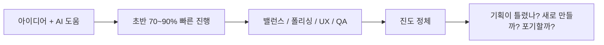
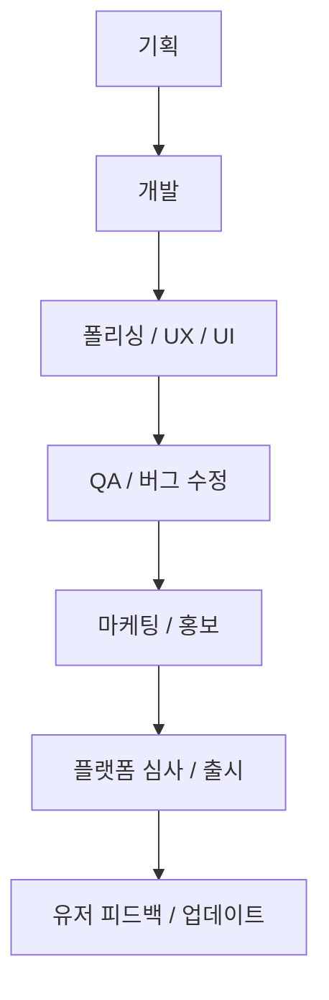

AI가 발전하면서 “이제 혼자서도 게임 하나쯤은 금방 만들 수 있겠다”는 기대가 커졌습니다. 실제로 초반 구현 속도만 보면 이 말은 꽤 맞습니다. 프로토타입은 빨리 나오고, 예전 같으면 며칠 걸릴 UI나 시스템 코드도 몇 시간 만에 형태를 잡을 수 있습니다. 그런데 이 영상은 그 다음 장면을 정확히 짚습니다. **AI는 1인 게임 개발의 초반 70~90%를 엄청 빠르게 밀어주지만, 마지막 10~20%를 대신해 주지는 못한다** 는 것입니다. [YouTube 영상](https://youtu.be/7QOphc3mA2Q)
<!--more-->

발표자의 핵심 주장은 아주 선명합니다. 게임 개발에서 가장 중요한 것은 “재미”가 아니라 “완성”이라는 것입니다. 재미를 추구하다가 결국 출시를 못 하면 아무 검증도, 피드백도, 다음 게임을 만들 동력도 생기지 않습니다. 반대로 완성하고 출시하면, 비록 허접하더라도 유저 반응과 운영 경험이 남고 그게 다음 게임의 재료가 됩니다. 이 글은 그 문제의식을 중심으로, 왜 AI 시대에도 1인 게임 개발이 여전히 어렵고 무엇을 우선순위로 둬야 하는지 정리해 보겠습니다.

## Sources

- https://youtu.be/7QOphc3mA2Q

## 1. AI는 초반 속도를 폭발적으로 올리지만, 후반 병목을 없애지는 못한다

영상은 1인 게임 개발의 전형적인 진행 그래프를 설명합니다. 처음에는 아이디어가 많고 AI도 잘 도와주기 때문에, 전체 스펙의 70%쯤을 전체 시간의 30% 안에 만든 것처럼 느껴집니다. 실제로 버튼 몇 개, 기본 전투, 인벤토리, 간단한 UI, 시스템 골격은 빠르게 나옵니다.

문제는 그 뒤입니다. 밸런스 조정, 반복 테스트, 스킬과 아이템의 확장, UX 정리, 세부 폴리싱, 버그 수정, 화면 흐름 손보기처럼 지루하지만 필수적인 작업이 쌓입니다. 발표자는 이 구간이 원래도 힘들었지만, AI가 들어오면서 오히려 더 심해졌다고 말합니다. 초반 진행이 너무 빠르다 보니, 후반의 느린 진도가 더 크게 체감되기 때문입니다.

즉 AI는 “게임 개발이 쉬워졌다”기보다, **초반과 후반의 체감 격차를 더 벌려 놓았다** 고 볼 수 있습니다. 이 격차를 모른 채 시작하면, 후반에 가서 기획이 잘못됐다고 착각하거나 아예 새 프로젝트로 갈아타고 싶어집니다.

## 2. 대부분 포기하는 이유는 “재미있는 부분만 빠르게 끝나기” 때문이다

발표자가 설명하는 포기 메커니즘은 꽤 현실적입니다. 처음에는 만들고 싶은 기능이 많고, AI도 거기에 잘 반응합니다. 그래서 “역시 AI랑 하면 못할 게 없다”는 감각을 받기 쉽습니다. 하지만 뒤로 갈수록 미뤄뒀던 작업만 남습니다. 화면 위치 다듬기, 버튼 상태 정리, 자잘한 연출 손보기, 난이도 곡선 맞추기, 아이템 수 늘리기, 스테이지 확장하기 같은 일들입니다.

이 작업들은 재미가 적고, AI도 결정적으로 대신해 주지 못하는 경우가 많습니다. 예를 들어 밸런스는 결국 사람이 여러 번 플레이하며 감각을 잡아야 하고, UI는 프로젝트의 흐름과 취향을 알아야 하며, 폴리싱은 “대충 작동”에서 “괜찮게 느껴짐”으로 가는 반복 작업입니다.

그래서 1인 개발자는 종종 “내 기획이 잘못됐나 보다”라고 결론내립니다. 하지만 영상은 그게 대체로 오판이라고 말합니다. 문제는 기획 자체보다, **모든 게임이 원래 이 후반 구간을 통과해야 한다는 사실을 모른 채 시작했다는 점** 에 가깝습니다.

## 3. 그래서 발표자는 “재미”보다 “완성”이 더 중요하다고 말한다

영상에서 가장 강한 문장은 여기입니다. 보통 게임 개발에서 가장 중요한 것이 뭐냐고 물으면 대부분 재미라고 답하지만, 발표자는 완성이라고 답하겠다고 말합니다. 이유도 분명합니다. 재미를 끝까지 검증하려면 먼저 게임이 완성되어야 하기 때문입니다.

완성하지 못하면 유저 피드백도 없고, 시장 반응도 없고, 다음 작품으로 이어질 경험도 없습니다. 반대로 완성하면 비록 부족한 게임이어도 실제로 무엇이 부족한지 알 수 있고, 출시와 운영 과정 자체가 학습이 됩니다. 발표자는 자신이 오랜 기간 PD로 일하면서 게임을 거의 드롭하지 않았다는 점을 자부심으로 말하는데, 바로 이 이유 때문입니다. 드롭된 게임은 내부 감각만 남고 외부 검증이 남지 않습니다.

## 4. 1인 개발에서의 “완성”은 코딩 끝이 아니라 출시 이후까지 포함한다

이 영상이 좋은 이유는 완성을 좁게 정의하지 않는다는 점입니다. 발표자가 말하는 1인 개발의 완성은 기획, 개발, 폴리싱, UX/UI 정리, QA, 마케팅과 홍보, 플랫폼 심사와 출시, 유저 피드백 반영과 업데이트까지 모두 포함합니다. [YouTube 영상](https://youtu.be/7QOphc3mA2Q)

이 정의는 냉정하지만 현실적입니다. 회사에서는 보통 개발팀이 앞단만 하고, 마케팅·운영·사업·CS가 뒤를 맡는 경우가 많습니다. 하지만 1인 개발자는 이 모든 단계를 혼자 겪어야 합니다. 그러니 코딩만 빨라졌다고 해서 1인 게임 개발이 갑자기 쉬워질 리가 없습니다. 오히려 해보지 않은 영역이 많을수록, 첫 작품은 가능한 한 작아야 합니다.

## 5. 명작을 목표로 하면 오히려 완성을 못 한다

영상 중반부에서 발표자는 웹툰 작가 이종범의 말을 인용하며, 처음부터 명작을 만들겠다는 마음가짐이 오히려 완성을 막는다고 설명합니다. 작품이 허접해 보이면 부끄러워서 내놓기 싫어지는데, 그 마음이 결국 출시를 가로막습니다.

게임도 똑같습니다. 스스로 봐도 부족한 게임을 출시하기 싫기 때문에, 계속 다듬다가 끝내 내지 못합니다. 그런데 발표자는 오히려 그 허접한 게임을 내보는 것이 중요하다고 말합니다. 그래야 실제 유저 피드백을 듣고, 무엇이 부족한지, 무엇을 다음 게임에 넣어야 하는지 배울 수 있기 때문입니다.

즉 명작은 첫 작품에서 갑자기 나오는 것이 아니라, 여러 번의 완성과 출시를 거친 뒤 나올 가능성이 높습니다. 이 관점에서 보면 첫 게임의 역할은 “대단한 작품”이 아니라, **출시 사이클 전체를 한 바퀴 도는 학습 장치** 에 가깝습니다.

## 6. 해결책은 “많이 만들기”와 “작게 만들기”다

발표자가 제시하는 실천 원칙은 두 가지입니다. 첫째는 많이 만들겠다는 마음가짐입니다. 지금 만드는 게임이 대단한 게임이어야 한다는 압박을 내려놓고, 일단 하나를 끝내서 출시해 보는 것이 우선입니다. 둘째는 작게 만들겠다는 마음가짐입니다. 특히 출시, 마케팅, 운영을 안 해본 사람이라면 무조건 작은 게임부터 시작해야 한다는 것입니다.

영상에서 예시로 드는 `똥 피하기 게임`은 상징적입니다. 기획도 단순하고, 구현도 단순하고, UI/UX 복잡도도 낮고, QA 부담도 적습니다. 대신 이 작은 게임을 통해 플랫폼 계정 만들기, 스토어 심사 흐름 익히기, 다운로드가 없을 때 무엇을 해야 하는지 배우기, 출시 이후 반응을 보는 경험을 할 수 있습니다.

핵심은 작은 게임이 하찮아서 만드는 것이 아니라, **지금 내 실력에서 통제할 수 없는 변수를 줄이기 위해서** 만든다는 점입니다. 기획 난이도, 기술 난이도, 아트 난이도, 운영 난이도를 동시에 높이면 결국 무엇이 문제였는지도 모른 채 포기하게 됩니다.

## 7. 마케팅도 개발 사이클의 일부로 봐야 한다

영상 후반부에서 발표자는 커뮤니티 홍보, 펀딩, 사전 예약, 플랫폼 설정 같은 것들을 직접 해봤다고 말합니다. 심지어 지금 유튜브를 하는 것도 나중에 게임을 낼 때 도움이 되는 마케팅 채널로 보고 있다고 설명합니다.

이 부분은 특히 중요합니다. 많은 1인 개발자가 “좋은 게임만 만들면 알아서 퍼지겠지”라고 기대하지만, 발표자는 그런 기대가 거의 맞지 않는다고 봅니다. 실제로는 아무도 다운로드하지 않을 가능성도 높고, 그때서야 비로소 마케팅과 홍보를 고민하게 됩니다. 결국 마케팅은 마지막 덤이 아니라, 완성 정의 안에 포함된 필수 단계입니다.

## 실전 적용 포인트

첫째, 지금 AI로 게임을 만들고 있다면 “초반 속도”를 실력 향상과 혼동하지 않는 것이 중요합니다. 빠르게 프로토타입이 나온다고 해서 완성 가능성이 높은 것은 아닙니다.

둘째, 첫 작품은 명작이 아니라 `출시 경험`을 목표로 잡는 편이 현실적입니다. 스토어 등록, 심사, 업데이트, 반응 확인까지 해봐야 진짜 한 바퀴를 돈 것입니다.

셋째, 안 해본 단계가 많을수록 게임 스펙을 과감하게 줄여야 합니다. 출시 경험이 없으면 게임 디자인보다 스토어 업로드조차 큰 장벽일 수 있습니다.

넷째, “좋은 아이디어는 열 번째 게임에 쓴다”는 태도도 유효합니다. 지금은 좋은 게임을 만들기보다, 좋은 게임을 만들 수 있는 사람으로 바뀌는 과정이 더 중요할 수 있습니다.

## 핵심 요약

- AI는 1인 게임 개발의 초반 70~90%를 빠르게 밀어주지만 마지막 10~20%는 대신해 주지 못한다.
- 많은 사람이 후반의 폴리싱, 밸런스, QA, 출시 준비 구간에서 지친다.
- 발표자는 게임 개발에서 가장 중요한 것을 “재미”가 아니라 “완성”이라고 말한다.
- 1인 개발에서의 완성은 기획, 개발, UX/UI, QA, 마케팅, 출시, 업데이트까지 포함한다.
- 처음부터 명작을 만들겠다는 태도는 오히려 출시를 막을 수 있다.
- 해결책은 많이 만들기와 작게 만들기다.
- 첫 게임의 목적은 대작이 아니라 출시 사이클 전체를 경험하는 데 있다.

## 결론

이 영상이 AI 1인 게임 개발에 대해 던지는 메시지는 생각보다 냉정합니다. AI가 코딩을 빠르게 만들어 줘도, 게임을 완성시키는 마지막 구간은 여전히 인간의 끈기와 반복, 감각, 출시 경험에 달려 있다는 것입니다. 그래서 “AI가 있으니 이제 혼자서도 명작을 금방 만들 수 있다”는 기대는 종종 환상에 가깝습니다.

하지만 동시에 희망적인 메시지도 있습니다. 완성을 중심에 두고, 작고 단순한 게임부터 여러 번 출시해 보겠다는 태도로 접근하면, AI는 여전히 엄청난 가속기가 될 수 있습니다. 결국 중요한 것은 AI가 얼마나 많이 만들어 주느냐보다, **내가 끝까지 내보낼 수 있는 크기로 게임을 설계하고 반복할 수 있느냐** 일 것입니다.
