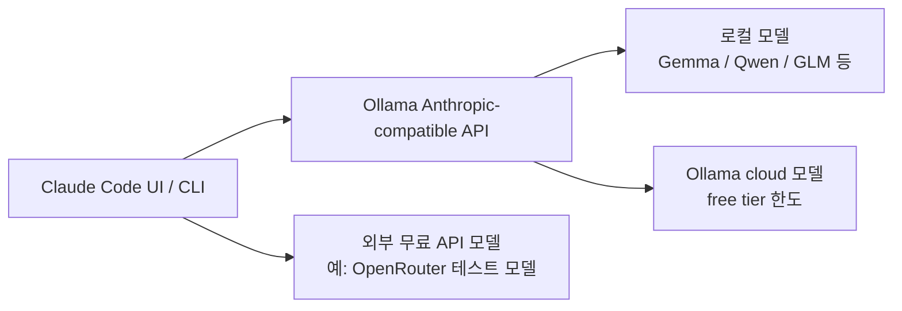

`Claude Code is now FREE` 라는 제목은 눈길을 끌지만, 정확히 말하면 Claude Code 자체가 갑자기 무료 서비스가 됐다는 뜻은 아닙니다. 이 영상이 보여 주는 건 **Claude Code라는 인터페이스와 워크플로를 유지한 채, 실제 모델 백엔드를 Ollama의 로컬 모델이나 무료 클라우드 모델로 바꾸는 방법** 입니다. 즉 “Claude 모델을 공짜로 쓴다”보다, “Claude Code 클라이언트를 다른 모델에 연결한다”에 더 가깝습니다. [YouTube 영상](https://youtu.be/8chCCBEWUZM)
<!--more-->

이 해석은 Ollama의 공식 자료와도 맞아떨어집니다. Ollama는 2026년 1월부터 Anthropic Messages API 호환을 제공하고, 이후 `ollama launch` 명령으로 Claude Code를 로컬 또는 cloud 모델에 쉽게 연결할 수 있게 했습니다. 공식 문서도 “Claude Code with any Ollama model”이라고 설명합니다. 즉 무료라는 말의 실체는 **Anthropic API 대신 Ollama 호환 엔드포인트를 통해 open model 또는 Ollama cloud model을 Claude Code에 꽂는 것** 입니다. [Ollama 공식 블로그](https://ollama.com/blog/claude) [Ollama launch](https://ollama.com/blog/launch) [Claude Code integration docs](https://docs.ollama.com/integrations/claude-code)

## Sources

- https://youtu.be/8chCCBEWUZM
- https://ollama.com/blog/claude
- https://ollama.com/blog/launch
- https://docs.ollama.com/integrations/claude-code
- https://docs.ollama.com/api/anthropic-compatibility

## 1. “Claude Code가 무료”라는 말은 “Claude 모델이 무료”라는 뜻이 아니다

영상은 세 가지 경로를 보여 줍니다. 첫째는 Ollama cloud의 무료 한도 안에 있는 모델을 Claude Code에 연결하는 방법, 둘째는 Gemma 같은 로컬 모델을 Claude Code에 붙이는 방법, 셋째는 OpenRouter의 무료 API 모델을 쓰는 방법입니다. 공통점은 모두 **Claude Code 클라이언트를 유지하면서 모델 공급자만 바꾼다** 는 점입니다. [YouTube 영상](https://youtu.be/8chCCBEWUZM)

이 차이를 구분하는 것이 중요합니다. 사용자가 얻는 것은 Anthropic의 Claude 모델 무료 이용권이 아니라, Claude Code의 터미널 UX, tool use, 작업 방식, slash-command 흐름을 다른 모델 위에서 흉내 내거나 재사용하는 경험입니다. 즉 무료가 된 것은 “환경”에 가깝고, 모델 자체는 여전히 별개입니다.

## 2. 이 구조를 가능하게 만든 핵심은 Ollama의 Anthropic API 호환이다

Ollama 공식 블로그에 따르면, Ollama v0.14.0부터 Anthropic Messages API와 호환되기 시작했습니다. 그래서 Claude Code 같은 도구가 Ollama를 Anthropic API처럼 바라보고 연결할 수 있게 됐습니다. 공식 예시는 `ANTHROPIC_AUTH_TOKEN=ollama`, `ANTHROPIC_BASE_URL=http://localhost:11434` 같은 환경 변수로 설명하고, Claude Code를 `claude --model qwen3.5` 같은 방식으로 실행하는 예를 보여 줍니다. [Ollama 공식 블로그](https://ollama.com/blog/claude)

즉 본질은 단순합니다. Claude Code는 Anthropic API를 기대하는데, Ollama가 그 API를 흉내 내는 레이어를 제공하니 중간에 연결이 됩니다. 이 덕분에 사용자는 Claude Code의 앞단은 그대로 두고, 뒷단 모델만 open model이나 Ollama cloud 모델로 바꿀 수 있습니다.

## 3. 2026년 기준 가장 쉬운 방법은 `ollama launch claude` 다

영상 속 시연은 사실상 Ollama의 `launch` 기능을 이용하는 흐름입니다. Ollama는 2026년 1월 23일 `ollama launch` 를 발표했고, Claude Code, OpenCode, Codex, Droid 같은 코딩 도구를 one-command로 설정하고 실행할 수 있게 했습니다. [Ollama launch](https://ollama.com/blog/launch)

공식 문서 기준 가장 간단한 진입은:

```bash
ollama launch claude
```

입니다. 그리고 특정 모델을 바로 지정할 수도 있습니다.

```bash
ollama launch claude --model kimi-k2.5:cloud
ollama launch claude --model glm-5:cloud
```

즉 영상에서 말하는 “복붙해서 바로 Claude Code에 붙인다”는 경험은, 최신 기준으로는 `launch` 가 대부분의 번거로운 설정을 감춰 준 결과입니다.

## 4. 무료 경로는 크게 세 가지다: 로컬 모델, Ollama cloud 무료 한도, 외부 무료 API

영상 내용을 공식 자료와 함께 정리하면 무료에 가까운 경로는 세 가지입니다.

첫째, **로컬 모델** 입니다. Gemma, qwen3.5, glm-4.7-flash 같은 모델을 로컬에서 돌리면, API 비용은 없고 하드웨어 비용만 듭니다. 이 경우 “무료”라는 말은 돈 대신 GPU/CPU·RAM을 쓴다는 뜻입니다. [YouTube 영상](https://youtu.be/8chCCBEWUZM) [Claude Code integration docs](https://docs.ollama.com/integrations/claude-code)

둘째, **Ollama cloud 모델의 무료 한도** 입니다. Ollama 블로그는 cloud 모델이 generous limits even at the free tier 라고 설명합니다. 다만 이것은 무제한 무료가 아니라 free tier 안에서만 무료라는 뜻입니다. [Ollama launch](https://ollama.com/blog/launch)

셋째, **OpenRouter 같은 외부 무료 API 모델** 입니다. 영상은 Elephant Alpha를 예로 들지만, 이 계열은 대체로 테스트 기간 동안만 무료인 경우가 많고, 모델이 수시로 바뀔 수 있습니다. 따라서 안정적인 워크플로라고 보기보다는, 단기적인 무료 우회 경로에 가깝습니다. [YouTube 영상](https://youtu.be/8chCCBEWUZM)



## 5. 진짜 중요한 건 “Claude Code의 UX”를 재사용한다는 점이다

이 방식이 매력적인 이유는 단순히 공짜라서가 아닙니다. 많은 사용자가 원하는 것은 Anthropic 모델 그 자체보다도, Claude Code의 작업 방식입니다. 터미널 기반 인터페이스, 파일 읽기와 수정, 명령 실행, 긴 문맥 유지, tool calling 흐름, agentic coding 습관 같은 것들입니다.

Ollama 공식 문서도 이 점을 노립니다. “Open models can be used with Claude Code through Ollama’s Anthropic-compatible API” 라고 명시하고, 텔레그램 플러그인, headless mode, web search, subagents 같은 기능도 Claude Code와 연결되는 형태로 설명합니다. [Claude Code integration docs](https://docs.ollama.com/integrations/claude-code) [Subagents and web search](https://ollama.com/blog/web-search-subagents-claude-code)

즉 사용자는 모델 품질이 다소 떨어질 수 있더라도, 익숙한 agentic coding 인터페이스를 유지하는 이점을 얻습니다. 이것이 “Claude Code를 무료처럼 쓴다”는 표현이 실감나는 이유입니다.

## 6. 다만 무료라고 해서 품질과 호환성이 자동으로 보장되지는 않는다

여기서 가장 중요한 단서는 Ollama가 권장 모델과 컨텍스트 길이를 따로 적고 있다는 점입니다. 공식 문서는 Claude Code가 큰 컨텍스트 윈도우를 필요로 하며, 최소 64k 토큰 정도를 권장합니다. [Claude Code integration docs](https://docs.ollama.com/integrations/claude-code)

또한 “Claude Code와 연결된다”는 것과 “Anthropic Claude와 같은 품질이 나온다”는 것은 전혀 다른 이야기입니다. 코딩 에이전트는 단순 채팅보다 tool calling, structured output, 긴 문맥 유지, 지시 추종성이 더 중요합니다. 따라서 무료 로컬 모델로 붙인다고 해서 모두 같은 수준으로 잘 돌아가진 않습니다. 무료 cloud 모델이나 테스트 API 모델도 마찬가지로, 속도·안정성·정확도·무료 기간이 계속 달라질 수 있습니다.

## 7. 그래서 이 영상의 진짜 메시지는 “Claude Code를 더 싸게, 더 유연하게 쓴다”에 가깝다

영상은 제목상 “free forever”에 가깝게 말하지만, 공식 자료를 함께 보면 더 정확한 결론은 이렇습니다. **Claude Code를 Anthropic 모델에만 묶어 둘 필요가 없고, Ollama를 통해 로컬·클라우드 모델로 라우팅할 수 있다** 는 것입니다. [YouTube 영상](https://youtu.be/8chCCBEWUZM) [Ollama 공식 블로그](https://ollama.com/blog/claude)

이 관점은 꽤 실용적입니다. 어떤 작업은 로컬 모델로 충분하고, 어떤 작업은 cloud 모델이 더 낫고, 어떤 상황에서는 임시 무료 API를 써도 됩니다. 즉 “Claude Code = Anthropic Claude”라는 고정 결합이 느슨해진 것입니다. 사용자는 이제 같은 작업 환경을 유지한 채, 비용과 품질 사이에서 더 유연하게 고를 수 있습니다.

## 실전 적용 포인트

첫째, 비용 절감이 목적이라면 가장 먼저 `ollama launch claude` 경로를 보는 것이 좋습니다. 2026년 현재 공식적으로 가장 단순한 설정 경로입니다.

둘째, 완전 무료를 원한다면 로컬 모델이 가장 명확합니다. 대신 GPU 메모리, 속도, 컨텍스트 길이 한계를 감수해야 합니다.

셋째, Ollama cloud free tier는 편하지만 한도와 모델 정책이 바뀔 수 있습니다. “오늘 무료”와 “장기적으로 무료”는 다르게 봐야 합니다.

넷째, 외부 무료 API 모델은 실험용으로는 좋지만, 지속 가능한 팀 워크플로의 기본값으로 삼기엔 불안정할 수 있습니다.

## 핵심 요약

- “Claude Code가 무료가 됐다”는 말은 모델이 무료라는 뜻보다 인터페이스를 다른 무료/로컬 모델에 연결할 수 있다는 뜻에 가깝다.
- 핵심 기술은 Ollama의 Anthropic Messages API 호환이다.
- 2026년 현재 가장 쉬운 설정은 `ollama launch claude` 다.
- 무료 경로는 로컬 모델, Ollama cloud free tier, 외부 무료 API 모델로 나눌 수 있다.
- 중요한 건 Claude Code의 UX와 agentic coding 흐름을 유지한 채 모델을 바꿀 수 있다는 점이다.
- 다만 무료 모델이 Anthropic Claude와 같은 품질을 보장하는 것은 아니다.

## 결론

이 영상은 약간 과장된 제목을 쓰고 있지만, 내용 자체는 꽤 실용적입니다. 핵심은 “Claude Code를 꼭 Claude 모델과만 써야 하는가?”라는 질문에 아니라고 답하는 데 있습니다. Ollama의 호환 레이어와 launch 기능 덕분에, 우리는 Claude Code라는 작업 환경을 유지하면서 더 저렴하거나 무료에 가까운 모델로 뒤쪽 엔진을 바꿀 수 있게 됐습니다.

따라서 지금 중요한 변화는 “Claude가 무료화됐다”가 아니라, **Claude Code가 모델 라우팅 가능한 프론트엔드가 됐다** 는 점입니다. 비용을 아끼고 싶거나, 로컬/온프레미스 환경에서 agentic coding을 실험하고 싶다면 이 흐름은 계속 볼 가치가 있습니다.
