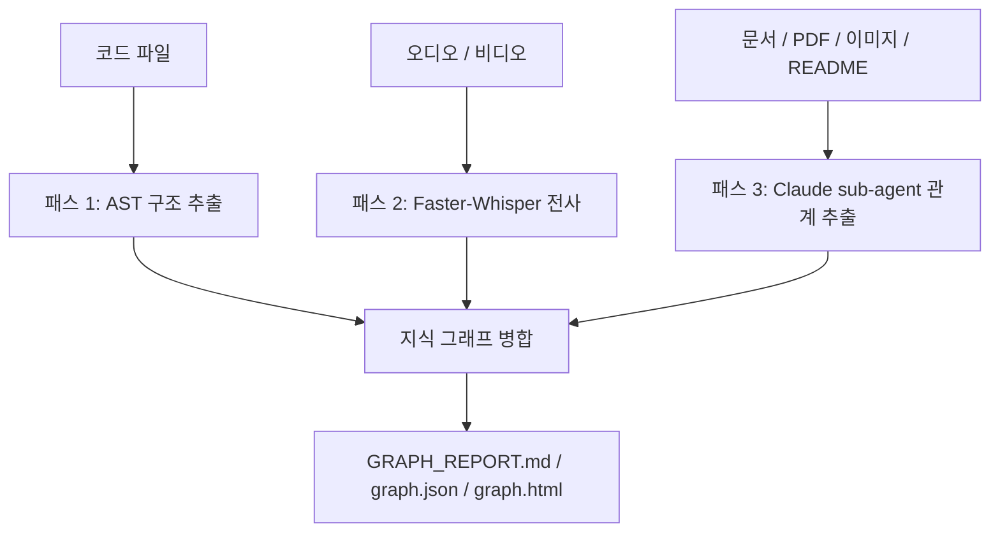
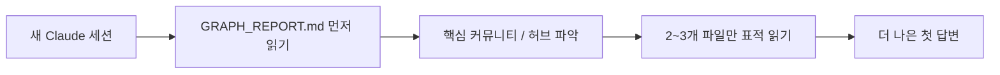

Graphify를 처음 보면 가장 눈에 띄는 숫자는 `71.5x fewer tokens` 입니다. 이 정도면 거의 판을 바꾸는 수치처럼 들립니다. 그런데 이 영상의 좋은 점은 그 숫자를 그대로 홍보하지 않는다는 데 있습니다. 실제 Claude Code 세션 두 개를 나란히 비교해 보니, 토큰 절감은 7~8% 수준에 가까웠고 대신 답변 품질이 더 나아졌다는 식으로 설명합니다. 즉 Graphify의 진짜 가치는 “무조건 71배 절감”이 아니라, **Claude가 매 세션마다 프로젝트를 처음부터 다시 읽는 낭비를 줄이고, 첫 답변부터 더 좋은 방향으로 읽게 만드는 것** 에 있습니다. [YouTube 영상](https://youtu.be/BkHps04qGgc)
<!--more-->

이 시각은 공식 README와도 잘 맞습니다. Graphify는 `/graphify` 한 번으로 코드, 문서, 이미지, 영상, 오디오를 읽어 knowledge graph를 만들고, 이후에는 `GRAPH_REPORT.md` 와 `graph.json` 을 통해 Claude Code, Codex, OpenCode, Gemini CLI 같은 도구가 raw 파일 대신 구조화된 지도를 먼저 읽게 합니다. 다시 말해 Graphify는 “토큰 절감기”라기보다, **AI coding assistant의 탐색 순서를 바꾸는 사전 구조화 레이어** 에 가깝습니다. [GitHub 저장소](https://github.com/safishamsi/graphify) [README 원문](https://raw.githubusercontent.com/safishamsi/graphify/v4/README.md)

## Sources

- https://youtu.be/BkHps04qGgc
- https://github.com/safishamsi/graphify
- https://raw.githubusercontent.com/safishamsi/graphify/v4/README.md

## 1. Graphify가 푸는 문제는 “Claude가 매번 신입사원처럼 시작한다”는 점이다

영상은 Claude 세션을 신입사원에 비유합니다. 새로운 세션이 열릴 때마다 Claude는 프로젝트를 모르는 상태에서 다시 시작합니다. README를 읽고, 여러 파일을 grep 하고, 함수 정의를 따라가고, import를 다시 추적합니다. 세션을 닫고 다음 날 다시 열면 같은 작업을 또 반복합니다.

이 구조는 비용도 들지만, 방향을 잘못 잡을 가능성도 만듭니다. Claude가 어떤 파일을 먼저 읽느냐에 따라 첫 답변의 질이 달라지기 때문입니다. Graphify는 여기에 “미리 만들어 둔 선임 동료의 지도”를 넣습니다. 프로젝트를 한 번 구조화해 두고, 새 세션이 열리면 먼저 `GRAPH_REPORT.md` 를 읽게 해서 Claude가 raw 파일을 마구 뒤지기 전에 큰 그림부터 잡도록 만드는 것입니다.

## 2. Graphify는 세 번의 패스로 지도를 만든다

영상 설명은 Graphify의 구조를 꽤 명확하게 요약합니다. 첫 번째 패스는 코드 구조 분석입니다. Python, TypeScript, Go, Rust 같은 언어를 tree-sitter와 AST 분석으로 읽어서 클래스, 함수, import, call 관계 같은 **사실 기반 구조** 를 뽑습니다. 이 단계는 로컬에서 돌아가고 토큰을 쓰지 않습니다. [YouTube 영상](https://youtu.be/BkHps04qGgc) [README 원문](https://raw.githubusercontent.com/safishamsi/graphify/v4/README.md)

두 번째 패스는 오디오와 비디오입니다. Faster-Whisper로 로컬 전사를 수행합니다. 세 번째 패스는 문서, PDF, 이미지, README, 기타 비정형 자료를 Claude sub-agent가 병렬로 읽으며 개념과 관계를 추출합니다. 이 세 번째 단계만 Claude API를 쓰고, 그마저도 한 번만 수행됩니다. 이후 세션에서는 캐시된 그래프를 읽습니다.

## 3. 71.5배 절감 수치는 맞을 수 있지만, 비교 기준을 이해해야 한다

영상은 이 숫자를 정직하게 해석합니다. 공식 README가 말하는 71.5배 절감은 “52개 파일 전체를 naïve하게 한 번에 Claude 컨텍스트에 집어넣는 경우”와, “Graphify가 graph file을 읽고 관련 neighborhood만 보는 경우”를 비교한 것입니다. 즉 123k tokens vs 1.7k tokens 같은 비교가 나옵니다. [YouTube 영상](https://youtu.be/BkHps04qGgc) [README 원문](https://raw.githubusercontent.com/safishamsi/graphify/v4/README.md)

문제는 실무에서 우리가 그렇게 일하지 않는다는 점입니다. 대부분의 Claude Code 사용자는 52개 파일을 한 번에 프롬프트에 붙이지 않습니다. 보통은 프로젝트 폴더를 열고 질문을 던진 뒤, Claude가 검색과 읽기를 수행하게 둡니다. 그러니 71.5배는 가능한 상한에 가까운 수치이지, 일반적인 실전 세션 절감률로 받아들이면 안 됩니다.

영상에서 실제로 비교한 두 identical session에서는 약 120k vs 113k tokens 정도였고, 절감률은 7~8% 수준이었습니다. 이 수치는 오히려 더 믿을 만합니다. 그리고 이 정도 차이에서도 답변 품질은 Graphify 쪽이 더 좋았다고 설명합니다.

## 4. 실전에서 더 중요한 이득은 “덜 읽는다”보다 “헛읽기를 덜 한다”는 점이다

이 영상이 잘 짚는 지점은 바로 여기입니다. Graphify의 핵심 효과는 단순히 파일 읽기 횟수 감소가 아닙니다. **잘못된 방향으로 읽는 횟수 감소** 가 더 중요합니다. Claude가 프로젝트를 모를 때는 README부터 읽고, 여러 파일을 따라가며, 어떤 것이 핵심 허브인지도 모른 채 검색합니다. Graphify는 주요 허브 노드, 커뮤니티, surprising connections를 먼저 보여 줌으로써 첫 탐색 방향 자체를 바꿉니다.

그래서 세션 길이가 길어질수록, 프로젝트가 복잡할수록, 코드와 문서가 섞여 있을수록 이득이 커집니다. 매번 같은 파일을 다시 읽는 비용도 있지만, 더 큰 문제는 관련 없는 파일을 여러 번 읽고도 핵심 구조를 놓치는 것입니다. Graphify는 이 확률을 줄여 줍니다.

## 5. 자동 훅이 중요한 이유는 “좋은 습관”을 강제하기 때문이다

영상에서는 `graphify install`, `graphify claude install`, `graphify update`, `graphify hook install` 흐름을 보여 줍니다. README도 Claude Code 설치 시 `CLAUDE.md` 섹션과 PreToolUse hook을 깔아서, Glob이나 Grep 전에 `GRAPH_REPORT.md` 를 먼저 보라고 유도한다고 설명합니다. [YouTube 영상](https://youtu.be/BkHps04qGgc) [README 원문](https://raw.githubusercontent.com/safishamsi/graphify/v4/README.md)

이게 중요한 이유는, 사람이 매번 “먼저 그래프를 봐야지”라고 기억하는 것보다 도구가 강제로 순서를 바꾸는 편이 훨씬 안정적이기 때문입니다. Graphify는 단순한 정적 산출물이 아니라, assistant의 기본 탐색 습관을 바꾸는 운영 장치로 이해하는 편이 맞습니다.

## 6. 코드베이스뿐 아니라 연구 노트와 문서 vault에도 먹힌다

영상 후반부는 Graphify가 코드 전용이 아니라는 점도 보여 줍니다. YouTube 스크립트, 트랜스크립트, 리서치 노트만 있는 폴더에서도 Graphify를 돌려, 어떤 주제를 가장 많이 다뤘는지, 무엇이 빠져 있는지 같은 질문에 답하게 합니다. PDF와 논문 묶음, 회의 녹음과 전략 문서도 같은 방식으로 처리할 수 있습니다. [YouTube 영상](https://youtu.be/BkHps04qGgc)

이 점은 Graphify를 “코드 인덱서”보다 “지식 구조화 도구”로 보게 만듭니다. Claude가 같은 자료를 세션마다 다시 읽고 있다면, 그게 코드든 문서든 회의록이든 Graphify를 붙일 이유가 생깁니다.

## 실전 적용 포인트

첫째, Graphify를 볼 때 71.5배라는 숫자 하나만 기대하면 실망할 수 있습니다. 프로젝트 규모와 질문 방식에 따라 실제 절감률은 훨씬 작을 수 있습니다.

둘째, 대신 첫 답변 품질과 세션 방향 설정이 더 중요합니다. Graphify는 “조금 덜 읽는다”보다 “덜 헤맨다”는 쪽에서 가치가 큽니다.

셋째, 긴 세션, 복합 자료, 문서+코드 혼합 프로젝트, 반복적인 온보딩 질문이 많은 환경일수록 효과가 커집니다.

넷째, 자동 훅과 update 흐름까지 같이 깔아 두는 것이 좋습니다. 그래프가 오래된 상태면 오히려 assistant를 잘못 이끌 수 있기 때문입니다.

## 핵심 요약

- Graphify의 71.5배 절감은 특정 비교 기준에서 나온 숫자다.
- 일반적인 Claude Code 실전 세션에서는 절감률이 훨씬 작을 수 있다.
- 하지만 답변 품질과 첫 탐색 방향은 더 좋아질 수 있다.
- Graphify는 코드, 문서, 이미지, 영상, 오디오를 세 패스로 분석해 하나의 그래프로 합친다.
- 중요한 것은 토큰 절약 자체보다 raw 파일을 헛읽는 횟수를 줄이는 것이다.
- 자동 훅은 Claude가 세션 시작 시 구조 요약을 먼저 읽게 만들어 습관을 바꾼다.
- 코드베이스뿐 아니라 연구 vault, 전략 문서, 회의 기록에도 적용할 수 있다.

## 결론

Graphify를 이해하는 가장 좋은 방법은 “71배 절감 도구”가 아니라, **Claude가 프로젝트를 이해하는 순서를 바꾸는 도구** 로 보는 것입니다. 숫자는 상황에 따라 달라질 수 있습니다. 하지만 Claude가 매 세션마다 같은 프로젝트를 처음부터 다시 읽고, 같은 파일을 다시 뒤지고, 같은 잘못된 방향으로 들어가는 문제는 꽤 보편적입니다.

그런 점에서 Graphify의 진짜 가치는 압도적인 토큰 절감보다도, 첫 답변의 질, 잘못된 탐색 감소, 긴 세션에서의 누적 이득, 그리고 코드와 문서를 아우르는 구조화된 지도에 있습니다. 이미 Graphify를 한 번 알고 있었다면, 이번 영상은 그 도구를 더 현실적으로 보게 만들어 줍니다.
