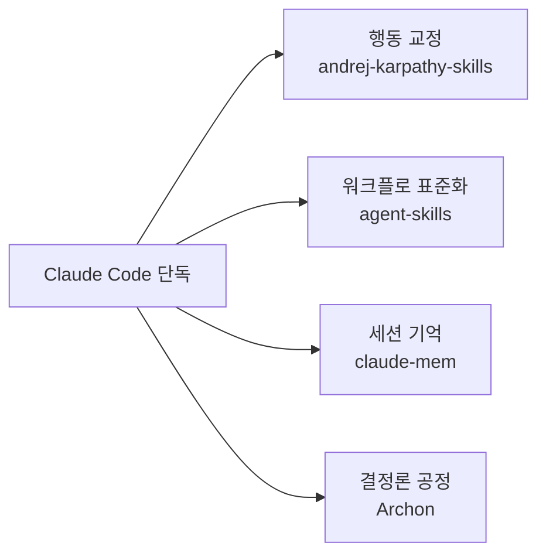
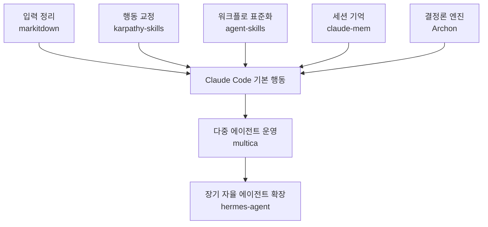

Claude Code를 계속 쓰다 보면 어느 순간 비슷한 지점에서 막힙니다. 세션이 끊기면 맥락이 날아가고, 워크플로가 느슨하면 결과가 들쭉날쭉해지고, 여러 에이전트를 굴리기 시작하면 누가 뭘 하는지 추적하기 어려워집니다. 문서가 섞인 프로젝트에서는 입력 정리부터 번거롭고, 자율 에이전트 쪽으로 가면 또 다른 레이어가 필요해집니다. 이번 Threads 포스트가 흥미로운 이유는, 이런 “Claude Code 단독 사용의 빈칸”을 메워 주는 오픈소스 7개를 한 번에 묶어 보여 주기 때문입니다. [Threads 원문](https://www.threads.com/@joyonghansleaker/post/DXSflGiE8iz?xmt=AQF05y1RkkgUq_Z03FE5GW4xt9byb8dbEe5DRh5xnVFJqThpe6NML5A-BQddtVlz8U1WvI_g&slof=1)
<!--more-->

목록은 이렇습니다. `andrej-karpathy-skills`, `agent-skills`, `claude-mem`, `Archon`, `multica`, `markitdown`, `hermes-agent`. 전부 같은 종류의 도구는 아닙니다. 오히려 각기 다른 허점을 메웁니다. 어떤 것은 Claude의 기본 행동을 교정하고, 어떤 것은 워크플로를 강제하며, 어떤 것은 기억을 붙이고, 어떤 것은 팀 단위 운영을 담당하고, 어떤 것은 입력 문서를 정리하고, 어떤 것은 더 자율적인 에이전트 계층을 만듭니다. 이 글에서는 각각을 “무엇을 대신해 주는가” 중심으로 정리해 보겠습니다.

## Sources

- https://www.threads.com/@joyonghansleaker/post/DXSflGiE8iz?xmt=AQF05y1RkkgUq_Z03FE5GW4xt9byb8dbEe5DRh5xnVFJqThpe6NML5A-BQddtVlz8U1WvI_g&slof=1
- https://github.com/forrestchang/andrej-karpathy-skills
- https://github.com/addyosmani/agent-skills
- https://github.com/thedotmack/claude-mem
- https://github.com/coleam00/Archon
- https://github.com/multica-ai/multica
- https://github.com/microsoft/markitdown
- https://github.com/NousResearch/hermes-agent

## 1. `andrej-karpathy-skills`: 기본 행동 교정 레이어

이 저장소는 Claude Code의 행동을 더 안정적으로 만들기 위한 단일 `CLAUDE.md` 파일에 가깝습니다. 설명 그대로 Andrej Karpathy가 지적한 LLM 코딩 함정을 줄이기 위해 만들어졌고, “최소 구현”, “외과적 수정”, “사고 과정 교정” 같은 기본 원칙을 Claude에게 계속 상기시키는 용도입니다. [GitHub 저장소](https://github.com/forrestchang/andrej-karpathy-skills)

2026년 4월 20일 기준 GitHub API 메타데이터를 보면 별 61,087개로 가장 빠르게 퍼진 계열 중 하나입니다. 이 숫자가 의미하는 바는 크고 복잡한 프레임워크보다, **작은 행동 규칙 파일 하나가 체감에 미치는 영향이 생각보다 크다** 는 것입니다. [GitHub API](https://api.github.com/repos/forrestchang/andrej-karpathy-skills)

## 2. `agent-skills`: 시니어 워크플로 강제 레이어

`addyosmani/agent-skills` 는 “Production-grade engineering skills for AI coding agents” 라는 설명을 달고 있습니다. 여기서 핵심은 Claude Code에게 무작정 자유를 더 주는 것이 아니라, 시니어 엔지니어가 밟는 절차를 slash command나 skill 형태로 패키징해 재사용한다는 점입니다. [GitHub 저장소](https://github.com/addyosmani/agent-skills)

즉 문제 정의, 계획 작성, 검증, 문서화, 릴리스 준비 같은 단계들을 “알아서 잘해라”가 아니라 “이 순서로 하라”로 바꾸는 도구입니다. 별 17,888개 수준까지 올라간 것도, 많은 사용자가 에이전트 성능 자체보다 **워크플로 표준화** 에 더 큰 필요를 느낀다는 신호로 볼 수 있습니다. [GitHub API](https://api.github.com/repos/addyosmani/agent-skills)

## 3. `claude-mem`: 세션 기억 보강 레이어

Threads 작성자가 직접 체감했다고 적은 것이 바로 `claude-mem` 입니다. 이 저장소는 Claude Code 세션 동안 Claude가 본 것, 한 것, 결정한 것을 자동으로 캡처하고, AI로 압축한 뒤 다음 세션에 다시 주입하는 메모리 레이어입니다. [GitHub 저장소](https://github.com/thedotmack/claude-mem)

설명만 보면 단순한 편의 기능처럼 보이지만, 사실 Claude Code의 가장 큰 구조적 약점 하나를 겨냥합니다. 세션이 끝나면 맥락이 리셋된다는 문제입니다. 2026년 4월 20일 기준 별 63,248개라는 수치도 이 고통이 얼마나 보편적인지 보여 줍니다. 다만 이런 메모리 레이어는 항상 trade-off가 있습니다. 메모리를 유지하는 대가로 추가 훅, 추가 토큰, 잘못 압축된 기억의 누적 같은 문제가 생길 수 있습니다. 그래서 “무조건 좋다”보다 **없을 때와 있을 때의 차이를 체감하는 레이어** 로 보는 편이 맞습니다. [GitHub API](https://api.github.com/repos/thedotmack/claude-mem)

## 4. `Archon`: 결정론 워크플로 엔진 레이어

`coleam00/Archon` 은 스스로를 “The first open-source harness builder for AI coding”이라고 소개합니다. 핵심 문장은 “Make AI coding deterministic and repeatable” 입니다. [GitHub 저장소](https://github.com/coleam00/Archon)

이 프로젝트가 푸는 문제는 명확합니다. 같은 버그를 고치라고 해도 매번 다른 순서와 다른 결과가 나오는 LLM의 비결정성입니다. Archon은 YAML 워크플로로 계획, 구현, 검증, 리뷰, PR 생성 같은 단계를 강제하고, worktree를 분리하고, 반복 루프와 게이트를 넣습니다. 다시 말해 Claude Code를 “똑똑한 개인”으로 두는 대신, **정해진 공정 위에서 일하게 만드는 엔진** 입니다. 별 18,925개, 포크 2,929개 수준까지 올라간 것도 이런 필요를 반영합니다. [GitHub API](https://api.github.com/repos/coleam00/Archon)

## 5. `multica`: 사람+에이전트 팀 운영 레이어

`multica`는 “Turn coding agents into real teammates — assign tasks, track progress, compound skills”라고 설명합니다. 이 프로젝트는 모델 성능을 올리는 도구가 아니라, 에이전트를 팀의 작업 단위로 다루게 만드는 플랫폼입니다. [GitHub 저장소](https://github.com/multica-ai/multica)

여기서 해결하려는 문제는 “에이전트를 여러 개 돌릴 수 있다”가 아니라 “여러 개를 어떻게 추적하고 협업시킬 것인가”입니다. 누가 어떤 이슈를 맡고 있는지, 어떤 블로커가 있는지, 무엇을 재사용할 수 있는지 같은 관리 레이어가 필요해지는 순간 Multica의 의미가 생깁니다. 즉 Claude Code가 강한 개인 contributor라면, multica는 **에이전트를 팀 단위 자원으로 운영하는 매니저 레이어** 에 가깝습니다. [GitHub API](https://api.github.com/repos/multica-ai/multica)

## 6. `markitdown`: 입력 정리 레이어

이 목록에서 가장 다른 성격을 가진 것이 `microsoft/markitdown` 입니다. 설명은 아주 직설적입니다. “Python tool for converting files and office documents to Markdown.” [GitHub 저장소](https://github.com/microsoft/markitdown)

그런데 실전에서는 이런 도구가 의외로 중요합니다. 에이전트 성능은 reasoning보다 입력 정리에서 먼저 무너질 때가 많기 때문입니다. PDF, Word, PowerPoint, Excel, 이미지 OCR, 오디오 전사까지 마크다운으로 정리할 수 있다면, Claude Code나 다른 에이전트가 읽을 수 있는 재료가 훨씬 깔끔해집니다. 별 112,575개라는 압도적인 숫자도 “입력 정제”가 얼마나 넓은 수요를 갖는지 보여 줍니다. [GitHub API](https://api.github.com/repos/microsoft/markitdown)

## 7. `hermes-agent`: Claude Code 바깥의 자율 에이전트 레이어

목록의 마지막 `NousResearch/hermes-agent` 는 Claude Code 보조 도구라기보다, 그 바깥에 있는 더 자율적인 에이전트 스택에 가깝습니다. 공식 설명은 “The agent that grows with you”입니다. [GitHub 저장소](https://github.com/NousResearch/hermes-agent)

이 프로젝트가 상징하는 방향은 분명합니다. 단순한 coding assistant를 넘어, 메모리·도구·멀티채널·자기개선 스킬을 가진 장기 실행형 에이전트로 가는 흐름입니다. 별 101,940개 수준까지 오른 것도 이런 기대를 반영합니다. Claude Code가 강한 로컬 작업도구라면, Hermes Agent는 **더 넓은 자동화와 자율성 쪽으로 확장된 미래형 계층** 에 가깝습니다. [GitHub API](https://api.github.com/repos/NousResearch/hermes-agent)

## 8. 이 7개를 한꺼번에 보면 “Claude Code 확장 로드맵”처럼 읽힌다

이 목록이 좋은 이유는 단순 추천 리스트가 아니라, Claude Code 사용자가 어디에서 막히는지를 단계별로 보여 주기 때문입니다.

- 기본 행동이 불안정하다 → `andrej-karpathy-skills`
- 절차가 들쭉날쭉하다 → `agent-skills`
- 세션이 끊기면 맥락이 날아간다 → `claude-mem`
- 결과를 반복 가능하게 만들고 싶다 → `Archon`
- 여러 에이전트를 팀처럼 운영하고 싶다 → `multica`
- 입력 문서가 지저분하다 → `markitdown`
- 더 자율적인 장기 에이전트가 필요하다 → `hermes-agent`

즉 이 7개는 경쟁 관계라기보다, **Claude Code 위아래에 덧대는 보조 레이어들** 로 보는 편이 더 정확합니다.

## 실전 적용 포인트

처음부터 7개를 다 붙이는 것은 오히려 독이 될 수 있습니다. 가장 먼저 볼 것은 `CLAUDE.md` 같은 기본 행동 교정 레이어입니다. 그다음 반복 작업이 많아지면 `agent-skills` 나 `Archon` 으로 절차를 강제하는 쪽이 맞습니다.

세션 리셋이 특히 고통스럽다면 `claude-mem` 을 검토할 만합니다. 다만 메모리 레이어는 편리함과 오버헤드가 같이 오므로, 프로젝트 단위로 격리해 보는 식의 운영 감각이 필요합니다.

문서가 많은 조직 환경이라면 의외로 `markitdown` 의 체감이 클 수 있습니다. 좋은 에이전트도 읽을 수 없는 입력 앞에서는 힘을 못 쓰기 때문입니다.

여러 에이전트를 돌리기 시작했다면 그때는 개인 생산성 도구를 넘어서 `multica` 나 `hermes-agent` 같은 팀/플랫폼 레이어를 볼 시점입니다.

## 핵심 요약

- Threads가 소개한 7개 저장소는 같은 종류의 도구가 아니다.
- `andrej-karpathy-skills` 는 Claude의 기본 행동을 교정한다.
- `agent-skills` 는 시니어 워크플로를 강제한다.
- `claude-mem` 은 세션을 넘는 기억 레이어를 제공한다.
- `Archon` 은 AI 코딩을 더 결정론적이고 반복 가능하게 만든다.
- `multica` 는 에이전트를 추적 가능한 팀원으로 운영하게 한다.
- `markitdown` 은 문서 입력을 깔끔한 Markdown으로 바꿔 준다.
- `hermes-agent` 는 더 자율적인 장기 실행형 에이전트 방향을 보여 준다.

## 결론

Claude Code를 오래 쓰다 보면 깨닫게 되는 건, 문제의 절반은 모델이 아니라 운영 구조라는 점입니다. 기본 행동을 어떻게 고정할지, 세션 기억을 어떻게 이어갈지, 워크플로를 얼마나 강제할지, 문서를 어떻게 정리할지, 여러 에이전트를 어떻게 팀처럼 다룰지가 점점 더 중요해집니다.

이번 7개 목록은 그 점을 잘 보여 줍니다. 좋은 Claude Code 환경은 단일 도구 하나로 완성되지 않습니다. 오히려 **행동 교정, 기억, 절차, 입력 정리, 팀 운영, 자율성** 같은 레이어를 어디까지 붙일지 결정하는 일에 더 가깝습니다. 이 Threads 포스트는 그 확장 지도를 꽤 깔끔하게 보여 준 사례입니다.
