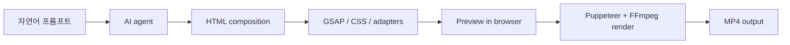
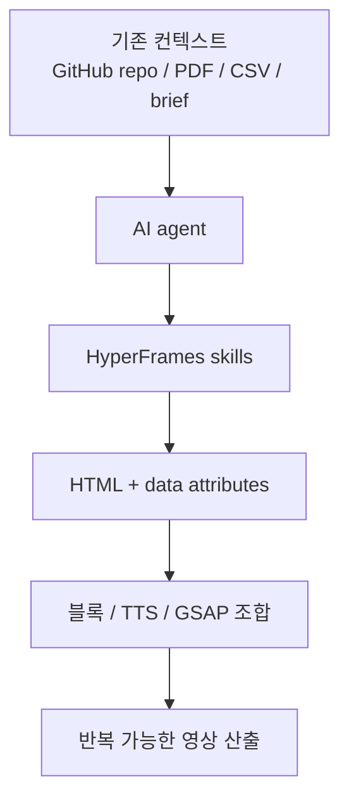

에이전트가 글을 쓰고, 코드를 짜고, 이미지를 만드는 건 이제 익숙합니다. 그런데 영상은 여전히 마지막 퍼즐처럼 남아 있었습니다. 모션, 타이밍, 자막, 오디오, 전환을 다루려면 보통 전용 툴이나 복잡한 프레임워크가 필요했고, AI 에이전트가 “직접 편집한다”는 감각은 아직 어색했습니다. `HyperFrames` 가 흥미로운 이유는 바로 이 지점을 겨냥하기 때문입니다. `Write HTML. Render video. Built for agents.` 라는 설명 그대로, 에이전트가 HTML을 쓰듯 영상을 구성하도록 만든 프레임워크입니다. [Threads 원문](https://www.threads.com/@qjc.ai/post/DXVonq6k91-?xmt=AQF0-RQuDG84wVgvjauNWr74fZrSux1slsBwPAudOHGSD48gQ8U-L2twYt_HIXE_WVSFlqlo&slof=1) [GitHub 저장소](https://github.com/heygen-com/hyperframes)
<!--more-->

Threads 글은 이 프로젝트를 “Claude Code가 이제 영상을 만든다”는 문장으로 소개합니다. 과장은 있지만 핵심은 맞습니다. HyperFrames는 Claude Code, Cursor, Codex, Gemini CLI 같은 AI coding agent가 처음부터 잘 다룰 수 있는 형태로 설계됐습니다. React나 Vue 컴포넌트 추상화 대신, plain HTML + data attributes + GSAP라는 훨씬 직접적인 표현을 택했습니다. [Threads 원문](https://www.threads.com/@qjc.ai/post/DXVonq6k91-?xmt=AQF0-RQuDG84wVgvjauNWr74fZrSux1slsBwPAudOHGSD48gQ8U-L2twYt_HIXE_WVSFlqlo&slof=1) [README 원문](https://raw.githubusercontent.com/heygen-com/hyperframes/main/README.md)

2026년 4월 20일 기준 GitHub API 메타데이터를 보면 `heygen-com/hyperframes` 는 별 7,429개, 포크 567개, 기본 브랜치 `main`, Apache-2.0 라이선스, TypeScript 프로젝트입니다. Node.js 22 이상과 FFmpeg만 있으면 시작할 수 있고, `npx skills add heygen-com/hyperframes` 명령으로 AI agent용 skills도 함께 설치됩니다. [GitHub API](https://api.github.com/repos/heygen-com/hyperframes)

## Sources

- https://www.threads.com/@qjc.ai/post/DXVonq6k91-?xmt=AQF0-RQuDG84wVgvjauNWr74fZrSux1slsBwPAudOHGSD48gQ8U-L2twYt_HIXE_WVSFlqlo&slof=1
- https://github.com/heygen-com/hyperframes
- https://raw.githubusercontent.com/heygen-com/hyperframes/main/README.md
- https://api.github.com/repos/heygen-com/hyperframes
- https://hyperframes.heygen.com/introduction

## 1. HyperFrames의 핵심은 “React로 영상을 만드는 법”이 아니라 “에이전트가 바로 쓸 수 있는 표현”이다

Threads가 가장 강조하는 포인트는 왜 React/Vue가 아니라 HTML이냐는 질문입니다. 답은 간단합니다. 에이전트는 이미 HTML을 잘 다룹니다. 반면 React로 영상 구성을 만들게 하면, 컴포넌트 설계 → JSX → 빌드 → 렌더링이라는 번역 단계가 들어갑니다. HyperFrames는 이 번역 과정을 줄이고, HTML 태그와 `data-start`, `data-duration`, `data-track-index` 같은 속성으로 바로 시간축을 표현하게 합니다. [Threads 원문](https://www.threads.com/@qjc.ai/post/DXVonq6k91-?xmt=AQF0-RQuDG84wVgvjauNWr74fZrSux1slsBwPAudOHGSD48gQ8U-L2twYt_HIXE_WVSFlqlo&slof=1) [README 원문](https://raw.githubusercontent.com/heygen-com/hyperframes/main/README.md)

이 설계가 중요한 이유는 영상 저작을 “프레임워크 학습”보다 “구조 설명”으로 바꾸기 때문입니다. 에이전트는 HTML을 읽고 쓰는 데 익숙하고, 개발자도 브라우저 DOM 감각으로 접근할 수 있습니다. HyperFrames는 이 익숙함 위에 타이밍과 모션 규칙을 얹습니다.

## 2. 구조는 HTML, 모션은 GSAP, 출력은 MP4라는 조합이 꽤 현실적이다

README 예제를 보면 video, img, audio 태그에 시작 시간과 지속 시간, 트랙 인덱스를 데이터 속성으로 달아 구성합니다. 브라우저에서는 이를 preview하고, 최종적으로는 render해서 MP4를 만듭니다. [README 원문](https://raw.githubusercontent.com/heygen-com/hyperframes/main/README.md)

Threads는 GSAP를 별도의 skill로 언급합니다. 즉 HyperFrames는 영상을 “새로운 그래픽 엔진”으로 푸는 게 아니라, 웹 기술 스택을 영상 저작에 맞게 재배치한 것입니다. 구조는 HTML, 애니메이션은 GSAP, 캡처와 인코딩은 Puppeteer + FFmpeg라는 식입니다. 이 조합은 신기한 데모보다 실용적인 자동화 파이프라인에 가깝습니다.



## 3. 결정론적 렌더링은 에이전트 시대에 특히 중요하다

Threads가 좋게 짚은 부분 중 하나는 `Math.random()` 까지 금지된다는 점입니다. 같은 HTML 입력이면 언제나 같은 영상이 나와야 하고, 100번 렌더해도 결과가 같아야 CI나 자동화 파이프라인에 태울 수 있다는 것입니다. [Threads 원문](https://www.threads.com/@qjc.ai/post/DXVonq6k91-?xmt=AQF0-RQuDG84wVgvjauNWr74fZrSux1slsBwPAudOHGSD48gQ8U-L2twYt_HIXE_WVSFlqlo&slof=1)

이건 단순 기술 제약이 아니라 철학에 가깝습니다. 많은 생성형 미디어 도구는 멋진 결과를 보여 주지만, 반복 가능성과 재현성은 약합니다. 반면 HyperFrames는 에이전트가 자동으로 콘텐츠를 생산하는 시대를 전제로, “입력이 같으면 출력도 같아야 한다”는 소프트웨어적 성질을 유지하려고 합니다. 이 점이 콘텐츠 자동화에서 꽤 큰 차이를 만듭니다.

## 4. 설치 방식도 “에이전트 친화적”으로 설계되어 있다

README 기준 추천 경로는 수동 설치가 아니라 AI coding agent와 함께 시작하는 것입니다.

```bash
npx skills add heygen-com/hyperframes
```

이 한 줄로 Claude Code, Cursor, Gemini CLI, Codex 같은 에이전트에 프레임워크 사용법을 가르치는 skills가 설치됩니다. Claude Code에서는 `/hyperframes`, `/hyperframes-cli`, `/hyperframes-registry`, `/website-to-hyperframes`, `/gsap` 같은 명령으로 노출된다고 설명합니다. [README 원문](https://raw.githubusercontent.com/heygen-com/hyperframes/main/README.md)

Threads가 이 설치 구조를 중요하게 보는 이유도 명확합니다. HyperFrames는 단순 CLI가 아니라, **에이전트가 올바른 composition을 처음부터 쓰게 만드는 교육 패키지** 까지 함께 제공합니다. 그래서 “프레임워크를 배운다”보다 “에이전트가 프레임워크를 잘 쓰도록 만든다”는 느낌이 강합니다.

## 5. 진짜 강력한 부분은 warm start다

Threads는 두 가지 프롬프트 패턴을 구분합니다. 하나는 cold start입니다. “10초짜리 제품 인트로, 다크 배경, 페이드인 타이틀” 같은 식으로 바로 영상 명세를 말하는 것입니다. 다른 하나는 warm start입니다. 예를 들어 “이 GitHub 저장소를 45초 피치 영상으로 만들어 줘”처럼, 이미 존재하는 맥락을 에이전트가 읽고 영상으로 바꾸는 방식입니다. [Threads 원문](https://www.threads.com/@qjc.ai/post/DXVonq6k91-?xmt=AQF0-RQuDG84wVgvjauNWr74fZrSux1slsBwPAudOHGSD48gQ8U-L2twYt_HIXE_WVSFlqlo&slof=1)

이 두 번째가 특히 중요합니다. 에이전트는 이미 리포지토리, PDF, CSV, 문서를 읽고 요약하는 데 익숙합니다. HyperFrames는 그 결과를 다시 영상 레이어로 이어 붙이는 마지막 도구가 됩니다. 즉 리서치와 프로덕션 사이의 마지막 연결부를 맡는 셈입니다.

## 6. 자연어를 기술 설정으로 번역하는 vocabulary가 내장돼 있다

Threads는 `bouncy`, `dramatic`, `dreamy`, `hype`, `corporate` 같은 단어가 각각 easing, scale, typography, transition 방식으로 번역된다고 설명합니다. 사용자는 감정과 톤만 말하고, 프레임워크가 이를 기술 설정으로 풀어낸다는 것입니다. [Threads 원문](https://www.threads.com/@qjc.ai/post/DXVonq6k91-?xmt=AQF0-RQuDG84wVgvjauNWr74fZrSux1slsBwPAudOHGSD48gQ8U-L2twYt_HIXE_WVSFlqlo&slof=1)

이 부분은 아주 실용적입니다. 대부분의 사용자는 “expo.out”이나 “sine.inOut”보다 “좀 더 극적으로” 같은 말을 먼저 합니다. HyperFrames는 이 간극을 메우는 vocabulary를 미리 준비해 놓고, 에이전트가 그것을 활용하게 만듭니다. 결국 영상 생성은 코드이면서도 디자인 언어여야 하므로, 이런 사전 번역층이 꽤 중요합니다.

## 7. 구조를 보면 단순 툴이 아니라 꽤 확장 가능한 플랫폼이다

README와 Threads를 같이 보면 HyperFrames는 여러 패키지로 나뉘어 있습니다.

- `hyperframes` CLI
- `@hyperframes/core`
- `@hyperframes/engine`
- `@hyperframes/producer`
- `@hyperframes/studio`
- `@hyperframes/player`
- `@hyperframes/shader-transitions`

Threads는 여기에 Frame Adapter 패턴까지 언급하며 GSAP, Lottie, Three.js 연결 가능성을 말합니다. [Threads 원문](https://www.threads.com/@qjc.ai/post/DXVonq6k91-?xmt=AQF0-RQuDG84wVgvjauNWr74fZrSux1slsBwPAudOHGSD48gQ8U-L2twYt_HIXE_WVSFlqlo&slof=1) [README 원문](https://raw.githubusercontent.com/heygen-com/hyperframes/main/README.md)

즉 이것은 단발성 “HTML을 MP4로” 도구가 아니라, 향후 다양한 렌더러와 블록, 컴포넌트 카탈로그, 웹 임베드, 스튜디오 UI까지 확장 가능한 구조를 가진 플랫폼으로 읽을 수 있습니다.

## 8. TTS와 블록 카탈로그가 있어서 실제 생산성 도구처럼 보인다

Threads는 Kokoro 로컬 TTS가 기본 포함되고, 50개 이상의 블록과 컴포넌트 카탈로그가 제공된다고 설명합니다. README도 `npx hyperframes add instagram-follow`, `data-chart`, shader transition 같은 카탈로그형 재사용 요소를 보여 줍니다. [Threads 원문](https://www.threads.com/@qjc.ai/post/DXVonq6k91-?xmt=AQF0-RQuDG84wVgvjauNWr74fZrSux1slsBwPAudOHGSD48gQ8U-L2twYt_HIXE_WVSFlqlo&slof=1) [README 원문](https://raw.githubusercontent.com/heygen-com/hyperframes/main/README.md)

이건 에이전트 워크플로에서 중요합니다. 순수 자유도만 높은 프레임워크는 결국 매번 처음부터 만들어야 합니다. 반면 HyperFrames는 재사용 가능한 블록을 제공해, 에이전트가 일정한 패턴을 더 빠르고 안정적으로 조립할 수 있게 합니다.



## 실전 적용 포인트

첫째, HyperFrames는 “자연어만 치면 영상이 자동 생성된다”는 소비자형 제품보다, **에이전트와 함께 프로그래머블하게 영상 제작을 자동화하는 도구** 에 가깝습니다. 따라서 코드와 문서, 데이터가 이미 있는 환경에서 더 강합니다.

둘째, 디자인 툴 대체라기보다 영상 파이프라인 자동화 도구로 봐야 합니다. 특히 제품 소개 영상, 튜토리얼, 데이터 시각화 영상, 리포지토리 피치 영상 같은 반복 제작에 잘 맞습니다.

셋째, Node.js 22 이상과 FFmpeg가 필요하고, 결정론적 제약을 지켜야 하므로 기존 자유로운 웹 프로토타이핑 감각과는 조금 다를 수 있습니다.

넷째, 이 도구의 진짜 힘은 에이전트와 결합될 때 나옵니다. `npx skills add heygen-com/hyperframes` 로 스킬을 넣고 Claude Code나 Codex가 올바른 패턴을 따르게 하는 흐름이 핵심입니다.

## 핵심 요약

- HyperFrames는 HTML 기반 영상 렌더링 프레임워크이며 AI 에이전트 사용을 전제로 설계됐다.
- React/Vue 대신 HTML + data attributes를 쓰는 이유는 에이전트가 가장 잘 다루는 표현이기 때문이다.
- 구조는 HTML, 모션은 GSAP, 렌더링은 Puppeteer + FFmpeg 조합으로 이해할 수 있다.
- 같은 입력이면 같은 출력이 나오는 결정론적 렌더링을 중요하게 본다.
- `npx skills add heygen-com/hyperframes` 로 Claude Code 등 에이전트에 사용법을 주입할 수 있다.
- warm start 방식 덕분에 GitHub 저장소, PDF, CSV를 바로 영상으로 바꾸는 흐름이 가능하다.
- TTS, 블록 카탈로그, 스튜디오, 플레이어까지 갖춘 확장형 구조다.

## 결론

HyperFrames가 흥미로운 이유는 “또 하나의 영상 생성 툴”이라서가 아닙니다. 오히려 영상이라는 마지막 생산 매체를 에이전트가 직접 편집 가능한 형태로 바꿨다는 데 있습니다. 그 핵심 선택이 바로 HTML입니다. 가장 오래되고, 가장 널리 검증됐고, 에이전트가 가장 잘 다루는 표현을 영상 조합 언어로 삼은 것입니다.

그래서 HyperFrames는 영상 생성 모델과 경쟁하는 툴이라기보다, **에이전트 시대의 영상 저작 프레임워크** 로 보는 편이 맞습니다. 리서치, 글쓰기, 이미지 생성 다음 단계로 “영상까지 코드처럼 다루고 싶다”면, 이 프로젝트는 꽤 중요한 신호로 읽힙니다.
