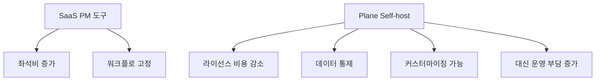

프로젝트 관리 도구 이야기를 할 때 우리는 보통 Jira냐, Linear냐, ClickUp이냐 같은 SaaS 선택지 안에서만 고민합니다. 그런데 `Plane` 은 질문 자체를 바꿉니다. “어떤 SaaS를 구독할까?”가 아니라, **프로젝트 관리 도구를 우리 팀 인프라 안에 두고 운영할 수는 없을까?** 를 묻는 프로젝트입니다. 이번 Threads 포스트가 흥미로운 이유도 바로 그 지점입니다. Jira 대체 정도가 아니라, Linear, Monday, ClickUp까지 통째로 겨냥하는 오픈소스라는 점이 강조됩니다. [Threads 원문](https://www.threads.com/@softdaddy_o/post/DXT8bBlitHh?xmt=AQF0VVFOsta0W9eme85Hiyz3sLONnnpNgcadpOEBRZKkO5rJU91Pg2Gk1kOaRpO5V2bzIhQv&slof=1)
<!--more-->

실제 저장소 설명도 꽤 직설적입니다. “Open-source Jira, Linear, Monday, and ClickUp alternative.” 그리고 단순 이슈 트래커가 아니라 tasks, sprints, docs, triage를 관리하는 modern project management platform이라고 말합니다. 즉 Plane은 칸반 하나만 대체하려는 도구가 아니라, **프로젝트 운영에서 흩어진 기능들을 하나의 self-hosted 제품으로 묶으려는 시도** 에 가깝습니다. [GitHub 저장소](https://github.com/makeplane/plane)

2026년 4월 20일 기준 GitHub API 메타데이터를 보면 Plane은 별 48,132개, 포크 4,023개, 기본 브랜치 `preview`, AGPL-3.0 라이선스, TypeScript 기반 프로젝트입니다. README는 Plane Cloud와 Self-host 두 경로를 동시에 제공하고, Docker와 Kubernetes 설치 문서를 따로 갖고 있습니다. [GitHub API](https://api.github.com/repos/makeplane/plane) [README 원문](https://raw.githubusercontent.com/makeplane/plane/preview/README.md)

## Sources

- https://www.threads.com/@softdaddy_o/post/DXT8bBlitHh?xmt=AQF0VVFOsta0W9eme85Hiyz3sLONnnpNgcadpOEBRZKkO5rJU91Pg2Gk1kOaRpO5V2bzIhQv&slof=1
- https://github.com/makeplane/plane
- https://raw.githubusercontent.com/makeplane/plane/preview/README.md
- https://api.github.com/repos/makeplane/plane

## 1. Plane의 본질은 “오픈소스 Jira 클론”보다 넓다

Plane을 단순 Jira 대체제로만 보면 반만 본 셈입니다. README를 보면 Work Items, Cycles, Modules, Views, Pages, Analytics가 핵심 기능으로 정리되어 있습니다. 즉 이슈 등록과 스프린트만 있는 것이 아니라, 문서화와 분석까지 같이 가져가려는 방향입니다. [README 원문](https://raw.githubusercontent.com/makeplane/plane/preview/README.md)

이 구성이 중요한 이유는, 실제 팀에서는 프로젝트 관리가 보드 하나로 끝나지 않기 때문입니다. Jira는 이슈 트래킹에 강하고, Linear는 빠른 실행감에 강하고, Notion이나 Docs는 문서화에 강하고, 별도 BI는 분석에 쓰입니다. Plane은 이 조각난 조합을 하나의 플랫폼으로 가져오려는 쪽에 가깝습니다. 그래서 Threads에서 “Jira뿐 아니라 Linear, Monday, ClickUp까지 통째로 대체한다”는 표현이 나오는 것입니다.

## 2. 셀프호스팅 가능하다는 점이 진짜 차별점이다

README는 설치 경로를 Plane Cloud와 Self-host Plane으로 나눠 안내합니다. Docker와 Kubernetes 가이드도 공식적으로 제공합니다. [README 원문](https://raw.githubusercontent.com/makeplane/plane/preview/README.md)

이게 주는 의미는 꽤 큽니다. SaaS 프로젝트 관리 도구는 보통 per-seat 과금 구조를 갖고, 팀이 커질수록 비용이 빠르게 올라갑니다. 반면 Plane은 인프라와 운영 부담을 감수하는 대신, 라이선스 비용을 줄이고 데이터 주권을 더 가져갈 수 있습니다. 특히 작은 팀이나 초기 스타트업, 사내망 환경, 혹은 외부 SaaS 도입이 까다로운 조직에서는 이 trade-off가 꽤 현실적입니다.

Threads 글이 “팀 규모가 작은데 Jira 라이선스가 부담되면 한 번 설치해서 보는 것도 괜찮다”고 말한 것도 바로 이 맥락으로 읽을 수 있습니다.

## 3. 오픈소스의 진짜 장점은 비용보다 “툴을 우리 쪽 사정에 맞게 바꿀 수 있다”는 데 있다

Threads 글에서 좋은 포인트 하나는 라이선스 비용 얘기에서 끝나지 않는다는 점입니다. 워크플로우가 회사 사정에 안 맞으면 코드를 직접 고칠 수 있다는 자유를 강조합니다. [Threads 원문](https://www.threads.com/@softdaddy_o/post/DXT8bBlitHh?xmt=AQF0VVFOsta0W9eme85Hiyz3sLONnnpNgcadpOEBRZKkO5rJU91Pg2Gk1kOaRpO5V2bzIhQv&slof=1)

이건 생각보다 중요합니다. SaaS 도구는 기능이 많아도, 우리 팀의 고유한 프로세스와 100% 맞지 않는 경우가 많습니다. 예를 들어 특정 승인 흐름, 문서 템플릿, 팀별 상태 체계, 내부 도구 연동 방식이 애매하게 안 맞을 수 있습니다. 상용 서비스에서는 보통 “제품이 허용하는 범위 안에서 적응”해야 하지만, 오픈소스는 반대로 “제품을 우리 쪽으로 끌어당길” 수 있습니다.

물론 그 자유에는 대가가 있습니다. 직접 수정하면 유지보수 비용이 생기고, 업스트림 업데이트를 따라가는 부담도 생깁니다. 하지만 그 선택권 자체가 있다는 점이 SaaS와는 다른 지점입니다.

## 4. 기능 목록을 보면 팀 운영 흐름 전체를 덮으려는 의도가 보인다

README 기준 핵심 기능을 다시 보면 꽤 선명합니다.

- Work Items: 이슈와 하위 속성 관리
- Cycles: 스프린트 / 사이클 운영과 burn-down
- Modules: 큰 프로젝트를 모듈로 나누기
- Views: 필터와 커스텀 뷰 공유
- Pages: 문서와 아이디어 정리
- Analytics: 실시간 분석과 blocker 파악

이 조합은 Plane이 단순히 “이슈 카드 나열 앱”이 아니라는 점을 보여 줍니다. 계획, 실행, 문서화, 분석까지 하나의 제품 안에서 이어지게 하려는 것입니다. 다시 말해 Plane은 Jira의 backlog/sprint를 넘어서, Linear의 빠른 issue 흐름과 ClickUp류의 올인원 느낌을 오픈소스로 합치려는 방향으로 읽을 수 있습니다.

## 5. 다만 “무료”와 “운영이 쉬움”은 같은 말이 아니다

Plane을 볼 때 가장 조심해야 할 부분도 여기입니다. SaaS 구독료가 없다고 해서 총비용이 자동으로 낮아지는 것은 아닙니다. self-host를 택하면 인프라 관리, 백업, 업그레이드, 모니터링, 보안, 인증, 장애 대응 같은 운영 업무가 생깁니다.

README가 Docker와 Kubernetes 설치 문서를 자세히 갖고 있는 이유도, 이 제품이 단순히 코드를 내려받아 npm run만 하면 끝나는 수준이 아니라는 뜻입니다. 즉 Plane은 “무료 Jira”라기보다, **우리 팀이 직접 운영하는 프로젝트 관리 시스템** 에 가깝습니다. 비용은 라이선스에서 인프라와 운영으로 이동한다고 보는 편이 더 정확합니다.

## 6. 라이선스도 꼭 봐야 한다: Plane은 AGPL-3.0이다

GitHub API 기준 Plane은 MIT나 Apache가 아니라 `AGPL-3.0` 입니다. [GitHub API](https://api.github.com/repos/makeplane/plane)

이건 특히 중요합니다. 단순 사내 사용에서는 큰 문제가 아닐 수 있지만, 제품으로 감싸서 외부 서비스로 재배포하거나 네트워크를 통해 제공하는 형태를 고민한다면 AGPL 조건을 제대로 이해해야 합니다. 즉 Plane은 오픈소스이지만, 마음대로 가져다 상용 SaaS처럼 닫아버릴 수 있는 성격의 라이선스는 아닙니다. “오픈소스니까 무조건 자유롭다”가 아니라, **강한 copyleft 계열의 오픈소스** 라는 점을 인지해야 합니다.

## 7. 그래서 Plane이 특히 맞는 팀은 따로 있다

Plane은 모든 팀의 기본값이라고 보긴 어렵습니다. 오히려 다음 조건에 더 잘 맞습니다.

- Jira 좌석 비용이 부담되는 작은 팀
- 데이터와 워크플로를 사내에서 통제하고 싶은 팀
- 기존 SaaS의 프로세스 강제가 답답했던 팀
- 개발 역량이 있어 self-host와 커스터마이징을 감당할 수 있는 팀
- 이슈, 사이클, 문서, 분석을 한 화면계에서 묶고 싶은 팀

반대로 “인프라 운영은 싫고, 바로 켜서 바로 쓰고 싶다”가 최우선이라면 오히려 Plane Cloud나 기존 SaaS가 더 나을 수 있습니다. 핵심은 기능이 아니라 **운영 모델이 우리 팀과 맞는가** 입니다.

## 실전 적용 포인트

작은 개발팀이라면 Plane을 “당장 Jira를 버릴까?”가 아니라 “파일럿으로 한 프로젝트만 옮겨볼까?” 정도로 보는 편이 좋습니다. 실제로는 사이클 관리, 문서 흐름, 분석 화면, 권한 설정, 팀 적응 비용까지 같이 봐야 하기 때문입니다.

또한 self-host를 고려한다면 비용 비교를 라이선스만으로 하지 말고, 서버 운영과 백업, 업그레이드까지 포함해 봐야 합니다.

그리고 오픈소스라서 자유롭다는 장점은, 그만큼 스스로 판단하고 유지해야 할 영역도 많다는 뜻입니다. 회사 사정에 맞게 코드 수정이 가능하다는 것은 강점이지만, 동시에 내부에서 제품을 소유해야 한다는 뜻이기도 합니다.

## 핵심 요약

- Plane은 단순 Jira 대체제가 아니라 Linear, Monday, ClickUp까지 겨냥하는 오픈소스 프로젝트 관리 플랫폼이다.
- 핵심 기능은 Work Items, Cycles, Modules, Views, Pages, Analytics다.
- Plane Cloud와 Self-host 두 경로를 모두 제공한다.
- 셀프호스팅의 장점은 좌석비 절감뿐 아니라 데이터 통제와 워크플로 커스터마이징 가능성이다.
- 대신 운영, 백업, 업그레이드, 보안 부담이 따라온다.
- Plane의 라이선스는 AGPL-3.0이라 활용 방식에 따라 주의가 필요하다.
- 특히 작은 팀이나 개발 친화적 조직에서 검토할 가치가 크다.

## 결론

Plane이 흥미로운 이유는 “오픈소스 Jira 클론”이라서가 아닙니다. 오히려 프로젝트 관리 도구를 다시 인프라의 일부로 가져오려는 시도라는 점이 더 중요합니다. SaaS에 좌석비를 내고 제품이 정한 방식에 맞춰 일하는 대신, 우리 팀의 데이터와 워크플로를 직접 소유하고 운영할 수 있는 선택지를 준다는 것입니다.

물론 이 자유는 공짜가 아닙니다. 라이선스 비용이 줄어드는 대신 운영과 책임이 늘어납니다. 그래서 Plane은 모든 팀의 기본 답이라기보다, **SaaS 비용과 제품 유연성 사이에서 다른 균형점을 찾고 싶은 팀에게 특히 매력적인 선택지** 로 보는 편이 맞습니다.
