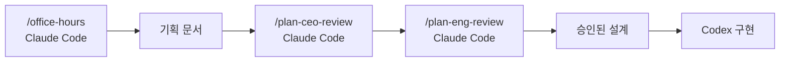
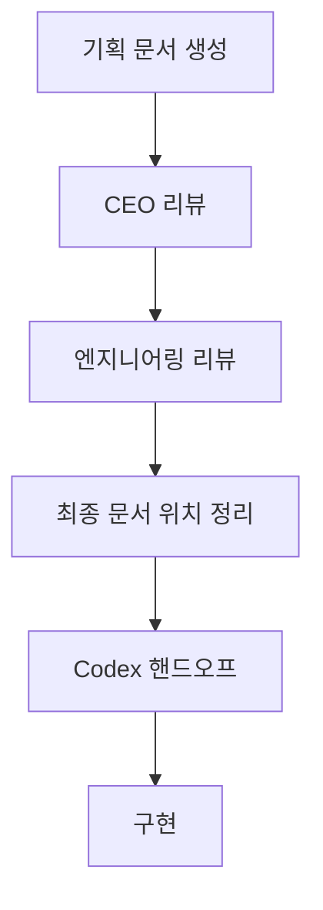

하네스 엔지니어링의 필요성은 이제 꽤 많이 알려졌습니다. 그냥 “만들어줘”라고 던지면 그럴듯한 데모는 나오지만, 실제 데이터 연결이 빠지거나 테스트가 없거나 아예 빌드가 안 되는 경우가 많다는 것도 점점 익숙해졌습니다. 문제는 그 다음입니다. **필요한 건 알겠는데, 이걸 매번 직접 설계하고 구현하는 건 또 너무 어렵다** 는 점입니다. 이번 영상은 그 질문에 대한 실용적인 답으로 `GStack` 을 꺼냅니다. [YouTube 영상](https://www.youtube.com/watch?v=PeRUUFHvKq0)
<!--more-->

영상의 핵심은 GStack을 “하네스 엔지니어링을 위한 스킬 팩”으로 다루는 것입니다. 스킬 하나하나를 처음부터 설계하지 않고, 이미 패키지된 `office-hours`, `plan-ceo-review`, `plan-eng-review` 같은 검증된 스킬을 Claude Code와 Codex에 설치해 기획·리뷰·구현을 분리합니다. 이 구조는 단순히 편리한 것이 아니라, **AI 워크플로에 사람 팀의 역할 분리를 이식하는 가장 쉬운 입문 형태** 에 가깝습니다.

2026년 4월 21일 기준 GitHub API 메타데이터를 보면 `garrytan/gstack` 은 별 78,588개, 포크 11,294개, 기본 브랜치 `main`, MIT 라이선스입니다. 저장소 설명도 꽤 직설적입니다. “23 opinionated tools that serve as CEO, Designer, Eng Manager, Release Manager, Doc Engineer, and QA.” [GitHub 저장소](https://github.com/garrytan/gstack) [GitHub API](https://api.github.com/repos/garrytan/gstack)

## Sources

- https://www.youtube.com/watch?v=PeRUUFHvKq0
- https://github.com/garrytan/gstack
- https://api.github.com/repos/garrytan/gstack

## 1. GStack은 “스킬”을 묶어놓은 하네스 팩이다

영상은 먼저 스킬이 무엇인지 설명합니다. 스킬은 쉽게 말해 AI에게 주는 반복 업무용 작업 매뉴얼입니다. 특정 작업에서 어떤 순서로 생각하고, 어떤 질문을 던지고, 어떤 형식으로 결과를 내야 하는지를 `SKILL.md` 같은 파일에 담아 놓고, 에이전트가 필요할 때 그 지침을 읽어 따르게 하는 방식입니다.

GStack은 이 스킬들을 한 번에 묶어 둔 패키지입니다. office-hours, design-review, plan-ceo-review, plan-eng-review처럼 이미 역할이 나뉘어 있고, 각각의 스킬이 “지금 이 단계에서 어떤 렌즈로 문제를 봐야 하는지”를 규정해 줍니다. 즉 GStack은 하나의 모델을 더 똑똑하게 만드는 툴이 아니라, **에이전트가 밟아야 할 단계와 관점을 표준화하는 프레임워크** 에 가깝습니다.

## 2. 하네스가 필요한 이유: 데모와 운영 가능한 결과물은 다르기 때문이다

영상 초반은 지난 실험을 다시 상기시킵니다. 하네스가 없으면 겉보기엔 그럴듯한 데모가 나오지만, 실제 데이터를 연결하지 않거나 테스트가 빠지거나 빌드가 되지 않는 경우가 많았습니다. 반대로 하네스를 적용하면 운영 가능한 결과물이 나올 가능성이 높아졌습니다. [YouTube 영상](https://www.youtube.com/watch?v=PeRUUFHvKq0)

이 차이는 결국 “모델이 똑똑한가”보다 “모델이 어떤 순서로 일하게 했는가”에서 나옵니다. 즉 하네스 엔지니어링의 목적은 능력치를 올리는 것이 아니라, 실수를 줄이고 검증을 강제하는 것입니다. GStack은 이걸 패키지화해서 바로 가져다 쓰게 해 줍니다.

## 3. 설치의 핵심은 `.claude/skills/gstack` 을 만드는 것이다

영상에서 GStack 설치를 하면 `.claude/skills/gstack` 아래에 여러 하위 폴더가 생성됩니다. 예를 들어 `office-hours`, `design-review`, `plan-ceo-review`, `plan-eng-review` 같은 디렉터리들이 생기고, 각 폴더 안에 해당 스킬의 설명과 지침이 담긴 `SKILL.md` 가 들어 있습니다. [YouTube 영상](https://www.youtube.com/watch?v=PeRUUFHvKq0)

이 구조가 중요한 이유는 Claude Code에서 slash command 형태로 불러올 수 있기 때문입니다. `/office-hours`, `/plan-ceo-review`, `/plan-eng-review` 같은 방식으로 직접 호출할 수 있고, 필요하면 Codex 쪽으로도 가져갈 수 있습니다. 즉 설치는 단순 복사가 아니라, **에이전트가 특정 역할을 즉시 불러 쓸 수 있는 인터페이스를 만든다** 는 의미가 있습니다.

## 4. 이 영상의 핵심 워크플로: Claude는 기획, Codex는 구현

영상은 같은 프로젝트를 만들되, 역할을 분리합니다. 대한민국 AI 관련 정부 지원 사업과 공모전 정보를 보여 주는 웹사이트를 예시로 삼고:

- Claude Code로 기획
- Claude Code로 CEO 리뷰와 엔지니어링 리뷰
- Codex로 구현

을 맡깁니다. [YouTube 영상](https://www.youtube.com/watch?v=PeRUUFHvKq0)

이 구조는 꽤 흥미롭습니다. 보통 한 모델에게 전부 맡기기 쉽지만, 영상은 서로 다른 모델이 서로 다른 시점에서 교차 검증하도록 설계합니다. 기획자, 구현자, 리뷰어가 나뉘어 있는 실제 팀 구조를 그대로 AI 워크플로에 옮긴 셈입니다. 결국 이것도 하네스 엔지니어링의 한 형태입니다.

## 5. `office-hours` 는 아이디어를 기획서로 바꾸는 단계다

영상에서 office-hours는 단순 브레인스토밍이 아닙니다. 사용자가 만들고 싶은 서비스의 궁극적 목표, 스타트업인지 내부 도구인지, 수요의 근거가 무엇인지, 누구를 위한 제품인지, 어떤 제약이 있는지를 계속 물어보며 기획을 날카롭게 만듭니다. [YouTube 영상](https://www.youtube.com/watch?v=PeRUUFHvKq0)

이 과정은 중요합니다. 많은 AI 코딩 작업이 요구사항이 애매한 상태로 바로 구현으로 넘어가는데, 그러면 나중에 다시 방향을 바꿔야 합니다. office-hours는 이 초기 모호함을 문서로 바꾸는 역할을 합니다. 결국 하네스의 첫 단계는 코딩이 아니라 문제 정의입니다.

## 6. `plan-ceo-review` 와 `plan-eng-review` 는 서로 다른 결함을 잡는다

영상은 office-hours 다음에 CEO 리뷰를 넣고, 그다음 엔지니어링 리뷰를 넣습니다. CEO 리뷰는 제품 관점에서 기획을 더 깎고, 출시 이후 단계나 전략적 범위를 더 정리하는 역할을 합니다. 엔지니어링 리뷰는 CTO/엔지니어 관점에서 아키텍처와 구현 가능성, 구조적 리스크를 짚습니다. [YouTube 영상](https://www.youtube.com/watch?v=PeRUUFHvKq0)

이 분리가 중요한 이유는 같은 문서를 봐도 서로 다른 문제가 보이기 때문입니다. 제품 관점에서는 과한 범위나 약한 수요 근거가 보이고, 엔지니어링 관점에서는 데이터 모델과 구조적 위험이 보입니다. 즉 GStack은 단순 role play가 아니라, **문서 하나를 서로 다른 렌즈로 반복 점검하게 만드는 시스템** 으로 봐야 합니다.

## 7. Codex와 함께 쓸 때의 포인트: 스킬만 복사하면 끝나지 않는다

영상은 GStack을 Codex 쪽에도 가져올 수 있다고 설명합니다. 실제로 Codex가 `.claude` 내 스킬을 임포트하면 유사한 구조가 `.agents` 같은 폴더 아래에도 복제됩니다. 다만 중요한 지적도 나옵니다. Claude Code가 지금까지 기획한 내용이 어디 저장돼 있는지 Codex가 자동으로 다 이해하는 것은 아니라는 점입니다. [YouTube 영상](https://www.youtube.com/watch?v=PeRUUFHvKq0)

즉 구현 모델에게 넘길 때는 단순히 “이제 구현해”가 아니라, **기획 문서와 승인된 설계가 어디 있는지 명확히 공유하는 핸드오프** 가 필요합니다. 이건 실제 팀에서도 똑같습니다. 리뷰를 잘했더라도 구현자에게 전달이 안 되면 하네스의 효과가 줄어듭니다.

## 8. 이 영상이 말하는 진짜 장점: 하네스를 직접 설계하지 않아도 된다는 것

하네스 엔지니어링이 어려운 이유는 개념보다 구현입니다. 어떤 단계가 있어야 하는지, 어떤 질문을 던져야 하는지, 어떤 역할을 어떻게 나눌지를 처음부터 설계하려면 시간이 많이 듭니다. GStack은 그 부담을 크게 줄여 줍니다.

물론 그대로 가져다 쓴다고 해서 모든 프로젝트에 완벽히 맞는 것은 아닙니다. 하지만 최소한 검증된 출발점을 줍니다. 그리고 사용자는 그 위에서 자기 프로젝트에 맞게 스킬을 수정하거나, 어떤 단계는 쓰고 어떤 단계는 빼는 식으로 적응할 수 있습니다. 즉 GStack은 완성 답안이라기보다, **하네스 엔지니어링의 좋은 기본 골격** 에 가깝습니다.

## 실전 적용 포인트

처음부터 모든 스킬을 다 쓰기보다, `office-hours → plan-ceo-review → plan-eng-review` 세 단계만 먼저 써 보는 것이 좋습니다. 이것만으로도 바로 구현부터 들어가는 흐름보다 훨씬 안정적일 수 있습니다.

Claude Code와 Codex를 같이 쓸 경우에는 역할을 분리하는 것이 핵심입니다. 같은 문서를 서로 다른 모델에게 검토하게 하거나, 기획은 Claude, 구현은 Codex처럼 나누는 방식이 유효합니다.

또한 GStack을 설치했다고 해서 자동으로 문맥이 공유되는 것은 아니므로, 기획 문서를 파일로 남기고 구현 단계에서 그 파일을 명시적으로 참조하게 하는 것이 중요합니다.

## 핵심 요약

- GStack은 하네스 엔지니어링을 위한 스킬 팩이다.
- `office-hours` 는 아이디어를 날카로운 기획 문서로 바꾼다.
- `plan-ceo-review` 는 제품 관점에서 범위와 전략을 다듬는다.
- `plan-eng-review` 는 엔지니어링 관점에서 구조와 리스크를 점검한다.
- Claude Code로 기획·리뷰를 하고 Codex로 구현을 맡기는 역할 분리가 가능하다.
- 핵심은 모델 성능보다 순서와 핸드오프를 설계하는 것이다.
- GStack은 하네스를 직접 설계하지 않아도 되는 좋은 출발점을 제공한다.

## 결론

이 영상이 보여 주는 가장 실용적인 메시지는, 하네스 엔지니어링을 꼭 처음부터 직접 발명할 필요는 없다는 점입니다. 검증된 스킬 팩인 GStack을 설치하고, 기획과 리뷰를 먼저 거친 뒤, 다른 모델에게 구현을 맡기는 구조만으로도 결과물의 안정성이 크게 달라질 수 있습니다.

결국 하네스 엔지니어링은 복잡한 철학이 아니라, **AI에게 어떤 순서로 일하게 할 것인가** 의 문제입니다. GStack은 그 순서를 잘 포장해 둔 패키지이고, 이 영상은 그것을 Claude Code와 Codex에 어떻게 실제로 적용할 수 있는지 꽤 현실적으로 보여 줍니다.
