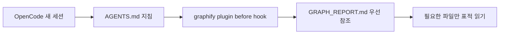
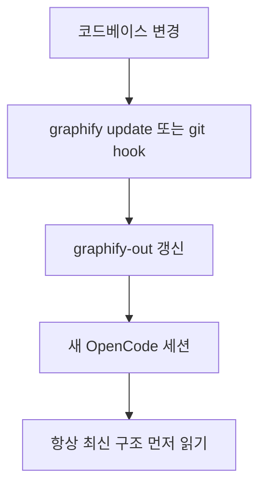

OpenCode 같은 AI 코딩 도구를 오래 쓰다 보면 가장 아까운 순간이 있습니다. 새 세션을 열 때마다 똑같은 README를 다시 읽고, config를 다시 훑고, 소스 파일을 하나씩 따라가며 “이 프로젝트가 뭐 하는 거였지?”를 다시 복원하는 순간입니다. 이 과정은 단순히 토큰만 쓰는 게 아니라, 첫 탐색 방향을 잘못 잡으면 답변 품질도 흔들립니다. 이번 영상은 그 문제를 OpenCode 기준으로 아주 구체적으로 보여 줍니다. 그리고 해법으로 `Graphify` 를 붙입니다. 핵심은 매 세션마다 raw 파일을 다시 읽는 대신, **이미 만들어 둔 지식 그래프를 먼저 읽게 하는 것** 입니다. [YouTube 영상](https://youtu.be/-L_faOE-H5g)
<!--more-->

Graphify 자체는 이미 알려진 도구지만, 이 영상이 흥미로운 이유는 OpenCode에 붙였을 때 어떻게 “always-on” 상태를 만드는지까지 보여 주기 때문입니다. 단순히 `/graphify .` 를 한 번 실행하는 데서 끝나는 것이 아니라, `graphify install --platform opencode` 와 `graphify opencode install` 을 통해 AGENTS.md와 plugin hook을 심어, OpenCode가 bash 도구를 쓰기 전에 `GRAPH_REPORT.md` 를 먼저 보도록 강제합니다. [README 원문](https://raw.githubusercontent.com/safishamsi/graphify/v4/README.md)

## Sources

- https://youtu.be/-L_faOE-H5g
- https://github.com/safishamsi/graphify
- https://raw.githubusercontent.com/safishamsi/graphify/v4/README.md

## 1. OpenCode의 기본 문제: 새 세션은 항상 맨몸으로 시작한다

영상은 아주 흔한 상황으로 시작합니다. OpenCode에서 새 세션을 열고 “이 payment module이 뭐 하는지 요약해줘”라고 묻습니다. 그러면 OpenCode는 README를 열고, config를 읽고, 소스 파일을 하나씩 보며 머릿속 지도를 새로 만듭니다. [YouTube 영상](https://youtu.be/-L_faOE-H5g)

문제는 이 지도가 세션을 닫는 순간 사라진다는 점입니다. 다음 날 다시 열면 또 같은 과정을 반복합니다. 같은 파일을 다시 읽고, 같은 grep을 하고, 같은 토큰을 태웁니다. OpenCode가 나쁘다기보다, 세션 기반 도구의 구조적 한계입니다. Graphify는 여기서 “다시 읽기” 대신 “미리 만든 구조를 먼저 읽기”로 순서를 바꿉니다.

## 2. Graphify의 3패스 구조는 비용이 어디서 드는지 명확히 보여 준다

영상은 Graphify를 세 패스로 설명합니다. 첫 번째는 tree-sitter 기반 코드 분석입니다. Python, JavaScript, TypeScript, Go, Rust, Java, C, C++ 등 다수 언어를 지원하고, 클래스, 함수, import, call 관계를 정적으로 뽑습니다. 이 단계는 로컬에서 돌아가고 토큰 비용이 없습니다. [YouTube 영상](https://youtu.be/-L_faOE-H5g) [README 원문](https://raw.githubusercontent.com/safishamsi/graphify/v4/README.md)

두 번째는 오디오·비디오 처리입니다. faster-whisper를 써서 로컬 전사를 수행합니다. 세 번째가 비용이 드는 부분으로, markdown, PDFs, images, readmes, docs를 모델 provider를 통해 병렬 sub-agent가 읽으며 관계와 개념을 추출합니다. 중요한 건 이 세 번째 패스도 **코퍼스당 한 번** 이라는 점입니다. 변경 파일만 다시 처리하기 때문에, 매 세션마다 같은 파일에 돈을 다시 쓰지 않습니다.

## 3. OpenCode에서 진짜 중요한 건 “설치”보다 “always-on 연결”이다

영상이 구체적으로 보여 주는 명령 흐름은 이렇습니다.

- `pip install graphifyy`
- `graphify install --platform opencode`
- `graphify opencode install`

여기서 핵심은 마지막 명령입니다. 이 단계가 OpenCode 프로젝트 루트의 `AGENTS.md` 에 그래프를 먼저 보라는 지침을 쓰고, `.opencode/plugins/graphify.js` 를 설치해 tool execute before 훅에 연결합니다. 그리고 `opencode.json` 에 등록합니다. [YouTube 영상](https://youtu.be/-L_faOE-H5g) [README 원문](https://raw.githubusercontent.com/safishamsi/graphify/v4/README.md)

즉 Graphify를 OpenCode와 결합할 때의 포인트는 “그래프 파일이 있다”가 아니라, **새 세션이 열릴 때마다 OpenCode가 그것을 기본 전제처럼 보게 만든다** 는 데 있습니다.

## 4. OpenCode용 plugin이 중요한 이유: 좋은 습관을 사람이 기억할 필요가 없어진다

만약 plugin이 없다면, 사용자는 매 세션마다 “먼저 graph report를 읽어”라고 직접 말해야 합니다. 문제는 대부분 그렇게 하지 않는다는 점입니다. 급하면 바로 질문부터 던지고, OpenCode는 다시 raw 파일을 뒤집니다.

plugin은 이 실수를 구조적으로 막습니다. 영상 설명대로, bash 도구가 실행되기 전에 “지식 그래프가 있으니 먼저 graph report를 읽어라”는 리마인더를 출력에 주입합니다. 이건 아주 단순해 보이지만 효과가 큽니다. 사람의 습관에 기대지 않고, 도구 레벨에서 탐색 순서를 바꿔 버리기 때문입니다.

## 5. 작은 프로젝트에는 과할 수 있지만, 혼합 코퍼스에서는 이득이 커진다

영상은 솔직하게 선을 긋습니다. 프로젝트가 10개 파일 이하로 아주 작다면 굳이 Graphify를 쓸 필요가 없다고 말합니다. 이때는 구조적 가치만 조금 있고 토큰 절감은 크지 않습니다. [YouTube 영상](https://youtu.be/-L_faOE-H5g)

Graphify가 진짜 힘을 발휘하는 곳은:

- 파일 수가 많은 코드베이스
- markdown 문서가 섞인 docs 폴더
- PDF와 연구 노트가 섞인 연구 vault
- 회의 녹음, 튜토리얼 영상, 스크린샷까지 함께 있는 mixed corpus

같은 곳입니다. 구조가 복잡할수록, 그리고 코퍼스가 혼합될수록 raw 파일 탐색의 비효율이 커지고, Graphify의 지식 그래프가 더 많은 방향성을 제공합니다.

## 6. `graphify-out` 폴더의 핵심은 `graph.html`보다 `GRAPH_REPORT.md` 다

영상은 `graphify-out` 에 생성되는 산출물도 설명합니다.

- `graph.html`
- `GRAPH_REPORT.md`
- `graph.json`
- `cache/`

여기서 사람이 가장 눈에 띄는 것은 `graph.html` 입니다. 별자리 지도 같은 시각화가 나오고, god nodes와 community를 볼 수 있습니다. 하지만 OpenCode가 day-to-day로 가장 먼저 쓰는 것은 `GRAPH_REPORT.md` 입니다. README도 always-on hook이 주로 이 요약 리포트를 읽게 만든다고 설명합니다. [YouTube 영상](https://youtu.be/-L_faOE-H5g) [README 원문](https://raw.githubusercontent.com/safishamsi/graphify/v4/README.md)

즉 `graph.html` 은 사람이 보는 지도이고, `GRAPH_REPORT.md` 는 에이전트가 매 세션 읽는 브리핑 문서라고 보면 됩니다.

## 7. 유지보수 포인트: update와 git hook이 없으면 금방 stale해진다

그래프는 한 번만 만들고 끝내는 게 아닙니다. 프로젝트가 바뀌면 그래프도 낡습니다. 영상은 두 가지 경로를 제시합니다.

- `graphify update`
- `graphify hook install`

첫 번째는 수동 업데이트이고, 두 번째는 git hook을 설치해 commit과 branch switch 때 자동으로 갱신하는 방식입니다. 영상은 솔직하게 후자를 추천합니다. 안 그러면 결국 잊어버리기 때문입니다. [YouTube 영상](https://youtu.be/-L_faOE-H5g)

이 점도 중요합니다. 지식 그래프는 static artifact가 아니라, 코드베이스의 변화를 따라가야 하는 **살아있는 인덱스** 입니다.

## 8. OpenCode 통합의 진짜 이득: 토큰보다 첫 답변 품질과 검색 방향

영상은 “돈이 어디서 드는지”를 설명하지만, 더 중요한 건 검색 방향입니다. OpenCode가 지식 그래프를 먼저 읽으면, 무엇이 핵심 허브인지, 어떤 모듈이 중심인지, 어떤 문서가 서로 연결되는지부터 알고 시작합니다. 그러면 첫 질문부터 덜 헤맵니다.

즉 Graphify를 OpenCode에 붙이는 이유는 단순히 “조금 더 싸게 쓰기”가 아닙니다. **OpenCode가 프로젝트를 이해하는 초기 방향을 바로잡기 위해서** 입니다. 이게 누적되면 토큰 절감 이상의 가치를 만듭니다.

## 실전 적용 포인트

OpenCode를 메인으로 쓰고, 프로젝트가 크거나 mixed corpus라면 Graphify를 항상 붙여 둘 가치가 큽니다. 특히 코드 + docs + PDF + meeting note 같은 환경일수록 그렇습니다.

반대로 아주 작은 toy project에는 setup 비용이 과할 수 있습니다. 이 경우는 구조를 보기 위한 실험 정도로만 충분합니다.

또한 OpenCode에 붙일 때는 단순 설치보다 `graphify opencode install` 까지 해 두는 것이 중요합니다. 그래야 AGENTS.md와 plugin hook이 함께 설정되어 매 세션 자동으로 동작합니다.

## 핵심 요약

- OpenCode의 구조적 약점은 새 세션마다 코드베이스를 처음부터 다시 읽는 것이다.
- Graphify는 프로젝트를 한 번 그래프로 만들고, 이후 세션은 그 요약을 먼저 읽게 한다.
- OpenCode 통합의 핵심은 `graphify opencode install` 이다.
- 이 명령은 AGENTS.md 지침과 `.opencode/plugins/graphify.js` hook을 함께 설치한다.
- 작은 프로젝트에서는 효과가 제한적일 수 있지만, mixed corpus에서는 이득이 커진다.
- `graph.html` 은 사람용 지도, `GRAPH_REPORT.md` 는 에이전트용 브리핑 문서에 가깝다.
- 그래프는 `update` 또는 git hook으로 계속 최신 상태를 유지해야 한다.

## 결론

OpenCode에 Graphify를 붙인다는 것은 단순히 새 툴 하나를 더 얹는 일이 아닙니다. 세션 시작 순서를 바꾸는 일입니다. README와 영상을 같이 보면, 이 통합의 진짜 포인트는 “매번 raw 파일을 뒤지기 전에 구조를 먼저 읽게 만드는 것”에 있습니다.

그래서 이 조합은 OpenCode를 더 싸게 만드는 도구라기보다, **OpenCode를 덜 헤매게 만드는 보조 레이어** 로 보는 편이 맞습니다. 프로젝트가 커지고 문서가 섞일수록 이 차이는 더 커집니다.
