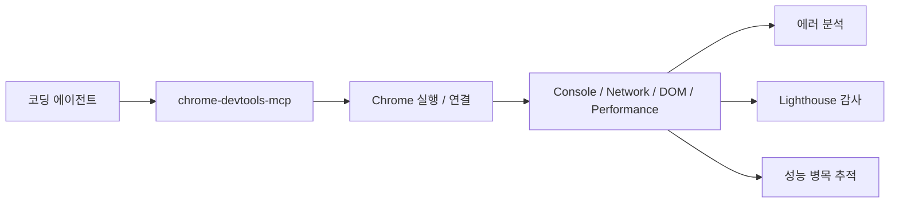
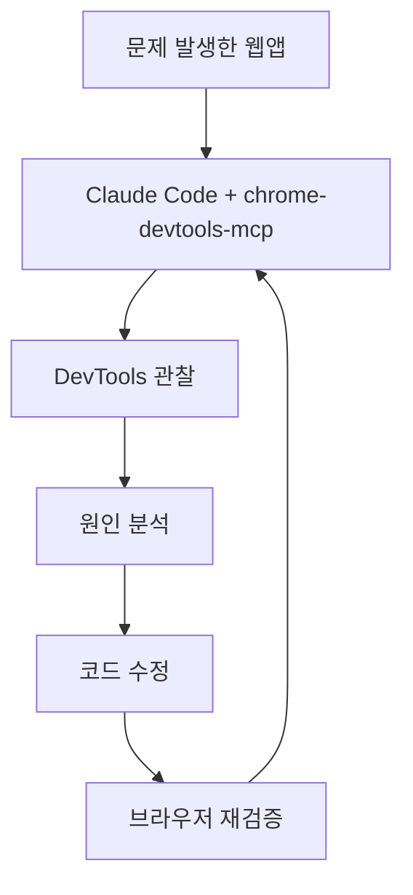

브라우저 디버깅을 AI에게 맡긴다고 할 때, 예전에는 늘 사람이 중간에 끼어 있었습니다. 스크린샷을 찍어서 넘겨 주고, 콘솔 에러를 복사해 붙이고, 네트워크 탭을 열어 요청 실패를 확인해 주는 식이었습니다. 이번 Threads가 강조한 지점은 바로 여기입니다. 이제는 Claude Code 같은 코딩 에이전트가 **사람을 중간 전달자로 두지 않고 Chrome 자체를 직접 열고, DevTools를 조작하고, 디버깅과 감사를 수행할 수 있다** 는 것입니다. 그 핵심이 `chrome-devtools-mcp` 입니다. [Threads 원문](https://www.threads.com/@qjc.ai/post/DXYHV_LE2x9) [GitHub 저장소](https://github.com/ChromeDevTools/chrome-devtools-mcp)
<!--more-->

이 도구가 특히 중요한 이유는 서드파티 장난감 프로젝트가 아니라, Chrome DevTools 팀이 직접 배포하는 공식 MCP 서버라는 점입니다. 저장소 설명도 간단합니다. `Chrome DevTools for coding agents.` 즉 이 프로젝트는 Claude, Gemini, Cursor, Copilot 같은 에이전트가 라이브 Chrome 브라우저를 제어하고 검사할 수 있게 만드는 공식 브리지입니다. [Threads 원문](https://www.threads.com/@qjc.ai/post/DXYHV_LE2x9) [GitHub 저장소](https://github.com/ChromeDevTools/chrome-devtools-mcp) [Chrome for Developers 블로그](https://developer.chrome.com/blog/chrome-devtools-mcp)

## Sources

- https://www.threads.com/@qjc.ai/post/DXYHV_LE2x9
- https://github.com/ChromeDevTools/chrome-devtools-mcp
- https://developer.chrome.com/blog/chrome-devtools-mcp

## 1. 핵심 변화는 “브라우저를 설명하는 AI”에서 “브라우저를 조작하는 AI”로 넘어간 점이다

Threads의 표현을 빌리면, 지금까지 AI에게 웹사이트 디버깅을 맡길 때는 사람이 다리 역할을 했습니다. 콘솔 에러를 복사하고, 스크린샷을 찍고, 네트워크 요청을 확인해 주며 AI가 볼 수 있는 텍스트로 다시 변환해 줘야 했습니다. [Threads 원문](https://www.threads.com/@qjc.ai/post/DXYHV_LE2x9)

`chrome-devtools-mcp`가 만드는 전환은 단순 자동화가 아닙니다. 에이전트가:

- Chrome을 직접 열고
- 페이지를 탐색하고
- 콘솔 에러를 읽고
- 네트워크 요청을 검사하고
- Lighthouse 감사를 실행하고
- 성능 trace를 수집하는

흐름을 한 MCP 서버 뒤로 묶어 버립니다. 이 순간부터 브라우저는 “사람이 보고 전달하는 화면”이 아니라, **에이전트가 직접 관찰하고 조작하는 실행 환경** 이 됩니다.

## 2. 왜 공식 Chrome DevTools 팀의 서버라는 점이 중요한가

브라우저 자동화 도구는 이미 많습니다. Playwright도 있고, Puppeteer도 있고, 각종 비공식 MCP 래퍼도 있습니다. 그런데 `chrome-devtools-mcp`는 출처가 다릅니다. Chrome DevTools 팀이 직접 관리하고, Chrome for Developers 블로그에서도 공식 MCP 서버로 소개합니다. [GitHub 저장소](https://github.com/ChromeDevTools/chrome-devtools-mcp) [Chrome for Developers 블로그](https://developer.chrome.com/blog/chrome-devtools-mcp)

이 차이는 꽤 큽니다.

- DevTools 프로토콜 변화에 더 빨리 따라갈 가능성
- 콘솔, 네트워크, 성능 분석 같은 본류 기능과의 정합성
- 에이전트용 사용 사례를 전제로 한 도구 설계
- 문서와 릴리스 관리의 안정성

실제로 저장소는 2026년 4월 22일 기준 stars 36,590, forks 2,257, 기본 브랜치 `main`, Apache-2.0 라이선스, TypeScript 프로젝트이며 최신 릴리스는 `v0.22.0` 입니다. [GitHub 저장소](https://github.com/ChromeDevTools/chrome-devtools-mcp)

## 3. 이 도구의 진짜 가치는 테스트 자동화보다 “디버깅 자동화”에 있다

많은 사람이 브라우저 제어를 보면 곧바로 E2E 테스트를 떠올립니다. 하지만 `chrome-devtools-mcp`가 더 흥미로운 이유는 테스트보다는 **디버깅과 성능 분석에 최적화된 인터페이스** 라는 점입니다. 공식 소개도 신뢰할 수 있는 자동화, 심층 디버깅, 성능 분석을 강조합니다. [GitHub 저장소](https://github.com/ChromeDevTools/chrome-devtools-mcp) [Chrome for Developers 블로그](https://developer.chrome.com/blog/chrome-devtools-mcp)

예를 들어 프론트엔드 개발에서 AI에게 이런 식의 일을 맡길 수 있습니다.

- “지금 로그인 버튼이 왜 안 눌리는지 콘솔과 네트워크를 함께 봐줘”
- “이 페이지의 Lighthouse 결과를 뽑고 병목을 정리해줘”
- “특정 액션 직후 브라우저 에러 스택트레이스를 분석해줘”
- “실제 DOM 상태를 보고 CSS 충돌 원인을 추적해줘”

이건 테스트 스크립트 작성보다 훨씬 실무에 가깝습니다. 즉 `chrome-devtools-mcp`는 브라우저를 자동 클릭하는 도구라기보다, **브라우저 디버거 자체를 에이전트에게 개방하는 도구** 에 가깝습니다.

## 4. 사람이 하던 ‘중간 전달’ 비용이 사라진다

Threads가 짚은 포인트를 조금 더 실무적으로 풀면 이렇습니다. 지금까지 AI 디버깅의 병목은 모델 성능이 아니라 **관찰 데이터의 전달 비용** 이었습니다.

- 사람이 에러를 복사해야 하고
- 어떤 탭을 볼지 결정해야 하고
- 다시 AI에게 설명해 줘야 하고
- 필요한 추가 확인이 나오면 또 브라우저로 돌아가야 했습니다

이 과정은 번거롭기도 하지만, 컨텍스트 손실이 큽니다. 특히 네트워크 요청 순서, 콘솔 에러 맥락, DOM 실제 상태 같은 것은 텍스트 요약으로 옮기는 순간 정보가 많이 줄어듭니다.

`chrome-devtools-mcp`는 이 손실을 크게 줄입니다. AI가 원본 관찰 환경에 직접 접근하기 때문입니다. 그래서 단순히 “편하다” 수준이 아니라, **디버깅 루프의 왕복 횟수 자체를 줄인다** 는 데 의미가 있습니다.

## 5. 릴리스 속도가 빠르다는 점도 중요하다

Threads는 2025년 9월 첫 공개 이후 빠르게 업데이트가 이어졌다고 짚습니다. 실제로 최신 릴리스는 2026년 4월 21일 공개된 `chrome-devtools-mcp-v0.22.0` 입니다. [Threads 원문](https://www.threads.com/@qjc.ai/post/DXYHV_LE2x9) [GitHub Releases](https://github.com/ChromeDevTools/chrome-devtools-mcp/releases)

이번 릴리스에는 다음 같은 변화가 포함됩니다.

- Chrome extensions 디버깅 지원
- `click_at(x,y)` 실험 도구
- dialog 자동 처리
- WebMCP 관련 실험 기능
- 파일 출력 확장자 보정

이런 변화는 단순 버그 수정이 아니라, 프로젝트가 아직 빠르게 기능면을 넓히고 있다는 뜻입니다. 즉 지금의 `chrome-devtools-mcp`는 고정된 완제품이라기보다, **에이전트 브라우저 디버깅의 표준층으로 빠르게 진화 중인 프로젝트** 로 보는 편이 맞습니다.

## 6. Playwright MCP와 무엇이 다른가

비슷한 자리에 자주 놓이는 도구가 Playwright 계열입니다. 둘 다 브라우저를 AI에게 열어 준다는 점에서는 닮았지만, 철학은 조금 다릅니다.

- Playwright 계열: 시나리오 재현과 자동화 테스트에 더 친함
- chrome-devtools-mcp: 실제 DevTools 정보와 디버깅·감사에 더 친함

즉 어떤 페이지를 재현 가능하게 클릭하고 검증하는 데는 Playwright가 익숙할 수 있습니다. 반면 콘솔, 네트워크, 성능, Lighthouse, DevTools 관찰을 AI에게 곧바로 열어 주려면 `chrome-devtools-mcp`가 더 자연스럽습니다.

그래서 프론트엔드 개발자 입장에서는 두 도구가 경쟁자라기보다 **재현용과 진단용의 성격이 다른 보완재** 로 보일 가능성이 큽니다.

## 7. Claude Code와 잘 맞는 이유는 “보이는 문제를 바로 잡는 루프”를 만들기 때문이다

Threads는 Claude Code 맥락에서 이 도구를 소개합니다. 이 조합이 잘 맞는 이유는 분명합니다. Claude Code는 원래 코드 수정과 설명에 강한데, 여기에 브라우저 관찰 능력까지 붙으면 다음 루프가 생깁니다.

1. 브라우저에서 문제를 직접 본다
2. 콘솔/네트워크/DOM 상태를 읽는다
3. 원인 후보를 정리한다
4. 코드를 수정한다
5. 다시 브라우저에서 확인한다

즉 “코드 에이전트”가 “실행 환경을 보는 에이전트”로 확장됩니다. 이것이 바로 `chrome-devtools-mcp`가 단순 MCP 하나 이상으로 의미가 있는 이유입니다.

## 실전 적용 포인트

프론트엔드 작업 비중이 높고, AI에게 단순 코드 생성보다 실제 디버깅 보조를 맡기고 싶다면 `chrome-devtools-mcp`는 거의 기본 도구에 가깝습니다.

특히 아래 같은 상황에서 효과가 큽니다.

- 재현은 되는데 원인 파악이 늦는 UI 버그
- 콘솔/네트워크/DOM을 함께 봐야 하는 상호작용 문제
- 성능 병목이나 Lighthouse 개선이 필요한 페이지
- Claude Code, Gemini, Cursor 같은 에이전트를 브라우저까지 확장하고 싶을 때

반대로 백엔드 중심 작업이나 브라우저와 거의 상호작용하지 않는 프로젝트에서는 우선순위가 낮을 수 있습니다.

## 핵심 요약

- `chrome-devtools-mcp`는 AI가 Chrome DevTools를 직접 조작하게 만드는 공식 MCP 서버다.
- 핵심 변화는 사람이 중간에서 스크린샷과 에러를 전달하던 구조를 없앤 점이다.
- 테스트 자동화보다 디버깅 자동화와 성능 분석 자동화에서 더 큰 가치가 있다.
- Claude Code 같은 코딩 에이전트에 붙이면 코드 수정과 브라우저 검증이 하나의 루프로 이어진다.
- 2026년 4월 22일 기준 최신 릴리스는 `v0.22.0`, 저장소는 stars 36,590 규모다.

## 결론

`chrome-devtools-mcp`가 중요한 이유는 브라우저를 AI에게 “보여 주는” 수준이 아니라, 브라우저 디버거를 AI에게 “건네주는” 수준으로 바꿨기 때문입니다. 이 차이는 꽤 큽니다. 앞으로 프론트엔드 개발에서 AI의 유용함은 코드 생성 능력만이 아니라, **실행 중인 웹앱을 얼마나 정확하게 관찰하고 고칠 수 있느냐** 로 더 많이 평가될 가능성이 큽니다.

그 기준에서 보면 `chrome-devtools-mcp`는 재미있는 보조 도구가 아니라, 브라우저 디버깅을 에이전트 시대에 맞게 다시 정의하는 핵심 인프라에 가깝습니다.
