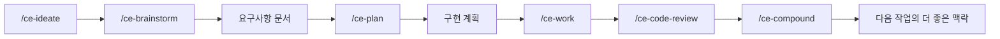
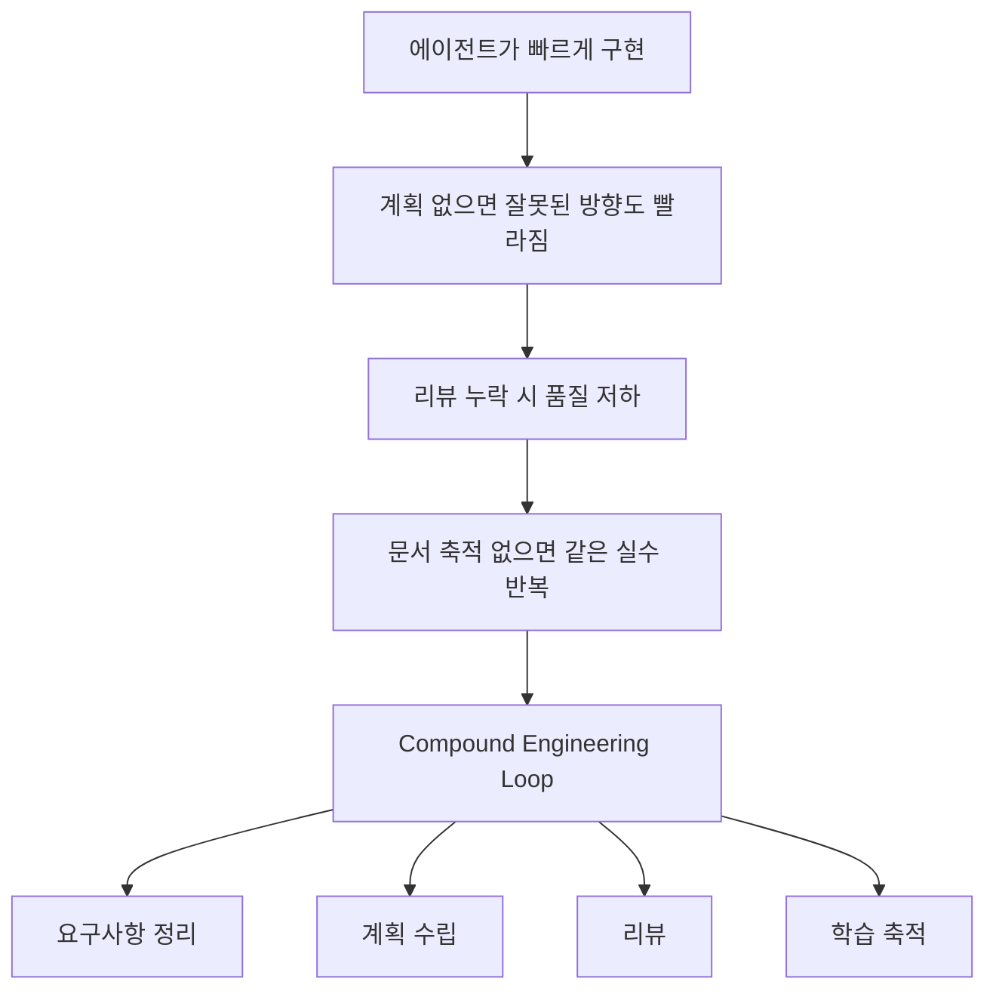

에이전트 코딩 도구를 이야기할 때 많은 프로젝트는 결국 “더 잘 써 주는 프롬프트”나 “더 많은 스킬 묶음”으로 귀결됩니다. 그런데 `compound-engineering-plugin`은 출발점이 조금 다릅니다. README 첫 문장부터 이 프로젝트는 `AI skills and agents that make each unit of engineering work easier than the last.` 라고 말합니다. 즉 이번 작업을 끝내는 것이 목표가 아니라, **이번 작업이 다음 작업을 더 쉽게 만들도록 설계하겠다** 는 선언입니다. [GitHub 저장소](https://github.com/EveryInc/compound-engineering-plugin)
<!--more-->

이 철학을 README는 `compound engineering` 이라고 부릅니다. 핵심 문장은 더 직설적입니다. 전통적인 개발은 기술 부채를 쌓아 가지만, compound engineering은 그 흐름을 뒤집고 `80% is in planning and review, 20% is in execution` 이라고 말합니다. 즉 이 플러그인의 포인트는 코딩 에이전트를 더 많이 붙이는 것이 아니라, **계획·실행·리뷰·학습 축적의 루프를 강제해서 다음 작업의 비용을 줄이는 것** 입니다. [README](https://github.com/EveryInc/compound-engineering-plugin)

## Sources

- https://github.com/EveryInc/compound-engineering-plugin

## 1. 이 플러그인은 “코드를 대신 써주는 도구”보다 “일하는 순서를 바꾸는 도구”에 가깝다

README를 보면 이 프로젝트는 기능 목록보다 철학을 먼저 설명합니다. 각 작업 단위가 다음 작업을 더 어렵게 만드는 대신 더 쉽게 만들어야 한다는 것입니다. [README](https://github.com/EveryInc/compound-engineering-plugin)

이 말은 꽤 중요합니다. 보통 AI 코딩의 병목은 코드 생성 속도가 아니라:

- 요구사항이 불명확한 상태로 시작하고
- 구현 중 설계가 흔들리고
- 리뷰가 늦고
- 배운 것이 문서화되지 않아
- 다음 세션에서 같은 실수를 반복하는 데서 생깁니다

`compound-engineering-plugin`은 바로 이 흐름을 바꾸려 합니다. 그래서 이 프로젝트를 프롬프트 팩으로 보기보다, **에이전트 시대의 엔지니어링 프로세스 템플릿** 으로 보는 편이 더 정확합니다.

## 2. 핵심 철학은 80/20이다: 실행보다 계획과 리뷰에 더 많은 비중을 둔다

README는 아주 분명하게 말합니다.

- `/ce-brainstorm` 와 `/ce-plan` 으로 코딩 전에 충분히 계획한다
- `/ce-code-review` 와 `/ce-doc-review` 로 판단을 교정한다
- `/ce-compound` 로 배운 것을 재사용 가능한 지식으로 남긴다

그리고 이런 접근이 의식적인 의식놀음이 아니라 leverage, 즉 지렛대라고 설명합니다. 좋은 브레인스토밍은 더 날카로운 계획을 만들고, 좋은 계획은 실행 범위를 줄이며, 좋은 리뷰는 버그가 아니라 패턴을 잡고, 좋은 compound note는 다음 에이전트가 같은 교훈을 다시 배우지 않게 만든다는 것입니다. [README](https://github.com/EveryInc/compound-engineering-plugin)

이건 결국 “AI가 코드를 빨리 써 준다”는 기대를 뒤집는 관점입니다. 빠른 실행보다 **더 적게 만들고, 더 정확하게 만들고, 배운 것을 누적시키는 것** 이 장기적으로 더 큰 속도를 만든다는 주장입니다.

## 3. 작업 루프가 매우 명확하다: ideate → brainstorm → plan → work → review → compound

README가 제시하는 core loop는 다음과 같습니다.

- `/ce-ideate`
- `/ce-brainstorm`
- `/ce-plan`
- `/ce-work`
- `/ce-code-review`
- `/ce-compound`

이 순서는 상당히 의도적입니다. 먼저 큰 아이디어를 검토하고, 그다음 요구사항을 대화형으로 좁히고, 구현 계획으로 내리고, 작업을 수행하고, 멀티 에이전트 리뷰를 돌린 뒤, 마지막으로 교훈을 문서로 남깁니다. [README](https://github.com/EveryInc/compound-engineering-plugin)

즉 이 플러그인은 “프롬프트 하나로 끝내기”와 정반대 방향입니다. 오히려 **하나의 작업을 여러 단계의 인공물로 분해** 합니다.

- 아이디어
- 요구사항 문서
- 구현 계획
- 실제 작업
- 리뷰 결과
- 축적 노트

이 인공물들이 남기 때문에 다음 세션, 다음 사람, 다음 에이전트가 이전 맥락을 더 쉽게 이어받을 수 있습니다.

## 4. 중요한 것은 스킬 수보다 루프 완성도다

README에 따르면 현재 이 플러그인은 `36 skills` 와 `51 agents` 를 제공합니다. 숫자만 보면 거대한 스킬 번들처럼 보일 수 있습니다. [README](https://github.com/EveryInc/compound-engineering-plugin)

하지만 더 중요한 것은 종류보다 연결 방식입니다. 예를 들어:

- `ce-brainstorm` 는 요구사항을 정리하고
- `ce-plan` 은 그것을 구현 단계로 내리고
- `ce-work` 는 계획을 따라 실행하고
- `ce-code-review` 는 품질을 점검하고
- `ce-compound` 는 학습 내용을 축적합니다

이렇게 서로가 이어지도록 설계되어 있습니다. 즉 독립 스킬 36개가 아니라, **서로 앞뒤 문맥을 이어 주는 작업 그래프** 에 가깝습니다.

그래서 이 프로젝트의 가치는 “할 수 있는 게 많다”보다 “한 번의 작업이 다음 작업에 기여하도록 구조화되어 있다”는 데 있습니다.

## 5. 특히 리뷰와 축적 단계가 이 플러그인의 진짜 차별점이다

많은 에이전트 워크플로는 기획과 구현까지는 다룹니다. 하지만 리뷰와 축적은 종종 빠집니다. 왜냐하면 당장 눈에 보이는 생산성은 구현에서 나오기 때문입니다.

그런데 `compound-engineering-plugin`은 오히려 이 후반부를 핵심으로 둡니다.

- `/ce-code-review`: 멀티 에이전트 리뷰를 통해 판단 교정
- `/ce-compound`: 다음 작업을 쉽게 만들 지식을 남김

이 점이 중요합니다. 실제 개발에서 가장 비싼 비용 중 하나는 같은 종류의 판단을 계속 다시 하는 것입니다. 왜 이 방식이 실패했는지, 이 모듈에서는 무엇을 주의해야 하는지, 어떤 패턴이 반복되는지 문서화가 안 되어 있으면 세션이 바뀔 때마다 학습 비용을 다시 냅니다.

`compound` 단계는 그 낭비를 줄이려는 시도입니다. 즉 이 플러그인은 결과물만 생산하는 게 아니라, **미래의 작업 비용을 낮추는 메모리 층** 을 함께 만들려 합니다.

## 6. Codex, Claude Code, Cursor까지 지원하는 이유는 특정 모델보다 방식이 중요하다는 뜻이다

README는 설치 경로를 Claude Code, Cursor, Codex, GitHub Copilot 등 여러 도구에 대해 안내합니다. 특히 Codex에서는 마켓플레이스 등록, 에이전트 설치, TUI에서 플러그인 설치라는 3단계를 따로 설명할 정도로 자세합니다. [README](https://github.com/EveryInc/compound-engineering-plugin)

이건 단순 설치 가이드 이상입니다. 이 프로젝트가 특정 모델이나 특정 제품에 종속된 비법이 아니라, **도구를 가로지르는 작업 방식** 을 제공하려 한다는 뜻이기 때문입니다.

즉 “Claude에서만 먹히는 요령”이 아니라:

- 요구사항을 먼저 만들고
- 계획을 문서화하고
- 작업을 추적하고
- 리뷰를 다단계로 돌리고
- 학습을 축적하는

패턴 자체를 여러 에이전트 런타임에 이식하려는 접근입니다.

## 7. 왜 지금 이런 플러그인이 더 중요해지는가

에이전트 코딩이 빨라질수록 역설적으로 계획 없는 실행의 비용도 커집니다. 예전에는 사람이 직접 코드를 치느라 속도가 느려서, 잘못된 방향도 천천히 갔습니다. 지금은 에이전트가 잘못된 방향으로도 매우 빠르게 나아갈 수 있습니다.

그래서 요즘 더 중요한 것은 “얼마나 빨리 작성하느냐”보다:

- 어디까지 만들지 먼저 정했는가
- 구현 전에 설계 위험을 검토했는가
- 작업 후 판단을 리뷰했는가
- 배운 내용을 다음 세션이 재사용할 수 있는가

입니다.

`compound-engineering-plugin`은 바로 이 질문들에 대한 하나의 운영 해답으로 보입니다. 즉 에이전트를 더 강하게 만드는 게 아니라, **에이전트가 만든 속도를 프로세스로 제어하는 장치** 입니다.

## 8. 실전에서는 어떤 팀에 잘 맞을까

이 플러그인은 특히 다음 같은 팀에 잘 맞습니다.

- AI 코딩 도구는 이미 쓰고 있지만 작업 품질 편차가 큰 팀
- 기능은 빨리 나오는데 설계와 리뷰가 자주 흔들리는 팀
- 세션이 바뀌면 맥락이 자꾸 사라지는 팀
- 반복되는 판단과 교훈을 문서 자산으로 쌓고 싶은 팀

반대로 아주 짧은 개인 스크립트나 일회성 실험에서는 다소 무겁게 느껴질 수 있습니다. 왜냐하면 이 플러그인의 가치는 “한 번 빨리 끝내기”보다 **반복되는 엔지니어링 루프를 개선하는 것** 에서 나오기 때문입니다.

## 실전 적용 포인트

이 저장소를 볼 때는 “ce 명령이 많다”보다 “어떤 순서를 강제하나”를 먼저 보는 게 좋습니다.

가장 현실적인 도입 방법은 전체를 한 번에 쓰는 것이 아니라:

- 브레인스토밍 + 계획 단계만 먼저 도입하거나
- 코드 리뷰 + compound 단계만 먼저 도입하거나
- 버그 수정 흐름에서 `ce-debug → ce-code-review → ce-compound` 만 붙여 보는 방식입니다

즉 기능 전체보다 **루프의 어느 지점이 우리 팀의 병목인지** 를 먼저 찾아 붙이는 편이 좋습니다.

## 핵심 요약

- `compound-engineering-plugin`은 스킬 번들보다 엔지니어링 루프에 가깝다.
- 핵심 철학은 `80% planning and review, 20% execution` 이다.
- `/ce-brainstorm`, `/ce-plan`, `/ce-work`, `/ce-code-review`, `/ce-compound` 가 하나의 사이클을 이룬다.
- 진짜 차별점은 리뷰와 학습 축적 단계를 명시적으로 포함한다는 점이다.
- Claude Code, Cursor, Codex 등 여러 도구에 설치되는 것은 특정 모델보다 작업 방식이 더 중요하다는 뜻이다.
- 2026년 4월 22일 기준 저장소는 stars 15,099, forks 1,166, MIT 라이선스, TypeScript 프로젝트다.

## 결론

`compound-engineering-plugin`이 흥미로운 이유는 에이전트에게 더 많은 코드를 쓰게 만드는 데 있지 않습니다. 오히려 반대입니다. 에이전트가 너무 쉽게 코드를 써 버리는 시대에, **무엇을 먼저 생각하고 무엇을 남겨야 하는지** 를 작업 순서로 강제하는 데 있습니다.

그래서 이 프로젝트는 단순 플러그인이라기보다, AI 코딩 시대의 엔지니어링 운영체계에 더 가깝습니다. 이번 작업이 다음 작업을 더 쉽게 만들어야 한다는 철학이 맞다면, 이 저장소는 꽤 오래 참고할 만한 출발점입니다.
