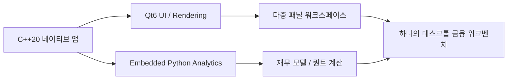
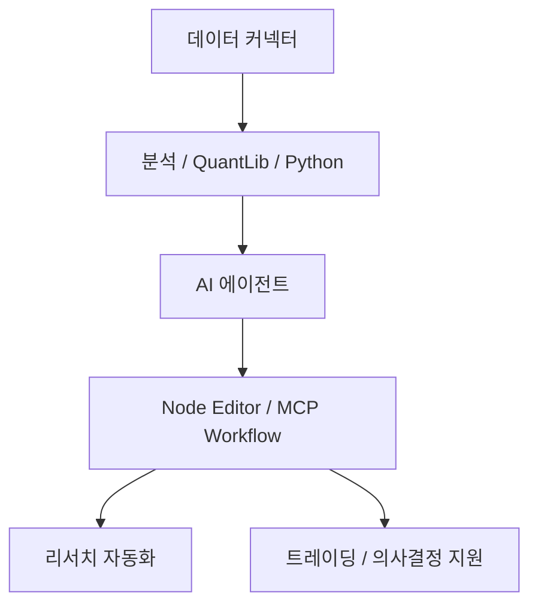

금융 데이터 툴을 이야기할 때 많은 제품이 결국 웹 대시보드나 Electron 앱으로 귀결됩니다. 그런데 `Fincept Terminal`은 정반대 방향을 택합니다. 저장소 첫 문장부터 이 프로젝트는 현대적인 금융 애플리케이션이며, 고급 시장 분석·투자 리서치·경제 데이터 도구를 한데 묶어 대화형 탐색과 데이터 기반 의사결정을 지원한다고 설명합니다. 그리고 README는 한 발 더 나아가 `pure native C++20 desktop application` 이라고 못 박습니다. 즉 이 프로젝트는 “오픈소스 Bloomberg 대안” 같은 거창한 슬로건보다, **금융 터미널을 웹이 아니라 네이티브 데스크톱으로 다시 만들겠다** 는 쪽에 더 가깝습니다. [GitHub 저장소](https://github.com/Fincept-Corporation/FinceptTerminal) [README](https://raw.githubusercontent.com/Fincept-Corporation/FinceptTerminal/main/README.md)
<!--more-->

특히 눈에 띄는 부분은 조합입니다. UI와 렌더링은 `Qt6`, 분석은 `embedded Python`, 전체 앱 껍질은 `C++20` 으로 묶습니다. 여기에 37개 AI 에이전트, 100개 이상 데이터 커넥터, 실시간 트레이딩, QuantLib 기반 정량 분석, 노드 에디터, MCP 통합까지 올려 놓았습니다. README가 주장하는 기능 범위가 워낙 넓어서 과장처럼 보일 수도 있지만, 적어도 프로젝트가 겨냥하는 그림은 분명합니다. **단순 시세 조회 앱이 아니라, 리서치·분석·자동화·거래를 한 프로세스 안에 넣는 금융 워크벤치** 입니다. [GitHub 저장소](https://github.com/Fincept-Corporation/FinceptTerminal) [README](https://raw.githubusercontent.com/Fincept-Corporation/FinceptTerminal/main/README.md)

## Sources

- https://github.com/Fincept-Corporation/FinceptTerminal
- https://raw.githubusercontent.com/Fincept-Corporation/FinceptTerminal/main/README.md

## 1. Fincept Terminal이 겨냥하는 것은 “차트 앱”이 아니라 금융 작업대다

README의 소개 문구는 꽤 공격적입니다. `State-of-the-art financial intelligence platform with CFA-level analytics, AI automation, and unlimited data connectivity.` 라고 적고 있습니다. 이 문장을 그대로 받아들이면, 이 프로젝트는 단순히 가격을 띄우는 앱이 아니라 애널리스트, 투자자, 트레이더가 데이터를 보고 해석하고 자동화하는 전체 흐름을 겨냥합니다. [README](https://raw.githubusercontent.com/Fincept-Corporation/FinceptTerminal/main/README.md)

실제로 기능 목록도 그 방향과 맞습니다.

- DCF, 포트폴리오 최적화, VaR, Sharpe 같은 분석
- AI 에이전트 기반 투자 프레임워크
- 경제·거시 데이터 연결
- 실시간 트레이딩
- QuantLib 기반 정량 모듈
- 지정학·해상 추적 같은 글로벌 인텔리전스
- 노드 에디터 기반 자동화

이 구성을 보면 Fincept Terminal은 “하나의 강력한 기능”보다 **여러 금융 업무를 끊지 않고 이어 붙이는 통합 데스크톱** 을 지향한다고 보는 편이 맞습니다.

## 2. 가장 중요한 차별점은 웹이 아니라 네이티브라는 점이다

README는 Fincept Terminal v4를 `pure native C++20 desktop application` 으로 설명합니다. UI와 렌더링은 Qt6, 분석은 embedded Python, 결과적으로는 단일 네이티브 바이너리 안에서 동작하는 구조를 강조합니다. [README](https://raw.githubusercontent.com/Fincept-Corporation/FinceptTerminal/main/README.md)

이 선택은 단순 취향 문제가 아닙니다. 금융 터미널류 앱은 보통 다음 요구가 큽니다.

- 큰 데이터 테이블과 차트를 오래 띄워 두기
- 실시간 피드와 분석 계산을 함께 돌리기
- 여러 패널과 워크스페이스를 동시에 다루기
- 대화형 탐색과 계산 응답성을 유지하기

이런 환경에서는 브라우저 기반 앱보다 네이티브 렌더링과 시스템 자원 제어가 더 유리할 수 있습니다. Fincept Terminal이 강조하는 “Bloomberg-terminal-class performance”라는 표현도 결국 이 지점을 겨냥합니다. 물론 실제 성능은 사용 환경에 따라 다르겠지만, 최소한 **제품 철학이 웹 편의성보다 로컬 성능과 밀도를 우선한다** 는 점은 분명합니다.

## 3. AI 에이전트는 부가 기능이 아니라 핵심 인터페이스 레이어에 가깝다

README가 내세우는 AI 기능도 흥미롭습니다. 단순 챗봇 한 개가 아니라, 투자자·트레이더·경제·지정학 프레임워크에 걸쳐 37개 에이전트를 제공한다고 설명합니다. 또 OpenAI, Anthropic, Gemini, Groq, DeepSeek, MiniMax, OpenRouter, Ollama 등 여러 공급자를 지원한다고 적고 있습니다. [README](https://raw.githubusercontent.com/Fincept-Corporation/FinceptTerminal/main/README.md)

이 말은 Fincept Terminal이 AI를 “검색창 옆의 보조 버튼” 정도로 보는 게 아니라, **리서치 워크플로 자체를 에이전트 친화적으로 재구성하려 한다** 는 뜻에 가깝습니다. 예를 들어 종목 분석, 가치투자 프레임워크, 거시경제 해석, 뉴스 맥락화 같은 과정을 역할별 보조 시스템으로 나누려는 접근으로 읽힙니다.

다만 이런 구조는 장점과 함께 주의점도 있습니다.

- 에이전트 수가 많다고 바로 품질이 올라가는 것은 아니다
- 데이터 출처와 프롬프트 품질이 결과 신뢰도를 좌우한다
- 금융 판단에서는 생성형 모델의 확신 오류가 특히 위험하다

그래서 이 부분은 “AI가 투자 결정을 대신한다”기보다, **복잡한 리서치 흐름을 빠르게 탐색하게 해 주는 조수 계층** 으로 이해하는 것이 현실적입니다.

## 4. 100개 이상 데이터 커넥터가 중요한 이유는 기능보다 연결성 때문이다

README는 DBnomics, Polygon, Kraken, Yahoo Finance, FRED, IMF, World Bank, AkShare, 각종 정부 API 등 100개 이상 데이터 커넥터를 강조합니다. [README](https://raw.githubusercontent.com/Fincept-Corporation/FinceptTerminal/main/README.md)

이건 단순히 “연결 가능한 API가 많다”는 자랑이 아닙니다. 금융 툴의 실제 생산성은 분석 공식보다도, **서로 다른 출처의 데이터를 한 화면과 한 모델 안에 엮을 수 있느냐** 에 크게 좌우됩니다.

예를 들면 이런 흐름이 가능합니다.

- 주가/체결 데이터
- 거시경제 시계열
- 기업 재무 데이터
- 뉴스와 감성
- 대체 데이터

이 데이터가 각각 다른 탭, 다른 사이트, 다른 스크립트에 흩어져 있으면 사용자는 결국 분석보다 정리에 시간을 씁니다. Fincept Terminal은 이 병목을 커넥터 계층으로 밀어 넣으려는 프로젝트로 보입니다.

## 5. 실시간 트레이딩과 QuantLib가 붙으면서 “리서치 툴” 이상이 된다

README의 기능 설명에서 특히 범위가 넓어지는 지점은 두 군데입니다.

- 실시간 트레이딩
- QuantLib Suite

실시간 트레이딩은 Kraken, HyperLiquid WebSocket, paper trading engine, 그리고 다수 브로커 통합을 언급합니다. QuantLib Suite는 18개 정량 분석 모듈을 제공한다고 설명합니다. [README](https://raw.githubusercontent.com/Fincept-Corporation/FinceptTerminal/main/README.md)

이 조합은 중요합니다. 왜냐하면 데이터 조회 + 리서치까지만 지원하는 툴과, 거기서 더 나아가 가격결정·리스크·실거래·모의거래까지 연결하는 툴은 완전히 다른 성격이기 때문입니다. Fincept Terminal은 전자보다는 후자 쪽으로 확장하려고 합니다.

물론 이 영역은 책임도 커집니다.

- 실시간 데이터 정확성
- 주문 실행 안정성
- 브로커 연동 유지보수
- 규제·지역별 제약

즉 기능적으로는 훨씬 매력적이지만, 운영 난이도도 동시에 높아지는 구조입니다.

## 6. Node Editor와 MCP 통합은 “금융 자동화 IDE”로 읽는 편이 더 정확하다

README는 `Visual Workflows` 항목에서 노드 에디터와 MCP 도구 통합을 언급합니다. 이 부분은 겉으로는 작은 기능처럼 보이지만, 방향성 면에서는 매우 중요합니다. [README](https://raw.githubusercontent.com/Fincept-Corporation/FinceptTerminal/main/README.md)

왜냐하면 이것은 Fincept Terminal을 단순 데스크톱 앱이 아니라, **금융 분석과 자동화를 설계하는 실행 환경** 으로 확장하려는 신호이기 때문입니다.

즉 사용 시나리오는 이런 식으로 넓어집니다.

- 데이터 수집 파이프라인 만들기
- 신호 생성과 조건 점검 묶기
- 리서치 단계 자동화하기
- 모델 호출과 외부 도구 연결하기

이렇게 보면 Fincept Terminal은 “오픈소스 Bloomberg 대안”이라는 표현보다 오히려 **데스크톱 기반 금융 자동화 플랫폼** 이라는 설명이 더 정확할 수도 있습니다.

## 7. 설치 경로가 여러 개인 것은 오픈소스 프로젝트로서 꽤 성숙한 신호다

README는 설치 방법을 네 가지로 정리합니다.

- 릴리스 설치 파일 다운로드
- `setup.sh` 기반 원클릭 빌드
- Docker 실행
- 수동 소스 빌드

이건 중요합니다. 기술적으로 복잡한 프로젝트일수록 대부분 “빌드는 되는데 써 보기는 어렵다”는 문제가 생기기 때문입니다. Fincept Terminal은 적어도 README 차원에서는 진입 경로를 꽤 폭넓게 열어 둡니다. 최신 릴리스도 `v4.0.2` 로 안내하고 있습니다. [GitHub 저장소](https://github.com/Fincept-Corporation/FinceptTerminal) [README](https://raw.githubusercontent.com/Fincept-Corporation/FinceptTerminal/main/README.md)

특히 여기서는 네이티브 앱이라는 특성상 설치 경험이 중요합니다. 웹 앱이면 링크 하나로 끝나지만, 네이티브 툴은 설치가 곧 첫인상입니다. 이런 점에서 플랫폼별 바이너리와 Docker 경로를 함께 제공하는 것은 좋은 선택입니다.

## 8. 라이선스는 꼭 봐야 한다: AGPL-3.0 + 상용 라이선스

저장소와 README는 이 프로젝트가 AGPL-3.0 오픈소스 라이선스를 사용한다고 보여 주며, 동시에 상용 라이선스 옵션도 함께 제시합니다. [GitHub 저장소](https://github.com/Fincept-Corporation/FinceptTerminal) [README](https://raw.githubusercontent.com/Fincept-Corporation/FinceptTerminal/main/README.md)

이 조합은 아주 흔한 듀얼 라이선스 패턴입니다. 커뮤니티 사용과 공개 기여를 열어 두면서도, 기업 환경이나 폐쇄형 배포에는 별도 상용 조건을 두려는 방식입니다.

따라서 관심 있는 팀은 기능만 볼 것이 아니라 다음도 함께 검토해야 합니다.

- 내부 사용인지 외부 서비스 배포인지
- 수정본 공개 의무가 생기는지
- 상용 계약이 필요한 사용 형태인지

특히 AGPL은 네트워크를 통한 제공까지 고려해야 하므로, 회사에서 붙여 쓰려면 법무 검토가 빠지면 안 됩니다.

## 실전 적용 포인트

Fincept Terminal은 개인 투자자용 가벼운 주식 앱을 찾는 사람보다, 데이터·리서치·퀀트·자동화·에이전트를 한 워크스페이스 안에 모으고 싶은 사용자에게 더 잘 맞습니다.

특히 아래 같은 경우에 흥미롭습니다.

- 웹 대시보드보다 네이티브 성능과 밀도를 선호할 때
- Python 분석을 GUI 워크플로에 붙이고 싶을 때
- 여러 금융 데이터 소스를 한 툴에 통합하고 싶을 때
- AI 리서치 보조와 정량 분석을 함께 실험하고 싶을 때

반대로 아주 단순한 가격 조회, 소규모 포트폴리오 관리, 한두 개 API만 필요한 경우에는 프로젝트의 범위가 다소 클 수 있습니다.

## 핵심 요약

- Fincept Terminal은 단순 시세 앱이 아니라 금융 작업대에 가까운 오픈소스 프로젝트다.
- 핵심 차별점은 웹이 아니라 `C++20 + Qt6 + embedded Python` 기반 네이티브 구조다.
- 37개 AI 에이전트, 100개 이상 데이터 커넥터, 실시간 트레이딩, QuantLib, Node Editor를 함께 묶는다.
- 이 프로젝트의 진짜 가치는 개별 기능보다 리서치·분석·자동화를 한 프로세스에 모으는 통합성에 있다.
- 라이선스는 AGPL-3.0과 상용 라이선스를 함께 고려해야 한다.

## 결론

Fincept Terminal은 “오픈소스로도 이런 범위의 금융 터미널을 만들 수 있나?”라는 질문에 꽤 야심 차게 답하는 프로젝트입니다. README의 표현에는 분명 비전이 많이 담겨 있지만, 바로 그 점이 이 저장소를 흥미롭게 만듭니다. 이 프로젝트는 차트를 예쁘게 보여 주는 데서 멈추지 않고, **분석·리서치·자동화·거래를 한 네이티브 데스크톱 안으로 끌어오려는 시도** 이기 때문입니다.

그래서 Fincept Terminal은 단순한 금융 앱이라기보다, 금융 업무를 위한 로컬 워크벤치를 오픈소스로 재구성하려는 실험으로 보는 편이 더 잘 맞습니다.
