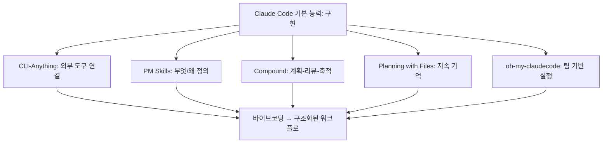

이 영상은 `Claude Code 도구 5선`처럼 보이지만, 실제로 더 흥미로운 것은 도구 자체보다 배열 방식입니다. 소개되는 다섯 개는 서로 같은 일을 하지 않습니다. 어떤 것은 외부 소프트웨어를 CLI로 바꿔 도구를 늘리고, 어떤 것은 계획과 리뷰를 강제하고, 어떤 것은 제품 감각을 보충하고, 어떤 것은 컨텍스트를 파일에 고정하고, 어떤 것은 멀티 에이전트 팀으로 실행을 밀어붙입니다. 즉 이 영상은 “좋은 플러그인 5개”라기보다, **Claude Code의 빈칸을 채우는 5개 레이어** 를 보여 주는 쪽에 가깝습니다. [YouTube 영상](https://www.youtube.com/watch?v=QK0B1mbJ-VU)
<!--more-->

영상 속 도구는 다음 다섯 개입니다.

- `CLI-Anything`
- `compound-engineering-plugin`
- `Product-Manager-Skills`
- `planning-with-files`
- `oh-my-claudecode`

이 조합이 흥미로운 이유는, Claude Code가 본래 잘하는 “코드 작성” 바깥의 문제를 각각 다른 방향에서 메워 주기 때문입니다. 도구 연결, 계획, 제품 사고, 기억 유지, 멀티 에이전트 실행. 결국 Claude Code를 더 잘 쓰는 방법은 모델을 바꾸는 것보다, **그 앞뒤에 어떤 운영층을 붙이느냐** 에 있다는 메시지로 읽힙니다. [YouTube 영상](https://www.youtube.com/watch?v=QK0B1mbJ-VU)

## Sources

- https://www.youtube.com/watch?v=QK0B1mbJ-VU
- https://github.com/HKUDS/CLI-Anything
- https://github.com/EveryInc/compound-engineering-plugin
- https://github.com/deanpeters/Product-Manager-Skills
- https://github.com/OthmanAdi/planning-with-files
- https://github.com/Yeachan-Heo/oh-my-claudecode

## 1. CLI-Anything: 에이전트 네이티브가 아닌 소프트웨어를 Claude Code 도구로 바꾼다

영상의 첫 도구는 `CLI-Anything` 입니다. 설명은 아주 명확합니다. 우리가 매일 쓰는 오픈소스 소프트웨어 대부분은 아직 “agent native”가 아닙니다. 즉 Claude Code가 바로 다루기 어려운 GUI 앱이나 라이브러리가 많습니다. CLI-Anything은 이 틈을 메웁니다. 저장소 슬로건도 `Making ALL Software Agent-Native` 입니다. [YouTube 영상](https://www.youtube.com/watch?v=QK0B1mbJ-VU) [GitHub 저장소](https://github.com/HKUDS/CLI-Anything)

영상에서는 Excalidraw를 예로 듭니다. 저장소를 로컬에 두고 `/cli-anything` 명령으로 분석하게 하면, Claude Code가 사용할 수 있는 CLI 래퍼를 만듭니다. 그러면 “지식 그래프 작동 방식을 다이어그램으로 그려 줘” 같은 명령을 Claude Code가 직접 처리할 수 있게 됩니다.

이 도구의 본질은 단순 자동화가 아닙니다. **GUI나 라이브러리 사용법을 에이전트가 이해할 수 있는 CLI 표면으로 바꾸는 것** 입니다. 그래서 브라우저 자동화, 워크플로 자동화, 그림 도구, 이미지 생성 같은 영역이 모두 Claude Code의 행동 반경 안으로 들어옵니다.

2026년 4월 22일 기준 저장소는 stars 32,179, forks 3,125, 기본 브랜치 `main`, Apache-2.0 라이선스, Python 프로젝트입니다. [GitHub 저장소](https://github.com/HKUDS/CLI-Anything)

## 2. Compound Engineering Plugin: 실행보다 계획·리뷰·축적을 루프로 만든다

두 번째 도구는 `compound-engineering-plugin` 입니다. 영상에서 이 도구는 “단순하지만 유연한 쪽”의 대표 예시로 소개됩니다. 핵심은 6단계입니다.

- ideate
- brainstorm
- plan
- work
- review
- compound

영상이 특히 강조하는 부분은 마지막 `compound` 입니다. 한 번의 작업에서 얻은 학습을 다음 세션으로 가져가, 같은 실수를 반복하지 않게 만드는 단계입니다. [YouTube 영상](https://www.youtube.com/watch?v=QK0B1mbJ-VU) [GitHub 저장소](https://github.com/EveryInc/compound-engineering-plugin)

즉 이 도구는 코드를 더 빨리 쓰는 게 목적이 아닙니다. 오히려:

- 작업 전에 아이디어를 발산하고
- 요구사항을 정리하고
- 세부 계획을 세운 뒤
- 구현하고
- 조건부 서브에이전트로 리뷰하고
- 교훈을 문서로 남깁니다

이렇게 미래 작업 비용을 줄이는 쪽에 가깝습니다. 영상 속 표현대로 “완료할 때마다 그 지식이 다음 단계로 운반되어야 한다”는 것이 compound engineering의 핵심입니다.

2026년 4월 22일 기준 저장소는 stars 15,099, forks 1,166, 기본 브랜치 `main`, MIT 라이선스, TypeScript 프로젝트입니다. [GitHub 저장소](https://github.com/EveryInc/compound-engineering-plugin)

## 3. Product Manager Skills: Claude Code에 빠진 ‘무엇과 왜’를 보충한다

세 번째 도구는 `Product-Manager-Skills` 입니다. 영상이 이 도구를 소개하는 방식이 인상적입니다. AI 코딩 열풍 속에서 제품 관리자의 역할이 잊히고 있다는 겁니다. 제품팀은 원래 “무엇을 왜 만들 것인가”를 정의했고, 엔지니어는 “어떻게 만들 것인가”를 담당해 왔다는 것이죠. [YouTube 영상](https://www.youtube.com/watch?v=QK0B1mbJ-VU)

이 저장소는 제품 발견, 전략, 실행, 시장 조사, 데이터 분석, go-to-market, 성장 전략 등 여러 플러그인/스킬을 제공합니다. 영상에서는 예시로:

- 고객 인터뷰 질문 설계
- growth loop 발굴
- 마케팅 아이디어 생성

같은 일을 보여 줍니다. 예컨대 요리 앱이라면, 사용자가 만든 결과물을 공유하게 해서 친구가 다시 가입하는 식의 성장 루프를 제안하는 방식입니다. [GitHub 저장소](https://github.com/deanpeters/Product-Manager-Skills)

이 도구의 의미는 간단합니다. Claude Code는 기본적으로 구현 도구에 가깝지만, 실제 제품은 구현 전에:

- 어떤 문제를 풀지
- 어떤 사용자에게 줄지
- 어떤 기능이 성장과 연결되는지

를 먼저 정의해야 합니다. Product Manager Skills는 바로 이 **PM 레이어를 보강하는 운영층** 입니다.

2026년 4월 22일 기준 저장소는 stars 3,649, forks 474, 기본 브랜치 `main`, Python 프로젝트입니다. 라이선스는 GitHub API 기준 `NOASSERTION` 으로 표시됩니다. [GitHub 저장소](https://github.com/deanpeters/Product-Manager-Skills)

## 4. Planning with Files: 세션이 길어져도 계획과 발견을 잃지 않게 한다

네 번째 도구는 `planning-with-files` 입니다. 영상은 이를 `Manus-style persistent markdown planning system` 으로 소개합니다. 핵심 문제의식도 아주 현실적입니다. Claude Code의 대화 안에만 todo와 계획을 두면, 컨텍스트를 리셋하는 순간 중요한 정보가 사라집니다. [YouTube 영상](https://www.youtube.com/watch?v=QK0B1mbJ-VU) [GitHub 저장소](https://github.com/OthmanAdi/planning-with-files)

이 도구는 세 개의 파일 패턴으로 이 문제를 해결합니다.

- 단계와 진행 상황
- 조사 결과와 발견
- 세션 로그와 테스트 결과

영상에서는 이를 연구 프로젝트 예시로 보여 줍니다. 지식 그래프 기반 시스템을 만들기 위해 자료를 조사하게 하면, 계획 파일에 단계가 쌓이고, findings 파일에는 각 단계의 발견이 계속 기록되며, 이후 추가 질문을 해도 기존 맥락 위에 이어 붙입니다.

즉 planning-with-files는 Claude Code에게 **작업 중 임시 기억이 아니라, 디스크 위의 작업 기억** 을 줍니다. goal drift를 줄이고, 실패 반복을 막고, 긴 작업을 세션 단위로 끊어도 이어서 할 수 있게 만드는 게 핵심입니다.

2026년 4월 22일 기준 저장소는 stars 19,331, forks 1,731, 기본 브랜치 `master`, MIT 라이선스, Python 프로젝트입니다. [GitHub 저장소](https://github.com/OthmanAdi/planning-with-files)

## 5. oh-my-claudecode: Claude Code의 숨겨진 팀 기능을 실제 오케스트레이션으로 바꾼다

마지막 도구는 `oh-my-claudecode` 입니다. 영상은 이것을 Claude Code의 hidden agent teams 기능을 즉시 쓸모 있게 만들어 주는 도구로 설명합니다. 핵심 차이는 sub-agent와 team의 차이입니다. sub-agent는 각자 일하고 나중에 보고하지만, agent teams는 실시간으로 정보를 공유하며 함께 움직일 수 있다는 점입니다. [YouTube 영상](https://www.youtube.com/watch?v=QK0B1mbJ-VU) [GitHub 저장소](https://github.com/Yeachan-Heo/oh-my-claudecode)

영상에서는 쇼핑 리스트 기능을 요리 앱에 넣는 예시를 보여 줍니다. 백엔드 쪽 API 계약을 한 에이전트가 잡고, 프런트엔드 쪽 에이전트가 그 정보를 공유받아 동시에 작업하는 식입니다. 결과는 완벽하지 않았고 버그도 남았지만, 이 데모가 보여 주는 핵심은 분명합니다.

즉 `oh-my-claudecode`는 Claude Code를 단일 실행자에서 **팀 기반 오케스트레이터** 로 확장합니다. 다만 영상도 분명히 말하듯, 이 방식은 계획 단계 없이 돌리면 엉뚱한 방향으로 빠질 위험이 있습니다. 그래서 planning 없이 autopilot만 켜는 것은 멋지지만 불안정합니다.

2026년 4월 22일 기준 저장소는 stars 30,681, forks 2,843, 기본 브랜치 `main`, MIT 라이선스, TypeScript 프로젝트입니다. [GitHub 저장소](https://github.com/Yeachan-Heo/oh-my-claudecode)

## 6. 이 다섯 개를 함께 보면, Claude Code의 약점을 메우는 전체 그림이 보인다

영상이 정말 좋은 이유는, 다섯 개가 따로 놀지 않는다는 점입니다.

- `CLI-Anything`: Claude Code의 도구 반경 확장
- `Product Manager Skills`: 제품 사고 보강
- `compound-engineering-plugin`: 계획·실행·리뷰·학습 루프
- `planning-with-files`: 지속 기억 보강
- `oh-my-claudecode`: 멀티 에이전트 실행

이렇게 놓고 보면 Claude Code를 둘러싼 문제들이 꽤 명확해집니다.

- 도구가 부족하다
- 무엇을 만들지 정의가 약하다
- 계획과 리뷰가 빠진다
- 세션이 바뀌면 기억이 끊긴다
- 큰 작업은 혼자 하기 어렵다

그리고 이 영상의 다섯 도구는 각각 그 구멍 하나씩을 메웁니다. 그래서 이건 `best plugins` 리스트라기보다 **Claude Code를 하나의 운영체계처럼 만드는 구성도** 에 가깝습니다.

## 실전 적용 포인트

이 다섯 개를 한 번에 다 쓰는 것보다, 자기 병목부터 고르는 편이 좋습니다.

- 외부 도구 연동이 문제면 `CLI-Anything`
- 무엇을 만들지 흐릿하면 `Product Manager Skills`
- 구현은 빠르지만 품질과 재사용이 약하면 `compound-engineering-plugin`
- 세션이 길어질수록 방향을 잃으면 `planning-with-files`
- 큰 기능을 병렬로 밀고 싶으면 `oh-my-claudecode`

특히 영상이 은근히 강조하는 메시지는 이것입니다. **autopilot보다 planning이 먼저** 라는 점입니다. 아무리 팀 기반 실행이 강력해도, 계획과 기억 레이어가 없으면 잘못된 방향으로도 빠르게 달릴 수 있습니다.

## 핵심 요약

- 이 영상은 Claude Code용 도구 5개를 소개하지만, 실제로는 5개 운영 레이어를 보여 준다.
- `CLI-Anything`는 비에이전트 소프트웨어를 Claude Code용 CLI로 바꾼다.
- `compound-engineering-plugin`은 계획·실행·리뷰·학습 축적 루프를 만든다.
- `Product Manager Skills`는 제품 관리자의 “무엇과 왜”를 보강한다.
- `planning-with-files`는 세션이 바뀌어도 계획과 발견을 파일로 유지한다.
- `oh-my-claudecode`는 Claude Code를 팀 기반 멀티 에이전트 실행기로 확장한다.
- 핵심 메시지는 바이브코딩을 더 강하게 하는 것이 아니라, 바이브코딩을 워크플로로 바꾸는 것이다.

## 결론

Claude Code를 잘 쓴다는 것은 더 좋은 프롬프트를 찾는 것만이 아닙니다. 어떤 도구를 연결하고, 어떤 계획 루프를 만들고, 무엇을 기억으로 남기고, 언제 여러 에이전트를 동시에 움직일지까지 포함한 문제입니다.

그 점에서 이 영상의 다섯 도구는 꽤 상징적입니다. 각각이 서로 다른 약점을 메우면서, 결국 Claude Code를 “혼자 코드를 잘 쓰는 모델”에서 **계획하고 기억하고 협업하는 작업 시스템** 으로 바꾸기 때문입니다.
