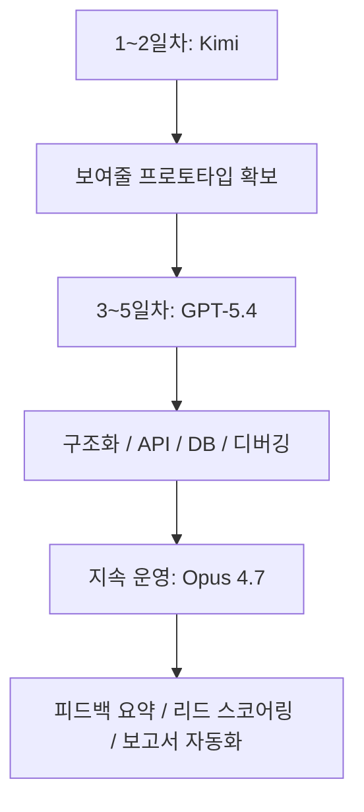

이 영상이 흥미로운 이유는 “누가 최고냐”를 묻는 척하면서, 실제로는 그 질문이 별로 중요하지 않다고 말하기 때문입니다. 제목은 `Opus 4.7 VS GPT-5.4 VS Kimi K2.6 Code` 이지만, 영상이 끝날 때 남는 메시지는 비교 우승자가 아니라 **역할 분담** 입니다. 빠른 프로토타이핑은 Kimi, 백엔드와 구조 설계는 GPT-5.4, 대용량 문맥 처리와 자동화는 Opus 4.7. 즉 모델을 하나 고르는 문제가 아니라, 어떤 단계에 어떤 모델을 배치하느냐가 더 중요하다는 이야기입니다. [YouTube 영상](https://youtu.be/_laLxMrvP4c)
<!--more-->

영상은 꽤 노골적으로 말합니다. 학생이면 답이 다르고, 교사면 답이 다르고, 사업가면 또 다르다고요. 이 말은 결국 “최고 모델”이라는 말이 대부분 상황을 지워 버린다는 뜻입니다. 실제 업무에서는 프론트엔드 시안, 백엔드 로직, 운영 자동화, 문서 요약, 리드 점수화가 한 번에 섞여 나오기 때문에, 한 모델이 모든 순간의 최고일 수는 없습니다. 그래서 이 영상은 벤치마크 대신 **워크플로우 설계 관점에서 세 모델을 어떻게 조합할지** 보여 주는 쪽에 가깝습니다. [YouTube 영상](https://youtu.be/_laLxMrvP4c)

## Sources

- https://youtu.be/_laLxMrvP4c

## 1. 이 영상의 핵심은 승자 발표가 아니라 “작업별 배치”다

영상 초반은 전형적인 비교 콘텐츠처럼 시작합니다. 하나는 죽었다고 하고, 하나는 고장 났다고 하고, 하나는 인터넷에서 가장 똑똑해졌다고들 말하지만 정작 “무엇을 실제로 만들 수 있느냐”는 아무도 말해 주지 않는다고요. [YouTube 영상](https://youtu.be/_laLxMrvP4c)

하지만 바로 이어서 방향이 바뀝니다. 영상이 진짜 답이라고 제시하는 것은 이겁니다.

- 무엇을 만들고 있는가
- 얼마나 빨리 결과가 필요한가
- 예산이 얼마나 민감한가
- 정확성과 구조 안정성이 얼마나 중요한가
- 문맥량이 얼마나 큰가

즉 세 모델은 같은 링 위에서 싸우는 선수라기보다, 서로 다른 구간에 배치되는 공구에 가깝습니다. 이 관점 전환이 이 영상의 핵심입니다.

## 2. Kimi K2.6 Code는 “빠른 앞단” 역할로 배치된다

영상은 Kimi를 빠르고, 저렴하고, 특히 프론트엔드와 UI 작업에 의외로 강한 모델로 묘사합니다. 랜딩 페이지, 프로토타입, 작고 빠른 실험을 만드는 데 적합하다고 말합니다. [YouTube 영상](https://youtu.be/_laLxMrvP4c)

영상 속 예시는 아주 직설적입니다.

- 원페이지 포트폴리오 사이트 만들기
- AI 자동화 랜딩 페이지 초안 만들기
- 빠르게 HTML/CSS를 뽑아서 바로 테스트하기

이런 작업에서는 “완벽한 구조”보다 **바로 눈에 보이는 결과를 빨리 꺼내는 것** 이 더 중요합니다. Kimi는 바로 이 구간에 배치됩니다.

중요한 포인트는, 영상이 Kimi를 최고 범용 모델이라고 칭찬하지는 않는다는 점입니다. 대신 “아이디어를 실제 화면으로 가장 빨리 바꾸는 모델”처럼 다룹니다. 즉 cheap and fast의 장점을 전략적으로 쓰라는 이야기입니다.

## 3. GPT-5.4는 구조와 정확성이 필요한 코어 구현 담당으로 놓인다

영상은 GPT-5.4를 여전히 가장 좋은 올라운드 코딩 모델이라고 설명합니다. 백엔드 로직, 디버깅, 복잡한 시스템 설계, 멀티스텝 에이전트 워크플로에 강하다고 말합니다. [YouTube 영상](https://youtu.be/_laLxMrvP4c)

그래서 Kimi가 만든 프론트 초안 다음 단계로 GPT-5.4가 들어옵니다.

- Next.js 컴포넌트로 재구성하기
- 이메일 API 연결하기
- 데이터베이스에 signup 저장하기
- REST API와 상태 흐름 정리하기
- 디버깅과 단계별 설명 받기

이 구간은 “대충 보여 주는 코드”가 아니라 **실제로 고장 없이 돌아가야 하는 코드** 가 필요한 구간입니다. 영상이 GPT-5.4를 여기에 배치하는 이유도 바로 그것입니다.

즉 GPT-5.4의 역할은 가장 창의적인 초안 생성이라기보다, **프로토타입을 제품 코드에 가깝게 밀어 넣는 안정화 계층** 으로 읽을 수 있습니다.

## 4. Opus 4.7은 “한 번에 많이 읽고 계속 굴리는 일”에 배치된다

영상이 Opus 4.7의 강점으로 가장 강조하는 것은 큰 문맥과 이미지 이해, 그리고 자동화 워크플로입니다. 영상 설명대로라면 방대한 코드베이스나 리서치 자료, 강의 자료를 한 번에 넣고 다루는 작업에서 존재감이 커집니다. [YouTube 영상](https://youtu.be/_laLxMrvP4c)

사업가 예시에서 영상은 Opus 4.7을 이런 데 씁니다.

- 80개 멤버 피드백 요약
- 긴 기간의 리드 데이터 분류
- 주간 보고서 작성
- 팀이 의사결정할 인사이트 정리

여기서 중요한 것은 Opus가 “가장 좋은 코더”라서 뽑힌 것이 아니라는 점입니다. 오히려 **많은 자료를 읽고, 자동화 루틴을 굴리고, 백그라운드 운영 업무를 맡기기 좋은 모델** 로 배치됩니다.

즉 Kimi가 출발 속도, GPT-5.4가 구현의 뼈대라면, Opus 4.7은 운영과 분석의 지속 레이어에 더 가깝습니다.

## 5. 이 영상이 진짜로 제안하는 것은 단일 모델 전략이 아니라 3단계 운영 스택이다

영상 후반은 세 모델을 함께 쓰는 가장 똑똑한 방법이라고 하면서 다음 식으로 정리합니다.

- Day 1~2: Kimi로 랜딩 페이지나 프로토타입 제작
- Day 3~5: GPT-5.4로 백엔드와 구조 다듬기
- Ongoing: Opus 4.7로 데이터 워크플로와 자동화 운영

이 구조가 흥미로운 이유는 실제 스타트업이나 1인 개발자의 일과 꽤 비슷하기 때문입니다.

1. 먼저 빨리 보여 줄 것을 만든다
2. 그다음 제대로 작동하게 만든다
3. 이후 반복 업무를 자동화한다

이건 모델 비교라기보다 거의 **AI 활용 운영체제** 에 가깝습니다.

## 6. 영상의 실전 메시지는 “비싼 모델을 모든 일에 쓰지 말라”는 것이다

영상은 사람들이 자주 하는 실수도 같이 말합니다.

- 가장 비싼 모델을 모든 작업에 쓰는 것
- 트윗 하나 보고 모델을 계속 갈아타는 것
- 모델에 충분한 맥락을 주지 않는 것

이 중 첫 번째가 특히 중요합니다. Opus 4.7이 아무리 좋더라도, 간단한 랜딩 페이지나 짧은 카피 작성까지 다 맡기면 비용 대비 효율이 떨어진다는 겁니다. 반대로 Kimi로 복잡한 구조 설계와 안정성이 필요한 백엔드 전체를 끝까지 밀면 한계가 올 수 있습니다. [YouTube 영상](https://youtu.be/_laLxMrvP4c)

즉 이 영상은 성능 비교를 하는 것처럼 보이지만 실제로는 **비용과 정확성, 속도의 균형을 맞추는 배치 전략** 을 설명합니다.

## 7. 결국 중요한 것은 모델 성능보다 파이프라인 설계다

이 영상을 보고 남는 가장 큰 인상은 “모델이 좋아졌다”가 아니라, **모델을 어디에 붙이느냐가 훨씬 중요하다** 는 점입니다.

같은 사람도 이렇게 쓸 수 있습니다.

- Kimi로 처음 화면과 카피를 뽑고
- GPT-5.4로 기능을 붙이고
- Opus 4.7으로 운영 자동화를 만든다

혹은 반대로,

- 작은 개인 프로젝트면 Kimi와 GPT-5.4만 쓰고
- 문서량이 큰 연구/교육 환경이면 Opus 4.7 비중을 키운다

즉 정답은 모델 이름이 아니라 **업무 구조에 맞는 조합** 입니다.

## 실전 적용 포인트

이 영상을 그대로 실무에 옮기면 가장 간단한 원칙은 이것입니다.

- 눈에 보이는 초안과 프로토타입은 가장 빠른 모델에게 맡긴다
- 정확성과 구조가 필요한 구현은 가장 안정적인 코딩 모델에게 맡긴다
- 반복 운영, 대량 문맥 처리, 보고서화는 긴 문맥과 자동화에 강한 모델에게 맡긴다

특히 1인 개발자나 작은 팀에게 이 방식이 잘 맞습니다. 처음부터 하나의 최고 모델을 찾으려고 하기보다, **싼 모델로 먼저 검증하고 비싼 모델은 꼭 필요한 구간에만 쓰는 방식** 이 실제 예산 관리에 더 유리하기 때문입니다.

## 핵심 요약

- 이 영상은 Kimi K2.6 Code, GPT-5.4, Opus 4.7의 승자를 뽑지 않는다.
- 대신 세 모델을 작업 단계별로 배치하는 3단계 스택을 제안한다.
- Kimi는 빠른 프론트/UI 프로토타이핑 담당이다.
- GPT-5.4는 백엔드, 구조 설계, 디버깅 같은 코어 구현 담당이다.
- Opus 4.7은 대용량 문맥 처리와 운영 자동화 담당이다.
- 핵심은 단일 최고 모델보다 역할 분담 파이프라인이 더 현실적이라는 점이다.

## 결론

이 영상이 말하는 진짜 교훈은 간단합니다. 이제 모델을 하나만 고르려는 질문은 점점 덜 중요해지고 있습니다. 더 중요한 질문은 “이 작업을 어떤 단계로 나누고, 각 단계에 어떤 모델을 붙일 것인가”입니다.

그래서 `Kimi vs GPT-5.4 vs Opus 4.7`이라는 제목은 사실 절반만 맞습니다. 실전에서는 `vs` 가 아니라 `+` 에 가깝기 때문입니다. 빠르게 만들고, 제대로 연결하고, 반복 업무를 자동화하는 흐름 안에서 세 모델을 역할별로 배치하는 것. 이 영상의 핵심은 바로 그 운영 감각에 있습니다.
