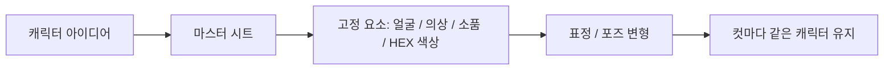
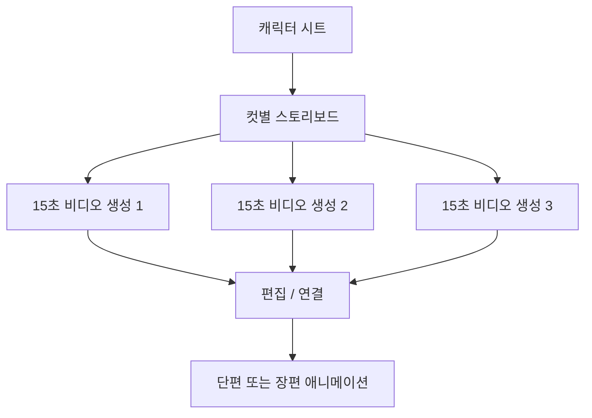

이 영상의 핵심은 “AI 애니메이션을 10분 만에 만들었다”는 자극적인 문장이 아닙니다. 진짜 중요한 것은, 장편 애니메이션도 결국 **같은 파이프라인의 반복** 이라는 주장입니다. 영상은 이를 아주 단순한 두 단계로 설명합니다. 먼저 캐릭터 시트와 스토리보드를 만든다. 그리고 그걸 바탕으로 15초 단위 비디오를 생성한다. 이 흐름이 잡히면 단편이든 장편이든 길이만 늘어날 뿐 원리는 같다는 것이죠. [YouTube 영상](https://www.youtube.com/watch?v=7oN5U0XFhNU)
<!--more-->

영상은 이를 `GPT 이미지 2` 와 `Seedance 2.0` 조합이라고 부르지만, 사실 더 본질적인 메시지는 모델 이름이 아닙니다. **일관성을 먼저 설계하고, 영상은 나중에 만든다** 는 점입니다. 캐릭터 시트 없이 바로 영상으로 가면 얼굴, 옷, 색, 소품, 카메라 액션이 제멋대로 흔들립니다. 반대로 마스터 시트와 스토리보드를 먼저 고정하면, 영상 생성은 그다음의 기계적 확장 작업이 됩니다. [YouTube 영상](https://www.youtube.com/watch?v=7oN5U0XFhNU)

## Sources

- https://www.youtube.com/watch?v=7oN5U0XFhNU

## 1. 전체 구조는 의외로 단순하다: 먼저 설계하고, 그다음 생성한다

영상이 제시하는 전체 흐름은 딱 두 단계입니다.

1. 스토리보드 단계  
   - 이야기 기획
   - 캐릭터 시트
   - 컷별 프롬프트
   - 스토리보드

2. 영상 생성 단계  
   - 스토리보드 + 캐릭터 시트 입력
   - 비디오 프롬프트 입력
   - 15초 단위 생성

이 구조가 중요한 이유는 많은 초보자가 반대로 가기 때문입니다. 그냥 “15초 애니메이션 만들어 줘”라고 비디오 모델에 바로 던지면, 처음 한 프레임만 참고하고 나머지는 AI가 알아서 상상해 버립니다. 영상은 바로 이 점을 문제로 봅니다. [YouTube 영상](https://www.youtube.com/watch?v=7oN5U0XFhNU)

즉 AI 애니메이션 제작에서 진짜 핵심은 생성 버튼이 아니라, **생성 전에 무엇을 얼마나 고정했는가** 입니다.

## 2. 가장 먼저 해야 할 일은 캐릭터 시트 확정이다

영상은 캐릭터 시트를 모든 것의 출발점으로 둡니다. 머리 길이, 머리색, 리본 색, 한복 색, 나이, 성격, 소품 등 가능한 한 많은 디테일을 한 장에 고정해야 한다고 말합니다. [YouTube 영상](https://www.youtube.com/watch?v=7oN5U0XFhNU)

왜냐하면 이미지 모델은 매 생성마다 조금씩 다른 사람을 그리기 때문입니다. 그래서 캐릭터 시트가 없으면:

- 같은 주인공인데 얼굴이 바뀌고
- 옷색이 흔들리고
- 머리 길이가 달라지고
- 소품이 사라지거나 새로 붙습니다

영상은 이를 막기 위해 두 가지를 특히 강조합니다.

### 2-1. 색은 이름이 아니라 HEX 코드로 고정

파란색이라고 쓰면 모델이 제각각 해석합니다. 어떤 컷은 남색, 어떤 컷은 하늘색이 됩니다. 따라서 색상은 `HEX 코드` 로 지정해야 한다는 것이 영상의 첫 번째 팁입니다.

### 2-2. 네거티브 프롬프트와 신체 디테일을 구체화

예를 들어 `long hair` 정도로 쓰면 어깨까지인지 허리까지인지 매번 바뀔 수 있습니다. 그래서 `chest-length waves` 처럼 길이와 형태를 구체적으로 고정해야 한다고 설명합니다.

이 두 가지를 걸어 두면 캐릭터 일관성의 대부분이 해결된다는 것이 영상의 핵심 주장입니다.

## 3. 캐릭터 일관성은 이미지 품질 문제가 아니라 ‘사전 설계’ 문제다

영상이 흥미로운 지점은, 일관성 문제를 더 좋은 모델로 해결하려 하지 않는다는 점입니다. 대신 일관성은 사전에 잠가야 한다고 봅니다. [YouTube 영상](https://www.youtube.com/watch?v=7oN5U0XFhNU)

즉:

- 모델이 자동으로 같은 얼굴을 기억해 줄 거라고 기대하지 말고
- 캐릭터 시트에 모든 고정값을 넣고
- 다양한 표정과 포즈, 소품까지 함께 시트 안에 넣어야 한다

는 접근입니다.

이 방식은 사실 실사 이미지 생성보다 애니메이션에 더 중요합니다. 왜냐하면 애니메이션은 한 장이 아니라 연속된 컷들이 이어져야 하고, 시청자는 프레임 사이의 작은 변화에도 쉽게 위화감을 느끼기 때문입니다.

## 4. 스토리보드는 단순 그림이 아니라 시간표다

영상에서 두 번째 핵심은 스토리보드입니다. 여기서 스토리보드는 “대충 이런 장면”을 그리는 용도가 아닙니다. 오히려 초 단위로 카메라 액션, 효과, 음악 배치까지 정리하는 **실행 시간표** 에 가깝습니다. [YouTube 영상](https://www.youtube.com/watch?v=7oN5U0XFhNU)

이 점이 중요합니다. 비디오 모델에 그냥 15초 분량을 맡기면:

- 카메라 이동이 제멋대로 섞이고
- 액션 타이밍이 흐트러지고
- 캐릭터가 어떻게 움직여야 하는지 अस्पяс하게 되고
- 처음 의도한 연출이 무너집니다

그래서 영상은 컷별로 초 단위 구조를 짜야 한다고 말합니다. 특히 `1초에 컷 두 개` 식의 frame-to-frame 설계를 통해 장면 의도를 더 세밀하게 통제할 수 있다고 강조합니다.

즉 스토리보드는 그림 참고 자료가 아니라, **비디오 모델이 마음대로 상상하지 못하게 막는 제약 문서** 입니다.

## 5. 오디오 맵핑까지 스토리보드 안에 넣는 이유

영상은 또 하나의 흥미로운 포인트로 `오디오 맵핑` 을 언급합니다. 가야금, 해금, 첼로 같은 악기가 컷별로 어떻게 들어갈지까지 미리 시트 안에 넣는다는 것입니다. [YouTube 영상](https://www.youtube.com/watch?v=7oN5U0XFhNU)

이건 단순히 배경음악 취향 문제가 아닙니다. 애니메이션의 몰입감은:

- 화면 전환
- 감정 곡선
- 음악 변화

가 함께 맞물릴 때 커집니다. 따라서 영상은 수미상관 구조, 감정 피크 시점, 음악 기승전결까지 한 번에 설계하면 훨씬 몰입도가 높아진다고 설명합니다.

이 말은 결국 AI 애니메이션 제작이 영상 생성만의 문제가 아니라, **연출 문서를 얼마나 치밀하게 만드느냐의 문제** 라는 뜻이기도 합니다.

## 6. Seedance 2.0 단계는 생각보다 단순하다

영상의 설명에 따르면, 비디오 생성 단계 자체는 오히려 더 단순합니다.

- 이미 만든 스토리보드
- 이미 만든 캐릭터 시트
- 비디오 프롬프트
- 15초 길이 선택

만으로 생성이 가능하다고 말합니다. [YouTube 영상](https://www.youtube.com/watch?v=7oN5U0XFhNU)

이 구조가 중요한 이유는, 실제 난이도의 대부분이 영상 생성 모델 사용법에 있지 않다는 걸 보여 주기 때문입니다. 힘든 부분은 오히려 그 전에:

- 무엇을 보여 줄지
- 누가 등장하는지
- 카메라가 어떻게 움직이는지
- 음악이 어디서 올라가고 꺾이는지

를 정해 두는 데 있습니다.

즉 영상 생성은 마무리 단계이고, 성패는 그 전에 거의 결정된다는 이야기입니다.

## 7. 장편도 결국 같은 원리라는 말은 왜 성립하나

영상이 반복해서 강조하는 문장은 “2분이든 10분이든 30분이든 1시간이든 원리는 같다”는 것입니다. [YouTube 영상](https://www.youtube.com/watch?v=7oN5U0XFhNU)

이 말이 성립하는 이유는 장편 애니메이션을 다음처럼 볼 수 있기 때문입니다.

- 긴 영상 하나가 아니라
- 잘 정의된 캐릭터 세트와
- 잘 정의된 스토리보드 묶음과
- 여러 개의 15초 세그먼트 조립

으로 보는 방식입니다.

즉 장편 제작의 핵심은 “엄청난 한 번의 생성”이 아니라, **같은 규칙을 깨지지 않게 반복하는 생산 체계** 입니다. 이 지점이 바로 영상이 초보자에게도 희망적이라고 말하는 이유입니다.

## 8. 이 영상이 말하는 ‘쉬움’의 진짜 의미

영상은 “누구나 쉽게 만들 수 있다”는 표현을 여러 번 씁니다. 여기서 쉬움은 결과 수준이 가볍다는 뜻이 아닙니다. 오히려 진입장벽이 높은 기술을, 프롬프트와 시트 중심 워크플로로 재구성했다는 뜻에 더 가깝습니다. [YouTube 영상](https://www.youtube.com/watch?v=7oN5U0XFhNU)

즉 쉬움의 정체는:

- 툴 하나로 해결해서가 아니라
- 순서를 표준화해서
- 초보자도 같은 문서를 따라가면 비슷한 품질에 도달하게 만든 것

입니다.

그래서 이 영상이 던지는 가장 유용한 교훈은 “좋은 모델이 다 해 준다”가 아니라, **좋은 모델을 다루기 위한 중간 산출물의 중요성** 입니다.

## 실전 적용 포인트

이 워크플로를 바로 적용한다면 가장 중요한 순서는 다음입니다.

1. 영상부터 만들지 말고 캐릭터 시트를 먼저 만든다
2. 색은 이름이 아니라 HEX 코드로 고정한다
3. 머리 길이, 소품, 표정, 포즈를 최대한 구체적으로 박는다
4. 15초 비디오를 바로 던지지 말고 컷별 스토리보드를 만든다
5. 카메라 액션과 오디오 맵핑까지 함께 설계한다
6. 긴 영상은 여러 세그먼트의 반복으로 본다

즉 핵심은 `생성` 보다 `고정` 에 있습니다.

## 핵심 요약

- 이 영상의 핵심은 모델 이름보다 파이프라인이다.
- 캐릭터 시트와 스토리보드를 먼저 고정해야 영상 일관성이 생긴다.
- 색상은 HEX 코드로, 머리 길이와 소품은 구체적 묘사로 잠가야 한다.
- 스토리보드는 컷별 시간표이자 AI의 자유도를 제한하는 제약 문서다.
- 15초 비디오 생성 자체는 마지막 단계이며, 성패는 그 전에 대부분 결정된다.
- 장편 제작도 결국 같은 규칙의 반복과 조립으로 볼 수 있다.

## 결론

AI 애니메이션 제작이 갑자기 쉬워진 것처럼 보이는 이유는, 모델이 마법처럼 모든 걸 알아서 해서가 아닙니다. 오히려 반대입니다. 캐릭터 시트, 스토리보드, 오디오 맵핑 같은 중간 문서를 먼저 만들고, 영상 생성은 그 결과를 따르게 하는 방식으로 **혼란을 줄였기 때문** 입니다.

그래서 이 영상의 진짜 가치는 “GPT와 Seedance 조합이 대단하다”는 데보다, AI 애니메이션을 반복 가능한 생산 파이프라인으로 보여 준다는 데 있습니다. 긴 영상을 만들고 싶다면, 먼저 더 좋은 비디오 프롬프트를 고민하기보다 더 좋은 캐릭터 시트와 스토리보드부터 만드는 편이 맞습니다.
