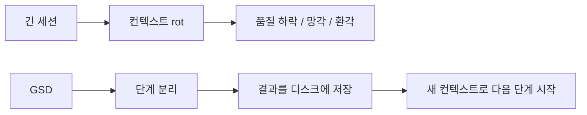
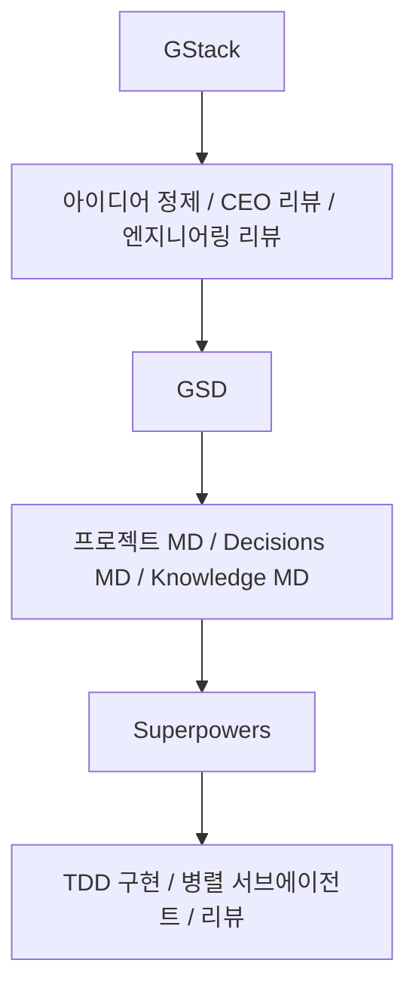

같은 `Superpowers vs GSD vs GStack` 비교라도 이번 영상은 초점이 꽤 분명합니다. 누가 더 세냐를 말하기보다, **지금 내 병목이 무엇인지 먼저 보라** 고 말합니다. 테스트 없이 코드부터 뱉어내는 게 문제라면 Superpowers, 장기 세션에서 AI가 점점 멍청해지는 게 문제라면 GSD, 제품·디자인·QA 관점이 자꾸 빠진다면 GStack. 즉 이 영상은 세 프레임워크를 사상 대결로 올려놓지 않고, 실제 작업에서 부딪히는 문제별 처방전으로 배치합니다. [YouTube 영상](https://www.youtube.com/watch?v=MWaWw6v6Rn4)
<!--more-->

이미 비슷한 비교 글들은 많지만, 이 영상이 특히 좋은 이유는 세 프레임워크를 `프로세스`, `컨텍스트`, `관점`이라는 세 층으로 정리한 뒤, 마지막에 **셋을 함께 쓸 때의 함정** 까지 같이 말해 준다는 점입니다. 그래서 이번 글도 단순 비교보다 선택 가이드에 더 가깝게 정리해 보겠습니다. [YouTube 영상](https://www.youtube.com/watch?v=MWaWw6v6Rn4)

## Sources

- https://www.youtube.com/watch?v=MWaWw6v6Rn4

## 1. 왜 이런 프레임워크가 생겼나: Claude Code는 작은 일엔 강하지만 큰 일에선 흔들린다

영상은 아주 익숙한 문제에서 시작합니다. 작은 기능 하나는 잘 짜 주는데, 작업이 길어지면 테스트도 무시하고, 아까 내린 결정을 까먹고, 시키지도 않은 기능을 혼자 덧붙이며 무너진다는 것입니다. [YouTube 영상](https://www.youtube.com/watch?v=MWaWw6v6Rn4)

이 문제를 보면 많은 사람이 “모델이 덜 똑똑해서”라고 생각하지만, 이 영상은 그렇게 보지 않습니다. 대신 Claude Code의 실패를 세 가지 층으로 나눕니다.

- 실행 절차가 느슨하다
- 세션이 길어지며 컨텍스트가 썩는다
- 하나의 시각으로만 판단해 제품 완성도가 떨어진다

이렇게 병목을 분리해야 비로소 어떤 프레임워크가 필요한지 보인다는 것이죠.

## 2. Superpowers는 ‘실행 품질’이 문제일 때 가장 먼저 쓴다

영상에서 `Superpowers`는 프로세스 강제 프레임워크로 정의됩니다. 핵심은 시니어 개발자의 일하는 방식을 Claude Code에 통째로 이식하는 것입니다.

- 브레인스토밍
- 스펙 작성
- 플래닝
- TDD 구현
- 서브에이전트 개발
- 리뷰
- 파이널라이즈

그리고 영상이 특히 강조하는 것은 TDD입니다. 테스트를 먼저 쓰고, 그 테스트를 통과하는 최소한의 코드만 작성하고, 이후 리팩터링하는 `red-green-refactor` 사이클을 강제한다는 점입니다. 심지어 테스트 없이 먼저 짠 코드는 지우고 다시 테스트부터 쓰게 만든다고 설명합니다. [YouTube 영상](https://www.youtube.com/watch?v=MWaWw6v6Rn4)

즉 Superpowers는 “Claude가 막 짠다”는 문제를 정면으로 다룹니다. 그래서 다음 같은 경우에 잘 맞습니다.

- 코딩은 빠른데 품질이 들쭉날쭉할 때
- 나중에 고치느라 더 오래 걸릴 때
- 스스로도 자꾸 ‘일단 만들고 보자’로 흘러갈 때

이럴 때 Superpowers는 모델 지능을 올리는 대신 **행동 순서를 강제로 교정** 합니다.

## 3. GSD는 ‘장기 세션 붕괴’가 문제일 때 들어간다

`GSD`의 초점은 완전히 다릅니다. 이 영상에서 GSD는 `context rot`, 즉 컨텍스트 썩음 현상을 해결하려는 도구로 설명됩니다. 처음 20~30% 구간은 멀쩡하지만, 50%를 넘어서면 쫓기듯이 짜고, 70%를 넘으면 환각과 요구사항 망각이 시작된다는 식입니다. [YouTube 영상](https://www.youtube.com/watch?v=MWaWw6v6Rn4)

그래서 GSD는 작업을 세 단계로 나눕니다.

- plan
- execute
- review

그리고 각 단계마다 새로운 서브에이전트와 깨끗한 컨텍스트를 줍니다. 결과물은 디스크에 저장해서 다음 단계가 읽어 오도록 하고, 메인 세션은 낮은 점유율을 유지합니다.

이 구조의 핵심은 Claude Code에게 “길게 기억해”라고 요구하지 않는 것입니다. 대신:

- 자주 끊고
- 중간 상태를 저장하고
- 새 컨텍스트로 다시 시작하게 합니다

즉 GSD는 모델이 긴 세션을 잘 버틸 거라는 기대를 버리고, **세션을 짧게 유지하는 구조 자체를 설계** 합니다.

## 4. GStack은 ‘제품 완성도’가 문제일 때 강하다

`GStack`의 핵심은 역할 기반 격리입니다. 영상은 GStack을 한 명의 AI에게 23개의 역할을 번갈아 씌우는 방식으로 설명합니다. CEO 모드, 엔지니어링 매니저 모드, 디자이너 모드, QA 모드, 시큐리티 오피서 모드 등 역할을 나눠 각자의 시각으로 프로젝트를 보게 만드는 것입니다. [YouTube 영상](https://www.youtube.com/watch?v=MWaWw6v6Rn4)

여기서 중요한 점은 각 역할이 필요한 컨텍스트만 받는다는 것입니다.

- 엔지니어는 제품 로드맵을 다 보지 않고
- QA는 구현 디테일을 다 보지 않고
- 디자이너는 시각적 일관성과 AI 슬롭을 본다

즉 GStack은 “모든 걸 한 번에 다 판단하는 범용 에이전트”를 포기하고, **관점의 분업으로 품질을 높이는 구조** 입니다.

그래서 다음 같은 사람에게 특히 잘 맞습니다.

- 파운더처럼 제품·디자인·QA를 다 챙겨야 하는 사람
- 구현보다 리뷰와 완성도에서 자주 구멍이 나는 사람
- 기술적으로는 되는데 제품적으로 어색한 결과가 자주 나오는 사람

## 5. 이 영상의 가장 좋은 정리: 셋은 같은 층이 아니다

영상은 세 프레임워크를 한 문장씩 이렇게 요약합니다.

- Superpowers는 `어떻게 일할 것인가`
- GSD는 `어디에서 일할 것인가`
- GStack은 `무엇을 할 것인가`

이 표현이 아주 좋습니다. [YouTube 영상](https://www.youtube.com/watch?v=MWaWw6v6Rn4)

조금 더 풀어 쓰면:

- Superpowers는 실행 프로세스의 품질을 제약한다
- GSD는 작업 환경과 세션 구조의 품질을 제약한다
- GStack은 의사결정과 관점의 품질을 제약한다

즉 이 셋은 경쟁자가 아니라, 애초에 서로 다른 층에서 작동합니다. 그래서 하나를 고르면 다른 둘이 불필요해지는 구조가 아니라, 필요하면 겹쳐서 쓸 수 있는 구조가 됩니다.

## 6. 병목별 선택 가이드: 무엇이 답답한지부터 보라

이 영상이 실전적으로 좋은 이유는 선택 기준이 명확하기 때문입니다.

### 6-1. 혼자 일하는데 자기 훈육이 약하다

코드부터 막 짜고 나중에 후회한다면 `Superpowers` 가 가장 먼저입니다. TDD와 리뷰 단계가 강제로 들어가기 때문입니다.

### 6-2. 며칠짜리 장기 작업에서 AI가 중간에 바보가 된다

이 경우는 `GSD` 가 맞습니다. 컨텍스트 격리와 디스크 저장 구조가 핵심이기 때문입니다.

### 6-3. 파운더/사이드프로젝트 빌더라 제품·디자인·QA까지 다 봐야 한다

이때는 `GStack` 이 잘 맞습니다. 역할별 리뷰 게이트가 생기기 때문입니다.

### 6-4. 위 세 문제가 동시에 있다

영상은 이 경우 셋을 쌓아서 쓰라고 말합니다. 그리고 그게 허황된 얘기가 아니라, 꽤 구체적인 3층 구조로 설명됩니다.

## 7. 3층 레이어 조합: GStack 위, GSD 중간, Superpowers 아래

영상이 추천하는 레이어 구조는 이렇습니다.

- 맨 위: `GStack`
- 가운데: `GSD`
- 맨 아래: `Superpowers`

역할은 분명합니다.

- GStack: 무엇을 만들지, 정말 만들 가치가 있는지 결정
- GSD: 장기 세션 동안 계획이 흐트러지지 않게 유지
- Superpowers: 실제 코드를 TDD로 구현

즉 GStack이 `무엇과 왜`, GSD가 `어디서`, Superpowers가 `어떻게` 를 맡는 분업입니다. [YouTube 영상](https://www.youtube.com/watch?v=MWaWw6v6Rn4)

## 8. 하지만 같이 쓸 때 함정도 있다

이 영상이 좋았던 또 하나의 이유는 “합쳐 쓰면 좋다”에서 끝내지 않고, **실제 함정** 을 말해 준다는 점입니다.

### 8-1. 토큰 비용 문제

GStack의 역할 기반 스킬을 한꺼번에 다 켜면 토큰 소비가 커지고 응답이 느려집니다. 영상은 큰 결정이 필요할 때만 CEO 리뷰 같은 무거운 스킬을 부르라고 조언합니다. 즉 평소에는 코어 스킬만 켜 두는 편이 낫습니다.

### 8-2. 인터랙티브 프롬프트 충돌

Superpowers의 인터랙티브 프롬프트가 GSD의 컨텍스트 격리 구조와 충돌할 수 있다고 합니다. 특히 CI나 자동화 환경에서는 프롬프트를 비활성화해야 합니다.

### 8-3. 작은 작업에 과잉 적용

한 줄 수정이나 작은 버그에 7단계 워크플로를 전부 돌리면 숨이 막힙니다. 영상의 핵심 조언은 간단합니다. **지금 부족한 게 의사결정인지, 컨텍스트인지, 실행인지 먼저 진단하고 필요한 레이어만 고르라** 는 것입니다.

## 9. 이 영상이 기존 비교보다 더 실용적인 이유

비슷한 비교 콘텐츠들은 대개 철학 설명에서 끝납니다. 그런데 이 영상은 한 단계 더 나아갑니다.

- 왜 프레임워크가 생겼는지 설명하고
- 각자 해결하는 층을 나누고
- 누구에게 맞는지 정리하고
- 셋을 같이 쓰는 구조를 보여 준 뒤
- 그 구조의 비용과 함정도 말합니다

즉 “뭐가 더 좋냐”는 질문을 “내 병목이 뭐냐”로 바꿔 줍니다. 이것이 실무에서 훨씬 유용합니다.

## 실전 적용 포인트

처음 시작하는 사람이라면 영상의 조언대로 한 번에 셋 다 깔기보다:

1. `Superpowers` 를 먼저 2주 정도 써 보고
2. 그래도 장기 세션이 무너지면 `GSD`
3. 제품/디자인/QA 관점이 아쉬우면 `GStack`

순서로 붙이는 편이 낫습니다.

그리고 이미 여러 프레임워크를 섞어 쓰는 사람이라면, 세 프레임워크를 비교할 때 “더 좋은 것”을 찾기보다:

- 지금 내가 자주 실패하는 층이 어디인가
- 지금 추가해야 할 레이어가 무엇인가

를 묻는 편이 훨씬 생산적입니다.

## 핵심 요약

- 이 영상은 Superpowers, GSD, GStack을 병목별 선택지로 정리한다.
- Superpowers는 실행 프로세스 품질 문제를 푼다.
- GSD는 장기 세션에서 생기는 context rot 문제를 푼다.
- GStack은 제품·디자인·QA 관점 부족 문제를 푼다.
- 세 프레임워크는 경쟁자가 아니라 서로 다른 층에 있다.
- 함께 쓸 때는 `GStack → GSD → Superpowers` 의 3층 구조가 유효하다.
- 다만 토큰 비용, 프롬프트 충돌, 과잉 적용 같은 함정도 고려해야 한다.

## 결론

Superpowers, GSD, GStack 중 무엇을 먼저 써야 할지는 결국 “누가 더 강하냐”의 문제가 아닙니다. 지금 내 작업이 어디서 망가지고 있는지의 문제입니다. 실행 절차가 느슨한지, 컨텍스트가 무너지는지, 아니면 제품 완성도를 올릴 관점이 부족한지부터 봐야 합니다.

그래서 이 영상의 진짜 가치는 프레임워크 리뷰 자체보다, Claude Code 운용을 `병목 중심으로 진단하는 사고방식` 을 준다는 데 있습니다. 그 점에서 이번 비교는 단순한 소개가 아니라, 실제 선택 가이드에 더 가깝습니다.
